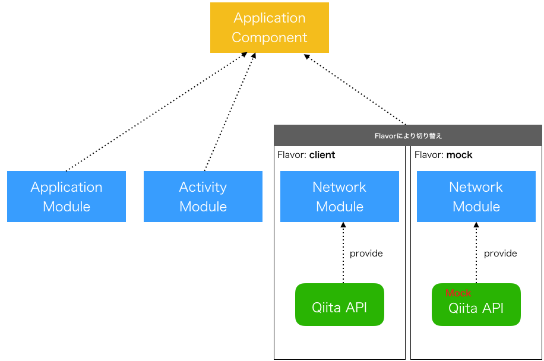

Android開発におけるモジュール化手法
---------------------------------------------

- [はじめに](#introduction)
- [TL;DR](#tldr)
- [アプリケーション環境](#application-environment)
- [開発時の課題](#dev-problem)
- [構成](#configuration)
  - [Build Variants](#configuration-build-variants)
  - [モジュール化](#configuration-modularization)

## <a name="introduction">はじめに</a>
このドキュメントは、Android案件の過程で得られたモジュール化に関する知見をまとめたものになります。

本ドキュメントが、Android案件開始の際のアプローチや採用技術についての参考情報となることを目的としています。<br/>
本ドキュメントを通して、以下の情報を得ることができます。

- テスタビリティのためのモジュール化構成
- ステージ(環境)管理ごとの設定

## <a name="tldr">TL;DR</a>
- テスタビリティ向上
    - モジュール化のためのコンポーネント管理は[Google Dagger2](https://github.com/google/dagger)を利用
    - Dependency Injection(DI)パターンを活用し、コンポーネントの利用と定義箇所を分離
    - Product Flavorに応じてコンポーネントの切り替えを行うシンプルな構造を実現
- ステージに依存した設定の切り離し
    - ステージ管理ごとの切り替えはAndroid [Build Variants](https://developer.android.com/studio/build/build-variants)を利用
    - Product Flavorを定義し、ステージに応じた接続先設定を分離
    - ビルド時にBuild Variants選択し切り替えを行うシンプルな構造を実現

## <a name="application-environment">アプリケーション環境</a>
本ドキュメントでは、以下アプリケーション環境を使用します。

|lib|version|
|:-----|:-------|
|[Android SDK](https://developer.android.com/)|28|
|[Kotlin](https://kotlinlang.org/)|1.3.21|
|[Gradle](https://gradle.org/)|4.10.3|

## <a name="dev-problem">開発時の課題</a>
Android開発を行う上で以下の課題があります。

- コンポーネントを一部mock化してテストを行いたい
    - 通信先の状態など外部のデータソースやサーバ状態に依存することを避ける
    - Httpクライアントを使用している機能において、テスト対象のロジック以外の原因による失敗を防止する
- ステージごとに接続先を手軽に切り替えたい
    - 開発用(ステージング/本番維持など)の環境への接続設定など、本番環境とは無関係なハードコード避けて事故を防止する

これらを実現するためにはアプリケーション全体でコンポーネントを集約して管理し、部品の切り替えや変更容易性を向上する必要があります。<br/>
具体的な実現方法として以下を用います。

- Android [Build Variants](https://developer.android.com/studio/build/build-variants)の活用
- Dependency Injection(DI)パターンを活用

## <a name="configuration">構成</a>

### <a name="configuration-build-variants">Build Variants</a>

#### Build Variantsとは
> ビルド バリアントはビルドタイプとプロダクト フレーバーを組み合わせたもので、Gradle がアプリをビルドするために使用する設定です。 ビルド バリアントを使用して、開発時にプロダクト フレーバーのデバッグ バージョンをビルドしたり、配布用のプロダクト フレーバーの署名済みリリース バージョンをビルドしたりできます。 ビルド バリアントを直接設定するのではなく、ビルド バリアントを形成するビルドタイプとプロダクト フレーバーを設定します。 追加のビルドタイプやプロダクト フレーバーを作成すると、さらに多くのビルド バリアントが作成されます。<br/>
> ー [カスタムビルドの設定｜developer.android.com](https://developer.android.com/studio/build/index.html#build-config) より

※ `Build Type`、`Product Flavor`については[カスタムビルドの設定｜developer.android.com](https://developer.android.com/studio/build/index.html#build-config)を参照ください。

`Build Variants` = `Build Type` × `Product Flavor` の組み合わせで表現できます。 <br/>
これらはGradle `app/build.gradle` にて定義できます。以下に例を示します。

```groovy
android {
    buildTypes {
        debug { /* ... */ }
        release { /* ... */ }
    }
    
    productFlavors {
        free { /* ... */ }
        pro { /* ... */ }
    }
}
```

上記例のように定義した場合、ビルド時には以下4つのBuild Variantsが選べることとなります。

- `debug` × `free`
- `debug` × `pro`
- `release` × `free`
- `release` × `pro`

#### Build Type
Build Typeの基本方針は、ビルドに関することのみ定義することです。例えば、ビルド時の圧縮(minify)や証明書(sign-ing)に関することが該当します。<br/>
ステージ管理ごとの切り替えを含むビルド以外のことは定義しません。

方針をもとに以下のように定義しました。

|Build Type |使用用途|
|:----------|:------------------------------|
| `debug`   |開発ローカルでの動作確認時に使用|
| `release` |圧縮や証明書が必要なリリースビルド時に使用|

#### Product Flavor
Product Flavorの基本方針としては、各ステージごとの設定を管理します。<br/>
ステージ内の設定グループはFlavor Dimensionで表現します。

方針をもとに以下2つのDimensionを作成しました。

|Flavor Dimension|使用用途|
|:---------------|:------------------------------|
| `backend`      |バックエンドのAPIサーバに関する設定グループ|
| `api_client`   |APIクライアントのモジュールに関する設定グループ|

以下にグループの設定例を示します。

##### Dimension: `backend`

|Product Flavor |使用用途|
|:--------------|:---|
| `local`       |開発ローカルに立てているサーバに通信する際に使用|
| `staging`         |backendサービス検証環境に通信する際に使用|

##### Dimension: `api_client`

|Product Flavor |説明|
|:--------------|:---|
| `mock`        |連携先APIとの通信をmockにする場合に使用|
| `client`      |連携先APIとの通信を通常通り行う場合に使用|

#### コード例
Dimension `backend` 定義に対応するディレクトリを作成します。

```txt
src
  ├ main/res
  │ └ ...
  ├ local/res
  │ └ values
  │   └ backend-api.xml
  ├ staging/res
  │ └ values
  │   └ backend-api.xml
  └ build.gradle
```

##### Androidアプリケーション `build.gradle`
Android Build Variants(Build Type/Product Flavor)をGradleに定義します。

```groovy
android {
    // ...

    buildTypes {
        debug {
            minifyEnabled false
        }
        release {
            minifyEnabled true
            proguardFiles getDefaultProguardFile('proguard-android.txt'), 'proguard-rules.pro'
        }
    }
    
    flavorDimensions 'backend', 'api_client'
    productFlavors {
        local {
            dimension 'backend'
        }
        staging {
            dimension 'backend'
        }

        mock {
            dimension 'api_client'
        }
        client {
            dimension 'api_client'
        }
    }
    
    // ...
}
```

##### リソース `backend-api.xml`
Dimension `backend` 定義に対応する環境設定ファイルを作成し、接続先を記載します。

###### local

```xml
<resources>
    <string name="api_url">http://10.0.2.2/</string>
    <string name="api_key"></string>
</resources>
```

###### staging

```xml
<resources>
    <string name="api_url">http://staging.example.com/</string>
    <string name="api_key">abcdef12345</string>
</resources>
```

---

### <a name="configuration-modularization">モジュール化</a>
モジュール化を実現するためのコンポーネント管理は[Google Dagger2](https://github.com/google/dagger)を利用します。<br/>
合わせてProduct Flavorに応じたモジュールやリソースを用意します。

ここではFlavor Dimensionで用意した `api_client` のモジュールを切り替えるために以下のパッケージを用意しています。

```txt
src
  ├ main
  ├ mock
  └ client
```

#### Daggerとは
JavaやAndroidのプラットフォームにてDIをサポートするためのライブラリです。<br/>
詳細については公式のユーザガイドを参照ください。

- [User's Guide｜google.github.io](https://google.github.io/dagger/users-guide)

#### Daggerによるモジュール化
DIの仕組みを利用しProduct Flavorによって利用するモジュールを選択できることを目指します。
ここからはQiita APIを利用してQiitaのタグクラウドを表示するAndroidアプリを例にして解説します。



この図を例にとると、Product Flavorが `client` の場合はAPIに通信を行うモジュール `QiitaApi` が提供します。<br/>
一方、Product Flavorが `mock` の場合はAPIに通信は行わずモック動作を行う `MockQiitaApi` を提供します。

次に実際のパッケージの構成について見てみます。パッケージはDagger関連のクラスをまとめる `di` パッケージを用意しています。<br/>
その配下にDaggerのコンポーネント/モジュール用の `component` / `module` パッケージを用意しました。

```txt
src
  ├ main/java
  │ └ jp/co/tis/android_sandbox
  │   └ di
  │     ├ component
  │     │ └ ApplicationComponent.java
  │     └ module
  │       ├ ApplicationModule.java
  │       └ ActivityModule.java
  ...
```

上記の構成に合わせ、Product Flavorごとのパッケージに切り替えを行うModuleクラスを作成します。<br/>
以下の例ではProduct Flavor `mock` / `client` ごとに `NetworkModule.java` を作成しています。

```txt
src
  ...
  ├ mock/java
  │ └ jp/co/tis/android_sandbox
  │   └ di
  │     └ module
  │       └ NetworkModule.java
  └ client/java
    └ jp/co/tis/android_sandbox
      └ di
        └ module
          └ NetworkModule.java
```

今回例として用意したDaggerのコンポーネント/モジュールについて以下で解説します。

##### component

|クラス                   |説明|
|:-----------------------|:-----------------------------------------------|
| `ApplicationComponent` |アプリケーション全体で使用する依存オブジェクトグラフを管理する|

##### module

|クラス                |説明|
|:--------------------|:---------------------------------------|
| `ApplicationModule` |アプリケーション全体で共有するmoduleを定義する|
| `ActivityModule`    |ActivityごとのInjectorを定義する|
| `NetworkModule`     |APIに通信するクライアントmoduleを定義する|

#### モジュール化によって得られるテスタビリティ
上記のようにDaggerのComponent/Moduleを組むことで各ステージおよびテスト時のモジュール切り替え容易になります。<br/>
実際の切り替えはGradleの仕組みに則って行います。

例えばユニットテストを特定のBuild Typeにて実施する場合を考えてみます。<br/>
Gradleではユーザが定義したBuild Typeごとのタスクが自動で利用可能な状態になります。

今回の例ではテストの実行時、Build Typeに応じた以下8種類のタスクが利用可能になっています。

```bash
$ ./gradlew tasks
> :tasks

...

testLocalClientDebugUnitTest - Run unit tests for the localClientDebug build.
testLocalClientReleaseUnitTest - Run unit tests for the localClientRelease build.
testLocalMockDebugUnitTest - Run unit tests for the localMockDebug build.
testLocalMockReleaseUnitTest - Run unit tests for the localMockRelease build.
testStagingClientDebugUnitTest - Run unit tests for the stagingClientDebug build.
testStagingClientReleaseUnitTest - Run unit tests for the stagingClientRelease build.
testStagingMockDebugUnitTest - Run unit tests for the stagingMockDebug build.
testStagingMockReleaseUnitTest - Run unit tests for the stagingMockRelease build.
```

あとは指定のBuild Variantsにてテスト実行すればOKです。

```bash
$ ./gradlew testLocalMockDebugUnitTest
```

各開発者のローカル環境におけるBuild Variantsの切り替えは[IDEAの機能](https://developer.android.com/studio/run#changing-variant)を実施することで可能となります。

#### コード例

##### Androidアプリケーション `build.gradle`

Daggerを利用するために以下の依存を追加します。

```groovy
apply plugin: 'kotlin-kapt'

// ...

dependencies {
    // ...
    
    implementation 'com.google.dagger:dagger:2.21'
    kapt "com.google.dagger:dagger-compiler:2.21"
    implementation 'com.google.dagger:dagger-android:2.21'
    implementation 'com.google.dagger:dagger-android-support:2.21'
    kapt 'com.google.dagger:dagger-android-processor:2.21'
    
    // ...
}
```

##### Application
アプリケーションの起動クラスは `DaggerApplication` を継承します。
加えて、Daggerにより自動生成された `DaggerApplicationComponent` より `AndroidInjector` を作成します。

```kotlin
import jp.co.tis.android_sandbox.di.component.DaggerApplicationComponent
import dagger.android.AndroidInjector
import dagger.android.support.DaggerApplication

class SandboxApplication : DaggerApplication() {

    override fun applicationInjector(): AndroidInjector<out DaggerApplication> =
            DaggerApplicationComponent.builder().create(this)
            
    // ...
}
```

##### Activity
インジェクション先では `@Inject` を使用してモジュール注入を定義し、`AndroidInjection.inject(this)` で実際にモジュールを注入します。

```kotlin
import android.os.Bundle
import android.support.v7.app.AppCompatActivity
import dagger.android.AndroidInjection
import retrofit2.Retrofit
import javax.inject.Inject
import jp.co.tis.android_sandbox.service.api.QiitaApi

class MainActivity : AppCompatActivity() {
    @Inject
    lateinit var qiitaApi: QiitaApi
    
    override fun onCreate(savedInstanceState: Bundle?) {
        AndroidInjection.inject(this)
        super.onCreate(savedInstanceState)
        
        // ...
    }
}
```

##### Daggerコンポーネント

###### `ApplicationComponent`
Daggerのコンポーネントクラスでは、以下のようにModuleのオブジェクトグラフ追加しました。<br/>
ここではDagger Androidサポートを受けるために `AndroidSupportInjectionModule` を追加しています。

```kotlin
import jp.co.tis.android_sandbox.SandboxApplication
import jp.co.tis.android_sandbox.di.module.ActivityModule
import jp.co.tis.android_sandbox.di.module.ApplicationModule
import jp.co.tis.android_sandbox.di.module.NetworkModule
import dagger.Component
import dagger.android.AndroidInjector
import dagger.android.support.AndroidSupportInjectionModule
import javax.inject.Singleton

@Component(modules = [
    AndroidSupportInjectionModule::class,
    ApplicationModule::class,
    ActivityModule::class,
    NetworkModule::class
])
@Singleton
interface ApplicationComponent : AndroidInjector<SandboxApplication> {

    @Component.Builder
    abstract class Builder : AndroidInjector.Builder<SandboxApplication>()
}
```

##### Daggerモジュール
 
###### `ApplicationModule`

```kotlin
import android.content.Context
import jp.co.tis.android_sandbox.SandboxApplication
import dagger.Binds
import dagger.Module
import javax.inject.Singleton

@Module
abstract class ApplicationModule {
    @Binds
    @Singleton
    abstract fun provideContext(app: SandboxApplication): Context
}
```

###### `ActivityModule`

```kotlin
import jp.co.tis.android_sandbox.MainActivity
import dagger.Module
import dagger.android.ContributesAndroidInjector

@Module
abstract class ActivityModule {

    @ContributesAndroidInjector
    abstract fun contributeMainActivity(): MainActivity
}
```
 
###### `NetworkModule`
本サンプルコードでは [Gson](https://github.com/google/gson)、[Retrofit](https://github.com/square/retrofit)を使用しています。

また外部通信のAPIクライアントとしてRetrofitを利用した `QiitaApi` を作成しました。

```kotlin
import jp.co.tis.android_sandbox.model.api.QiitaTag
import retrofit2.Call
import retrofit2.http.GET
import retrofit2.http.Query

interface QiitaApi {

    @GET("api/v2/tags")
    fun fetchTags(
            @Query("page") page: Int? = null,
            @Query("per_page") perPage: Int? = null,
            @Query("sort") sort: String? = null
    ): Call<List<QiitaTag>>
}
```

```kotlin
data class QiitaTag (
        var followers_count: Int,
        var icon_url: String?,
        var id: String,
        var items_count: Int
)
```

以下にはProduct Flavorごとの切り替えを実現するためのDagger Moduleを紹介します。

■ Product Flavor `client`

```kotlin
import android.content.Context
import com.google.gson.Gson
import com.google.gson.GsonBuilder
import dagger.Module
import dagger.Provides
import retrofit2.Retrofit
import retrofit2.converter.gson.GsonConverterFactory
import javax.inject.Singleton
import jp.co.tis.android_sandbox.R
import jp.co.tis.android_sandbox.service.api.QiitaApi

@Module
class NetworkModule {
    @Provides
    @Singleton
    fun provideGson(): Gson = GsonBuilder().create()

    @Provides
    @Singleton
    fun provideRetrofit(context: Context, gson: Gson): Retrofit = Retrofit.Builder()
            .baseUrl(context.getString(R.string.api_url))
            .addConverterFactory(GsonConverterFactory.create(gson))
            .build()

    @Provides
    @Singleton
    fun provideQiitaApi(retrofit: Retrofit): QiitaApi = retrofit.create(QiitaApi::class.java)
}
```

■ Product Flavor `mock`

```kotlin
import android.content.Context
import com.google.gson.Gson
import com.google.gson.GsonBuilder
import dagger.Module
import dagger.Provides
import retrofit2.Retrofit
import retrofit2.converter.gson.GsonConverterFactory
import javax.inject.Singleton
import jp.co.tis.android_sandbox.R
import jp.co.tis.android_sandbox.service.api.MockQiitaApi
import jp.co.tis.android_sandbox.service.api.QiitaApi
import retrofit2.mock.MockRetrofit

@Module
class NetworkModule {
    @Provides
    @Singleton
    fun provideGson(): Gson = GsonBuilder().create()

    @Provides
    @Singleton
    fun provideHttpClient(context: Context, gson: Gson): Retrofit {
        return Retrofit.Builder()
                .baseUrl(context.getString(R.string.api_url))
                .addConverterFactory(GsonConverterFactory.create(gson))
                .build()
    }

    @Provides
    @Singleton
    fun provideQiitaApi(retrofit: Retrofit): QiitaApi {
        val mockRetrofit = MockRetrofit.Builder(retrofit).build()
        val api = mockRetrofit.create(QiitaApi::class.java)

        return MockQiitaApi(api)
    }
}
```

Mockクラスは以下のクラスを新たに作成しました。

```kotlin
import jp.co.tis.android_sandbox.model.api.QiitaTag
import retrofit2.Call
import retrofit2.mock.BehaviorDelegate

class MockQiitaApi(
        private val delegate: BehaviorDelegate<QiitaApi>
) : QiitaApi {

    override fun fetchTags(page: Int?, perPage: Int?, sort: String?): Call<List<QiitaTag>> {
        val entities = ArrayList<QiitaTag>()

        return delegate.returningResponse(entities)
                .fetchTags(page, perPage, sort)
    }
}
```
