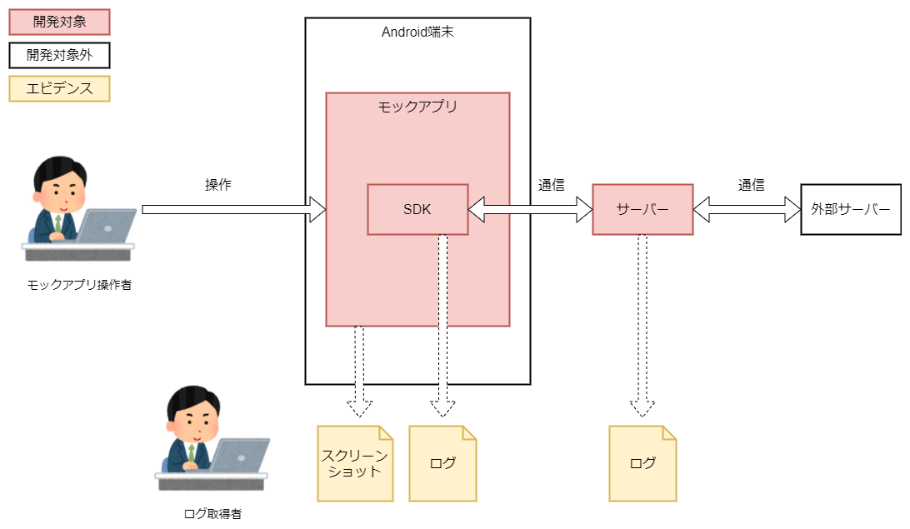
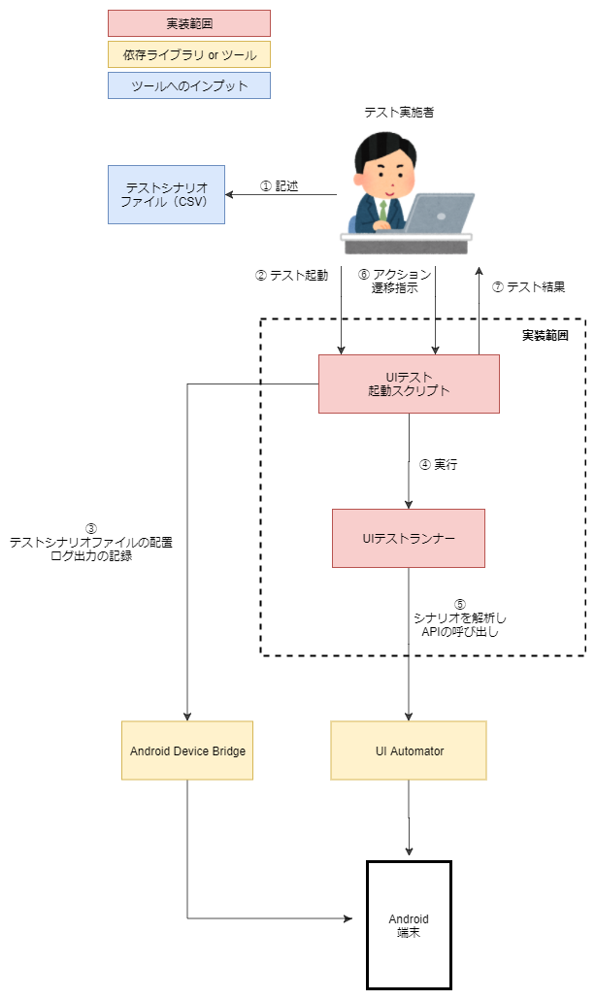
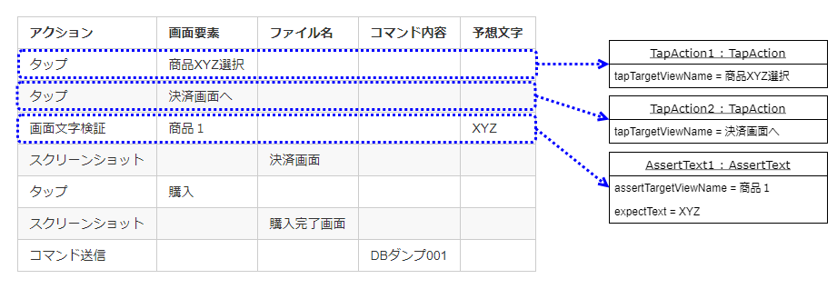

AndroidアプリのUIテスト自動化事例
===

* [はじめに](#はじめに)
* [サマリ](#サマリ)
* [この活動への取り組みについての情報](#この活動への取り組みについての情報)
* [動機](#動機)
* [ツールを作成するにあたり狙ったこと](#ツールを作成するにあたり狙ったこと)
* [作成したツール](#作成したツール)
	* [ツールでできること](#ツールでできること)
	* [構成と動作概要](#構成と動作概要)
	* [特徴](#特徴)
	* [シナリオファイルとアクションクラス](#シナリオファイルとアクションクラス)
* [狙ったことに対する結果](#狙ったことに対する結果)
* [おわりに](#おわりに)

# はじめに

このドキュメントはリリース毎に行う結合テストが高コストになっていたプロジェクトにおいて、Androidアプリの操作を自動化するツールを作成しテストの低コスト化を試みた事例についてまとめたものになります。

本ドキュメントが、Androidアプリのテスト自動化に取り組む際のアプローチや採用技術についての参考情報となることを目的としています。

※本事例は、ツール作成完了時点で執筆しています。実際のテスト工程でツールを適用した際に効果等を追記する予定です。

# サマリ

リリース毎に行う結合テストが高コストになっていたため、テスト自動化ツールを作成しました。作成したツールには、Android操作の自動化、Androidアプリのログ取得や任意のバッチファイルの実行、といった機能を備えています。また、作成したツールの特徴であるシナリオファイルとアクションクラスによって、テスト内容の可読性、既存のテストコードの再利用性、テストシナリオ記述者と開発者の分離といった効果が期待できます。

# この活動への取り組みについての情報

**プロジェクト内容**

- 新規サービス開発

**開発プロセス**

- スクラム

**開発規模**

- 期間：5か月
- 本記事執筆時点でのプロジェクト開始からの経過時間：3か月
- 開発者数：8人

**技術要素**

- 実装形態：Webアプリ、Android端末上で動作するSDK
- 言語：Java 11、Kotlin 1.0
- フレームワーク：Spring Framework

**ツール作成にかかった大まかな時間**

- 40時間程度

※以降、とくに明記しない限り「Android端末上で動作するSDK」を「SDK」と記述します。

# 動機

リグレッションテストの低コスト化がプロジェクトを成功へ導くために重要でした。リグレッションテストとは、ソフトウェアに変更を加えた際に予期せぬ不具合が加えられていないかを確認するため開発期間中に何度も実行するテストのことです。スクラム開発では、各スプリントを通じてソフトウェアを段階的に作成するため、開発期間を通してソフトウェアに変更を加えることになります。そのため、リグレッションテストを頻繁に実施することになり、コストを低下させることが求められます。

本プロジェクトではリリース毎に行う結合テストがとくに高コストになっていました。結合テストではSDKを、テスト用に開発したAndroidモックアプリへ取り込み、システム間通信ができる状態にして行っていました。そのため、テスト実施者がAndroidモックアプリを直接操作したり、アプリ操作の任意のタイミングで通信先システムのエビデンスを取得したりしなければならず、テストに関わる人（Androidモックアプリの操作者とエビデンス取得者）と時間のコストが高い状態でした。



このことから、リリース毎に行うテストにおいてAndroidモックアプリの操作とエビデンスの取得を自動化すればコストを削減できると考え、テスト自動化ツールを作成しました。テストが自動化されることでテスト時間が短縮されるだけではなく、テストに関わる人数を削減できるのではないかと考えました。

# ツールを作成するにあたり狙ったこと

テスト自動化のツールを作成する上で以下のことを狙いました。

**Androidモックアプリ操作の自動化**

Androidアプリの操作を自動化することを狙いました。本事例ではAndroidモックアプリを操作することでSDKやその他の連携するシステムの動作をテストしています。テストの実施者は複雑な操作を指定された順番通りに実施しなくてはならず、時間がかかったり、操作ミスによりテストをやり直したりする事がしばしばありました。Androidアプリの操作が自動化されれば複雑な操作を人が行わなくて済むので、誤った操作をすることなく短時間でテストが可能になると考えました。

**エビデンス取得の自動化**

テスト実行途中の任意のタイミングで周辺システムのエビデンス記録を自動化することを狙いました。本事例ではテスト中の任意のタイミングで、SDKと通信しているシステムのログやデータベースの内容などを人が操作してエビデンスとして記録しています。ただ、エビデンスの取得と、Androidモックアプリの操作を合わせて同一人物が行うと操作ミスが多いので、Androidモックアプリを操作する人とエビデンスを記録する人の2人でテストを実施しています。そこで、エビデンスの取得が自動化されれば、エビデンスの取得を行う人が不要になるのではないかと考えました。

**テスト対象のアプリを限定しない**

ツールがテスト対象にできるAndroidアプリを限定しないようにすることを狙いました。限定しないとは、ツールが特定の画面要素のみに対応していたり、特定の動作のみに対応するといったことがないようにするという事です。このようにすることで、Androidモックアプリの画面要素や動作が変わったとしてもツールを継続して使用できます。さらに、複数のプロジェクトで横断的に使用することもできます。

# 作成したツール

## ツールでできること

ツールは以下の事ができます。

**Android操作を自動実行**

Androidの操作を後述するアクションと呼ばれる単位で、指定された順序で自動実行できます。ツールが内部で使用しているUI Automatorの機能により、複数のアプリを操作したり、スクリーンショットを撮影したりできます。画面内に表示されている文字列の検証も可能です。

**Androidアプリのログ取得**

Androidアプリのログを自動で記録し、保存できます。ログはテスト終了時にAndroid端末と接続されているPCにテキストファイルとして転送されます。

**Android端末と接続されているPCの任意のバッチファイルの実行**

Android端末と接続されているPCの任意のバッチファイルを、任意のタイミングで実行できます。この機能を使えば特定のデータベースのダンプファイル取得などを任意のタイミングで実行できます。

## 構成と動作概要

本ツールの概要を示す図を以下に示します。



本ツールの実装部分は大きく2つの構成になっています。

* スクリプト ... テストの実行や遷移を制御するスクリプトファイル群（バッチファイル、シェルスクリプト）
* UIテストランナー ... 後述するテストのシナリオファイルを解析しテストを実行するプログラム（KotlinとJavaで実装されたライブラリ）

本ツールが依存しているツールおよびライブラリは以下の2つです。

* [Android Device Bridge](https://developer.android.com/studio/command-line/adb?hl=JA) ... エミュレーターや接続されたAndroid端末と通信しさまざまな用途に使用できるコマンドラインツール。
* [UI Automator](https://developer.android.com/training/testing/ui-automator) ... AndroidアプリのUIテストフレームワーク


本ツールは以下のステップで実行されます。1、2、6ステップについては人が行います。

1. **シナリオファイルの記述** 

	テストのシナリオを後述するルールを元にCSV形式で作成します。本ツールでは、このCSVファイルをシナリオファイルと呼びます。

2. **テスト起動** 

	テスト起動用スクリプトを、シナリオファイルをスクリプトの引数で指定し実行します。

3. **テストシナリオファイルの配置、ログ出力の記録** 

	スクリプトがAndroid Device Bridgeを使用してシナリオファイルをAndroid端末上に配置し、ログの記録を開始します。

4. **UIテストランナーを実行** 

	スクリプトがUIテストランナーを呼び出しテストを実行します。

5. **シナリオファイルを解析しUI Automator APIの呼び出し** 

	UIテストランナーがAndroid端末上に配置されているシナリオファイルを解析し、UI Automatorを使ってテストを実行します。

6. **アクション遷移指示** 

	テスト実施者はアクション（詳細は後述）の遷移許可を行うスクリプトを任意のタイミングで実行します。この操作は後述するアクションクラスの内容によっては不要になります。

7. **ログの転送** 

	テストが終了すると、スクリプトがテスト実行時の端末のログをAndroid Device Bridgeを使用してAndroid端末と接続しているPCに転送します。

## 特徴

**本ツールの特徴はアクションと呼ばれる単位でAndroidに対する操作や、Android端末と接続されているPCの任意のバッチファイルを自動実行できる事です。** アクションとは、Android端末上で実行できる操作や、Android端末上で実行できるテストコードの処理のまとまりの事を指します。たとえば以下のような内容です。

* 〇〇をタップ
* 〇〇入力フィールドに△△を入力
* 〇〇に表示されている文字列の検証
* 接続されているPCの特定のバッチファイルの実行

テストの実施者はアクションの実行順序とアクションの実行に必要なパラメーターをCSVファイルに定義することで、テストを自動実行できます。本ツールでは上記のような基本的なアクションをはじめからCSVに記入し、実行できるようになってますが、必要に応じて独自のアクションを定義することもできます。

この特徴から考えられるメリットは以下の通りです。

* テスト内容の可読性 ... AndroidアプリのUIテストをコードで実装するのではなく、アクションの単位でCSVファイルに記述するためテストの内容を分かりやすく表現できます。
* 既存コードの再利用性 ... アクションの実装を再利用することができ、テストコードの実装にかかるコストを削減できます。必要なアクションがすべて用意されている場合、コードを書かずにテストを自動実行できます。アクションの実装については[シナリオファイルとアクションクラス](#シナリオファイルとアクションクラス)を参照してください。
* テストシナリオ記述者と開発者の分離 ... テストシナリオを考える人とアクションを実装する開発者を分離することができ、Androidに詳しくない人でも実行可能なテストのシナリオを作成できます。

## シナリオファイルとアクションクラス

アクションの内容を記載するシナリオファイルとアクションごとにインスタンス化されるアクションクラスを説明します。

以下に、シナリオファイルの例を示します。

|アクション|画面要素|ファイル名|コマンド内容|予想文字|
|:--|:--|:--|:--|:--|
|タップ|商品XYZ選択|
|タップ|決済画面へ|
|画面文字検証|商品1|||XYZ|
|スクリーンショット||決済画面|
|タップ|購入|
|スクリーンショット||購入完了画面|
|コマンド送信|||DBダンプ001|

本ツールは上記のように、特定のルールに基づいて記述されたCSVファイルを、テストのシナリオが記述されたシナリオファイルとして読み込みます。最初の行はヘッダー行となり、シナリオ内容の記述形式を規定します。ヘッダー行以外の各行がアクションを表します。アクションは、実行したい順番で上から記述します。

テストは、シナリオファイルの内容を元にしてアクションごとに対応するJavaクラスをインスタンス化し、メソッドを呼び出すことで実行されます。アクションごとにインスタンス化されるJavaクラスをアクションクラスと呼びます。上記のシナリオファイルでは、Android画面上の特定の要素をタップするアクションクラスや、Android画面上に表示されている文字列の検証をするアクションクラス、スクリーンショットを取るアクションクラスなどが各行に対してインスタンス化され、上から順に実行されます。

以下に、Android画面上の特定の要素をタップするアクションクラス `TapAction` のコードを示します。

```
@ActionName(name = "タップ")
public class TapAction implements Action {

    @ActionParameter(paramName = "画面要素")
    public String tapTargetViewName;

    @Override
    public void execute(UiDevice uiDevice, UiObjectResolver uiObjectResolver, Stopper stopper) {
        Log.i(BuildConfig.LOG_TAG, "execute tap for [" + tapTargetViewName + "]");
        uiObjectResolver.resolve(tapTargetViewName).click();
        stopper.stopUntilUnLockCommand();
    }

}
```

上記のシナリオファイルを入力とし、本ツールを実行した際のアクションクラスとシナリオファイルに関連する動きは以下になります。

（1） **シナリオファイルから対応するクラスのインスタンス化とフィールドの初期化** 

UIテストランナーがシナリオファイルを読み込み、アクション列のそれぞれの文字列内容を元に対応するJavaクラスがインスタンス化されます。本ツールはJavaクラスに付与されている `@ActionName` アノテーションの内容を元に対応するJavaクラスの検索を行います。たとえばアクション列に `タップ` が指定されている行では、`@ActionName(name = "タップ")` を検索するため、上記の `TapAction` クラスがインスタンス化されます。

シナリオファイルのアクション列以外に値が書き込まれている場合、対応するそれぞれのアクションクラスが持つフィールドへそれらの値がセットされます。本ツールはセット先のフィールドをアクションクラスのフィールドに付与されている `@ActionParameter` アノテーションを元に探します。上記の `TapAction` クラスでは `tapTargetViewName` フィールドに `@ActionParameter(paramName = "画面要素")` が付与されているので、画面要素列の値がフィールドにセットされます。上記のシナリオファイルでは、2行目で「商品XYZ選択」が、3行目で「決済画面へ」が、個々のTapActionインスタンスの `tapTargetViewName` フィールドに文字列としてセットされます。

以下に、上記のシナリオファイルのヘッダー行を除く3行目までをUIテストランナーが読み込んだ際の概要を示します。



（2） **アクションクラスの `execute` メソッドの呼び出し**

アクションクラスの `execute` メソッドをシナリオファイルで定義されている順番に本ツールが呼び出します。呼び出しに必要な以下の引数は本ツールによって与えられます。

- UiDevice ... Androidアプリを操作する、UI Automatorによって提供されるクラス。詳細は[こちら](https://developer.android.com/reference/androidx/test/uiautomator/UiDevice)を参照。
- UiObjectResolver ... Androidアプリの画面要素を示す文字列から、対応する `UiObject2` を解決するクラス。 `UiObject2` はUI Automatorによって提供されるクラスであり、タップや入力などの動作を対象画面要素に対して行うことができる。`UiObject2` の詳細は[こちら](https://developer.android.com/reference/android/support/test/uiautomator/UiObject2)。Androidアプリの画面要素を表す文字と、`UiObject2`の対応は開発者がアプリに合わせて本ツールのセットアップ時に設定することができる。
- Stopper ... 処理を一時停止するために使用されるクラス。このクラスを利用することで、本ツールの利用者からアクション遷移指示が出るまで処理を停止できる。このクラスを利用しない場合、アクション遷移指示を待たずに次のアクションへ遷移する。

上記の `TapAction` クラスでは `UiObjectResolver` を使用してタップ先のAndroidアプリの画面要素を表す `UiObject2` クラスを解決し、画面をタップします。その後、 `Stopper` クラスを使用し、アクション遷移指示が出るまで処理を停止します。アクション遷移指示が出ると処理の停止を解除し、 `execute` メソッドを終了します。`execute` メソッドが終了すると、次のアクションの `execute` メソッドが呼び出されます。

# 狙ったことに対する結果

テスト自動化のツールを作成する上で狙ったことに対する結果について説明します。

**Androidモックアプリ操作の自動化**

Androidモックアプリの操作を自動化できるようになりました。本ツールはシナリオファイルを元にAndroidアプリを操作するため、モックアプリをテスト実施者が直接操作しなくて済むようになりました。その結果、テストの実施者が複雑な操作を指定された順番通りに実施する必要がなくなりました。

**エビデンス取得の自動化**

テスト実行途中の任意のタイミングで周辺システムのエビデンスを自動的に記録できるようになりました。本ツールが備えている、「Android端末と接続されているPCの任意のバッチファイルを実行する機能」により、テスト中の任意のタイミングで他システムのログやデータベースの内容などを記録できるようになりました。また、Androidアプリの画面を画像として保存するアクションクラスを使う事で、スクリーンショットのエビデンスも記録できるようになりました。

**テスト対象のアプリを限定しない**

ツールがテスト対象にできるAndroidアプリを限定しないようにできました。シナリオファイルで書かれる画面要素を示す文字列と、Androidアプリの画面要素との対応付けは開発者が自由に設定することができ、ツールが特定のAndroidアプリの画面要素のみに対応するといったことがないようにできました。さらに、アクションクラスを独自に定義できるようにしたことで特定の動作のみに対応するといったことも防ぐことができました。

# おわりに

本事例ではリリース毎に行う結合テストの低コスト化を狙い、テスト自動化ツールを作成しました。ツールの作成にあたり、Android操作の自動化、エビデンス取得の自動化、テスト対象のアプリを限定しないようにすることを狙いました。また、作成したツールにシナリオファイルとアクションクラスという特徴を持たせることで、テスト内容の可読性、既存のテストコードの再利用性、テストシナリオ記述者と開発者の分離といった効果が期待できるようになりました。本ドキュメントが、Androidアプリのテスト自動化に取り組む際のアプローチや採用技術についての参考情報になればと思います。
