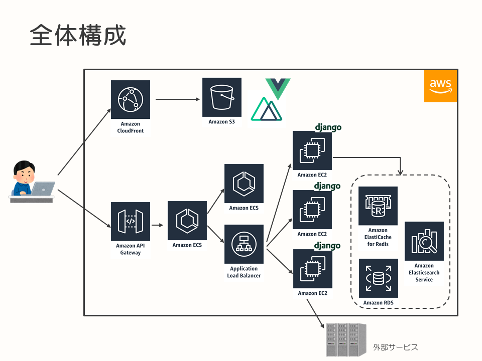
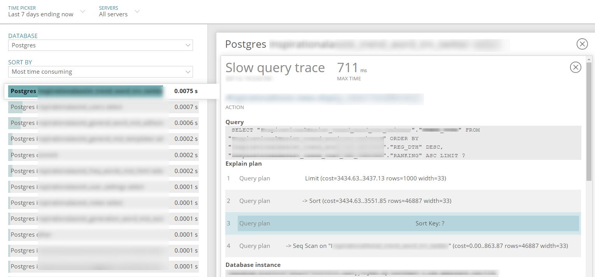
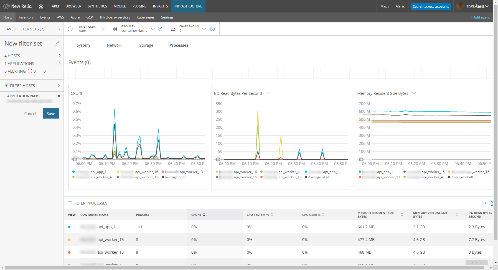

# New Relicを用いたWebサービスのモニタリング

Webサービスを安定的に提供するためには、システムのモニタリングが欠かせません。

本記事では、我々が現在運用しているWebサービスに対してどのようなアプローチでモニタリングツールを選定・導入したか、どのように活用しているかをご紹介します。

## 我々のWebサービスについて

ユーザーからの入力値に応じてさまざまな外部サービスから情報を収集し、付加価値をつけてユーザーへ表示するWebサービスを運用しています。

このサービスのAPIサーバーはPython, Djangoで作成しており、AWS EC2上で動かしています。

フロントエンドはVue.jsを用いてSPAとして構築しており、S3とCloudFrontで静的コンテンツを配信しています。

サービス全体のシステム構成は以下の通りです。

## ローンチ前に抱えていた問題

ローンチを目前に控え、我々は以下の問題を抱えていました。

* 例外発生時に参考となるようなログが出ていない
* 多数の外部サービスへアクセスしているが、それぞれに対するリクエスト量やレスポンスタイムなどを把握できていない
* 期待した性能が出ない
  * 詳細は[Webアプリケーションのパフォーマンスチューニング事例（Python）]()参照
* 複数のデータソース（PostgreSQL, Redis, Elasticsearch, SQLite)に接続しているが、利用状況を把握できていない

つまり、我々自身がサービスのパフォーマンス特性、状況を把握できていない状況にありました。このため、エラーが発生した際の原因調査や、性能問題におけるボトルネックの調査、対応に多くの時間を取られていました。

## モニタリングの導入

エラー時の原因調査や性能問題のボトルネックの調査に時間がかかってしまうのは、現在のシステム、サービスの状況をリアルタイムに把握できていないことが要因として挙げられます。

ちょうどサービス全体のモニタリングについて検討していたタイミングだったので、ツールで解決できないか調査を実施しました。

### モニタリングツールの選定

前述した問題の多くはアプリケーションレイヤーで発生していたため、APM（Application Performance Monitoring) が製品群に含まれる [New Relic](https://newrelic.co.jp/) と [Datadog](https://www.datadoghq.com/) を調査しました。

どちらも持っている機能としては似通っており、同じようなことが実現可能ですが、利用してみて以下の特色があるように感じました。

* New Relicはアプリケーションのモニタリングが得意
* Datadogはインフラ、とくにコンテナのモニタリングが得意

たとえば、New RelicのAPMでは遅かった処理のコールツリーを見ることができ、どの処理にどれだけ時間がかかったかを可視化してくれます。外部サービスの呼び出しに関しても、呼び出し回数や応答時間などを可視化してくれます。
Datadogでは処理のコールツリーは見れません。また、外部サービスの呼び出しをモニタリングするためには、コードを追加する必要があります。

次に、コンテナ監視をする場合を例として挙げます。Datadogでは、モニタリングする為のエージェントがDockerイメージとして提供されます。[AWS Fargate](https://aws.amazon.com/jp/fargate/) のようなホストのファイルシステムをマウントできないアーキテクチャであっても、エージェントのコンテナをサイドカーとして動かしてメトリクスを取得できます。

* https://docs.datadoghq.com/ja/integrations/ecs_fargate

New Relicは、エージェントを親ホストにインストールし、Dockerのメトリクスを取得します。AWS Fargateのモニタリングを実施する場合はAWSとのインテグレーション機能を利用するしかなく、AWS CloudWatch等で取得可能なメトリクス以外は取得できません。

* https://docs.newrelic.com/docs/infrastructure/install-configure-manage-infrastructure/linux-installation/tarball-assisted-install-infrastructure-linux
* https://docs.newrelic.com/docs/integrations/amazon-integrations/aws-integrations-list/aws-ecsecr-monitoring-integration

比較した両製品とも優れた良い製品ですが、以下の点から我々が抱えていた問題によりマッチすると考え、New Relicを採用しました。

* 例外発生時のスタックトレースや、コールスタックを見れる
* 外部サービスの呼び出しをモニタリングできる
* コールスタックで、どの処理に時間がかかったか把握できる
* スロークエリの検知でき、実行計画が確認できる

New Relicは、APMの導入が容易かつ高機能であり、我々自身がサービスのパフォーマンス特性、問題点を把握できていないという状況を解決するのに最適であると考えました。

New RelicとDatadogは似た領域の製品ですが、それぞれ特色が異なります。そのため、自分たちに合ったツールを選択するのが重要です。

また、サービスの状態の変化に応じて適したモニタリングツールも変わってきますので、適宜モニタリングの構成の見直しも必要です。

New Relicにはいくつか製品がありますが、最終的に以下を導入しました。それぞれの概要と、我々の活用方法については後述します。

* APM
  * アプリケーション監視
* Infrastructure
  * サーバー監視
* Insights
  * ダッシュボード

## New Relicによるモニタリングの実施

## New Relic APM

New Relic APMはアプリケーションのパフォーマンス、サービス間の依存関係、外部サービスの呼び出し、エラーなどを可視化します。

我々は特に、TransactionsとDatabasesの機能を活用しています。

Transactionsでは、時間がかかっている処理の一覧を確認できます。特定の処理を選択することで、詳細を確認できます。Trace detailsでは、処理のコールスタックを確認でき、 “どのメソッドで処理に時間がかかっているのか“ を特定するのにとても有用でした。

https://newrelic.com/resource/key-capabilities-new-relic-apm-jp

たとえば、もともとRedisにsetするデータ量がとても多く、その処理がボトルネックになっていました。

しかし、APMのTransactionsで遅い処理を抽出し、Trace detailsで詳細を確認するとすぐにRedisのsetが遅いことに気が付きました。

APMを導入していない場合は、怪しい処理に目星を付けてログを仕込んだり、プロファイルを実行したりして調査します。その場合、調査に多くの時間を要しますが、この例では5分もかからずに遅い処理を見つけることができました。

実際はこの後に “なぜRedisへのsetが遅いのか“ を調査しています。データ量の多さが原因だと判明したため、setするデータ量を削減することで解決しました。

Databasesでは、接続しているデータベースの処理時間やスループットなどが確認できます。

とくに有用だったのが、スロークエリを検知してくれる機能です。

https://newrelic.com/products/application-monitoring/features

遅かった処理を選択すると、サンプルとして取得されたスロークエリの一覧が表示されます。

対象のクエリを選択すると、実行にかかった時間、実行されたクエリ、実行計画、どのデータベースに対してクエリを発行したかなどが確認できます。

以下の画像のように実行計画が表示されるので、どのようにアクセスされたかがわかります。この処理がサービスのパフォーマンスに大きな影響を与えている場合、インデックスを利用するようにクエリを変更する、インデックスを追加するなどの対応を検討できます。

我々も実際、本番ローンチ前にAPMによってスロークエリを検知しています。これに関しては、インデックスを追加することで対応しています。性能テストは実施していたのですがスロークエリは検知できていなかったので、とても助かりました。

## New Relic Infrastructure

New Relic Infrastructureはコンテナ、VM、クラウドサービスの各種メトリクスを可視化します。

AWS, Azure, GCPや、サードパーティのサービス、Kubernetesであれば、容易にモニタリングできるようインテグレーション機能が提供されています。

インフラのモニタリングは、EC2にNew Relicのエージェントをインストールして実施しています。

アプリケーションはEC2上のDockerで動しており、エージェントをインストールすることで自動的にメトリクスを収集してくれます。

その他、AWSのインテグレーション機能を利用してAWSのさまざまなサービスのメトリクスをモニタリングしています。

キャッシュとしてElastiCache（Redis）を利用しているのですが、コストが課題になっていたのでElastiCacheの利用量は注意してモニタリングしていました。[Webアプリケーションのパフォーマンスチューニング事例（Python）- Redisでメモリを大量消費]()に記載されている通り、有効期限の設定や用途を明確にして整理することで対応しています。現在は問題が解消されたので、そこまで注意してモニタリングしていません。

現在も継続してモニタリングしている項目としては、API GatewayのHTTPステータスとレイテンシが挙げられます。これは、API Gatewayがユーザーから近く、影響がわかりやすいからです。

ちなみにNew Relicでは5xx系、4xx系など、大まかなステータス毎にしか把握できません。そのため、個別のHTTPステータス毎に把握したい場合は、カスタムメトリクスを送信するような仕組みを構築する必要があります。AWSの場合は、CloudWatch LogsのサブスクリプションでLambdaに連携し、カスタムメトリクスとして送信するなどが考えられます。

現状対応できていないので、今後対応していく予定です。

## New Relic Insights

New Relic Insightsは、New Relicの他の製品やサービス特有のメトリクスなどを一元的に収集し、可視化するダッシュボードを提供します。

https://newrelic.com/products/insights

我々は、システムメトリクス用のダッシュボードと、サービスのKPIを一覧で表示するビジネス用ダッシュボードを分けて運用しています。

システムメトリクス用のダッシュボードでは、Infrastructureで見ているメトリクスから重要視している項目を集約して可視化しています。問題が発生した際に、横断的に状況確認できる点が良いです。

ビジネス用ダッシュボードでは、サービスのUU（ユニークユーザー数）やサインアップ数などを表示しています。

サービスのローンチ直後はとくに、時間別のUUを見て利用傾向を把握していました。

現在は、前述したカスタムメトリクスを使い、有償契約しているユーザー数や売上などの可視化にも取り組んでいます。

ビジネス面での詳細な分析はBIツールに分があるので、そういった要求に対してはAWSのQuickSightで対応しています。

現状をリアルタイムに表示したい場合はInsights、詳細に分析したい場合はQuickSightといった棲み分けを行っています。

## まとめ

我々がどのようにモニタリングツールを選定、導入したか、どのように運用しているかを紹介してきました。

New Relicを利用することで、容易に必要なモニタリングを実現できました。

OSSを組み合わせてモニタリングの仕組みを構築することもできますが、採用するOSSに関する知識や構築するための時間が必要です。

ローンチまでに時間の猶予がなく、割けるリソースが少ない我々にとって、SaaSは最適な選択肢でした。また、抱えていた問題を解決するのに、New Relicがもっとも適していました。

チームメンバーのスキル構成、プロジェクトの状況、抱えている問題によってモニタリングに対するアプローチは変わりますが、本記事が参考となれば幸いです。
