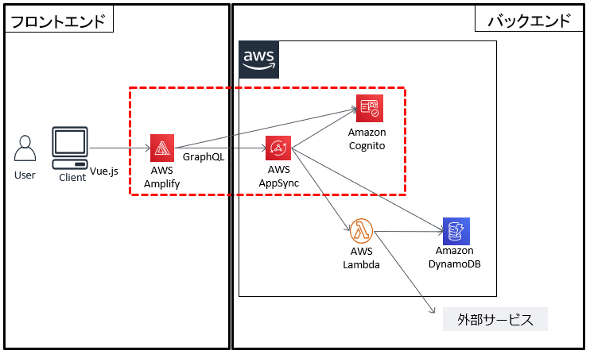
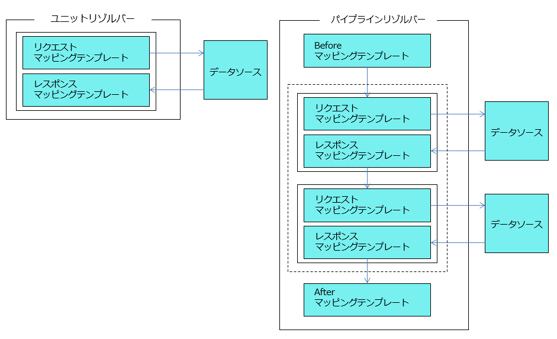

# AWS AppSync(GraphQL)を用いたバックエンドの構築事例

## 目次

- [はじめに](#はじめに)
- [TL;DR](#TL;DR)
- [背景](#背景)
- [全体のシステム構成](#全体のシステム構成)
- [GraphQLについて](#GraphQLについて)
- [AWS AppSyncについて](#AWS-AppSyncについて)
- [結果と今後](#結果と今後)

## はじめに

GraphQLは、2015年に公開されて以降、徐々に注目が高まっている技術になります。
以下リンクによると、2019年時点で約90％の人が注目していることが分かります。

- https://2019.stateofjs.com/data-layer/graphql/

しかし、実際にGraphQLを採用して開発した事例はまだ多くありません。
その結果、GraphQLのメリットが分からず、採用に二の足を踏んでいるようなプロジェクトも多いのではないかと想定しています。

我々は、新規開発のサービスにGraphQLを採用しました。
本ドキュメントは、そのときに得たGraphQLに関する知見やRESTと比較したときのメリットを構築事例としてまとめたものになります。

本ドキュメントで記述するGraphQLのメリット、マネージドサービスを用いたシステムの実装例、具体的な他サービスとのインテグレーション例を通し、GraphQLの採用を検討する際の一助になれば幸いです。

対象とする読者としては、以下を想定しています。

- 技術選定の際に、GraphQLの採用を検討している人
- GraphQLを採用したいが、フロントエンド・バックエンドのそれぞれをどのように実現すれば良いのか悩んでいる人

## TL;DR

- バックエンドの開発を行うために、GraphQL、AWS AppSyncを採用した
- GraphQLを用いたことで、RESTと比較して以下の利点があった
  - スキーマ定義により、フロントエンドとバックエンドで型安全にデータのやり取りができた
  - 1度のリクエストで複数のリソースから必要な情報のみ取得できるようになり、ネットワークアクセス回数とネットワーク負荷を削減できた
  - エンドポイントのURL定義に悩まず開発できた
- AWS AppSyncを採用したことで、以下の利点があった
  - GraphQLが簡単に使えるようになり、少人数・短時間でもバックエンドの開発が完了できた
  - Amazon Cognitoと組み合わせることで、容易に認可制御を実現できた
  - マッピングテンプレートを利用することで、データソースへアクセスする前後に容易に処理を挟むことができた

## 背景

サービスの新規立ち上げに伴い、製品管理アプリケーション(以降、管理アプリと呼称する)を作成することになりました。

管理アプリの概要は以下の通りで、フロントエンドはSPAで作成しています。

- 製品とそれに紐づく契約やユーザの情報を、管理・参照できるWebアプリケーションである
- Web画面を通し、製品や契約の情報を登録・更新・検索が可能である
- ログインユーザに紐づく権限によって、操作可能な機能や表示できる画面が異なる

また、管理アプリの開発体制は、バックエンドの有識者1名(技術選定の段階のみ参加)とフロントエンドの有識者1名、開発の未経験者1名となっています。

### 課題

技術選定を行うにあたり、以下の課題が挙がりました。

- アクセスするリソース数が明確ではなく、かつ多数になることが想定されていた
  - DB以外に(AWSではない)クラウドサービスも利用することになり、種類の違うリソースからデータを取得する必要がある
  - RESTのリソースとして設計してしまうと、それぞれのリソースの情報を逐一取得する必要があるため、業務上で必要なデータの取得に時間がかかる
  - リソース設計、URL設計にも時間をかけたくなかった
- 開発にあたるメンバーのスキルや人数、ローンチ時期を鑑みると、バックエンドを一から実装することは困難である

## 全体のシステム構成

前述の課題を鑑み、以下のようなシステム構成を取るようにしました。



フロントエンドにはVue.jsを使用しSPAとして構築しました。
バックエンドにはAWS AppSyncを採用しました。AppSyncでGraphQLのリクエストを受け取った後、データソース(図上のAWS LambdaやAmazon DynamoDB)からデータを取得し、レスポンスをフロントエンドに返しています。
フロントエンドとバックエンドの連携にはAWS Amplifyを利用しています。

本記事では赤い点線で囲んでいる部分に焦点を当てて説明します。

## GraphQLについて

### GraphQLの採用理由

上述した課題の通り、開発当初はアクセスすべきリソース数が多数になることが想定されていました。これをRESTfulなWebサービスとして設計した場合、
SPAのフロントエンドは以下をRESTのリソースごとに繰り返す形となることが想定されました。

- APIを呼び出し、バックエンドからリソースのデータを取得
- データを加工し表示

画面描画の都度、リソースごとにAPIの呼び出しを繰り返すと、画面を表示する際のレスポンスタイムが悪化します。

また、都度のデータ取得で本来は画面描画に使用しないデータも多く転送されることになり、ネットワーク帯域に余計な負荷が掛かってしまいます。

上記の懸念を回避するため、1度のリクエストで必要な情報のみを取得するような設計を目指すことになりました。
この点について調査を進めた結果、GraphQLであればこれを容易に実現できることがわかりました。

### GraphQLの特徴

GraphQLの特徴は以下の通りです。

- スキーマ言語とクエリ言語で構成されている
- スキーマ言語でAPI仕様を記述できる
  - クエリとレスポンスの構造、各フィールドの型を定義できる
    - 3種類のオペレーションタイプが定義できる
      - query (データ取得)
      - mutation (データ更新)
      - subscription (データ購読)
- クライアントはクエリ言語を使ってデータを取得・更新・購読できる
- クエリ言語では、スキーマ言語に定義されたフィールドを絞ることで、クライアントで必要な情報だけを取得できる
- 単一のエンドポイント(URL)のみを持つという特徴により、URL設計を考える必要がない

具体的なイメージを理解していただくため、契約情報を取得する際のスキーマと発行するクエリの例を示します。

- スキーマ

  ``` graphql
  schema {
    query: Query
  }

  type Query {
    contract: Contract!
  }

  type Contract {  # Contractの型定義。
    id: ID!        # フィールド。ID型(実体は文字列)。非null
    name: String  # フィールド。String型。null許可
  }
  ```

- 発行するクエリ

  ``` graphql
  query GetContract {
    contract  {
        id
        name
    }
  }
  ```

上記のqueryを発行すると、以下のレスポンスが返却されます。
発行したqueryとレスポンスが、ほとんど同じ形であることが見て取れます。

``` graphql
{
  "data": {
    “contract": {
      "id": “10000",
      "name": "契約-1",
    }
  }
}
```

上記例では契約情報のみ取得しましたが、製品情報も同時に取得する場合は以下のようになります。

- スキーマ

  ``` graphql
  type Query {
    contract(id: ID!): Contract!  ## 引数をとることも可能
    product(productId: ID!): Product!  ## 引数をとることも可能
  }

  type Contract {
    id: ID!
    name: String
  }

  type Product {
    productId: ID!
    productName: String
    productType: String
  }
  ```

- 発行するクエリ

  ``` graphql
  query GetContractAndProduct  {
    contract(id: "10000") {
        id
        name
    }
    product(productId: "hoge") {
      prodcutId
      productName
    }
  }
  ```

このようにGraphQLでは、1回のリクエストで複数のリソースから値を取得する設計が容易です。
本例では、発行するクエリに`productType`を定義していないため、レスポンスデータから`productType`が除外できます。

### GraphQLを採用したメリット

GraphQLを採用したことで管理アプリが抱えていた「必要なデータの取得に時間がかかる」という課題が解決し、改めて採用して良かったと感じました。

他にも以下の利点を得ることができました。

- フロントエンドとバックエンドを分担して開発する際に、スキーマ定義を確認することでAPIの仕様が理解できる
  - コミュニケーションコストを抑えることができた
  - スキーマの表現力が高いことにより、詳細にドキュメントを記述しなくても、フロントエンド・バックエンドの開発者がAPI仕様を簡単に理解できた。
- 複数のリソースからでも、1つのGraphQLリクエストを発行するだけでまとめて取得できた
- 画面描写に必要な情報はクエリ言語として指定できるため、軽い機能変更の時はフロントエンドの修正だけで済むことが多かった
- エンドポイントが1つなので、URL設計に時間を取られずに済んだ

## AWS AppSyncについて

### AWS AppSyncの導入理由

上述した課題の通り、GraphQLのサーバサイドを一から実装するのは、開発メンバーのスキル・ローンチ時期などを考慮すると困難でした。

AWS AppSyncはGraphQLを使ってデータアクセスできるマネージド型サービスです。
これを利用することで、GraphQLのバックエンド開発コストを抑えることができると判断しました。

また、開発をサポートする機能を多く内包していることも採用の決め手の1つとなりました。
たとえば、AWS AppSyncのコンソール上では、作成したクエリ言語を確認する環境を用意してくれています。
そこでは、オートコンプリートが効くのでクエリ言語の作成も容易にでき、Amazon Cognitoなどでログインした状態で作成したクエリ言語を試すこともできます。
実際に開発中は、この環境を使うことで他にツールを入れることなく、バックエンドの実装を確認できました。

### AWS AppSyncの特徴

AWS AppSyncの特徴は以下の通りです。

- GraphQLを使用して情報を取得できる
- Amazon Cognitoと連携することで認可制御が容易に実現できる
- パイプラインリゾルバーを利用することで、複数のオペレーションを組み合わせて実行できる
- マッピングテンプレートに処理を記載することで、リソースへアクセスする前後に処理を挟むことができる

管理アプリでは、マッピングテンプレートを以下のような用途で使用しました。

  - リクエストマッピングテンプレート
    - 文字数チェックなど、リクエストデータのスキーマ定義より細かいバリデーションを行う
    - DBへ新規登録する際に、フロントエンドからきたリクエストデータに固定値(バージョン)を加える
  - レスポンスマッピングテンプレート
    - 製品情報を取得した際に、リクエストを送信したユーザが所属するAmazon Cognitoのユーザグループに応じて、返却する情報を絞る
    - 複数リソースから得た結果を1つのオブジェクトに整形する

### AWS AppSyncのアーキテクチャ

上で述べた特徴の中に、AWS AppSync固有の名詞がいくつか登場するため、ここではAWS AppSyncのアーキテクチャとともに簡単に説明します。

AWS AppSyncは、モバイルアプリやWebクライアントからGraphQLリクエストを受け取ると、リゾルバーと呼ばれる関数にGraphQLリクエストをマッピングします。

ここでいう関数とは、リクエストマッピングテンプレート・レスポンスマッピングテンプレート・データソース名・バージョンで構成されており、
データソースへの1つのオペレーションを定義しています。

開発者はそれぞれリクエスト・レスポンスに対する処理をVTL(Apache Velocity Template Language)と呼ばれるフォーマットでマッピングテンプレートに自由に記述できます。

また、リゾルバーには以下があります。

- ユニットリゾルバー
- パイプラインリゾルバー

各リゾルバーのイメージを左右に並べて図示します。



前者は1つのデータソースに対する単純な操作に利用でき、後者は1つ以上のデータソースに対する操作に利用されます。
管理アプリでは、複数のデータソースからデータを取得する必要があったため、パイプラインリゾルバーを主に利用しました。

AWS AppSyncが指定できるデータソースのタイプは以下になります。

- Amazon DynamoDB table
- Amazon Elasticsearch domain
- Relational database
- HTTP endpoint
- AWS Lambda function
- None

その他のデータソースに対しても、AWS Lambda functionに当該データソースからのデータ取得処理を記述することで対応が可能です。
実際に管理アプリでは、外部サービスからデータ取得するときに利用しました。
このように、リゾルバーをAWS AppSyncに設定するだけで、容易にデータソースへのアクセスを行うことができます。

### フロントエンドのGraphQLを用いたデータアクセス

フロントエンドからバックエンドへのアクセスには、AWS AmplifyのJavaScriptライブラリを利用しました。

他の有力な選択肢として[Apollo Client](https://github.com/apollographql/apollo-client)というライブラリもあります。
しかし、管理アプリではAWS AppSyncの認証をAmazon Cognitoに委譲しており、Apollo Clientにはそれに関する機能がありません。
そのため、AWS Amplifyを採用することになりました。

#### AWS Amplifyとは

AWS AmplifyのJavaScriptライブラリは、Amazon CognitoによるAWS AppSyncの認証が簡単にできるAPIを提供しています。
AWS Amplifyを使うことで、わずか数行程度の実装でGraphQLリクエストをAWS AppSyncに発行できます。

##### 実装例

クエリの発行は1行で実装できます。
1件の契約情報を取得するための実装例は以下の通りです。

``` js
import { API, graphqlOperation} from 'aws-amplify';
import { Contract } from './graphql/queries'; // exportしたQuery
async getContract(id) {
  const result = await API.graphql(graphqlOperation(Contract, { id })); //  第一引数はQueryを代入した変数、第二引数はQueryに渡す引数のオブジェクト
  return result;
}
```

Amplifyのライブラリでは、発行するクエリは以下のように文字列で定義します。

``` js
export const Contract = `query Contract( $id: ID! ) {
  contract( id: $id) {
    id
    name
  }
}`;
```

### 認可制御の実現

`@aws_auth`ディレクティブをQueryやMutationに付与することで、Amazon Cognitoのユーザープール内のユーザーとグループを活用した認可制御が実現できます。管理アプリではこの機能を使い、どのグループがどのリゾルバーを起動できるのかを制御しました。たとえば「契約情報の新規登録は管理者権限を持つユーザのみ可能にする」といったユースケースを実現しています。

以下の例だと、`admin`と`sale`グループに所属するユーザのみcontractを発行できます。

- スキーマ

  ``` graphql
  type Query {
    contract(id: ID!): Contract
      @aws_auth(cognito_groups: [ “admin", “sale" ])
  }
  ```

もし、上記例のqueryを`admin`や`sale`以外のグループに所属するユーザで実行した場合、以下のようなerrorsオブジェクトが返却されます(一部の値を省略しています)。

``` json
{
  "errors": [
    {
      "errorType": "Unauthorized",
      "message": "Not Authorized to access contract on type Query"
    }
  ]
}
```

このように、アノテーションを1つつけるだけで認可制御が実現できました。

管理アプリでは、ユーザーグループ単位ではなく、同じユーザーグループ内でさらに認可制御を行う必要もありました。たとえば「一般権限を持つユーザが、自身のユーザ情報のみを更新できるようにする」のようなユースケースです。その場合は、スキーマではなくリゾルバーのマッピングテンプレートに定義します。

以下は、リゾルバーのリクエストマッピングテンプレートの例です。

``` vtl
#set( $member = "member-group" ) ## 一般権限
#set( $myRole = $ctx.identity.groups[0] )

#set( $myName = $ctx.identity.username )
#set( $userName = $ctx.args.userName )

## 実行ユーザグループが一般権限、かつ自身以外のユーザを操作しようとしている場合は、認可エラーとする。
#if( $myRole == $member && $myName != $userName )
  $util.unauthorized()
#end
```

上記の処理を共通的に記載することで、容易に認可制御を実現できました。

### AWS AppSyncを採用したメリット

まず、上記の課題で挙げていたような「バックエンドを一から実装する」必要がなくなり、開発コストを削減できました。

また、AWS AppSyncの開発をサポートする機能 (オートコンプリート機能やクエリ言語を試す環境など)も強力で、GraphQLを使ったことのない開発者でもスムーズに開発を進められました。

少人数、短期間であっても期間内に開発を完了できたことに、AWS AppSyncはとても寄与したと感じています。

他にも以下の利点を得ることができました。

- Amazon DynamoDBなど、規定されたデータソースへのアクセスはコンソール上で設定するだけで可能になった
- 規定されていないリソースへのアクセスもAWS Lambdaを利用することで柔軟に対応できた
- マッピングテンプレートを利用することで、データソースにアクセスする前後の処理を柔軟に記述できた
- パイプラインリゾルバーを利用することで、複数のリソースから1度に情報を取得できた

## 結果と今後

GraphQLとAWS AppSyncを用いたバックエンドの構築事例を紹介しました。

我々が開発した管理アプリは、アクセスするリソース数も多く、仮にRESTfulなWebサービスとして設計した場合に以下の点が懸念されていました。

- リソース設計やURL設計に時間がとられる
- 画面描画の際、必要なリソースごとにAPIの呼び出しを繰り返すため、レスポンスタイムが悪化する

GraphQLを選択した結果、リソース設計やURL設計もシンプルになり、一度のやり取りで画面描画に必要十分な情報が取得できることから、上記の点を顕在化させることなくサービスインさせることができました。管理アプリのようなリソースが多いプロジェクトにおいては、RESTではなくGraphQLを採用することは効果が高かったと評価しています。

一方で、RESTのバックエンドの開発に比べGraphQLのバックエンドを開発するノウハウは少なく、我々にとっても難易度が高いものでした。我々はマネージドサービスであるAWS AppSyncを利用することでこの問題を回避しました。このAWS AppSyncの採用により、周辺サービスともスムーズに連携でき、バックエンドの構築経験がない開発者だけでも短期間でWebアプリケーションを開発できました。
もし仮にGraphQLのマネージドサービスが使えなかった場合は、また違う選択をしたはずです。

今回は管理画面ということもあり、GraphQLのsubscriptionは利用しませんでしたが、今後リアルタイム性のあるアプリケーションを構築する際はぜひ採用を検討したいと考えています。

最後に、この構築事例が今後開発を行うシステム、プロジェクトにとって、少しでも参考になれば幸いです。
