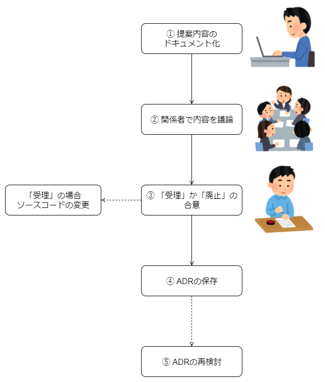

Architecture Decision Records導入事例
===

- [はじめに](#はじめに)
- [サマリ](#サマリ)
- [この活動への取り組みについての情報](#この活動への取り組みについての情報)
- [ArchitectureDecisionRecordsについて](#ArchitectureDecisionRecordsについて)
- [導入の動機](#導入の動機)
	- [不透明な意思決定](#不透明な意思決定)
	- [やみくもな意思決定](#やみくもな意思決定)
	- [時間がかかる新規アサインメンバーへの情報共有](#時間がかかる新規アサインメンバーへの情報共有)
- [ADRの導入](#ADRの導入)
	- [ADRの使用の合意](#ADRの使用の合意)
	- [ADRの運用](#ADRの運用)
		- [ステップ1：提案内容のドキュメント化](#ステップ1：提案内容のドキュメント化)
		- [ステップ2：関係者間での議論](#ステップ2：関係者間での議論)
		- [ステップ3：「受理」または「廃止」の合意](#ステップ3：「受理」または「廃止」の合意)
		- [ステップ4：ADRの保存](#ステップ4：ADRの保存)
		- [ステップ5：ADRの再検討](#ステップ5：ADRの再検討)
	- [参加者](#参加者)
- [運用に当たり工夫した事](#運用に当たり工夫した事)
	- [ADRの対象を明確化](#ADRの対象を明確化)
	- [ADRの受理を議論する人数を削減](#ADRの受理を議論する人数を削減)
- [得られた効果と懸念事項](#得られた効果と懸念事項)
	- [得られた効果](#得られた効果)
	- [懸念事項](#懸念事項)
		- [開発初期におけるADR運用コスト](#開発初期におけるADR運用コスト)
		- [結果の活用](#結果の活用)
- [おわりに](#おわりに)
- [付録：本事例で作成したADR](#付録：本事例で作成したADR)

---

# はじめに

このドキュメントは、スクラム開発においてArchitecture Decision Recordsを使用した結果を事例としてまとめたものになります。Architecture Decision Recordsを使用することで状況に応じて変化するアーキテクチャがどのような意思決定に基づいて作られたのかをプロジェクトの期間を通じて追跡することができるようになりました。

本ドキュメントを通じて、以下の情報を知ることができます。

- Architecture Decision Recordsの導入例
- Architecture Decision Recordsの効果

# サマリ

Architecture Decision Recordsを導入する以前、「アーキテクチャ上重要な意思決定」が不透明であること、やみくもであること、新規アサインメンバーへの情報共有に時間がかかること、といった課題がありました。そこで、Architecture Decision Recordsを導入し「アーキテクチャ上重要な意思決定」をどのように行うのかプロジェクト内で明確に定めました。その結果、「アーキテクチャ上重要な意思決定」に透明性、合理性を持たせることができ、さらにプロジェクトに新規アサインされたメンバーへの情報共有にかかる時間を短縮できました。一方で、開発初期にコストがかかることへの注意や、Architecture Decision Recordsの結果欄を記述するタイミングを明確にしておく必要があると分かりました。

# この活動への取り組みについての情報

本事例のプロジェクトについて説明します。

**開発プロセス**

- スクラム

**開発規模**

- 期間：5か月
- 開発者数：8人

**Architecture Decision Records以外の代表的な管理ドキュメント**

- 方式設計書 
	- システム仕様（DBアクセス、文字コード、日付・時刻処理方式など）。開発開始前で定義済みの内容と、Architecture Decision Recordsを運用していく中で決定された内容を記述。開発期間を通して状況に合わせ更新。
- 処理フロー設計図 
	- 各ユーザーストーリーに対するシステムの処理概要。Architecture Decision Recordsでは言及されない特定のクラスまたはメソッドの処理や、システム間の通信内容。開発期間を通して状況に合わせ更新。

**その他**

- 作成するソフトウェアの形態、要件、非機能要件については大部分が事前に決定済み
- 詳細な設計（インターフェイス、クラス、またはログ出力形式など）については開発しながら設計
- 一部のソフトウェアはフルスクラッチで開発

# ArchitectureDecisionRecordsについて

Architecture Decision Recordsについて本ドキュメントを読み進めるために必要となる内容を簡単に説明します。

Architecture Decision Recordsとは「アーキテクチャ上重要な意思決定」の記録のことです。「アーキテクチャ上重要な意思決定」とは、ソフトウェアの構造や依存関係、非機能特性、インターフェイス等の、アーキテクチャに関して変更または構築するのにコストが高いと思われるものに対する意思決定の事を指します。「アーキテクチャ上重要な意思決定」を記録することで開発者は状況に応じて変更されるアーキテクチャがどのような意思決定に基づいて作られたのかを確認できたり、決定した内容を現状に合わせて再検討するべきかの判断をしたりできます。Architecture Decision Recordsは段階的にソフトウェアを作成してくアジャイル開発と親和性があると言われています。

Architecture Decision Recordsの詳しい説明については下記のサイトを参照してください。

- [Documenting Architecture Decisions](http://thinkrelevance.com/blog/2011/11/15/documenting-architecture-decisions)

また、以降の文章ではArchitecture Decision RecordsをADRと短く表現します。

# 導入の動機

ADRをプロジェクトに導入した動機は「アーキテクチャ上重要な意思決定」が不透明であること、やみくもであること、さらに、新規アサインメンバーへの情報共有に時間がかかることの3つの課題に対応するためです。本事例では一部のソフトウェアをフルスクラッチで開発していたので、「アーキテクチャ上重要な意思決定」を必要とする場面が多く、これら3つの課題を解決することがプロジェクトを成功させるために重要でした。

## 不透明な意思決定

「アーキテクチャ上重要な意思決定」を特定の開発者が暗黙的に行い、他の開発者が設計の動機や目的を理解できない状況が多々ありました。暗黙的に行うとは、一人または複数人の開発者がその場の判断でソフトウェアアーキテクチャ上重要な意思決定を行い、その内容が開発メンバー全員に周知されないといったことです。このような事が起きると、他の開発者はそのアーキテクチャがどのような意思決定に基づいているのか理解できず、さらには意思決定があったのかすら理解することができません。ADR導入前では、一部の開発者が「スローする例外は○○例外クラスを継承する」といった意思決定が暗黙的に行われ、その後周知されず、開発メンバーごとに実装が異なるといったことが起きていました。その結果、ソフトウェアを理解することが困難になったり、設計の動機や目的の理解をするためのコミュニケーションコストが増加しました。

この課題に対し、ADRを導入し「アーキテクチャ上重要な意思決定」方法をプロジェクト内で明確に定め、意思決定に透明性を持たせることで、他の開発者が設計の動機や目的を理解できるようにしようとしました。「アーキテクチャ上重要な意思決定」方法をプロジェクト内で明確に定めることで、意思決定が暗黙的に行われることを防ぎ、開発者全員が意思決定の内容を共有できるようにします。その結果、ソフトウェアを理解することを容易にし、設計の動機や目的の理解をするためのコミュニケーションコストを削減することができるのではないかと考えました。

## やみくもな意思決定

既存のアーキテクチャがどのような意思決定に基づいて作られたのかが明確になっていないため、アーキテクチャを変更する際にやみくもに意思決定をする状況が多々ありました。どのような意思決定に至りソフトウェアアーキテクチャが決定されたのかが記録されていないため、変更を加える際に既存のソフトウェアアーキテクチャを正しく理解出来なかったためです。ADR導入前では、たとえば「○○クラスのパッケージを変更したいけど、そもそもなぜ△△パッケージに入れていたのか」といった疑問が挙がった際に開発メンバーが覚えておらず、変更内容によってはすでに解決されたアーキテクチャ上の課題が後の変更で打ち消されてしまう事が何度かありました。

この課題に対し、ADRを導入し既存のアーキテクチャがどのような意思決定に基づいて作られたのかを明確にすることで、アーキテクチャを変更する際に合理性をもって意思決定できるようにしようとしました。ソフトウェアアーキテクチャがどのような意思決定に基づいているのかが明確になり記録されていれば、変更を加える際に過去の意思決定を参照し合理的な判断を行うことができます。その結果、すでに解決されたアーキテクチャ上の課題が後の変更で打ち消されてしまう事態を防ぐことができるのではないかと考えました。

## 時間がかかる新規アサインメンバーへの情報共有

プロジェクトの開発期間の途中でアサインされたメンバーに対し、すでになされた「アーキテクチャ上重要な意思決定」を共有するのが困難でした。途中でアサインされたメンバーは、開発対象のソフトウェアを理解する上で、設計の動機や目的について知る必要があります。その設計の目的や動機が記録として残っておらず、また、開発メンバーごとに知っている箇所と知らない箇所があったために途中でアサインされたメンバーがすでになされた「アーキテクチャ上重要な意思決定」を理解することが困難になりました。その結果情報共有に時間がかかってしまいました。

この課題に対し、ADRを導入することで「アーキテクチャ上重要な意思決定」を記録し、開発期間の途中でアサインされたメンバーに対し、すでになされた「アーキテクチャ上重要な意思決定」の共有を容易にしようとしました。途中でアサインされたメンバーは、開発対象のソフトウェアを理解する上で、ADRを参照し設計の動機や目的について理解できます。その結果情報共有にかかる時間を短縮できるのではないかと考えました。

# ADRの導入

本事例において、ADRをどのように導入し運用していったのかについて説明します。ADRの導入方法や、運用方法は詳細なルールが定められているわけではなく、プロジェクトごとに適したやり方を用います。本事例では、ADRを使用することを開発メンバー全員で合意することから始め、その後、ADRの作成、「受理」「破棄」の合意、開発メンバーへの展開、再検討を「アーキテクチャ上重要な意思決定」をするたびに行いました。

## ADRの使用の合意

**ADRを使用することを開発メンバー全員で合意しました。** 合意に至る際、ADRについての説明とその効果、運用方法などを整理し、「ADRを使用する提案」をADRとして開発メンバーに展開しました。「ADRを使用する提案」の合意は、展開されたADRのステータスを「受理」することで行いました。この時受理されたADRを下記のリンク先に示します。

[ADRを使用する提案](.\sample\adr-000-adrを使用する.md)

この提案は開発が始まる前に行いました。開発が始まる前にADRの使用について合意することで、開発期間を圧迫することなくADRを使うか否かの議論ができます。さらに開発期間中の「アーキテクチャ上重要な意思決定」を漏れなく記録できます。

## ADRの運用

**ADRの運用は5つのステップで行いました。** 

- ステップ1：アーキテクチャの意思決定をADRとしてドキュメント化し提案
- ステップ2~3： 提案内容を関係者で議論し、提案を「受理」または「廃止」の合意
- ステップ4：「受理」の場合のみソースコードや関連ドキュメントを変更し、ADRの保存
- ステップ5： 提案内容を再検討する場合には、既存のADRを参照し新しいドキュメントを作成

### ステップ1：提案内容のドキュメント化

「アーキテクチャ上重要な意思決定」をADRとしてドキュメント化します。ドキュメントのファイル名、ファイル形式、文章構成などは[「ADRを使用する提案」](.\sample\adr-000-adrを使用する.md)にしたがって以下の内容で作成します。また、 `ステータス` については提案段階においては必ず提案中になります。

#### 書式とファイル名

- 書式
	- MarkDownファイル
- ファイル名
	- `adr-<3桁の数字>-タイトル.md`
	- 3桁の数字は連番で管理リポジトリごとに一意

#### 文章構成

- タイトル
	- 書き方
		- 「ADR :」から始め、内容を簡潔に表現
- コンテキスト
	- 以下の内容を記入（複数可）
	 	- 取り巻く状況・技術・社会的背景
		- この決定を必要とする理由 
		- 選択肢
- 決定事項
	- 以下の内容を記入（複数可）
		- 実現方法
		- 採用する技術・設計思想
		- 決定に至った理由
		- 決定に至らなかった理由
- ステータス
	- ADRの状態を以下のいずれかで記入
		- 提案中
		- 受理
		- 廃止
- 結果
  - ADRを適用した後の結果を記述

上記の内容にしたがってドキュメント化したら、開発メンバー全員に対して展開し閲覧できる状態にします。

### ステップ2：関係者間での議論

関係者間で提案されたADRを議論します。議論では提案の動機やその選択肢、実現可能性や効果が見込めるかについて中心に話し合います。

### ステップ3：「受理」または「廃止」の合意

提案されたADRの議論結果より、「受理」または「廃止」の合意をします。合意は議論参加者全員が納得のいく結論が出た後に行います。ひとりでも「受理」または「廃止」に反対する開発者がいる場合は議論を続けるようにし、多数決といった方法で合意をとることはしませんでした。

合意結果に応じてソースコード、設計を変更してよいかが決まります。

* 受理 ... 提案の内容に合わせソースコード、設計を変更する
* 破棄 ... ソースコード、設計は変更しない

### ステップ4：ADRの保存

ADRは「受理」または「破棄」のどちらになろうとその結果を `ステータス` に記入し、Gitリポジトリに追加します。GitリポジトリはADRが対象としているソフトウェアのリポジトリの `doc/adr` ディレクトリにまとめて配置します。ADRを対象としているソースコードと同じリポジトリで管理し、ソースコードからADR（またはその逆）の移動を簡単にしました。

### ステップ5：ADRの再検討

すでになされた「アーキテクチャ上重要な意思決定」について再検討する必要が出てきた場合、既存のADRを編集するのではなく、既存のADRを参照するように新しいADRを作成し提案から始めます。新しいADRを再度作成することで、過去にどのような意思決定をしてきたのかを簡単に把握することができるようになり、新しいADRが過去のどのような「アーキテクチャ上重要な意思決定」を元に提案されたのか読み取れるようになります。

## 参加者

**開発者はだれでも、ADRの提案や提案内容の議論へ参加できるようにしました。** つまり、特定の開発者がADRを提案したり「受理」「廃止」と判断したりするのではなく、開発者全員が保有スキルや実務経験に関係なくADRの運用に参加できるという事です。開発メンバー全員がADRの運用へ関われるようにすることで、特定の開発者の知見に偏ることなく多様な考え方を取り入れる事ができるようにしました。

# 運用に当たり工夫した事

ADRを運用するにあたって工夫した点について説明します。

## ADRの対象を明確化

**「アーキテクチャ上重要な意思決定」の定義を「ソフトウェアの複数箇所に関係する内容かプロジェクト固有の意思が入った内容に限る」とし、ADRの対象となる意思決定の認識を合わせました。** 「ソフトウェアの複数箇所に関係する内容」とは特定のクラスや関数に対して言及しているのではなく、複数のクラスや複数の関数に対して影響を及ぼすことという意味です。「プロジェクト固有の意思が入った内容」とは、ソフトウェア開発において一般常識的なものではなく、プロジェクト特有の内容という意味です。このようにADRの対象を明確化することで「何をADRに書けばよいのか」といった疑問の解消、さらにADRの対象のばらつきの防止を狙いました。この定義について、以下に例を示します。

**ソフトウェアの複数箇所に関係する内容**

- ADRの対象：例外クラス階層の設計
- ADRの対象外：〇〇メソッドのif分岐

**プロジェクト固有の意思が入った内容**

- ADRの対象：コードのフォーマッターには〇〇を使用する
- ADRの対象外：変数名には分かりやすい名前をつける

## ADRの受理を議論する人数を削減

**ADRの議論や、「受理」または「廃止」の合意をとるために議論へ参加する人数を開発メンバー全員ではなく、一部の人のみでも決定してよい方針にしました。** ADRの提案段階で開発メンバー全員に内容を展開しますが、その後の議論、「受理」または「廃止」の合意は対象のソフトウェアに詳しい人、強い関心がある人、提案内容に疑問を持つ人など一部の人のみでも行ってよいという事です。このようにした理由は、開発メンバー全員が集まれる時間は限られており、ADRの提案から「受理」または「廃止」の決定まで時間がかかってしまうためです。そのため、人数を削減し、時間の短縮を図りました。ただ、ADRの提案から「受理」または「廃止」の合意までを一人の開発者のみで行うと[課題](#導入の動機)が解決されないと考えたため、最低でも二人で行うようにしました。

人数を削減する工夫ができた理由としては、本事例特有の状況も影響していると考えます。本事例の場合では、[この活動への取り組みについての情報](#この活動への取り組みについての情報)でも挙げた通り、ソフトウェアの形態、要件、非機能要件については大部分が事前に決定済みでした。開発を始めるために必要な最低限の決定が事前に定義済みなので、開発メンバー全員が同席しなくてはならない「アーキテクチャ上重要な意思決定」が頻発しませんでした。よって、本事例とは異なるプロジェクト状況では、人数を削減することが効果的ではないかもしれません。

# 得られた効果と懸念事項

ADRを導入したことで得られた効果と、懸念事項について説明します。

## 得られた効果

[導入の動機](#導入の動機)で述べた3つの課題をそれぞれ解決することができました。不透明な意思決定については設計の動機や目的を開発者全員が理解できるようになり、設計の動機や目的の理解のためのコミュニケーションコストを削減できました。やみくもな意思決定についてはアーキテクチャを変更する際に合理性をもって意思決定できるようになり、解決されたアーキテクチャ上の課題が後の変更で打ち消されてしまう事態がなくなりました。新規アサインメンバーへの情報共有では「アーキテクチャ上重要な意思決定」を共有することが容易になり、情報共有の時間を短縮できました。

## 懸念事項

懸念事項について以下の2つが考えられます。

### 開発初期におけるADR運用コスト

開発初期においては、ADR運用のコストが高くメリットを感じる機会が少ないため、ADRを運用していく開発メンバーのモチベーションを維持する事が求められると考えます。開発を開始した直後では「アーキテクチャ上重要な意思決定」をする場面が多く、ADRを作成したり、議論したりするコストが開発中盤以降と比べて大きいです。さらに、開発初期ではシンプルなアーキテクチャの場合が多く、ADRを見直す機会が少ないためメリットを感じにくいです。しかし開発が進み、意思決定が重なっていくことでADRを新たに作成する場面が少なくなる一方で、既存のADRを見返しアーキテクチャを理解する場面が増えるのでメリットを感じやすくなります。そのため、開発初期においては開発メンバーがADRを運用することに価値を見出せるようモチベーションを維持する何らかの仕組みが必要になると考えます。本事例においては、開発初期においてADRの運用コストに対してメリットが低いという意見が挙がりましたが、ADRの効果が出てくるのは開発初期以降であるとメンバー間で繰り返し議論し納得してもらう事で継続して取り組めました。

### 結果の活用

ADRの結果欄が活用されず「アーキテクチャ上重要な意思決定」を元にアーキテクチャを変更した結果が不明であり、問題が表面化するまで対応することができませんでした。本来であればアーキテクチャが変更された結果、課題が解決されたのか、されなかったのか、などを考察し記録することで、アーキテクチャを再度検討するべきかADRを元に判断し問題が表面化する前に対応できたと考えています。ADRの結果欄が活用されなかった原因は結果をいつ書くべきなのかが明記されていなかったことであると考えており、タイミングを明記する必要があると考えています。

# おわりに

本ドキュメントでは、スクラム開発においてADRを使用した結果を事例として説明し、「アーキテクチャ上重要な意思決定」に透明性、合理性を持たせ、さらに新規アサインメンバーに対する情報共有時間の短縮ができたことを示しました。またADRの導入について、提案から運用までどのように行ったのかを説明し、開発初期にコストがかかることに注意することや、ADRの結果欄が活用されなかった課題について述べました。本事例の内容が、ADRを導入する際の参考になればと思います。

# 付録：本事例で作成したADR

本事例で作成したADRの合計は26でした。その一部を例として以下に示します。公開できない一部の情報については変更しています。

- [adr-000-adrを使用する](./sample/adr-000-adrを使用する.md)
- [adr-003-複数戻り値](./sample/adr-003-複数戻り値.md)
- [adr-008-例外が保持するプロパティ](./sample/adr-008-例外が保持するプロパティ.md)
