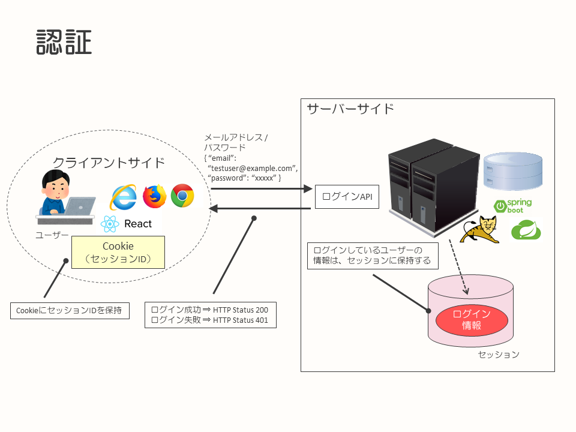
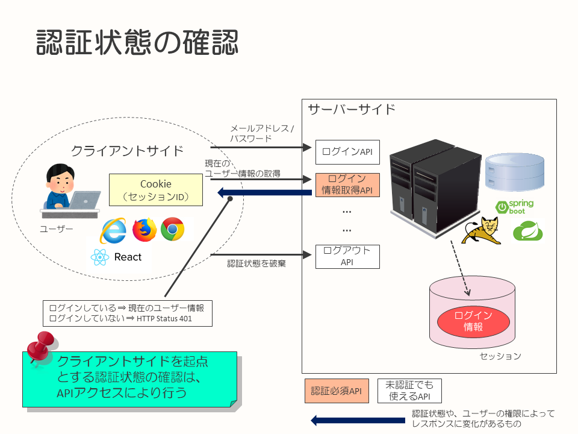
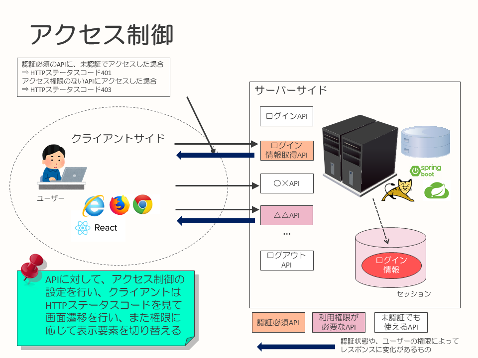

# SPA＋REST APIにおけるセッションを使った認証の実践例

* [はじめに](#introduction)
* [TL;DR](#tldr)
* [背景](#background)
* [認証方式](#authentication-method)
* [認証に関するAPIとアクセス制御](#about-authentication-api-and-access-control)
* [まとめ](#summary)


## <a name="introduction">はじめに</a>

このドキュメントは、SPA＋REST APIで構築したシステムの認証方法を、事例としてまとめたものになります。

本ドキュメントが、SPA＋REST APIにおける認証の実現方式のひとつとして、今後開発を行うシステム、プロジェクトの参考情報となることを目的としています。

なお、このドキュメントに記載しているシステムは開発中のものであり、実際に運用されているシステムではありません。その点については、ご留意のうえ、構成例としてドキュメントを参照いただければと思います。

このドキュメントは、[SPA＋REST APIのシステム構成例（AWS）](../spa-rest-api-system-design-on-aws/README.md)のアプリケーションの認証部分にフォーカスして記載したものです。

以下のような用語についての説明は、本ドキュメントでは行いません。事前に知識を持っている、もしくは必要に応じて他の資料、情報などを参照していただくことを前提とし、構築したアプリケーションと方式選定、実現内容を中心に記載しています。

* SPA
* REST API
* HTTPに関する基礎知識（ステータスコードなど）
* Webアプリケーションにおける、サーバーサイドセッション
* OpenID ConnectやJWTといった、認証に関する技術的なキーワードの詳細


## <a name="tldr">TL;DR</a>

* シンプルなSPA＋REST APIで作成したシステムを、AWS上に構築・環境展開
* フロントエンドはReact＋Redux、サーバーサイドはSpring Bootで実装
* ユーザーの認証状態は、セッションを使用して管理
  * Spring Securityを使用


## <a name="background">背景</a>

このドキュメントの事例となったプロジェクトの背景は、[SPA＋REST APIのシステム構成例（AWS） - 背景](../spa-rest-api-system-design-on-aws/README.md)に同じです。社内の開発案件における、プロジェクト内、チーム内の課題解決を行うためのシステム開発を行うことになりました。システム自体はAWS上に構築しますが、利用するユーザーは社内からの利用を前提とし、外部からのアクセスは許可しない方針です。

今回のプロジェクトでは、開発を行う過程で技術的なチャレンジに取り組み、メンバーのスキルアップを行うことも効果として睨んでいます。今回の開発メンバーは、これまでサーバーサイドでのアプリケーション開発を中心に経験してきており、フロントエンドに関するスキルや知識が薄い状態です。このため、チームの技術的なチャレンジ、習得も鑑みて従来のサーバーサイドでHTMLを生成するタイプの構成ではなく、SPA＋REST APIで構築を行うことにしました。


## <a name="application-constitution">アプリケーション構成</a>

アプリケーションの構成は、[背景](#background)の通り、技術習得が目的のひとつとなっていることもあり、昨今のトレンドを鑑みて、以下の構成としました。

* REST API … Java / Spring Boot
* フロントエンド … React＋Redux


また、まずは小さく作ってリリースし、今後改善を続けていく方針としたため、最小限の機能実装を行うようにしています。


## <a name="authentication-method">認証方式</a>

本プロジェクトでは、構築されたシステムを利用するためには認証が必要な前提としています。アプリケーションへアクセスしたユーザーが認証済みかどうか、また認証済みのユーザーの場合はその情報にどのようにアプリケーション内でアクセスするのかはプロジェクト内での共通したルールとなります。このため、認証方式や認証の仕組みを方針として決定しなくてはいけません。  
※なお、社外からのアクセスはAWSのセキュリティグループの設定によって制限します

従来のサーバーサイドでHTMLを生成するようなアプリケーションの場合、状態管理（認証を含む）はサーバーのセッションを利用することが一般的でした。SPAを採用する場合、クライアントサイドでも状態の管理ができるようになるため、クライアントとサーバーのどちらで、どのように状態を管理するのかがポイントになると考えました。

SPA＋REST APIで取り得る方式として調査を行い、認証方式の選択肢として以下の中から検討を行っています。

* クライアントサイドで認証状態を保持
  * OpenID Connect
  * JWTを使った認証機能の実装
* サーバーサイドで認証状態を保持
  * セッション（Cookie利用）

今回のプロジェクトで要求される機能という観点では、いずれの認証方式でも満たすことができます。そのうえで、プロジェクト内の事情などを鑑みつつ選択を行いました。

最終的に、今回のプロジェクトでの認証方式はセッションの利用を選択しました。

REST API側はSpring Bootを使用し、認証や認可に関連する機能はSpring Securityを活用して作り込みを減らし、簡易に実現する方針としたいと考えました。ただ、Spring Securityのデフォルト（もしくは表示内容をカスタマイズした）ログインページは使用せず、API形式でのログインにすることを考えていました。部分的に、サーバーサイドでの動的HTML生成やリダイレクトが発生することによる、アプリケーション構成の統一感がなくなることをできるかぎり避けたかったからです。

ID・パスワードをSPA側からJSON形式でAjaxリクエストを送り、認証成功・失敗の結果をHTTPステータスコードで受け取りますが、認証状態そのものはサーバーサイドで管理する従来のWebアプリケーションの方式となります。

API形式でログインできるようにするカスタマイズの分を差し引いても他の方式よりも簡易に実現でき、かつ他のサイトと連動する（クロスドメインを求める）必要もないため、単純にセッションを利用する方式を選択しました。

その他の観点で、クライアントサイドでのログイン状態の管理を行う選択肢を選ばなかった理由について、記載します。

まず、OpenID Connectについては、今回のプロジェクトで作成するアプリケーションはとても小さく、繰り返しになりますが他のサイトが提供するAPIと連動する必要もないため、オーバースペックであると考えました。

残ったJWTを使った認証についてですが、今回のプロジェクトのメンバーのスキルレベルと実装の容易さの観点から採用対象外としています。  
※JWTを使用した認証を実装する場合、有効期限やリフレッシュトークンと類似の仕組み、失効などを考慮した作り込みを考えると実装負担が大きいと考えました


## <a name="about-authentication-api-and-access-control">認証に関するAPIとアクセス制御</a>

本システムを利用するユーザーに対するユースケースを考えるとシステムを利用するユーザーに対して、以下のような制御が必要となります。

* 未認証でも利用できる機能
* 認証済みであれば利用できる機能
* 認証済みであり、かつ特定の権限を持っていれば利用できる機能

今回のシステムではクライアントサイドをSPAで実装し、サーバーサイドはREST APIで実装するという方針上、サーバーサイドのAPIも上記のような分類が必要となります。

まずログインについてですが、本システムではユーザーはメールアドレスとパスワードを使用して認証を行います。Spring Security上で認証を行うAPIを実現するため、Spring Securityのデフォルトのログイン機能を変更し、JSONでユーザー名およびパスワードを受け取るAPIに差し替えました。



この動作を実現するために、以下のようにJSONで送信されたリクエストを受け取って認証処理を行う、`AuthenticationProcessingFilter`のサブクラスを実装しています。
```java
public class JsonUsernamePasswordAuthenticationFilter extends AbstractAuthenticationProcessingFilter {
    ObjectMapper objectMapper = new ObjectMapper();

    String usernameParameter = "username";
    String passwordParameter = "password";

    public JsonUsernamePasswordAuthenticationFilter(AuthenticationManager authenticationManager) {
        super(new AntPathRequestMatcher("/login", "POST"));
        this.setAuthenticationManager(authenticationManager);
    }

    public String getUsernameParameter() {
        return usernameParameter;
    }

    public void setUsernameParameter(String usernameParameter) {
        this.usernameParameter = usernameParameter;
    }

    public String getPasswordParameter() {
        return passwordParameter;
    }

    public void setPasswordParameter(String passwordParameter) {
        this.passwordParameter = passwordParameter;
    }

    @SuppressWarnings("unchecked")
    @Override
    public Authentication attemptAuthentication(HttpServletRequest request, HttpServletResponse response) throws AuthenticationException, IOException, ServletException {
        Map<String, Object> requestObject;
        try {
            requestObject = objectMapper.readValue(request.getInputStream(), Map.class);
        } catch (IOException e) {
            requestObject = new HashMap<>();
        }

        String username =
                Optional
                        .ofNullable(requestObject.get(usernameParameter))
                        .map(Object::toString)
                        .map(String::trim)
                        .orElse("");
        String password =
                Optional
                        .ofNullable(requestObject.get(passwordParameter))
                        .map(Object::toString)
                        .orElse("");

        UsernamePasswordAuthenticationToken authRequest = new UsernamePasswordAuthenticationToken(
                username, password);

        authRequest.setDetails(authenticationDetailsSource.buildDetails(request));

        return this.getAuthenticationManager().authenticate(authRequest);
    }
}
```

Spring Securityの設定を行うために`WebSecurityConfigurerAdapter`を継承したクラスを作成する際には、作成した`AuthenticationProcessingFilter`のサブクラスで、デフォルトの`UsernamePasswordAuthenticationFilter`クラスを置き換えるように設定しています。
```java
        // アクセス制限の設定
        http
            .authorizeRequests()
            ...
            .anyRequest().permitAll();

        // ログインパラメーターの設定
        JsonUsernamePasswordAuthenticationFilter jsonUsernamePasswordAuthenticationFilter =
            new JsonUsernamePasswordAuthenticationFilter(authenticationManager());
        jsonUsernamePasswordAuthenticationFilter.setUsernameParameter("email");
        jsonUsernamePasswordAuthenticationFilter.setPasswordParameter("password");
        // ログイン後にリダイレクトのリダイレクトを抑制
        jsonUsernamePasswordAuthenticationFilter
            .setAuthenticationSuccessHandler((req, res, auth) -> res.setStatus(HttpServletResponse.SC_OK));
        // ログイン失敗時のリダイレクト抑制
        jsonUsernamePasswordAuthenticationFilter
            .setAuthenticationFailureHandler((req, res, ex) -> res.setStatus(HttpServletResponse.SC_UNAUTHORIZED));

        // FormログインのFilterを置き換える
        http.addFilterAt(jsonUsernamePasswordAuthenticationFilter, UsernamePasswordAuthenticationFilter.class);

        // Spring Securityデフォルトでは、アクセス権限（ROLE）設定したページに未認証状態でアクセスすると403を返すので、
        // 401を返すように変更
        http.exceptionHandling().authenticationEntryPoint(new HttpStatusEntryPoint(HttpStatus.UNAUTHORIZED));
        // 今回は、403エラー時にHTTP Bodyを返さないように設定
        http.exceptionHandling().accessDeniedHandler((req, res, ex) -> res.setStatus(HttpServletResponse.SC_FORBIDDEN));

        // ログアウト
        http
            .logout()
            .logoutUrl("/logout")
            // ログアウト時のリダイレクト抑制
            .logoutSuccessHandler((req, res, auth) -> res.setStatus(HttpServletResponse.SC_OK))
            .invalidateHttpSession(true);
```

この設定を組み込むことで、このアプリケーションで作成する`Controller`では、Spring Securityを使用した認証、アクセス制御（認可）の仕組みを利用できます。

ユーザーの名前といった、ユーザーに関する情報を取得する場合には、専用のAPIを作成し、こちらは認証必須のAPIとしてあります。このAPIに対して、認証しないままアクセスすると、HTTPステータスコード401を返却するように実装しています。その他の、利用にあたって認証を必要とするAPIについても同様です。



また、認証済みのユーザーであっても、必要な権限を持っていないと利用できない機能もあります。このような機能についてはアクセス制限を行い、対象のAPIについては利用する権限がない状態でアクセスすると、HTTPステータスコード403を返却するように設定しています。

未認証状態でアクセスした場合、このようなAPIは認証必須なAPIでもあるため、HTTPステータスコード401を返却します。



ユーザーの権限に応じて画面の振る舞いを制御する際には、このようなAPIが返却するHTTPステータスコードや、APIから取得したユーザーの情報から判断を行います。

ログアウトは、Spring Securityのログアウトエンドポイントを呼び出し、セッションを破棄することでログアウトとなります。

以上が、本システムで実現している認証に関する考え方と、APIの実装方針となります。


## <a name="summary">まとめ</a> 

今回構築したシステムでは、ユーザーの認証状態の管理をサーバーサイドセッションとし、Spring Securityのアクセス制御の仕組みを活用しつつSPA＋REST APIの仕組みを実現する方針を取りました。

1度JSONリクエスト認証する仕組みを構築してしまえば、REST APIでのログインや権限に関する制御はSpring Securityとその設定に任せてしまうことができるので、Springに慣れ親しんだユーザーであれば理解が容易となるメリットがありました。

その一方で、以下のようなポイントが今回の実現方法の妥協点となります。

* REST APIと呼びつつも、ユーザーの状態をサーバーサイドに持ってしまった
  * ステートレスに振る舞うべきRESTの原則に反し、サーバーサイドのセッションを利用する仕組みを作ってしまったことを意味する
* 状態管理について、クライアントサイドとサーバーとの役割分担が曖昧になりやすくなるかもしれない

Viewに関する状態管理はクライアントサイドで行い、REST APIでステートレスにサーバーへアクセスするのがSPA＋REST APIによる構成時の理想ではありますが、これに反するポイントを作ってしまったため役割分担が曖昧になる可能性があります。今後、他の機能を実現する際に、設計や実装を行う時、判断に迷いやすくなるポイントを含めてしまった、ということになります。

今回のプロジェクトにおける要求事項と期間、メンバー構成、システムの今後を踏まえると、この認証方式が現在の落とし所でした。

このような認証、ユーザーの認証や認可に関する実装方式は、常にベストな選択肢があるわけではなく利用するユーザーやシステムが置かれたコンテキストに応じて判断ポイント、実現方針が異なるものだと考えています。

一方で、今回はOpenID Connectといった認証プロトコルの採用は見送ってしまいましたが、メンバーのこの分野に関する習熟度および開発に費やせる期間が足りなかったこともあり、開発チームとしては今後これらの認証・認可プロトコルが組み込めるようなスキルアップを目指していきたいと考えています。

このような、認証に関する方式検討を行おうとされている方々へ、本ドキュメントが参考となれば幸いです。
