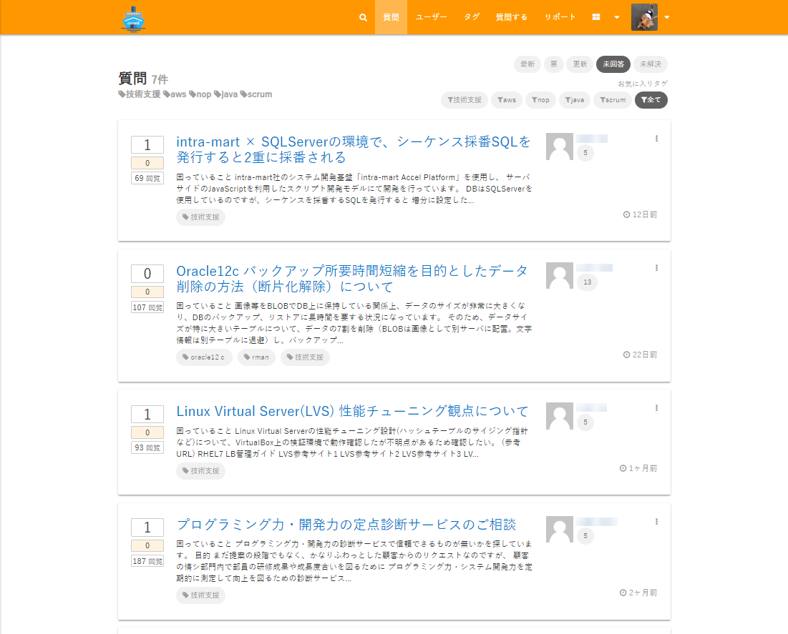

## 結合テスト自動化事例

* [はじめに](#はじめに)
* [canalとは](#canalとは)
* [この活動への取り組みについての情報](#この活動への取り組みについての情報)
* [目次](#目次)

---

### はじめに

このドキュメントは、社内で利用可能なQAサービス（以降では社内での呼称に合わせて canal（カナル）と呼ぶ）に対しての自動テスト導入の過程を、事例としてまとめたものになります。

canalは、ベースとなるオープンソースソフトウェアを使用してシステムを初期構築した後、今後の保守開発における品質維持を目的として自動テストの導入に取り組みました。

本ドキュメントが、自動テスト導入の際のアプローチや採用技術についての参考情報となることを目的としています。

本ドキュメントを通して、以下の情報を得ることができます。

* 自動テストがないアプリケーションに対する自動テスト導入の考え方・アプローチ
  * E2Eテスト
  * Controllerのテスト
* ブラウザテスト自動化の方法
  * Selenium, Selenide, ヘッドレスChrome
  * Page Objectsパターン

#### サマリ

* 自動テストがないアプリケーションに対し、まずはE2Eテストを導入した
  * ユーザーが利用する主要なユースケースを守れるようにした
* ビジネスロジックが`Controller`に集中しているため、`Controller`のテスト自動化を実施した
* 環境の制約があるなか、テスト環境を打鍵とCIとで共存できるようにした
* 自動テストがあることで、安心して機能追加できるようになった

#### canalとは

社内で利用可能な、業務で困っている課題、お客さまへの相談など、事業を進める上での困り事を解決することを目的としたサービスです。

社内のLDAP認証を使ってサインインできるプロパー社員、利用申請を行ったビジネスパートナー様がサインインできます。
canalにサインインできるユーザーであれば、誰でも質問を投稿でき、質問に対して回答できます。

#### この活動への取り組みについての情報

このドキュメントで記載している、自動テスト導入時の情報について記載します。

> 取り組んだ期間： 2018/6/18 〜 2018/6/29(10営業日)
> 取り組みを実施した人数： 3名
> 工数: 約20人日

---

### 目次

* [canalのシステム構成](canal-overview.md)

* [自動テスト導入の背景とアプローチ](testing-background-approach.md)

* [E2Eテストの導入](introduction-e2e-testing.md)

* [Controllerのテストの導入](introduction-controller-testing.md)

* [自動テストを導入しての所感と今後](impression-and-future.md)
