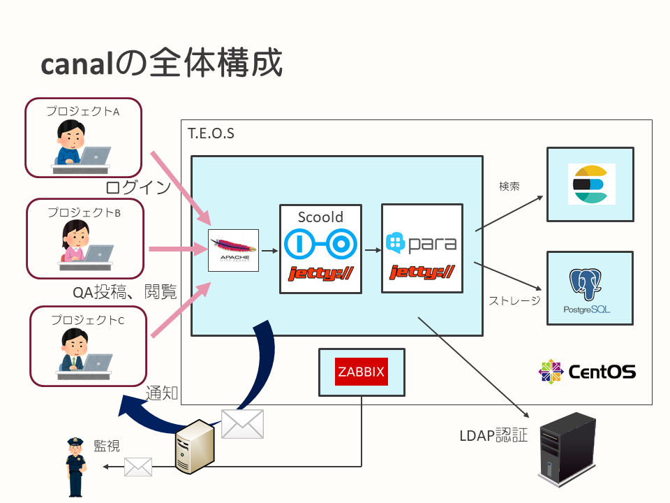
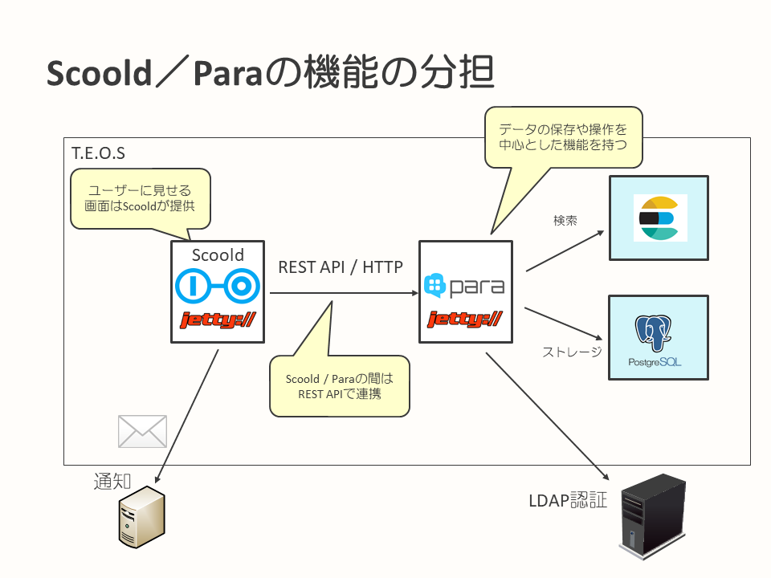
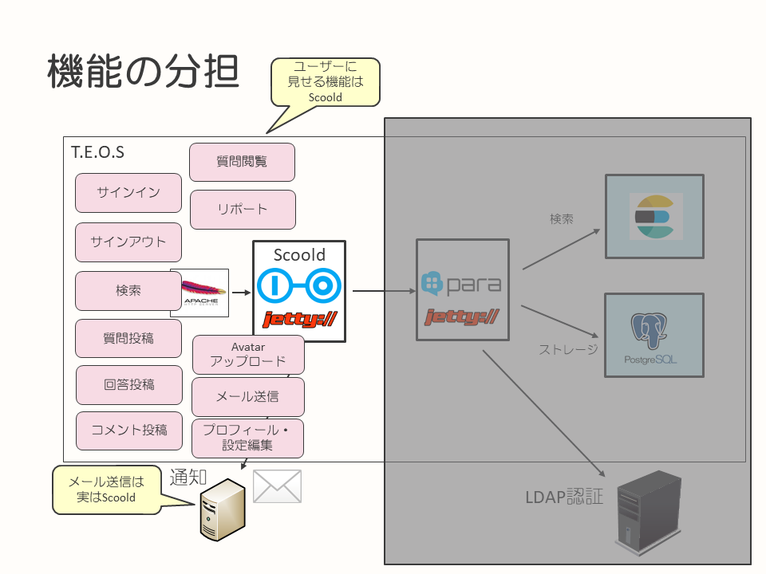
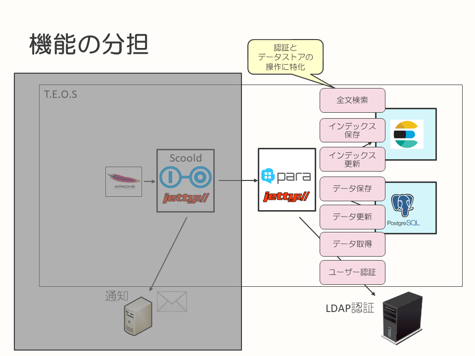

## canalのシステム構成

このページでは、canalへ自動テスト導入事例のドキュメントを読むにあたり、canalというシステムがどのような構成となっているのかを簡単に解説します。

* [canalのシステム全体構成](#canalのシステム全体構成)
* [canalで採用しているソフトウェア](#canalで採用しているソフトウェア)
* [ScooldとParaの役割分担と構成](#ScooldとParaの役割分担と構成)
  * [Scoold](#Scoold)
  * [Para](#Para)

### canalのシステム全体構成

社内にいるユーザーは、canalで次のような操作、体験を行います。

* LDAP認証でcanalにサインインします
* すでに投稿済みの質問や回答を閲覧、または検索します
* ユーザー本人の困っている課題を、質問として投稿します
* 質問に対する回答や、コメントを投稿します
* 質問や回答などのアクションに対する、メール通知を受け取ります

これらを実現する、canalを構成する要素を以下に記載します。

ユーザーに対するインターフェースをScoold、データの保存・検索などにはParaというオープンソースのソフトウェアを採用しており、これらがcanalを構成する主要な要素となっています。

canalではこのScooldとParaを、社内の環境やユーザーからの使い勝手を考慮したカスタマイズを行い、導入しています。

### canalで採用しているソフトウェア

canalで採用しているソフトウェアを、以下に記載します。

|ソフトウェア名|説明・用途|
|-|-|
|[Apache HTTP Server](https://httpd.apache.org/)|Scooldの前段に配置された、オープンソースのWebサーバ|
|[Scoold](https://github.com/Erudika/scoold/)|Javaで実装されたStack Overflowクローンであり、バックエンドにParaを使用します|
|[Para](https://github.com/Erudika/para)|データの保存や取得、検索を行うREST APIを提供します|
|[Elasticsearch](https://www.elastic.co/products/elasticsearch)|オープンソースの全文検索サーバであり、Paraによる全文検索機能に使用されます|
|[PostgreSQL](https://www.postgresql.org/)|オープンソースのRDBMSであり、Paraによる主要なデータ保存先として使用されます|
|[Zabbix](https://www.zabbix.com/)|オープンソースの監視ソフトウェア|

LDAP認証およびメール送信については、社内のものを利用します。  
※ テストの際、LDAP認証およびメール送信に使うサーバはテスト用に置き換わります。

canalを構成する主要なソフトウェアである、ScooldとParaにはREST APIを介した強い依存があります。データの保存、取得、検索にはParaの機能を利用するため、ほぼすべてのページでScooldからParaへのアクセスを必要とします。Scooldは、データをまったく管理しません。

### ScooldとParaの役割分担と構成

canalでは、ScooldとParaの役割分担がポイントとなるので、ここで少し掘り下げて解説します。

#### Scoold

Scooldは、ユーザーに見える機能に特化して実装されています。Viewの提供や、Viewに対する操作（`Controller`）を提供するのは、Scooldの役割となります。

Scooldを構成する主要なソフトウェアは、次のようになっています。

|フレームワークまたはライブラリ名|バージョン|用途|
|-|-|-|
|Spring MVC|4.3|Webアプリケーションの基本的なフレームワークとして利用しています|
|Apache Velocity|1.7|Viewのテンプレートエンジンとして利用しています|
|Jetty|9.3|アプリケーションに組み込みのアプリケーションサーバとして利用しています|
|Spring Boot|1.4|Spring Frameworkを使用した開発を行う際の、ライブラリの自動設定の仕組みとして利用しています|

#### Para

Paraは、データの保存、操作、検索の機能に特化して実装されています。

Scooldのバックエンドサーバとして使われますが、Scooldが使用するデータ構造自体を意識した機能は提供していません。Para自体が持つ、汎用的なデータの保存、取得、検索機能が使用されているだけになります。

Para自体には、APIなどを解説したドキュメントが存在しています。

[Para Document](https://paraio.org/)

Paraを構成する主要なソフトウェアは、次のようになっています。

|フレームワークまたはライブラリ名|バージョン|用途|
|-|-|-|
|Jersey|2.2|REST APIを実装するフレームワークとして利用しています。また、ParaへアクセスするためのクライアントAPIにも使用しています|
|Google Guice|3.0|DIコンテナとして利用しています|
|Jetty|9.4|アプリケーションに組み込みのアプリケーションサーバとして利用しています|
|Spring Boot|2.0|Jettyを簡易的に使用するために使っています。主要なコンテナはSpringではなく、Google Guiceです|

Paraにはプラグインの仕組みがあり、データストアや検索エンジンをプラグインとして設定することによって選択することができます。canalでは、データストアにPostgreSQL、検索エンジンにElasticsearchを採用しています。

---

次のページは、[自動テスト導入の背景とアプローチ](testing-background-approach.md)です。

この事例のドキュメントのトップページに戻る場合は、[こちら](README.md)から。
