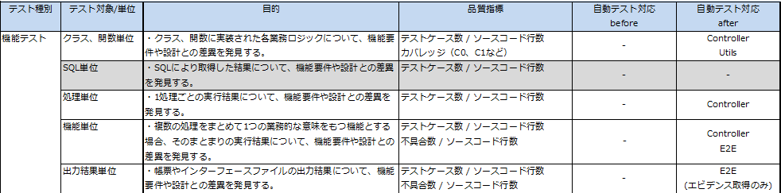

## 自動テストを導入しての所感と今後

このページでは、canalに自動テストを導入した際に得られた感想や、今後の取り組みについて記載します。

* [自動テスト導入にあたっての感想](#自動テスト導入にあたっての感想)
  * [テスト導入の効果](#テスト導入の効果)
  * [困ったこと](#困ったこと)
* [残課題と今後の改善ポイント](#残課題と今後の改善ポイント)

### 自動テスト導入にあたっての感想

以下に、canalに対して自動テストを導入するにあたって、得られた感想や悩んだポイントについて記載します。

繰り返しとなりますが、この取り組みは「すでに稼働済みのシステムに対して、自動テストを導入する」という点に注意してください。

#### テスト導入の効果

下表は[Fintan](https://fintan.jp/)で公開されている[テスト種別＆テスト観点カタログ](https://fintan.jp/?p=45)の機能テスト部分を抜粋し、取り組み実施前後でどう変わったかを示したものです。

この取り組みで、E2Eテストや`Controller`のテストを書くためのライブラリやテストコードの構成の決定、`Para`をテスト内で起動させて組み込んで使うなどの方法を確立しました。これにより、今後E2EやControllerのテストを拡充しやすい状態にできました。

開発フローは、テスト導入前後で以下のように変更し、`Controller`やE2Eテストを必ず実装・実施するようにしています。

**テスト導入前**

* 機能を実装
* 個人のローカル環境や開発環境にデプロイ
* 打鍵でのテスト

**テスト導入後**

* 機能を実装（`Controller`のテストも同時に実装・実施）
* 個人のローカル環境にデプロイ
* E2Eテストの実装・実施
* リポジトリへのpushを契機に以下をCIサーバーにて実施
  * ビルド、`Controller`のテスト
  * 開発環境へデプロイ
  * 開発環境に対するE2Eテスト
* 開発環境での打鍵テスト

E2EテストとControllerのテストにより、canalの主要なユースケースの動作を常に確認できるようになりました。これにより、機能追加や修正時に安心して開発できるようになったと感じています。

#### 困ったこと

各個別のページ（[E2Eテストの導入](introduction-e2e-testing.md)、[Controllerのテストの導入](introduction-controller-testing.md)）で、それぞれのテストに対する取り組みにおいて、検出した課題を記載しています。

技術的な課題は、それぞれ個別に取り組み、そのテストの範囲内で解決しています。内容については各個別のページを参照してください。

テストの方針、設計面についてはテストを作成するメンバー間で認識齟齬が発生しやすく、テスト範囲の設定に悩むことが多くありました。
この点については、その傾向が検出される度に繰り返し、以下の観点で方針を再確認しました。

* このテストではなにを確認すべきだったか
* 他のレイヤーのテストではなにを確認していたか

観点は、[テスト種別＆テスト観点カタログ](https://fintan.jp/?p=45)を利用すると網羅的に整理できるので、参照しながら自動化するテスト範囲を整理すると良いでしょう。

### 残課題と今後の改善ポイント

開発フローは整ってきましたが、`Controller`のテストの拡充に課題が残っています。

`Controller`のテストは、基本的に`Controller`の入出力に着目するものの、処理によっては内部の動作に踏み込む必要が出てきます。
しかし、Scooldではビジネスロジックが`Controller`に集中しているか`Utils`に散在しており、各クラスに対するテストを作成しづらい構成になっています。そのため、ビジネスロジックを単体で確認することが困難になってしまっています。

`Controller`に対するテストの仕組みは整ったので、今後はテストしやすいようにリファクタリングすることで開発速度を上げていくことが改善ポイントとなります。

---

canalテスト自動化導入事例についてのドキュメントは、このページが最後です。

この事例のドキュメントのトップページに戻る場合は、[こちら](README.md)から。
