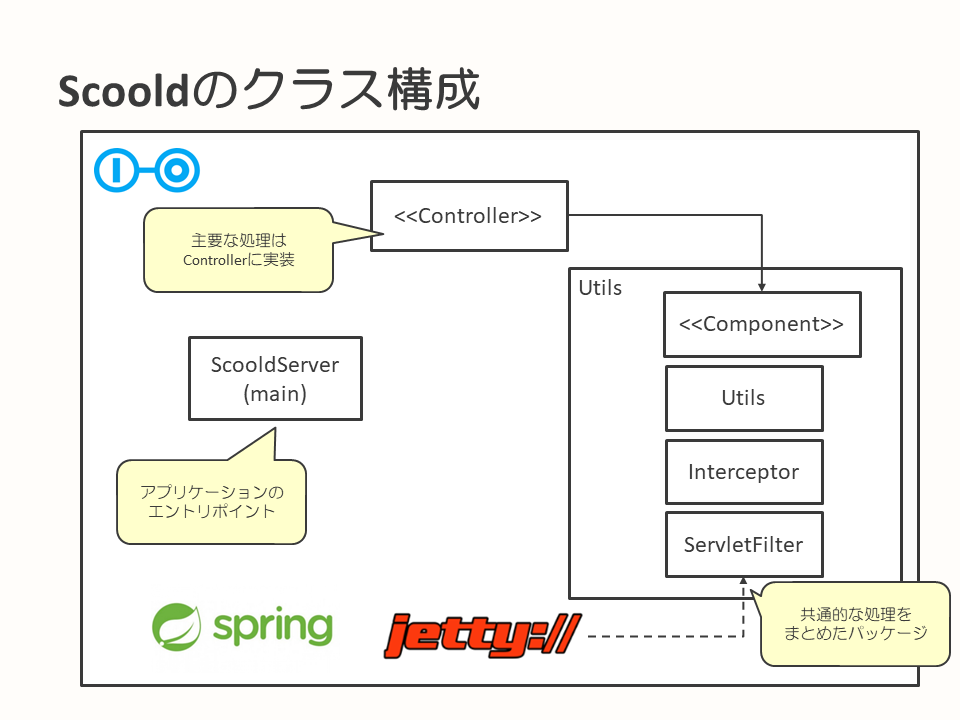

## Controllerのテストの導入

このページでは、canalにどのように`Controller`に対するテストを導入していったのかを解説します。

* [サマリ](#サマリ)
* [背景・課題](#背景・課題)
* [目的・狙い](#目的・狙い)
* [Scooldのクラス構成](#Scooldのクラス構成)
* [テスト対象の検討](#テスト対象の検討)
* [アプローチ](#アプローチ)
* [ソフトウェア選定](#ソフトウェア選定)
* [テスト実行環境](#テスト実行環境)
* [テスト観点](#テスト観点)
* [テストコード解説](#テストコード解説)
* [苦労した点](#苦労した点)

---

### サマリ

このページでは、以下の情報を得ることができます。

* 安全に機能追加するには粒度の細かいテストが必要だと考え、`Controller`のテストに取り組んだ
* アプリケーション構成を分析し、どこをモック化するか決めた
* `MockMvc`を利用することでアプリケーションサーバを起動せず、軽量・高速にテストを実行した
* 自動化したテストの中でどこまで確認するか、しっかり方針をすり合わせるのが良い

### 背景・課題

まず、[E2Eテスト](introduction-e2e-testing.md)に取り組み、主要なルート、ユースケースに対する自動テストを導入しました。
しかし、E2Eテストはあくまで結合テストレベルの確認（画面遷移など）が主となります。そこで、機能開発を安心して進める上で、より細かい粒度の業務ロジックに対するテストが今後必要になってくるはずと考えました。

テストの実施範囲は、[自動テスト導入の背景とアプローチ](testing-background-approach.md)に記載した[E2Eテスト](introduction-e2e-testing.md)と同様、Scooldに対するテストがやはり重要と判断しました。

### 目的・狙い

ビジネスロジックに対する単体テストを作成することで、修正を安全に行えるようになります。
これにより、サービスを安定稼働させつつ機能追加や改善を行えるようにすることを目的としています。

### Scooldのクラス構成

どう進めるか検討する前提になるので、Scooldの主要なクラス構成を簡単に解説します。



Scooldの主要な構成要素は、`Controller`と共通処理をまとめたパッケージ（`Utils`）にほぼ集約されます。多くのビジネスロジックは`Controller`に実装されており、部分的に`Utils`にも散らばっている状態となっています。

また、ScooldとParaには強い依存関係があり、`Controller`や`Utils`の至る箇所からParaへの呼び出しが行われています。Paraなしではビジネスロジックが成立しないほど高い結合度を持つのが構成上の特徴となります。


### テスト対象の検討

サービス全体をブラックボックスとして扱う[E2Eテスト](introduction-e2e-testing.md)とは異なり、クラスといったより小さい粒度の部品が対象となります。

Scooldは、`Controller`と共通的な処理をまとめたパッケージ（`Utils`）で主に構成されています。
これらをテストするのに、起動や実行の遅いブラウザを介するテストは不要なため、`Controller`と`Utils`への自動テスト導入を検討していきました。

どの部分からテストを作成するかは、[アプローチ](#アプローチ)での分析結果や、Scoold内での実装量の観点から、`Controller`に対してテスト導入に取り組んでいます。

なぜ`Controller`に対するテストに取り組んだかというと、Scoold内の実装量として`Controller`が多く、解決できると効果が高いと考えたからです。
テストの実装方法としても`Controller`側がカバーできると、他の内容のテスト作成もカバーしやすくなるメリットがあります。

`Controller`への自動テスト導入については、`Controller`の入出力に着目するように考えています。

### アプローチ

ScooldとParaには強い依存関係がありParaなしではほとんどの処理を実行できず、テストの実現が困難という問題があります。

このため、`Controller`、`Utils`のテストを検討する際にScooldとParaとの関連をどう扱うかがポイントとなりました。

Paraへの依存を切り離すため、Paraへのアクセスをモック化することを初期段階で検討しました。
しかし、モック化には次の課題があり、最終的にはParaに対するモックの採用は見送っています。

* Paraにアクセスするためのクラス`ParaClient`の修飾子が`final`であり、モック化が困難
* `ParaClient`がScooldの`Controller`や`Utils`の至るところで使われている

この状況でモック化を進めるとテスト中に大量のモック用のコードが登場することになり、テストそのものよりもモックのメンテナンスコストが大きくなると判断しました。

対応としては、Scooldのテスト実行時にParaを外部プロセスで起動し、本物のParaと組み合わせた状態でテストを行うようにしています。
これによりScooldとParaのどちらに問題があるか切り分けが難しくなる懸念もありましたが、以下の理由から本物のParaを使った方が低リスクだと考えています。

* 機能改修や追加の大半はScooldが対象
  * Paraに対する修正を行う予定がない
* Paraにはテストコードがあるため、一定の品質は確認できている

Para以外の要素については、必要に応じてモックを作成・利用しています。

### ソフトウェア選定

`spring-boot-starter-test`をMavenプロジェクトの依存関係に追加し、関連ライブラリを使用しています。

`spring-boot-starter-test`の関連ライブラリ中で、主に使用しているライブラリは以下のとおりです。

* Spring Test
* JUnit
* AssertJ
* Mockito

サーブレットの実行環境については、`Spring Test`の提供する`MockMvc`を使用することにしました。これにより、アプリケーションサーバを起動せず、軽量にテストを行うことができます。

### テスト実行環境


[アプローチ](#アプローチ)にあるように、Paraはモックではなくプロダクション環境と同等のものを使用しています。

ParaおよびParaが使用するデータベース（インメモリーのH2 Database）については、テスト実行時に自動起動するように構成しました。

Elasticsearchについては起動コストが非常に高く、追加で起動するだけの環境のキャパシティもなかったため、事前にテスト環境で起動済みのElasticsearchを利用しました。
Elasticsearchが異なるテストで共有されてしまう点に対しては、単体テストと手動テストでインデックスを分けることにより各テストで利用するデータがバッティングしない構成としています。

### テスト観点

`Controller`のテストを作成する上で、テストケースの確認ポイントは、以下のように考えました。

* `Controller`に対する、入出力に着目して確認すること
  * リクエストスコープに設定した値
  * セッションスコープに設定した値
  * HTTPステータスコードが正しいこと
  * 返却するViewのテンプレート名やリダイレクトURLが正しいこと
* バリデーション
  * エラーの発生有無
* ファイルアップロード
  * アップロード先の確認

また、以下の内容は`Controller`のテストの確認対象外としました。

* 画面のレイアウトや、HTMLの構成の確からしさの内容の検証
* 個々のビジネスロジックの中身の確認
* データが永続化されていることの確認

ビジネスロジックやデータの永続化等は、ビジネスロジックレイヤーで実施する単体テストの範囲と考えました。  
※`Controller`のテストも単体テストの範囲に含んでいますが、レイヤーとして分けて考えています。

HTMLの構成や見た目の検証については、ブラウザを介した打鍵テストを実施してレイアウトを確認するものとし、`Controller`のテストの確認ポイントからは対象外としています。

### テストコード解説

ここでは`Controller`の単体テストにおけるテストコードについて解説します。

#### モックの使用

バックエンドであるParaは本物を使用するものの、Scoold側のいくつかのアプリケーション構成要素については、モックを使用します。

サーブレットコンテナに関するもの（`Servlet API`など）はSpring Frameworkの`MockMvc`を使用してモック化しました。Scooldで実装している`Servlet Filter`も含まれます。

ファイルアップロードの場合は、Spring Frameworkの`MockMultipartFile`を使用してマルチパートリクエスト時の処理をモック化しました。

`Controller`以外のビジネスロジックに関するものや`Utils`については、`Mockito`を使用して必要に応じてモック化しました。

モックの使用については、以下の考え方に沿っています。

* 繰り返し実行することになるので、実行にかかる時間を抑えたい
  * アプリケーションサーバの起動は時間がかかるので避ける
* 今回フォーカスするのは`Controller`
  * その他はテスト範囲に含めない
  * 下位レイヤーとなる`Utils`は、それ単体でテストを行う

この考え方のもと、過度にモックを作りすぎない程度にモックを活用する方針としました。

#### 単体テストの処理フロー

`Controller`の単体テストにおける処理フローは以下となります。


#### サンプルコード

以下に、canalで作成した`Controller`の単体テストコードから抜粋した、サンプルコードを記載します。

テストコードは、テスト対象のソースコード名に`Test`を接尾語として付与したファイル名（クラス名）となっていますが、テストを行うメソッド名については内容が伝わりやすいように日本語表記を採用しています。

以下の例は、canalに投稿されたコメント情報を取得する機能のテストです。

```java
public class CommentControllerTest extends ControllerTestSupport { // ControllerTestSupportはControllerのテストの共通処理をまとめたクラス

	@Autowired
	private ParaClient paraClient;
	@Autowired
	MockMvcBuilder builder;

	private User user;
	private String questionId;
	private Comment comment;


	@Before
	public void setUp() {
		// （省略）
		// テストデータの登録など
	}

	@After
	public void tearDown() {
		// （省略）
		// 登録したデータの削除など
	}

	@Test
	public void コメントを取得できることの確認() throws Exception {
		mockMvc
				.perform(get("/comment/" + comment.getId())
						.cookie(new Cookie("para-auth", user.getPassword())))
				.andExpect(status().isOk())
				.andExpect(model().hasNoErrors())
				.andExpect(model().attribute("path", "comment.vm"))
				.andExpect(model().attribute("title", "コメント"))
				.andExpect(model().attribute("showComment", comment))
				.andExpect(view().name("base"));
	}
}
```

以下の例は、canalにアバターをアップロードする機能のテストです。

```java
public class AvatarControllerTest extends ControllerTestSupport { // ControllerTestSupportはControllerのテストの共通処理をまとめたクラス

	@Autowired
	ResourceLoader resourceLoader;
	@Autowired
	private ParaClient paraClient;

	private User user;
	private Profile profile;

	private static final String UPLOAD_PATH = "target/avatar/test/";

	@Before
	public void setUp() throws Exception {
		// （省略）
		// アップロードするディレクトリの作成など
	}

	@Test
	public void ファイルアップロードができること() throws Exception {
		final Resource resource = resourceLoader.getResource("classpath:data/test.png");
		final MockMultipartFile mockMultipartFile = new MockMultipartFile(
				"avatar-image", "test.png", "image/png", resource.getInputStream());

		mockMvc
				.perform(fileUpload("/avatar")
						.file(mockMultipartFile)
						.cookie(new Cookie("para-auth", user.getPassword())))
				.andExpect(status().is3xxRedirection())
				.andExpect(redirectedUrl("/profile"));

		Assertions
				.assertThat(new File(UPLOAD_PATH + profile.getId().split(":")[0] + ".png"))
				.exists();
	}
}
```

Spring Frameworkを使ったテスト環境の制御は、単体テストの共通処理をまとめた親クラス側で定義しています。

```java
@RunWith(ScooldTestRunner.class)  // ScooldServer初期化のためのSpringJUnit4ClassRunnerの拡張
@SpringBootTest(classes = {ScooldServer.class})  // ScooldServerがScooldの起動クラス
@AutoConfigureMockMvc
public class ControllerTestSupport {
	// 省略
}
```

### 苦労した点

canalで`Controller`の単体テストに取り組む際に、苦労した点、直面した課題などを記載します。

#### 技術的な課題

**共通的な処理が実装されているServlet FilterやInterceptorの扱い**

Scooldの実装傾向を確認したところ、以下のことが判明しました。

* `Servlet Filter`には`Controller`の関心事ではない処理が多い
* `Interceptor`には`Controller`以降の処理に直結するものも多数含まれている

このことから、`Servlet Filter`はテスト時の動作範囲から切り離しても問題なさそうです。
逆に、`Interceptor`は切り離すとテストできなくなるため、そのまま動作させることにしました。

実際の対応としては、[モックの使用](#モックの使用)に記載の通り、サーブレットに関する処理をモック化する際に`Servlet Filter`を`Controller`テスト時の動作範囲から切り離しました。

#### テスト設計上の課題

**Controllerテストの確認観点**

[E2Eテストの導入](introduction-e2e-testing.md)でも発生しましたが、どこまで結果の確認を実施するか、人によって迷うことがありました。例えば、View表示結果の確認有無などです。

あくまで`Controller`観点の入力で、どのレイヤーでどこまでテスト、確認するかを都度合わせていくことでイメージを揃えました。例に挙げたView表示結果の確認は`Controller`のテストではなくE2Eや打鍵テストで確認すべきとして、確認対象に含めませんでした。

---

次のページは、[自動テストを導入しての所感と今後](impression-and-future.md)です。

この事例のドキュメントのトップページに戻る場合は、[こちら](README.md)から。
