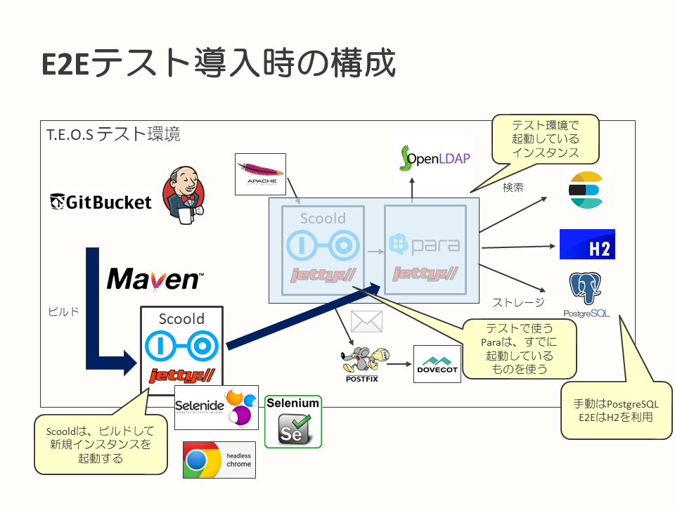

## E2Eテストの導入

このページでは、canalにどのようにE2Eテストを導入したのかを解説します。

* [サマリ](#サマリ)
* [背景・課題](#背景・課題)
* [目的・狙い](#目的・狙い)
* [テスト対象の検討](#テスト対象の検討)
* [アプローチ](#アプローチ)
* [ソフトウェア選定](#ソフトウェア選定)
* [テスト実行環境](#テスト実行環境)
* [テスト観点](#テスト観点)
* [テストコード解説](#テストコード解説)
* [苦労した点](#苦労した点)
* [Controllerのテストからのフィードバック](#Controllerのテストからのフィードバック)

---

### サマリ

* E2Eテストを導入することでユーザーの主要なユースケースを守りつつ、より詳細なテストを追加できる状態にした
  * E2Eは高コストのため、対象を絞って実施すると効果的
* E2Eテストは実ブラウザを利用し、APIの使いやすさからSelenideを採用した
* バックエンドであるParaは、コスト面からテスト環境のものを利用
  * データベースは組み込みのH2を利用することで手動の打鍵テストと衝突しないようにした
* Page Objectsパターンにより画面を構成する情報とテスト内容を分離することでメンテナンス性を確保した

### 背景・課題

[自動テスト導入の背景とアプローチ](testing-background-approach.md)に記載の通りです。

### 目的・狙い

ユーザー目線の自動テストを導入し、主要なユースケースに対するテストを用意することで最低限の安心を得ることを目的としています。
これにより、ユーザーの主要なユースケースが利用できる状態を維持しつつ、より詳細なテストを追加できるようになると考えました。

### テスト対象の検討

E2Eテストを実装するということで、位置づけとしては結合テスト（`Integration Test`）を対象としました。
ただし、打鍵のテストで確認している範囲をすべて網羅するのではなく、主要なルートを対象にテストを作成しました。これは、E2Eテストは実装コスト・実行コスト共に大きいため、範囲を絞って導入する方針としたためです。また、打鍵のテストの排除を目指すのではなく、リリースに向けた最終的なテストは打鍵のテストで確認するようにしています。

### アプローチ

実際のユーザー操作により近づけるため、ブラウザを使用したテストとして実装することにしました。
また、canalで採用しているCI環境（Jenkins）上で、テストが実行できるようにしています。
テスト実行の流れは、Scooldのソースコードをcanal内で管理しているGitリポジトリより取得し、テスト中にScooldを起動してテストを実施するようになっています。

### ソフトウェア選定

Scooldでは、E2Eテストに以下のソフトウェアを採用しました。

標準ブラウザと異なるブラウザを採用していますが、別途標準ブラウザでの打鍵テストを実施する方針としているため、ブラウザ特有の動作不良やレイアウト崩れなどの確認はそちらで行います。

|名称|バージョン|用途|採用理由|
|-|-|-|-|
|Selenide|4.x|Seleniumのラッパーとして利用|Seleniumをよりテスト用途に特化したライブラリとして使用し、実装の効率化を図るため|
|Selenium|3.x|E2Eテストの基本となるソフトウェア|ブラウザを使用したテスト用途では、標準的な位置づけのライブラリのため|
|Google Chrome|最新版|ヘッドレスブラウザ|Jenkinsで実行する関係上、ヘッドレスブラウザの方が便利なため|
|JUnit|4.x|テストランナーとして利用|標準的なテストライブラリのため|
|Spring Test|4.x|Spring Frameworkを利用したテストの作成に利用|Spring Frameworkで構築されたアプリケーションのテストを支援する標準的なライブラリのため|

ブラウザを利用したテストを行うため、Seleniumを採用しました。
Seleniumのバージョンについては、ScooldのSpring Bootのバージョンに合わせると以下の課題が出てきたため最新版を採用しました。

**課題**

* Scooldが採用しているSpring BootのバージョンにSeleniumを合わせるとSelenium 2.x（古いバージョン）になってしまう
  * 2.xは更新が停止している
  * 最新のブラウザでの動作に問題がある

**対応**

* Seleniumを最新版にしてScooldが使用しているライブラリバージョンに影響がないことを確認
* 最新版のSeleniumとSelenideで動作確認

Seleniumの利用については、よりテストしやすくラップされたSelenideを採用し、Selenium利用時のAPIの煩雑さを抑えるようにしています。
実際に採用してみた所感としても、Selenideの方が利用しやすく、学習コストも低かったように感じています。

E2Eテストのために動作させるブラウザは、[Google Chrome 59からヘッドレス環境で実行できるようになった](https://developers.google.com/web/updates/2017/04/headless-chrome?hl=ja)ため、Google Chromeを採用し、ヘッドレスで起動しています。

### テスト実行環境

E2Eテスト導入時の環境は、以下の通りです。すでにテスト環境でScoold、Para、Elasticsearch、PostgreSQLなどが動作している環境上に、JenkinsがGitリポジトリよりソースコードを取得し、ビルド、テストを行います。

この時、テスト実行時にScooldを既存のScooldインスタンスと別ポートで起動し、Para以降のソフトウェア、ミドルウェアについてはテスト環境のものをそのまま利用する形で環境の前提を置きました。



起動済みのParaを使用するのは、この時点ではScooldとParaの依存関係の強さは後回しとし、E2Eテストを実施可能な状態とすることに重きを置いたからです。

### テスト観点

テストは、すべての画面遷移を網羅的に確認をするのではなく、対象を絞ってテストコードを作成しました。

この取り組みで対象としたのは、canalにおける主要ルート、ユースケースであると考えられる、以下の3パターンとしています。

* サインイン → 質問検索 → 質問閲覧
* サインイン → 質問投稿 → 質問閲覧
* サインイン → 質問検索 → 質問閲覧 → 回答（コメント）投稿

テストケースの確認ポイントは、以下のように考えました。

* 画面遷移が正しくできていること
* ある画面で入力した内容が、次の画面への遷移後に可能な範囲で確認できること
  * タイトル、投稿内容、検索キーワードなど
  * 各テスト対象画面で、どのポイントを確認すればよいかを事前に設定

以下については単体テスト、打鍵テストで確認するため対象外としました。

* ビジネスロジックの中身の確認
* データが永続化されていることの確認
* 入力に関する内容以外の、表示内容の確認
  * 画面のレイアウトなど

テストがない状態からスタートしているため、最初に取り組んでいるテストで多くのことを確認したい気持ちになりがちです。
しかし、その点については最初にテスト対象とする範囲を事前に決め、必要以上にテスト範囲を大きくしないように努めました。

例えば、打鍵のテストは継続して実施することを前提としているため、画面レイアウトの確からしさなどはテスト観点の範囲外としています。
範囲外とはしていますが、E2Eテスト時に自動的にスクリーンショットを保存し、後で確認できるようにしています。

### テストコード解説

ここでは、canalで採用したE2Eテストでの、テストコードについて記載します。

テストケースは、前述した[テスト観点](#テスト観点)に則り、実施するテストの内容と合わせてインテグレーションテストとなるソースコードとして作成しています。

ビルドシステムとして使用している、Mavenのビルドライフサイクルに従い、テストを実装したファイル名が`*IT.java`となります。
単体テストでは`*Test.java`というファイル名で実装しますが、これとは実行されるフェーズが異なることになります。

ちなみに、ブラウザを使ったインテグレーションは実行に時間がかかるため、単体テストとは分けた構成としています。

#### 画面構成とテストの役割分担を行う、Page Objectsパターンの採用

テストの構成は、E2Eテストで画面（ページ）ごとの情報を個々のテストクラスに記載するのではなく、ページごとにクラスを定義して情報を集約する、[Page Objectsパターン](https://selenide.org/documentation/page-objects.html)を採用しています。

Page Objectsパターンでは、テストを構成する要素として以下のものがあります。

* ページオブジェクト
* テストコード

役割分担は、それぞれ以下となります。

**ページオブジェクト**

ひとつのWebページごとにページオブジェクトと呼ばれるクラスを作成し、ページの要素を特定するための、ページの構成に依存した情報を集約して定義します。たとえば、セレクタの利用なども含まれます。画面そのものに関する情報を集約して持ち、ページの操作方法を提供することが、ページオブジェクトの役割となります。

**テストコード**

ページオブジェクトを操作し、画面遷移指示と結果の確認を実施します。

**Page Objectsパターンを使用するメリット**

Page Objectsパターンを使うことで、以下のメリットを享受することを狙いとしています。

* デザインなどに依存するようなページの構成情報を、ページオブジェクトに閉じ込めることによるメリット
  * ページに関する情報を集約し、ページ自体の構造などに関わる情報をテストから隠蔽することができる
  * ページの構成情報の変更時なども、ページの情報を集約しているため、テストコードへの影響を軽減できる
* テストコードから、セレクタなどのページの構成要素に依存した内容を切り離すことができる
  * テストコードは結果を確認するための情報をページから取得する際にも、ページの構造を意識しなくてもよくなる

結果として、テストコードでページの構造を意識することがなくなり、テストの内容に集中できるようになります。

また、Webデザインに依存するページ構成についてはページオブジェクトに集約されます。そのため、ページ構成の変更時にはページオブジェクトをメンテナンスすればよく、それぞれの関心事の範囲が明確になります。

#### Page Objectsパターンを使ったテストコード（サンプルコード）

以下に、canalで作成したE2Eテストコードから抜粋した、サンプルコードを記載します。

サンプルコード内には、日本語によるクラスやメソッド定義も使用しています。日本語を使った定義は、以下のものになります。

* テストコードにおける、テストクラスやテストを行うメソッド
* ページオブジェクトにおける、画面遷移を表すもの

テストそのものは、読み手にテストシナリオやテスト内容の意図が通じやすいように、日本語表記を採用しています。それ以外は、通常のソースコードと同じく英字表記にしています。

ページオブジェクトの例は、以下となります。このように、各ページの構成要素に依存した内容は、ページオブジェクトとしてページ単位に集約します。

```java
// ログイン（サインイン）ページ用のページオブジェクト
public class LoginPage {

	public static final String E2E_TESTUSER = "E2Eテストシナリオで使用するユーザー名";

	public static TopPage ログインする() throws Exception {
		final LoginPage loginPage = Selenide.open("", LoginPage.class);
		final TopPage topPage = loginPage.login(E2E_TESTUSER, "E2Eテストシナリオで使用するユーザーのパスワード");
		return topPage;
	}
	
	public TopPage login(final String username, final String password) throws Exception {
		$("#username").setValue(username);
		$("#password").setValue(password);
		$("button.btn").click();
		return page(TopPage.class);
	}
}

// どのページにも存在するヘッダーを表すページオブジェクト（他のページの親クラスとなる）
public class HeaderPage {
	public NewQuestionPage 投稿するページへ() {
		$("a[href='/questions/ask']").click();
		return page(NewQuestionPage.class);
	}

	public SearchResultPage キーワード検索する(final String searchText) {
		$("i.fa-search.fa").click();
		final SelenideElement element = $("#search-box");
		element.setValue(searchText);
		element.pressEnter();
		return page(SearchResultPage.class);
	}
}

// トップページ用のページオブジェクト
public class TopPage extends HeaderPage {

	public AnswerPage 回答するページへ(String questionId) {
		$("a[href*='/" + questionId + "']").click();
		return Selenide.page(AnswerPage.class);
	}
}

// 検索結果一覧用のページオブジェクト
public class SearchResultPage extends HeaderPage {

	public List<SearchResult> getSearchResult() {
		final List<SearchResult> result = new ArrayList<>();
		for (final SelenideElement element : $$("div.ptl > div.card-panel")) {
			result.add(new SearchResult(element.attr("id"), null));
		}
		return result;
	}

	public SearchResultMorePage もっと見る(String keyword) {
		$("a[href='/search/questions/" + keyword + "']").scrollTo().click();
		return page(SearchResultMorePage.class);
	}

	public static class SearchResult {

		public final String id;
		public final String title;

		public SearchResult(String id, final String title) {
			System.out.println("id = " + id);
			System.out.println("title = " + title);
			this.id = id;
			this.title = title;
		}
	}
}
```

実際のテストを行うコードの例は、以下になります。テストコード側では、ページオブジェクトとして定義されたページを操作することで、画面操作を行い、結果に対する確認を実施していきます。

```java
public class キーワード検索から質問表示ができることIT extends IntegrationTestSupport {  // IntegrationTestSupportはインテグレーションテストの共通処理をまとめたクラス

	// 投入する質問のIDリスト
	private final List<String> questionIds = new ArrayList<>();

	@Before
	public void setUp() {
		setUpData();
	}

	@After
	public void tearDown() throws Exception {
	    // （省略）
		// 登録したデータの削除
	}

	@Test
	public void キーワード検索から質問表示ができること() throws Exception {
		final TopPage topPage = LoginPage.ログインする();
		saveScreenshot();

		final SearchResultPage searchResultsPage = topPage.キーワード検索する("flask OR SQLAlchemy OR python");
		saveScreenshot();

		final List<SearchResultPage.SearchResult> searchResult = searchResultsPage.getSearchResult();

		Assertions
				.assertThat(searchResult)
				.extracting("id")
				.containsExactlyInAnyOrder(questionIds.subList(0, 3).toArray())
				.hasSize(3);
	}

	private void setUpData() {

		final List<Question> records = new ArrayList<>();
		// タイトルが検索ヒットするデータ
		records.add(createRecord(
				"Flaskのデータベース検索について",
				"適当な内容",
				Collections.singletonList("web")
		));
		// ボディが検索ヒットするデータ
		records.add(createRecord(
				"適当なタイトル",
				"SQLAlchemyを使用するのはどう思います？？",
				Collections.singletonList("web")
		));
		// タグが検索ヒットするデータ
		records.add(createRecord(
				"適当なタイトル",
				"適当な内容",
				Collections.singletonList("python-db")
		));

		// （省略）
		// 質問データのセットアップ
	}
}
```

Spring Frameworkを使ったテストの環境の制御は、インテグレーションテストの共通処理をまとめた親クラス側で定義しています。

```java
@RunWith(ScooldTestRunner.class)  // ScooldServer初期化のためのSpringJUnit4ClassRunnerの拡張
@SpringBootTest(classes = ScooldServer.class, webEnvironment = WebEnvironment.RANDOM_PORT)  // ScooldServerがScooldの起動クラス
@ContextConfiguration(initializers = ConfigFileApplicationContextInitializer.class)
public abstract class IntegrationTestSupport {

	@LocalServerPort
	private int port;

	// 省略
}
```

### 苦労した点

E2Eテストの取り組みで苦労したポイント、直面した課題などを記載します。

#### 技術的な課題

**ブラウザの挙動差**

ヘッドレスなGoogle Chromeの挙動が、個人の環境によって異なるということがありました。
これは、個人の環境変数の設定差によりプロキシが有効化されていないことが原因でした。これにより、CDN経由でダウンロードするリソースが参照できず、画面崩れなどの問題が発生していました。
この問題は、設定を統一することで解決しています。

**CI環境での文字化け**

CI環境（Jenkins）上でE2Eのテストを実施し、キャプチャを確認した際、日本語の文字化けが発生しました。
これは、OSに日本語フォントをインストールしていなかったことが原因です。
OSに日本語フォントをインストールすることで、正常に表示されることを確認しています。

**Markdown EditorへのE2Eテストでの入力**

canalではコンテンツの記法にMarkdownを採用しており、Markdown Editorも使えるようになっています。これをSelenide / Seleniumから操作するのが困難でした。
採用しているMarkdown Editorの実装方法では、キー入力をSelenide / Seleniumから再現できませんでした。妥協点として、テキストエリアに直接文字列を送り込む方式を採用し、対応しました。

**テスト環境の共有**

自動テストと手動のテストで環境が同一のため、他の人の操作に影響を受ける可能性がありました。
この問題に対しては、[データベースをH2とし、テスト用の検索インデックスを設ける](#Controllerのテストからのフィードバック)ことにより解消しています。

**テスト設計での課題**

* 共通処理の記載位置
  * Page Objectsパターンは導入したものの、処理によってはページオブジェクトに書くべきかテスト側に書くべきか迷う点がいくつかあった
    * たとえば、以下のようなもの
      * スクリーンショットは画面遷移ごとに取得するルールにしたが、その処理はテストとページオブジェクトのどちらに書くか
        * テスト側で実装する方針とした
      * デザイン面はテストの確認対象に含めないが、確認対象を取得するためのセレクタをテストとページオブジェクトのどちらに書くか
        * ページオブジェクト側に実装
    * 共通的な考えになるので、ひとつひとつチーム内でイメージを合わせて、どちらに置くかマッピングしていった

大まかにテストで確認する内容を決めてはいたものの、実際にテストを書いてみると、どこまで確認すべきか迷うことが多くありました。

例えば、以下のようなものが挙がりましたが、 考えがぶれ始めたらチームで都度集まり再度確認観点をすり合わせていきました。

* データ登録後、なにを確認すべきか
  * 入力されたデータが表示されていること
  * （一覧画面へ遷移した場合）登録したデータが先頭に表示されていること

### Controllerのテストからのフィードバック

E2Eテストの作成は、canalにおける最初の自動テストへの取り組みとなりました。主要ルート、代表的なユースケースを自動テスト導入時に実装するテストケースとし、この後にScooldの`Controller`を自動テストする取り組みへとシフトしていきました。

`Controller`への自動テスト導入の取り組みを行うにあたり、ScooldのParaに対する強い依存関係が課題となりました。これに対し、ScooldでのJUnitテスト実行時にParaを別プロセスで起動できるようにテストに機能追加しました。

この内容をE2Eテストにもフィードバックし、`Controller`へのテスト取り組み実践後、以下のような構成となりました。

* E2Eテスト実行時に、Scooldを起動
* Paraも、テスト内で起動する（別プロセス）
* Paraが利用するElasticsearch、OpenLDAPは、テスト環境に存在しているものを使用する
  * Scooldが利用するPostfixも同様
* Paraが利用するデータベースに関しては、H2 DatabaseをPara内部で組み込みDBとして使用するように切り替え
  * これにより、データ管理が自動テストと手動の打鍵テストとで独立
  * 加えて、Elasticsearchのインデックスを手動で行うテストとは別の名前にすることにより、自動テスト実施時に打鍵のテストと独立したデータ管理を行うことができるようになった

結果として、E2Eテスト実行時にはテスト環境にParaがあらかじめ起動している必要がなくなりました。
また、手動のテストとのデータの重複を気にする必要もなくなりました。

---

次のページは、[Controllerのテストの導入](introduction-controller-testing.md)です。

この事例のドキュメントのトップページに戻る場合は、[こちら](README.md)から。
