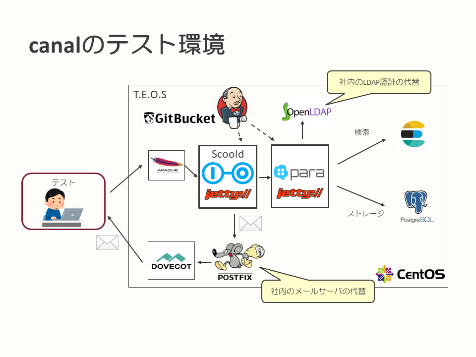
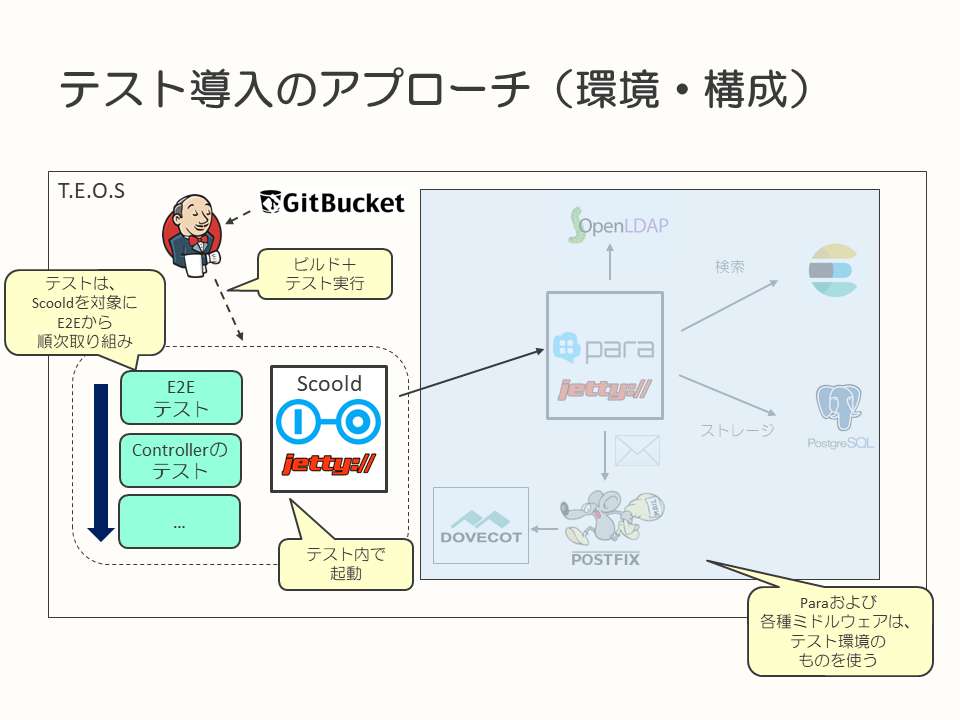
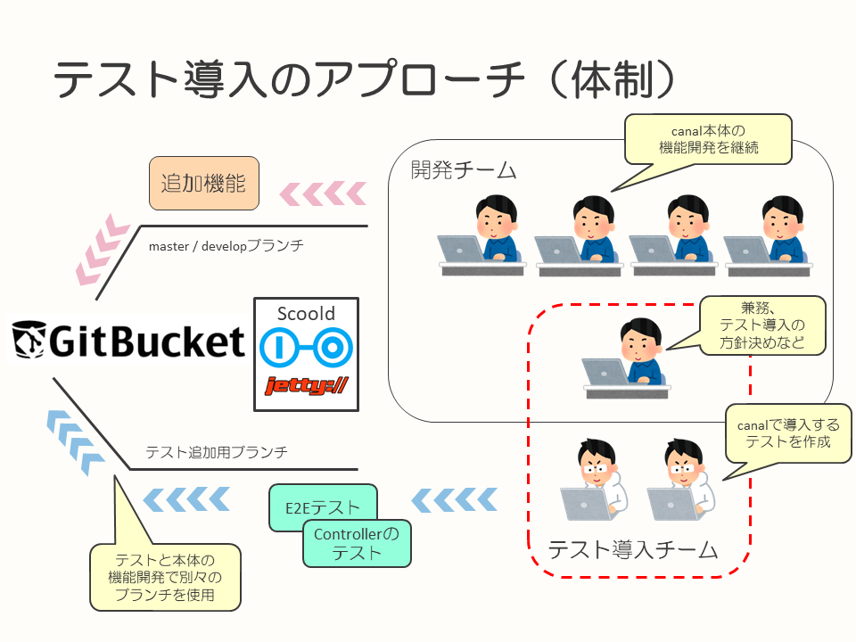

## 自動テスト導入の背景とアプローチ

このページでは、canalに自動テスト導入の取り組みを始めた背景と、実際に導入する際のアプローチ、考え方について記載しています。

* [サマリ](#サマリ)
* [背景](#背景)
  * [ScooldとParaの依存関係とテストコードの状態](#ScooldとParaの依存関係とテストコードの状態)
  * [社内で利用するためのカスタマイズとテスト](#社内で利用するためのカスタマイズとテスト)
  * [canalが抱える潜在課題](#canalが抱える潜在課題)
* [自動テスト導入に向けて](#自動テスト導入に向けて)
  * [特にテストすべきソフトウェアはScooldである](#特にテストすべきソフトウェアはScooldである)
  * [Scooldへのテスト導入の難しさ](#Scooldへのテスト導入の難しさ)
  * [アプローチ](#アプローチ)
  * [自動テストの導入をすることにより、期待していたこと](#自動テストの導入をすることにより、期待していたこと)

---

### サマリ

* 規模の小さいアプリケーションだが、構成要素が多岐に渡る
  * 構成要素が多岐に渡るのにもかかわらず、自動テストが少ない
* フロントサーバー（Scoold）がバックエンドサーバー（Para）に強く依存しておりテストしづらい構成
* ユーザーが操作するフロント（Scoold）側からテストを実施する方針とした

### 背景

#### ScooldとParaの依存関係とテストコードの状態

canal、[canalのシステム構成](canal-overview.md)で記載の通り、Scoold、Paraというアプリケーションを主要な構成要素としています。規模の割には、構成要素が以下のように多岐に渡る構成となっています。

* アプリケーション要素
  * Scoold
  * Para
* データストア
  * PostgreSQL
* 全文検索エンジン
  * Elasticsearch
* ID管理
  * LDAP認証
* メール送信
  * メールサーバ（SMTP）

テスト環境においては、LDAP認証はOpenLDAPに、メール送信に使うサーバはPostfixとしています。また、ソースコードはGitBucket管理、テスト環境へのデプロイはJenkinsで実施しており、これらはすべてテスト環境に同居しています。

各要素の依存度についてですが、**特にScooldがParaに強く依存している点が特徴**です。それぞれが独立したアプリケーションとして稼働しますが、**ScooldはParaが動作していない状態ではほとんどなにもできません**。

また、ScooldとParaはオープンソースのソフトウェアですが、テストコードがほとんどない状態になっています。特に、**Scooldに至ってはテストコードがまったくありません**。

以下に、各プロダクトのソースコードおよびテストコードの、ファイル数の分布を記載します。

|プロダクト名|ソースコード（ファイル数）|テストコード（ファイル数）|
|-|-|-|
|Scoold|36|0|
|Para|164|51|
|Para Dao Sql|4|8|
|Para Search Elasticsearch|5|5|

#### 社内で利用するためのカスタマイズとテスト

初期構築の時は、社内のQAサービスを構築するにあたって要件に比較的近い機能を持ったScooldおよびParaを採用することで、開発期間を短縮する方針を採用しました。

社内で使うにあたり、ScooldおよびParaに対しては機能追加を行い、テストは以下の方針で実施しました。

* ScooldおよびParaそのもののテストは、事前に機能確認をしているため重点的には行わない
* 開発した機能に対するテスト、ScooldおよびParaへの基本的なテストは打鍵中心に実施
  * 元となるScoold、Paraにはテストコードがあまりなく、特にParaへの依存度が大きいScooldはテストコードが完全に存在しない
  * canalとしての、必要な機能を満たしているかどうかの確認を実施
  * テストコードの作成は、導入からの検討となるため見送り

初期構築時点では、まずはサービスとしてなるべく早く公開することを目指したため上記の方針としました。

テスト種別は[テスト種別＆テスト観点カタログ](https://fintan.jp/?p=45)を元に、必要なものを実施しています。
OSS（ScooldとPara）を全面的に採用しているためインプットとなる成果物はほとんど存在していません。アプリケーション自体や、ユーザーとしてどう利用するのが良いかといった観点からテストケースを作成しています。

また、テストの実施はParaの単体テスト以外、手動で実施していました。
本取り組み後、機能テストの一部が自動化され、リグレッションテスト実施のコストが改善されています。

#### canalが抱える潜在課題

canalはもともとテストコードが薄いScooldおよびParaというソフトウェアをベースに、canalとして必要な機能追加を実施して公開時期優先でリリースしたという背景を持ちます。このため、潜在的に以下の問題を抱えていることは開発時から認識していました。

* もともと存在する機能を、canalの要件に合わせて修正する際に、他の機能に影響するかどうかが把握することが困難
* canalとして機能追加を加えていく際に、これまでの機能に対して影響を与えていないか把握することが困難

今後、サービスを改善していくにあたり、テストコードが存在しないまま開発を継続していくのはリスクがあると考えました。
例えば、リグレッション観点での確認不足によるバグを引き起こすことが予期されます。
また、リグレッションを回避するために毎回手動でテストを実施すると、大きく工数を取られてしまいます。

### 自動テスト導入に向けて

canalではこれらの背景における課題感から、Scooldへの自動テストの追加を行うことで品質を維持するための土台を構築する方針を検討しました。

#### 特にテストすべきソフトウェアはScooldである

canalにおいて、以下の観点から、Scooldが特にテストを重点的に行わなければならない対象のソフトウェアだと考えています。

* Scooldが、ユーザーから見た時に直接操作するアプリケーションである
* canalにおける機能追加のほとんどは、Scooldが対象となっている

#### Scooldへのテスト導入の難しさ

しかし、以下のようにもともとのScooldの状態もあり、自動テストの導入は一筋縄ではいかないと考えていました。

* ScooldがバックエンドであるParaに強く依存しており、Paraが存在しない状態を想定していない
  * テストコードがまったく存在しないこともあり、そもそもテストしやすい状態になっていない
    * クラス間の結合度の高さ、モック化のしやすさなど
    * Paraへの依存を切り離すために呼び出しをモック化すると、大量のモックを作ることになってしまう
    * 組み込みでParaを起動する方法もあるが、Springのバージョンが合わない
* Paraを使用してテストを行うにしても、Paraが使用するミドルウェアはパッケージング時の依存関係で決まることもあり、テスト時のParaの状態を想定しておく必要がある
  * Paraの設定値の扱いが難しい

#### アプローチ

canalにおけるテスト対象として重要視するソフトウェアがScooldだとした時に、これらの事情からまずどのように自動テストを導入するのがよいのかを検討する必要がありました。

ここでcanalを構成するParaの内容や、canalの今後の改修内容を鑑みて、Paraを今回のテスト導入の対象外として割り切ってスコープアウトし話を単純化しました。

* Paraについてはある程度テストコードが存在しており、かつcanalではあまり修正していない
* 今後の機能追加を考えても、Scooldに対して多くの改修が発生し、Paraはほとんど変わらないことが予想される

そのうえで、以下の作成方針でテストを導入していくこととしました。

* Paraに対する依存関係は、テスト環境に起動済みのものを使用する前提として課題から切り離し、テストコード、設定を作成する
  * ElasticsearchおよびPostgreSQLについても、テスト環境に起動済みのものを使用する
* Scooldに対するテストは、クラス単位の単体テストからではなく、E2Eテストから取り組んでいく
  * まずは、canalにおける主要な画面遷移ルートに対するE2Eテストを作成する
* テスト中に、組み込みのJettyを使ってScooldを起動する
* CIツール（Jenkins）上で、動作可能なように構成する
* E2Eテストができるようになったら、`Controller`などのテストに掘り下げていく

また、テストの追加にあたっての進め方としては、以下のようにしました。

* 今回の取り組みでは、テストコードの追加のみを行い、アプリケーション自体のソースコード自体は極力修正しない
  * テストの追加にあたって、アプリケーション自体のソースコードの改善が必要な場合は、別に時間を設けて取り組む方針とする
* この取り組み時も続いているcanalとしてのアプリケーション開発とはメンバーを分け、自動テストへの取り組みとは分けて実施する
  * 本来のcanalの開発メンバーは5名
  * この取り組みでは1名重複、2名追加で実施
    * 1名はプロジェクトのアーキテクチャを熟知
    * E2Eテストに必要な知識やライブラリについて、3名とも概要レベルは知っている

いずれも、現在の開発そのものには影響を極力与えず、テストのみの取り組みとして後に合流することを想定しています。

#### 自動テストの導入をすることにより、期待していたこと

自動テストの導入に取り組むことにより、即時の品質向上といったことよりは、以下のような効果を期待して活動を始めました。

* 自動テストを実施可能な仕組みの検討を行い、今後テストコードの追加しやすい構成を確立する
  * 今後のテストコード拡充の際に、新規の実現方式をできる限り追加しなくて済むように作成パターンを抽出する
* 機能開発を行う際に、テストコードを作成する文化の形成

このため、この取り組みではその時点のScooldおよびParaの機能を網羅するようなテストコードの作成を行うのではなく、主要な機能のパターンに対してテストコードの作成と確認を中心に行いました。

今後の開発などでテストコードを拡充していく際には、すでにあるテストコードの実現方法に則って追加していけばよい状態になることを、この取り組みではゴールとしました。

---

次のページは、[E2Eテストの導入](introduction-e2e-testing.md)です。

この事例のドキュメントのトップページに戻る場合は、[こちら](README.md)から。
