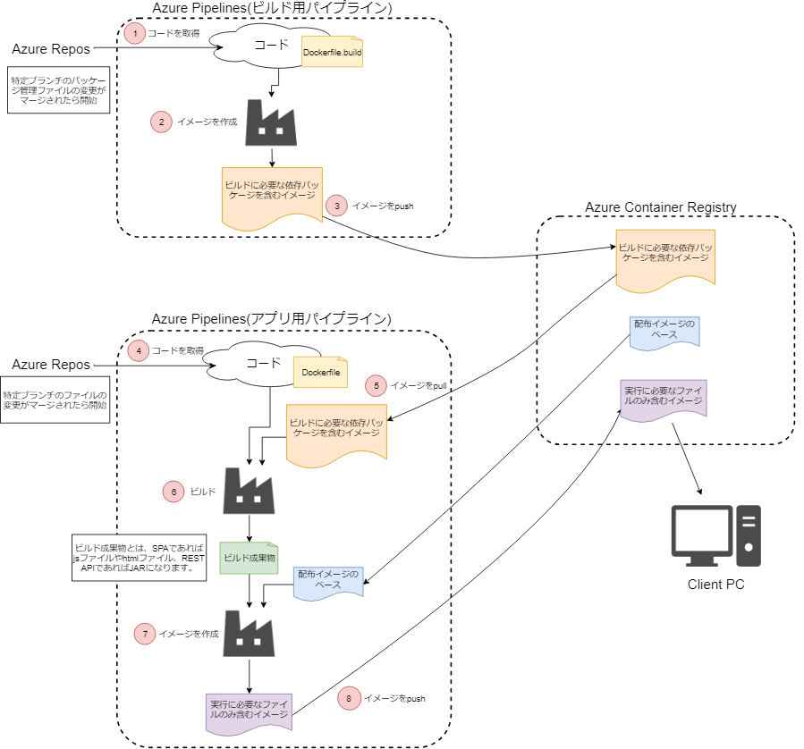
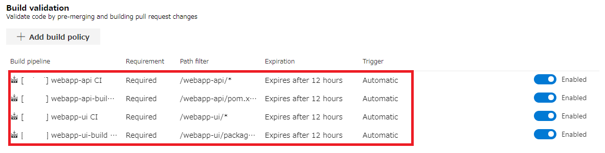
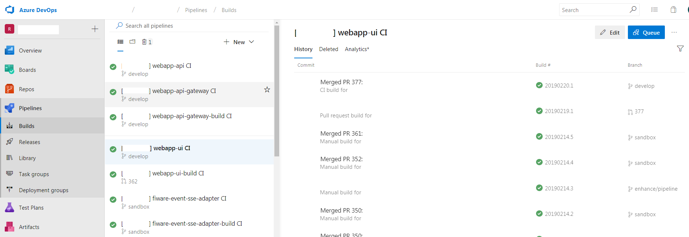
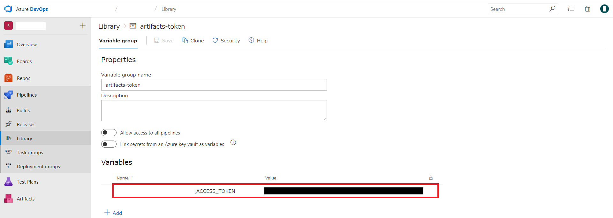

# Azure DevOpsを活用したCI（ビルドパイプライン）の構築例

* [はじめに](#introduction)
* [TL;DR](#tldr)
* [背景](#background)
* [Azure DevOps](#azure-devops)
* [CIの全体フロー](#ci-overview)
  * [トリガー](#trigger)
* [ビルド結果の確認](#build-result)
* [パッケージ管理](#package-manager)
  * [npm](#package-manager-npm)
  * [Maven](#package-manager-maven)
* [ビルド内容](#build)
  * [Java](#build-java)
  * [JavaScript](#build-js)
* [結果と今後](#result-future)

## <a name="introduction">はじめに</a>

このドキュメントは、「[RoboticBase](https://www.tis.co.jp/news/2018/tis_news/20181016_1.html)」の開発において、Azure DevOpsを活用してCI（ビルドパイプライン）を構築した実践例をまとめたものになります。

本ドキュメントが、Microsoft Azure上でAzure DevOpsを活用してCIに取り組む実践例として、今後開発を行うシステム、プロジェクトの参考情報となることを目的としています。

なお、このドキュメントに記載しているシステムは開発中のものであり、実際に運用されているシステムではありません。テストなどで品質を高めていく活動についても、これからになります。その点については、ご留意のうえ、構成例としてドキュメントを参照いただければと思います。

## <a name="tldr">TL;DR</a>

* Azure DevOpsを活用してCIの仕組みを構築
* CI対象のアプリケーションはSPA＋REST API
  * SPAはReact/Redux、REST APIはSpring Bootで実装
  * 各アプリケーションの配布形式はDockerイメージ
* Azure DevOpsのサービスのうち以下を利用
  * Azure Repos - Gitリポジトリ、PullRequest
  * Azure Pipelines - CI/CDのパイプライン
  * Azure Artifacts - パッケージ管理
* ビルド時間短縮のために、CIのパイプラインは各アプリケーションに対して2本で構成
  * ビルド時に使用するパッケージを含んだDockerイメージを作成するためのビルドパイプライン
  * アプリケーションとして配布されるDockerイメージを作成するビルドパイプライン
* Dockerイメージのマルチステージビルドの活用し、イメージの軽量化
  * アプリケーションとして配布されるDockerイメージの作成の際に、アプリケーションの実行に不要なファイル（ビルド時のみに必要なファイル）を含めないようにした

## <a name="background">背景</a>

このドキュメントの事例となったプロジェクトでは、人手不足の解消と業務生産性の向上などの社会課題の解決を目指し、複数のロボットを統合管理するプラットフォーム「[RoboticBase](https://www.tis.co.jp/news/2018/tis_news/20181016_1.html)」を開発しています。

このプラットフォームは、IoT・スマートシティ向け基盤ソフトウェア「[FIWARE](https://www.fiware.org/)」（ファイウェア）をベースに構築を進めています。プラットフォームの利用者は、ロボットを操作するため、Webブラウザから操作を行います。利用者向けのアプリケーションは、SPA＋REST APIで構築しています。SPAにはReact/Redux、REST APIにはSpring Bootを採用しています。

システムを開発、改善していくにあたり、デプロイの自動化といった頻繁にリリースができるCI/CDの仕組みを構築する必要があります。今回はSPA＋REST APIでアプリケーションを構築し、CI/CDを実現するにあたり不可欠な構成管理やビルド、デプロイの仕組みをAzure DevOpsのサービスを使って実現する方針としました。なお、CDはまだ取り組めていません。

## <a name="azure-devops">Azure DevOps</a>

[Azure DevOps](https://azure.microsoft.com/ja-jp/services/devops/)では、名前が示す通り、DevOpsに必要な開発ツール一式をSaaSとして提供しています。今回のプロジェクトでは、CIを実現するため、Azure DevOpsの以下のサービスを利用しています。

- [Azure Repos](https://azure.microsoft.com/ja-jp/services/devops/repos/) - Gitリポジトリ
- [Azure Pipelines](https://azure.microsoft.com/ja-jp/services/devops/pipelines/) - CI/CDのパイプライン
- [Azure Artifacts](https://azure.microsoft.com/ja-jp/services/devops/artifacts/) - パッケージ管理

構成管理にはAzure Reposを利用しています。ソースコードの追加、修正などは、masterブランチから新しくブランチを作成し、Azure Repos上でPull Requestを行い、開発チーム内でのレビューが完了したらマージするという流れで実施しています。

Azure Pipelinesでは、コードのビルド、テスト、Azure上のサービスへのデプロイといった一連の作業を定義し、1つのジョブとして実行してくれます。この一連の作業をビルドパイプラインと呼びます。  

## <a name="ci-overview">CIの全体フロー</a>

アプリケーションを最終的にDockerのイメージとして配布するためのビルドパイプラインを構築しています。今回使用するミドルウェアの1つであるFIWAREが、Dockerイメージでの提供を標準としているため、それに合わせてアプリケーションの配布方式もDockerイメージとしました。

ビルドパイプラインは、「アプリケーションのビルド～コンテナイメージのビルド～コンテナレジストリへの登録」をスコープとしています。

1つのコンテナイメージを作成するにあたって、2つのビルドパイプラインが関わってきます。

* ビルド時に使用するパッケージを含んだDockerイメージを作成するためのビルドパイプライン（以降、ビルド用パイプラインと称す）
* アプリケーションとして配布されるDockerイメージを作成するビルドパイプライン（以降、アプリ用パイプラインと称す）

これらのビルドパイプラインを使用したCIの全体フローを示します。



上記フローの具体例として、Javaで作成したアプリケーション(Maven利用）の例を示します。

1. Azure Repos（Git）からJavaソースコードを取得します。
2. Mavenのローカルリポジトリを内包したイメージを作成します。
3. 2で作成したイメージをAzure Container Registryにpushします
4. Azure Repos（Git）からJavaソースコードを取得します。
5. 3でpushしたイメージをAzure Container Registryからpullします。
6. 5でpullしてきたイメージ上で、4で取得したコードをビルドし、jarを作成します。
7. 6で作成したjarを含んだイメージを作成します。
8. 7で作成したイメージをAzure Container Registryにpushします。

アプリ用パイプラインで最終的に作成される「実行に必要なファイルのみ含むイメージ」は、ビルド成果物とコンテナ開始時にアプリケーションが起動する設定を「配布イメージのベース」に追加することで作成します。Javaのアプリケーションで具体例を示すと、「配布イメージのベース」にJARとコンテナ開始時にJARが起動する設定を追加することで「実行に必要なファイルのみ含むイメージ」を作成します。

ビルドパイプラインを2つに分割した理由は、Azure Pipelinesの無料枠（[小規模なチーム(Free)プラン](https://azure.microsoft.com/ja-jp/pricing/details/devops/azure-devops-services/)を利用）である1800分/月以内に、ビルド時間を収めるためです。仮にビルドパイプラインを分割せずに、1つのビルドパイプラインで実行した場合、毎回配布イメージの作成に必要なパッケージをダウンロードする必要が生じます。一方、今回のようにビルドパイプラインを分割した場合、配布イメージ作成に必要なパッケージに変更がなければ、改めてパッケージをダウンロードする必要はなく、アプリ用パイプラインのみを実行すれば配布用イメージを作成することができ、ビルド時間の短縮になります。

### <a name="trigger">トリガー</a>

ビルド用パイプラインが実行されるトリガーは、パッケージ管理ファイル（JavaScriptならpackage.json、Javaならpom.xml）が変更され、特定のブランチ、タグにマージされたタイミングに設定しています。アプリ用パイプラインが実行されるトリガーは、アプリケーションのソースコードが変更され、特定のブランチ、タグにマージされたタイミングに設定しています。

設定画面を以下に示します。対象ブランチに対して、何が変更されたらビルドパイプラインを開始するかを定義しています。



## <a name="build-result">ビルド結果の確認</a>

ビルド結果の成否確認はAzure DevOpsの画面上で容易に確認することができます。
グリーンのチェックマークで成功が表現されています。



## <a name="package-manager">パッケージ管理</a>

CI対象のアプリケーションは、SPA(React/Redux)＋REST API(Spring Boot)で構築しています。
それぞれ、JavaScriptとJavaのパッケージ管理として、一般的なnpmとMavenを採用しています。

### <a name="package-manager-npm">npm</a>

npmのパッケージ管理には、Azure DevOpsのオプション機能であるArtifactsを利用しました。イメージ作成時に使用する`.npmrc`ファイルで以下の設定を行い、Azure DevOpsのArtifactsをnpm registryとして利用しています。

```
registry="https://pkgs.dev.azure.com/xxx-project/_packaging/libraries/npm/registry/"
always-auth=true

//pkgs.dev.azure.com/xxx-project/_packaging/libraries/npm/registry/:_authToken=${ACCESS_TOKEN}
//pkgs.dev.azure.com/xxx-project/_packaging/libraries/npm/:_authToken=${ACCESS_TOKEN}
```

上記で使用している変数`ACCESS_TOKEN`は、Azure PipelinesのLibrary機能にて定義しています。
Library機能を使用することで、以下のように、画面から変数を定義することができます。



### <a name="package-manager-maven">Maven</a>

現時点ではMavenのプライベートリポジトリを必要としていないので、MavenではArtifactsは利用していません。将来的にMavenリポジトリが必要になった場合はArtifactsを利用する予定です。

## <a name="build">ビルド内容</a>

ここでは、ビルド内容について簡単に説明します。CI対象のアプリケーションは、SPA(React/Redux)＋REST API(Spring Boot)で構築しています。そのため、各アプリケーションのビルドは、JavaScriptまたはJavaのプロジェクトを対象としたビルドになります。

ビルドパイプラインの設定ファイルの全量とその概要は以下になります。

* azure-pipelines-build.yml
  * ビルド用パイプラインで使用するYAMLです。
  * java-build-image.ymlまたはnode-build-image.ymlに処理を委譲します。
* azure-pipelines.yml
  * アプリ用パイプラインで使用するYAMLです。
  * java-ci-image.ymlまたはdocker.ymlに処理を委譲します。
* java-build-image.yml（★）
  * Javaプロジェクトのビルド用パイプラインで使用するYAMLです。
  * docker-image-build-push.ymlに処理を委譲します。
* java-ci-image.yml（★）
  * Javaプロジェクトのアプリ用パイプラインで使用するYAMLです。
  * jarの作成、テスト結果のパブリッシュをした後、docker-image-build-push.ymlに処理を委譲します。
* node-build-image.yml（★）
  * JavaScriptプロジェクトのビルド用パイプラインで使用するYAMLです。
  * docker-image-build-push.ymlに処理を委譲します。
* docker.yml（★）
  * JavaScriptプロジェクトのアプリ用パイプラインで使用するYAMLです。
  * docker-image-build-push.ymlに処理を委譲します。
* docker-image-build-push.yml（★）
  * 全プロジェクトのビルドパイプラインで使用するYAMLです。
  * イメージのビルドとプッシュを行います。
* Dockerfile.build
  * ビルド用パイプラインで使用するDockerfileです。
* Dockerfile
  * アプリ用パイプラインで使用するDockerfileです。

（★）が付いたファイルはアプリケーションに固有のものではなく、汎用的に使用できるファイルです。YAMLに渡すパラメータを変えることによって、実際に行う処理を変化させているため、他のプロジェクトで再利用することが可能です。（★）が付いていないファイルは、アプリケーション毎に固有のファイルです。

ここから、JavaとJavaScriptのプロジェクト毎に詳細を見ていきます。

### <a name="build-java">Javaプロジェクト</a>

#### ビルド用パイプライン

Javaプロジェクトのビルド用パイプラインは、以下のファイルで定義しています。

* azure-pipelines-build.yml
* java-build-image.yml
* docker-image-build-push.yml
* Dockerfile.build

これらの内容を確認していきます。

##### `azure-pipelines-build.yml`

```
# 変数を定義
variables:
  component: webapp-api # componentという変数にwebapp-apiという値を格納

# チェックアウトしてくるコードを指定
resources:
  repositories:
  - repository: self # このファイルが配置してあるディレクトリ配下
    clean: true
    fetchDepth: 5
  - repository: pipeline # pipelineレポジトリ配下
    type: git
    name: azure-devops
    clean: true
    fetchDepth: 5

# java-build-image.ymlで定義されている処理を実行
jobs:
- template: pipeline-templates/java-build-image.yml@pipeline
  parameters:
    component: $(component) # `component`という引数を与えて実行
```

##### `java-build-image.yml`

```
# このYAMLファイルにわたってくるパラメータを宣言
parameters:
  component: ""
  job: ""
  buildCommandArguments: ""

jobs:
    # ジョブの名称と、ビルドパイプラインで使用するagent poolを指定
  - job: JavaBuildImage_${{parameters.job}}
    pool:
      vmImage: ubuntu-16.04

    # docker-image-build-push.ymlで定義されている処理を実行
    steps:
      - template: steps/docker-image-build-push.yml
        parameters:
          component: ${{ parameters.component }}
          registryRootPath: build-images/
          dockerfile: Dockerfile.build
          buildCommandArguments: ${{ parameters.buildCommandArguments }}
```

##### `docker-image-build-push.yml`

```
# このYAMLファイルにわたってくるパラメータを宣言
parameters:
  component: ""
  dockerfile: "Dockerfile"
  registryRootPath: ""
  buildCommandArguments: ""

steps:
    # Dockerfile.buildをもとにdocker buildを行う
  - task: Docker@1
    displayName: Build an image - ${{ parameters.component }}
    inputs:
      azureSubscriptionEndpoint: "XXXXXXXXXX"
      azureContainerRegistry: xxx-project.azurecr.io
      dockerFile: ${{ parameters.component }}/${{ parameters.dockerfile }}
      imageName: ${{ parameters.registryRootPath }}$(Build.Repository.Name)/${{ parameters.component }}:$(Build.SourceBranchName)
      arguments: ${{ parameters.buildCommandArguments }}

    # 上記タスクで作成したイメージをAzure Container Registryにpushする
  - task: Docker@1
    displayName: Push an image - ${{ parameters.component }}
    inputs:
      azureSubscriptionEndpoint: "XXXXXXXXXX"
      azureContainerRegistry: xxx-project.azurecr.io
      command: Push an image
      imageName: ${{ parameters.registryRootPath }}$(Build.Repository.Name)/${{ parameters.component }}:$(Build.SourceBranchName)
      includeSourceTag: true
    condition: and(succeeded(), or(eq(variables['Build.SourceBranch'], 'refs/heads/develop'), startsWith(variables['Build.SourceBranch'], 'refs/tags/')))
```

##### `Dockerfile.build`

```
# mavenとjdkが含まれたイメージをベースにすることを宣言
FROM maven:3-jdk-8-alpine # mavenとjdkが含まれたイメージを使用

ARG MAVEN_OPTS

WORKDIR /work
RUN mkdir -p repo
COPY . .
# mvn test を実行して、/work/repo内にMavenのローカルリポジトリを作成
RUN mvn dependency:go-offline -Dmaven.repo.local=repo test
```

#### アプリ用パイプライン

Javaプロジェクトのアプリ用パイプラインは、以下のファイルで定義しています。

* azure-pipelines.yml
* java-ci.yml
* docker-image-build-push.yml
* Dockerfile

これらの内容を確認していきます。

##### `azure-pipelines.yml`

```
# 変数を定義
variables:
  component: webapp-api # `component`という変数に`webapp-api`という値を格納

# チェックアウトしてくるコードを指定
resources:
  repositories:
  - repository: self # このファイルが配置してあるディレクトリ配下
    clean: true
    fetchDepth: 5
  - repository: pipeline # pipelineレポジトリ配下
    type: git
    name: azure-devops
    clean: true
    fetchDepth: 5

# java-ci.ymlで定義されている処理を実行
jobs:
- template: pipeline-templates/java-ci.yml@pipeline
  parameters:
    component: $(component) # `component`という引数を与えて実行
```

##### `java-ci.yml`

```
# このYAMLファイルにわたってくるパラメータを宣言
parameters:
  component: ""
  env: ""
  job: ""
  buildCommandArguments: ""

jobs:
    # ジョブの名称と、ビルドパイプラインで使用するagent poolを指定
  - job: JavaCI_${{parameters.job}}
    pool:
      vmImage: ubuntu-16.04

    steps:
        # ビルド用パイプラインで作成したイメージ上でmvn verifyを実行
      - task: Docker@1
        displayName: Run maven build - ${{ parameters.component }}
        inputs:
          azureSubscriptionEndpoint: "XXXXXXXXXX"
          azureContainerRegistry: xxx-project.azurecr.io
          imageName: build-images/$(Build.Repository.Name)/${{ parameters.component }}:develop
          command: run
          runInBackground: false
          volumes: |
            $(System.DefaultWorkingDirectory)/${{ parameters.component }}:$(System.DefaultWorkingDirectory)/${{ parameters.component }}
            /var/run/docker.sock:/var/run/docker.sock
          workingDirectory: $(System.DefaultWorkingDirectory)/${{ parameters.component }}
          containerCommand: mvn verify -Dmaven.repo.local=/work/repo
          envVars: ${{ parameters.env }}

        # テスト結果の可視化
      - task: PublishTestResults@2
        displayName: Publish test result - ${{ parameters.component }}
        inputs:
          testResultsFormat: JUnit
          testResultsFiles: "**/TEST-*.xml"
          searchFolder: $(System.DefaultWorkingDirectory)/${{ parameters.component }}
        condition: always()

        # docker-image-build-push.ymlで定義されている処理を実行
      - template: steps/docker-image-build-push.yml
        parameters:
          component: ${{ parameters.component }}
          buildCommandArguments: ${{ parameters.buildCommandArguments }}
```

##### `Dockerfile`

```
# jdkが含まれたイメージをベースにすることを宣言
FROM openjdk:8-jdk-alpine # jdkが含まれたイメージを使用

COPY target/azure-webapp-api-0.0.1-SNAPSHOT.jar app.jar # JARをコピー 

ENV JAVA_OPTS=""

# イメージ開始時に、javaコマンドで上記で作成したjarを動かす
ENTRYPOINT exec java $JAVA_OPTS -Djava.security.egd=file:/dev/./urandom -jar /app.jar
```

### <a name="build-js">JavaScriptプロジェクト</a>

#### ビルド用パイプライン

JavaScriptプロジェクトのビルド用パイプラインは、以下のファイルで定義しています。

* azure-pipelines-build.yml
* node-build-image.yml
* docker-image-build-push.yml
* Dockerfile.build

これらの内容を確認していきます。

##### `azure-pipelines-build.yml`

```
# 変数を定義
variables:
  - name: component
    value: webapp-ui
  - group: artifacts-token

# チェックアウトしてくるコードを指定
resources:
  repositories:
    - repository: self
      clean: true
      fetchDepth: 5
    - repository: pipeline
      type: git
      name: azure-devops
      clean: true
      fetchDepth: 5

# node-build-image.ymlで定義されている処理を実行
jobs:
  - template: pipeline-templates/node-build-image.yml@pipeline
    parameters:
      component: $(component)
      # プライベートリポジトリへのアクセスに必要なトークンを引数として渡す
      buildCommandArguments: |
        --build-arg ACCESS_TOKEN=$(ACCESS_TOKEN)
```

##### `node-build-image.yml`

```
# このYAMLファイルにわたってくるパラメータを宣言
parameters:
  component: ""
  job: ""
  buildCommandArguments: ""

jobs:
    # ジョブの名称と、ビルドパイプラインで使用するagent poolを指定
  - job: NodeBuildImage_${{parameters.job}}
    pool:
      vmImage: ubuntu-16.04

    # docker-image-build-push.ymlで定義されている処理を実行
    steps:
      - template: steps/docker-image-build-push.yml
        parameters:
          component: ${{ parameters.component }}
          registryRootPath: build-images/
          dockerfile: Dockerfile.build
          buildCommandArguments: ${{ parameters.buildCommandArguments }}
```

##### `Dockerfile.build`

```
# nodeが含まれたイメージをベースにすることを宣言
FROM node:10.13-alpine # nodeが含まれたイメージを利用

ARG ACCESS_TOKEN

WORKDIR /work
COPY .ci/.npmrc ./
COPY yarn.lock package.json ./
# npx yarnを実行して、イメージ内にパッケージをダウンロード
RUN npx yarn
```

#### アプリ用パイプライン

JavaScriptプロジェクトのアプリ用パイプラインは、以下のファイルで定義しています。

* azure-pipelines.yml
* docker.yml
* docker-image-build-push.yml
* Dockerfile

これらの内容を確認していきます。

##### `azure-pipelines.yml`

```
# 変数を定義
variables:
  - name: component
    value: webapp-ui
  - group: artifacts-token

# チェックアウトしてくるコードを指定
resources:
  repositories:
    - repository: self
      clean: true
      fetchDepth: 5
    - repository: pipeline
      type: git
      name: azure-devops
      clean: true
      fetchDepth: 5

# docker.ymlで定義されている処理を実行
jobs:
  - template: pipeline-templates/docker.yml@pipeline
    parameters:
      component: $(component)
      buildCommandArguments: |
        --build-arg ACCESS_TOKEN=$(ACCESS_TOKEN)

```

##### `docker.yml`

```
# このYAMLファイルにわたってくるパラメータを宣言
parameters:
  component: ""
  job: ""
  buildCommandArguments: ""

jobs:
    # ジョブの名称と、ビルドパイプラインで使用するagent poolを指定
  - job: BuildDockerImage_${{parameters.job}}
    pool:
      vmImage: ubuntu-16.04

    # docker-image-build-push.ymlで定義されている処理を実行
    steps:
      - template: steps/docker-image-build-push.yml
        parameters:
          component: ${{ parameters.component }}
          buildCommandArguments: ${{ parameters.buildCommandArguments }}
```

##### `Dockerfile`

```
# マルチステージビルド
# ビルド用パイプラインで作成したイメージをベースにすることを宣言
FROM xxx-project.azurecr.io/build-images/azure/webapp-ui:develop

ARG ACCESS_TOKEN

WORKDIR /work
COPY . .
COPY .ci/.npmrc ./
# JavaScriptのビルドを実行
RUN npx yarn
RUN npx yarn build

# nginxが含まれたイメージをベースにすることを宣言
FROM nginx:1.15.3

COPY /nginx/nginx.conf /etc/nginx/nginx.conf
COPY /nginx/conf.d/default.conf /etc/nginx/conf.d/default.conf
COPY --from=0 /work/build /usr/share/nginx/html # 最初のステージで作成したビルド成果物をイメージにコピーする
```

ここではマルチステージビルドの仕組みを使っているため、`Dockerfile`内に2つのFROM命令が含まれます。

最初のステージでは、ビルド用パイプラインで作成した、ビルドに必要なパッケージを含んだイメージをベースに使用しています。
このイメージのなかで`npx yarn`コマンドと`npx yarn build`コマンドを実行して、ビルド成果物を作成します。

次のステージでは、nginxをベースのイメージとして、nginxの設定ファイルと最初のステージのビルド成果物をイメージにコピーしています。

## <a name="result-future">結果と今後</a>

今回のプロジェクトでは、Azure DevOpsを活用して、SPA＋REST APIのアプリケーションに対するCIを構築しました。各アプリケーションはDockerで配布することにし、CIのパイプラインもそれに合わせた構成として作成しました。

実際にAzure DevOpsを活用してみて感じた点は以下になります。

* 開発ツール一式が揃っており、Azureの他サービスとも連携できる（すぐにデプロイできるなど）ので、環境構築の期間短縮が
期待できる
* マネージドなサービス全般に言えることですが、サーバを管理せずに開発環境を手に入れることができ、運用負荷が軽減される

実用に困らない範囲ではありますが、Azure Pipelinesのドキュメントの通りに動作しないこともありました。「pr:～」と書くとプルリクエストにトリガーが自動的につけられるように書いてありましたが、実際にそのような動きになりませんでした。

今後は、静的解析等の品質チェックをパイプラインに追加することや、テスト環境や本番環境へのデプロイに取り組む予定です。

現時点で、開発環境としてのAzure DevOpsの完成度は高いと思いますので、Azure上にアプリケーションを運用する場合はAzure DevOpsを利用する事例が多くなると思います。そのようなシステム、プロジェクトに、本ドキュメントに記載した事例が参考になればと思います。