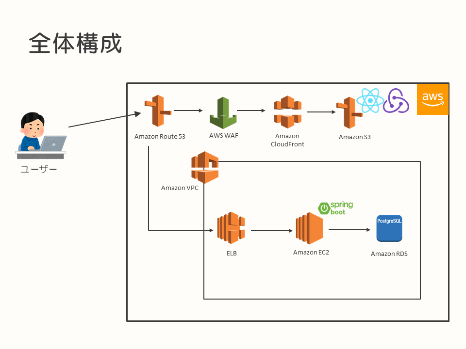
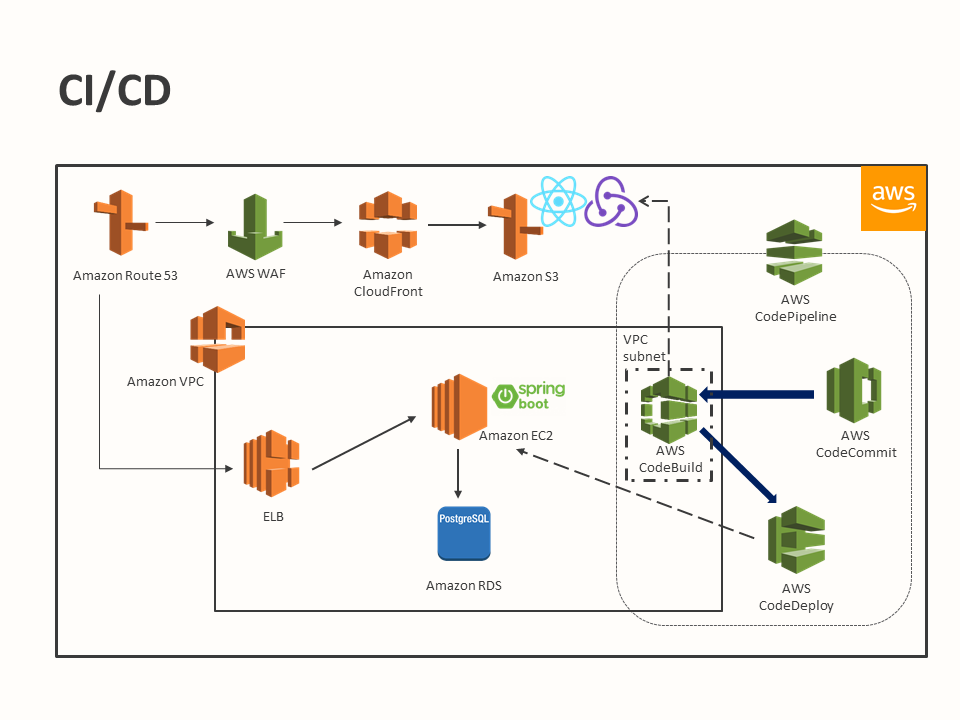
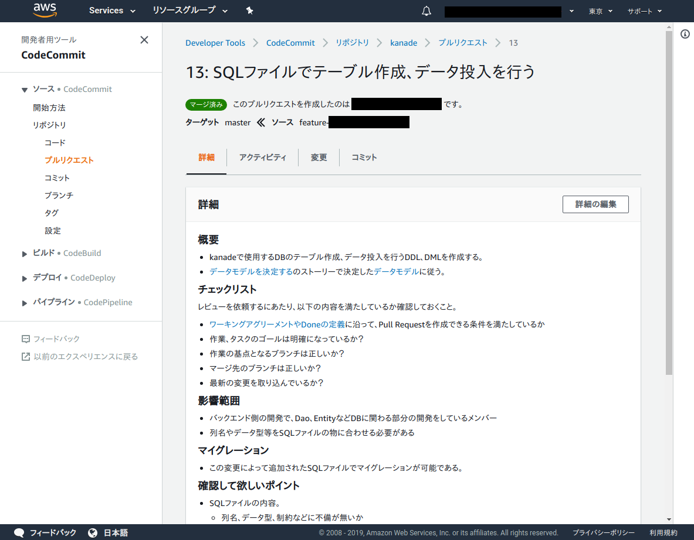
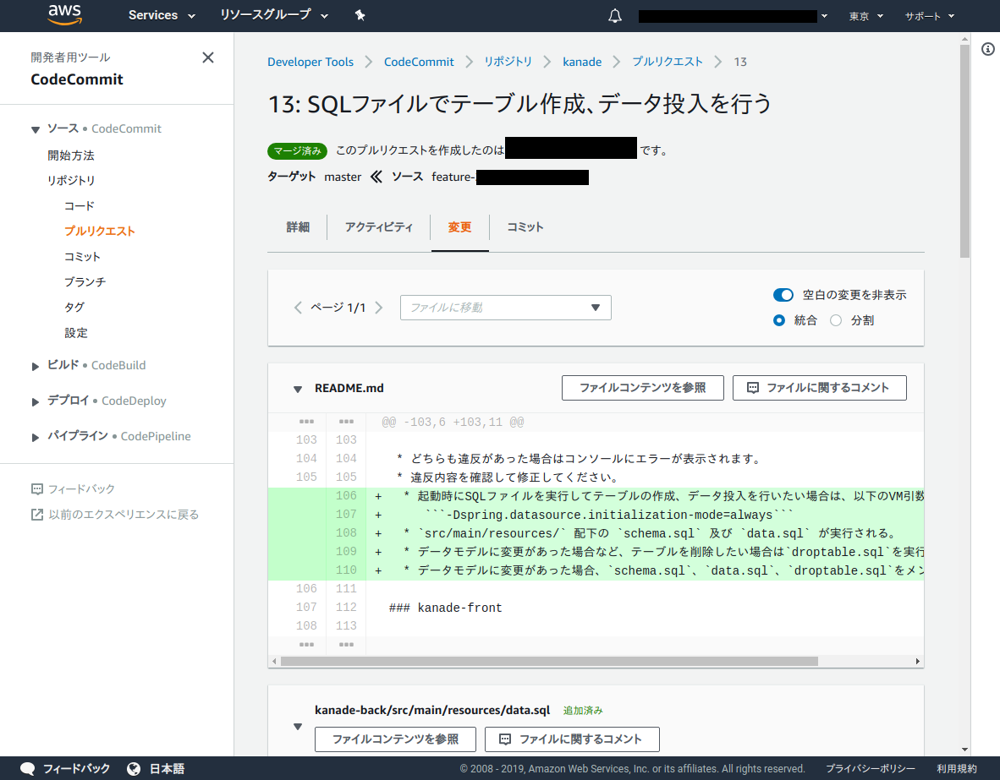
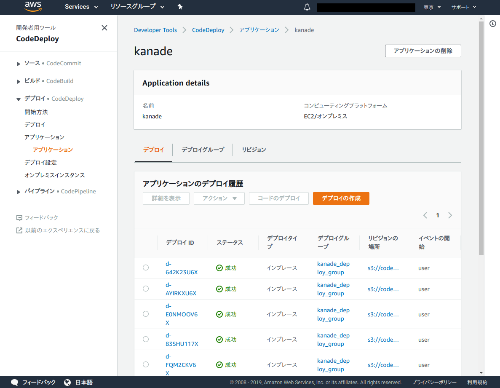
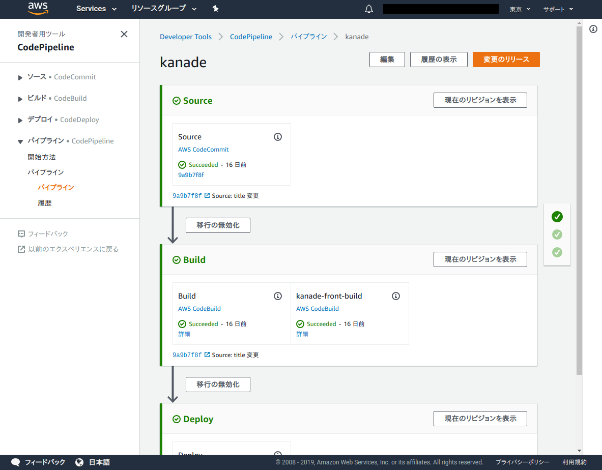

# AWSの開発者用ツールを活用したCI/CD構成例

* [はじめに](#introduction)
* [TL;DR](#tldr)
* [背景](#background)
* [構成](#constitution)
  * [システム全体構成](#system-constitution)
  * [CI/CDに関する全体像](#about-cicd)
  * [構成管理](#configuration-management)
  * [ビルド・デプロイ](#build-deploy)
* [結果と今後](#result-future)

## <a name="introduction">はじめに</a>

このドキュメントは、AWSの開発者用ツール（AWS CodeCommit、AWS CodeBuild、AWS CodeDeploy、AWS CodePipeline）を使用したCI/CDの実践例をまとめたものになります。

本ドキュメントが、AWS上で開発するシステムのCI/CDの構成、実践例として、今後開発を行うシステム、プロジェクトの参考情報となることを目的としています。

なお、このドキュメントに記載しているシステムは開発中のものであり、実際に運用されているシステムではありません。テストなどで品質を高めていく活動についても、これからになります。その点については、ご留意のうえ、構成例としてドキュメントを参照いただければと思います。

このドキュメントは、[SPA＋REST APIのシステム構成例（AWS）](../spa-rest-api-system-design-on-aws/README.md)のCI/CDの部分にフォーカスして記載したものです。

## <a name="tldr">TL;DR</a>

このドキュメントに記載しているシステムにおける、CI/CDの実践を行うにあたり、以下の内容でAWSの利用するサービスの選定と設定を行いました。

* シンプルなSPA＋REST APIで作成したシステムを、AWS上に構築・環境展開
  * フロントエンドはReact＋Redux、サーバーサイドはSpring Bootで実装
* サーバーサイド（REST API）は、EC2インスタンス上で実行
* フロントエンド（SPA）に関するコンテンツはAmazon S3上に置き、さらにAmazon CloudFrontを前段に配置
* ソースコードの管理は、Amazon CodeCommitで実施
* アプリケーションのビルドは、Amazon CodeBuildを利用
* アプリケーションのデプロイは、Amazon CodeDeployを利用
* リポジトリからのソースコードの取得、ビルド、デプロイの一連のフローを、Amazon CodePipelineで定義して管理

## <a name="background">背景</a>

このドキュメントの事例となったプロジェクトの背景は、[SPA＋REST APIのシステム構成例（AWS） - 背景](../spa-rest-api-system-design-on-aws/README.md)に同じです。社内の開発案件における、プロジェクト内、チーム内の課題解決を行うためのシステム開発を行うことになりました。

今回のプロジェクトでは、開発を行う過程で技術的なチャレンジに取り組み、スキルアップを行うことも効果として睨んでいます。

システムを開発、改善していくにあたり、デプロイの自動化といった頻繁にリリースができるCI/CDの仕組みを構築する必要があります。今回はSPA＋REST APIでアプリケーションを構築し、CD/CDを実現するにあたり不可欠な構成管理やビルド、デプロイの仕組みをAWSのサービスを使って実現する方針としました。

## <a name="constitution">構成</a>

### <a name="system-constitution">システム全体構成</a>

アプリケーションを動作させるための、システム全体の主要な構成要素は、以下の通りです。

* シンプルなSPA＋REST APIで作成したシステムを、AWS上に構築・環境展開
* REST APIをAmazon EC2で動作させ、前段にELBを配置
* データベースはRDSを利用
* フロントエンドのコンテンツは、Amazon CloudFrontを経由してAmazon S3から取得
* システムへは、Amazon Route 53により付与した名前でアクセス

### <a name="about-cicd">CI/CDに関する全体像</a>

今回のプロジェクトにおいて、アプリケーションに対して導入したCI/CDに関する要素は、以下のようになります。

* 構成管理
  * Amazon CodeCommit
* ビルド・デプロイ
  * Amazon CodeBuild
  * Amazon CodeDeploy
  * Amazon CodePipeline

構成管理を行うGitリポジトリとして、Amazon CodeCommitを採用しました。Amazon CodeCommitに格納されているソースコードを取得してビルドを行う役割にはAmazon CodeBuildを使用し、ビルド結果のデプロイにはAmazon CodeDeployを使用しています。そして、これらの一連のフローをまとめるパイプラインを定義する役割として、Amazon CodePipelineを採用しています。

また、Amazon CodeBuildはサブネットを作成してVPC内への配置とし、ビルドプロセスにおけるテストでの利用を踏まえて、RDSなどのVPC内のリソースへアクセスできる構成としています。

### <a name="configuration-management">構成管理</a>

ソースコードなどを管理するサービスとしては、Amazon CodeCommitを採用しました。

Amazon CodeCommitを採用したのは、以下の理由です。

* 開発チーム内のみからアクセス可能な、Gitリポジトリを使用したい
* Gitリポジトリ自体の運用は極力避けたいので、マネージドサービスを利用したい

また、AWSの提供する開発者向けのサービスを利用、評価してみたいという側面もあります。

今回のプロジェクトでは、CodeCommitを使って、以下の成果物管理を行いました。

* ドキュメント
* ソースコード

ドキュメントは基本的にMarkdownで書き、文字だけでは説明が難しいものなどは必要に応じて画像を作成し、埋め込んでいきました。

ドキュメント、ソースコードの追加、修正などは、`master`ブランチから新しくブランチを作成し、CodeCommit上でPull Requestを行い、開発チーム内でのレビューが完了したらマージするという流れで実施しています。

以下が、CodeCommit上でのPull Requestの様子になります。

ただ、本ドキュメントの最後に記載していますが、CodeCommitを使ってこのような開発、運用を行った際には気になる点がいくつかありました。

### <a name="build-deploy">ビルド・デプロイ</a>

ビルド、デプロイに関してはAmazon CodeBuild、Amazon CodeDeploy、そしてこれらを取りまとめるAmazon CodePipelineを採用しました。

Amazon CodeBuild、Amazon CodeDeploy、そしてAmazon CodePipelineを採用したのは、以下の理由です。

* ビルドを行う環境自体の運用は極力避けたいので、マネージドサービスを利用したい
* アプリケーションはEC2上で稼働しているため、EC2上へのデプロイが容易に可能なサービスを利用したい
  * CodeDeployであれば、ELBの背後に登録されているアプリケーションのローリングアップデートが可能

これら3つに関しても、CodeCommitと同様にAWSの提供する開発者向けのサービスを利用、評価したいという側面がありました。

デプロイ対象のアプリケーションは、EC2上で動作するREST API、S3上に配置するフロントエンドのコンテンツで構成されます。

REST APIについては、CodeBuild上でビルド後、CodeDeployを使用することでEC2へのデプロイを容易に実現できました。以下は、CodeDeploy上でのデプロイ履歴を表示したものです。

また、今後の可用性の向上なども踏まえて、EC2の前段にはELBを配置しており、実際の運用時にはローリングアップデートまで含めて実施する想定です。

フロントエンドのコンテンツについては、現時点では簡易にCodeBuildでのビルド時に生成された結果を、S3に配置したものをそのまま利用しています。

これらのステップを、一連のフローとしてまとめるためにCodePipelineを利用し、CodeCommitからのソースコードの取得、CodeBuildによるビルド、CodeDeployによるデプロイまでをひとつのパイプラインとして定義することができました。

以下が、CodePipelineで定義したパイプラインをブラウザ上で表示したものです。

## <a name="result-future">結果と今後</a>

現時点での構成では、AWS上のマネージドサービスを使用して、構成管理からビルド、デプロイまでの基本的な流れを実施するための環境を定義することができました。

今後は、より品質を高めていくためのアプリケーション自体のテストの追加や、実運用を視野に入れてのパイプライン内の構成要素、デプロイフローをブラッシュアップしていく予定です。

また、今回採用したサービス自体の評価ですが、CodeCommitについては類似の他のGitリポジトリのサービスおよびプロダクトと比較して機能が弱く映ってしまい、少々気になるところがある印象でした。

利用していて、特に以下のようなポイントが気になっています。

* Pull Requestをマージする時に、マージ元のブランチがマージ先のブランチの最新のコミットに追従できていないと、マージができない
  * 他のGitリポジトリサービスのように、競合がなければマージ可能とはならず最新化しておく必要がある
* Markdownファイルをリポジトリ内へ配置した時に、ブラウザからMarkdownとして参照することはできるが、リポジトリ内の画像を参照できない
  * 他のGitリポジトリサービスのように、コンテンツをRawで参照できない
* ブラウザから、ファイル単位の履歴が確認できず、リポジトリ全体の履歴から見ていくしかない

その他のサービスについては、特にそのようなことはありませんでした。

CodeBuildには多くのプログラミング言語に対するビルドのサポートがあり、CodeDeployではEC2へのデプロイが容易に実現可能で、簡単にビルドからデプロイまでの流れを構成することができました（CodePipeline含む）。今後、ELBの背後に配置したEC2上で稼働させているアプリケーションをローリングアップデートさせるなどのシナリオを考えると、AWSのサービスとして統合されている点、そしてマネージドサービスである点は魅力的です。

CodeBuildが直接サポートしているソースコード取得先にはCodeCommit以外もあるため、プロジェクト内でGitリポジトリとして採用するサービスは再度検討を行うことを考えています。CodeBuild、CodeDeploy、CodePipelineについては継続利用予定です。

以上が、本ドキュメントで紹介する、CI/CDの構成事例になります。システムの開発およびリリース後の改善、運用を行っていくにあたり、迅速にビルド・デプロイが自動化されて実施できる仕組みは、ビジネスとして価値のある作業により多くの時間を割くためには必要不可欠なものだと考えています。今後開発を行うシステム、プロジェクトに、本ドキュメントに記載した内容が事例として参考になればと思います。
