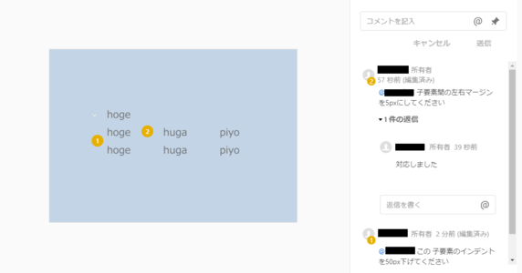

# デザイナー&エンジニア協業で得た TIPS

- [はじめに](#はじめに)
- [TL;DR](#TL;DR)
- [背景](#背景)
- [TIPS: コミュニケーションツールの使用目的を明確に！](#TIPS:-コミュニケーションツールの使用目的を明確に！)
- [TIPS: アニメーションも静止画で受け取る！](#TIPS:-アニメーションも静止画で受け取る！)
- [TIPS: デザインは設計書ではない！](#TIPS:-デザインは設計書ではない！)
- [デザイナー&エンジニア協業の感想と今後の課題](#デザイナー&エンジニア協業の感想と今後の課題)

# はじめに

近年、コスト削減を目的とした基幹システムの開発は一巡し、IT基盤が社会に浸透した時代背景から、サービスの付加価値や業績向上を目的とした攻めのシステム開発が増えています。
これらのシステムは、従来の「利用者に使われることが前提」としたシステムに比して、「利用者に使ってもらえる」ための優れたUI/UXデザインが求められます。  
このような背景からエンジニアとデザイナーの協業が増えてきている現場は多いと思いますが、両者の考え方やミッションは異なります。  
そのため今までのエンジニア同士のコミュニケーションとは異なる意思疎通の工夫が必要であると考えています。

今回、PoCを目的としたMVP開発（MVP: 実用最小限の製品 minimum viable product）において、デザイナーとエンジニアが協業して開発することとなりました。  
本稿は、その協業で得た知見や経験を紹介するものです。

### 想定読者

- デザイナー&エンジニア協業に興味があるエンジニア
- 協業時の留意点を知りたいエンジニア

# TL;DR

- チャットツールによる手軽なコミュニケーションにより、コミュニケーション不足による手戻りが抑制できた
- [Adobe XD](https://helpx.adobe.com/jp/xd/how-to/what-is-xd.html)（以下、XD）上での指摘/変更により、視覚的に指摘/変更内容が把握できた
- 指摘/変更管理はXDのコメント欄のみで行う方法がベストであり、指摘/変更時はメンションを付与して通知する
- デザインスペックに含まれるCSSコードスニペットの読み込みなど、XDには実装に繋がる便利機能が豊富
    - 一方でアニメーションの表現には課題も
- デザインはあくまで画面イメージであり、実装では設計書との突合せが必要

# 背景

### システム

- 経営のシミュレーションシステム
- 特徴：一画面での入力/表示項目が多い

### 開発規模

- 体制：デザイナー1人, 機能設計者1人, フロントエンドエンジニア2人
- 画面数：7画面

### コミュニケーション手段

今回のプロジェクトではデザイナーが東京、エンジニアは大阪という複数のロケーションに跨った環境で開発が進みました。  
そこで、デザイナーとのコミュニケーションは次の方法で行いました。

- Slack：デザインや仕様に関する質問や確認を行う場
- XDの共有機能：XDのコメント欄でデザイナーからの指摘やデザイン変更を管理する場
- 質問管理表（Excel）：デザイナーへの質問事項、回答状況、回答内容を管理
-  指摘管理表（Excel）：実装画面へのデザイン指摘事項、対応状況、対応内容を管理
- 週次の定例会：ZoomによるTV会議。実装画面の挙動確認や纏まった質問を行う場

### 画面開発の流れ

- デザイナーが設計書に基づき画面をデザインする
- その後、機能設計者と打ち合わせをしてデザインを精緻化
- エンジニアがデザインに基づきモックアップを実装する（モックアップ：実機能のない試作品のこと）
- モックアップ完成後、フロントエンジニアがサーバー通信や計算処理などの機能を実装していく

# TIPS: コミュニケーションツールの使用目的を明確に！

デザイナーは複数案件に並行アサインされることが多く、エンジニアと異なるロケーションでデザインすることが一般的です。  
本件でも同様に、異なるロケーションで開発を進めることになりました。

SlackやTeamsなどのチャットツールは電話やメールに比べ、一対複数でのコミュニケーションにも長けています。  
今回用いたSlackでは、使用用途に応じたチャンネル（グループ）を作成し、質問や確認事項を関係者全員で共有することができます。  
これらはメールと比べて堅苦しくなく素早いやり取りができるため、デザインの細かいところを気軽に相談することができました。  
それにより、コミュニケーション不足による手戻りを抑制し、スピーディーに開発を進めることができました。

XDには共同作業をスムーズに進める共有機能があり、画面デザインの位置に番号を振って、コメント欄で指摘事項や変更内容を記載することが出来ます。  
次の図はXDの共有機能画面です。

画面の①の指摘から分かるとおり、「このインデントを下げてください」という変更内容が、どの箇所かを視覚的に把握できます。  
この機能の活用により、デザイナーとエンジニア双方の時間を節約することができました。

このように、XDの共有機能を用いたコミュニケーションは有効な面がありましたが、次の課題もありました。

- ExcelシートやSlackなど、それぞれのツール役割の線引きを明確にせず使用していたため、情報が散らばってしまった
- 変更内容が一覧化されていないため、変更内容を見過ごしてしまった

前者について、デザイナーは複数の案件を抱えており、その案件ごとにコミュニケーション方法が異なると大変です。  
ですから、「デザインに関する（質問などの）やり取りは全てXDのコメント欄で行う(※)」など予めその目的のために使用するツールを絞っておけばよかったと思っています。

(※) デザイナーによると、デザインに関するやり取りはXDのコメント欄で統一するのが一番やりやすいそうです。

後者について、今回の開発では用いませんでしたが、Adobeアカウントを保有していれば上記画像のようにメンションをつけて変更箇所を通知するような進め方もできます。  
そうすることでデザインに関するやりとりをXD上で完結させることが可能です。  
Adobeアカウントを保有していない場合は、指摘/変更の詳細をXDに記載して「指摘/変更をしました」という通知だけを次のようにExcelで連携したり、Slackで連絡したりするなど他のツールを組み合わせて進める方法があります。  
目的一つに対してツールを一つに絞ることはできませんが、その際「何を」「どのツールで行うか」の線引きを明らかにすることで情報が散逸する危険性は下げられるのではないかと思います。

# TIPS: アニメーションも静止画で受け取る！

今回、デザインをXDの開発者モードで受け取りました。  
次のようなXDの機能を使うことで提供されたデザインと相違ない画面を実装できたことが良かった点として挙げられます。

- 配置されたオブジェクトの位置を測ることができる
- オブジェクトの大きさや文字色などをCSSとして取得できる
- デザイン画像のイメージをXDから取得できる

XDを使用したことのないエンジニアであっても、デザイナーから提供されたデザインを確認する程度の操作は簡単にできるため、スムーズに開発を進めることができました。

ただし、受け取ったデザインにはアニメーションやマウスホバー時の動作のような動きのあるデザインが示されていなかったため、デザイナーに動きの確認をする必要がありました。

動作が示されていない理由をデザイナー伺ったところ、「動きのあるデザインの作成は時間がかかるため、全画面の動作を実装するにはコストがかかりすぎるから」だそうです。  
ですから、コスト削減と同時にデザイン提供までの時間を短縮するためには、動きのあるデザインも次の画像のような動きのないデザインで受け取ることがベターです。

しかし、このような画像では実際の細かな動きを確認できないため、ホバー時のトランジション有無などの細かい挙動がデザイナーの意図と異なる可能性があります。  
そのような時は、そのXDのコメント欄でデザイナーに意図を確認するなどのコミュニケーションで情報を補う必要があります。  
そしてデザイナーに確認が取れたらモックアップを実装し、定例会で見てもらうなどして実際の動きを共有して、認識の齟齬が無いかを確認していきました。

このような工夫により、大きな手戻りは無く順調に開発を進めることができました。

# TIPS: デザインは設計書ではない！

従来開発の設計書においては、画面デザインについても設計書のような厳密性を求められました。  
一方で、デザイナーが作成する画面イメージは入力項目を網羅したデザインではありません。  
今回においても、あくまで画面イメージとして提供されました。  
例えば次の画像のように、設計書の画面項目は10項目ですが、デザイナーから提供されたものは5項目分のみが示されてるといった形です。

このようにデザインと設計書の項目等に差異が生じる原因として、デザイナーとエンジニアの考え方やミッションが異なるからということが考えられます。  
デザイナーは意図したUI/UXの提供をミッションとしており、エンジニアは設計書通りに動くシステムの提供をミッションとしています。  
そのため、デザイナーは設計書のようにデザインに重複のある10項目全てを網羅する必要がなく、デザインが伝わる項目分を提示すれば問題ありません。  
リスト形式、テキスト形式・・など表示パターンが網羅されていれば項目を網羅しなくても画面イメージが伝わるからです。  
ですから、私たちエンジニアはその画面イメージを参考にして、設計書と照らし合わせながら開発することが求められます。

しかし、今回私たちはそれを設計書だと思い込んでそのデザイン通りの画面を実装してしまい、その結果「テーブルの項目数が設計書と異なる」や「ページタイトル名が設計書と異なる」といった指摘を受けることとなりました。

設計書にミスがある可能性もあるため、今後は設計書とデザインに差異があった場合はデザインを受け取ってすぐに画面デザインが正なのか設計書が正なのかを確認する必要があります。

また、先述の通りデザイナーとエンジニアの考え方やミッションが異なっているため、同時にそれぞれの考える「当たり前」も異なっていると考えられます。  
ですからこのようなケースに限らず、何か疑問や確認事項があれば気軽にコミュニケーションをとって相互に認識を合わせていくことが、デザイナー＆エンジニア協業において何より肝要なのではないかと思います。

# デザイナー&エンジニア協業の感想と今後の課題

今回エンジニアとしては、XDで提供されたデザインがあったためとても実装しやすかったです。  
また、速い段階でデザイナーとプロダクトオーナー間でデザインの精緻化ができていたため、大幅なデザイン変更による大きな手戻りが発生せず非常に助かりました。

反省は、エラー表示方法やその他細かな動きを明文化せずに進めていた点です。  
幸い認識が一致して問題が顕在化することはありませんでしたが、まかり間違えれば大きな手戻りに繋がります。  
ですから今後は、「エラー表示方法やその他細かな動きを予め明文化して開発側からデザイナーに伝え、デザイナーが方針を固めてから作業へ取り掛かれるようにする」等の対策を取ります。

このドキュメントが、今後デザイナー&エンジニア協業を予定している方への参考となれば幸いです。
