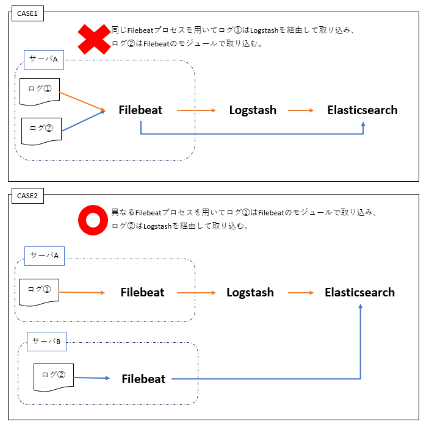

# ログの収集・格納・検索のためのElastic Stack設計ガイド

## 商標

Elasticsearch、Kibana、Logstash、Beats、FilebeatおよびそのロゴはElasticsearch BVの商標であり、米国およびその他の国で登録されています。  
本文中では®は表記しておりません。


## 目次

* [はじめに](#purpose)
* [前提事項](#requirement)
* [設計ノウハウ](#knowhow)
  * [Elastic Stackを構築するための設計](#phase1)
    * [サブスクリプションの選択](#choice-product)
    * [Elasticsearchのノード設計](#node-design)
    * [構成の設計](#archi-design)
    * [サーバ設計](#server-design)
    * [認証（オプション）](#permission-design)
    * [Elastic Stackのログ設計](#log-design)
  * [新規のログを収集・格納するための設計](#phase2)
    * [閲覧したい情報の検討](#dashboard-design)
    * [Filebeatモジュール使用の検討](#filebeat-module)
    * [FilebeatとLogstashの構成（オプション）](#fl-archi-design)
    * インデックス設計
      * [インデックス単位の設計](#index-unit-design)
      * [フィールド設計](#index-field-design)
      * [レプリカ設計](#index-replica-design)
      * [シャード設計](#index-shard-design)
      * [ライフサイクル設計](#index-lifecycle-design)
    * [データノードの再設計](#data-node-redesign)
* [参考記事](#ref)
* [まとめ](#summary)

## <a name="purpose">はじめに</a>

我々の長年運用するシステムではサーバおよびアプリケーションの増加に伴い、ログ管理の煩雑さが問題視されるようになりました。  
この問題を解消するためにElastic Stackによるログの収集・格納・検索を開始しました。  
Elastic Stackを選んだ理由は、無料ライセンスで使用できる機能が豊富でスモールスタートに向いており、オンプレミス環境での使用が可能だったためです。

Elastic Stackを導入した結果、ログ管理の煩雑さは軽減されました。  
同じ課題を抱えている方には、是非Elastic Stackを導入し、ログ管理の煩雑さから解放されて欲しいと思います。

しかし、Elastic Stackを導入するハードルは低くはありません。主な理由は以下の2つです。

* 学習コストが大きい
* リソース（サーバや、作業実施者）を準備する必要がある

本ドキュメントを読んでいる多くの方がElastic Stackを初めて利用することになると思います。
Elastic Stackを学習するための資料は公式ドキュメントをはじめ数多く存在しますが、
ログの収集の用途でElastic Stackを運用するために必要な情報がまとめられた、体系的なコンテンツは多くありません。  

初学者は膨大なドキュメントを読み漁りながら、全体的なフローとして何を実践しなければならないのかを判断し、そのために自分が必要な情報が何なのかを見極める必要があります。  
上記作業はかなりの時間と労力がかかるものですし、手順に間違いや漏れがあってもそれに気づきにくく、手戻りの元となります。

実際に我々のプロジェクトで最初にElastic Stackを利用しようとした際には、以下のような課題がありました。

* Elastic Stackに必要なリソースがわからず、リソースの準備に時間がかかった、リソースの拡張計画が立てられなかった
* ログ集約のために各アプリケーションに定義すべき内容がわかっておらず、設計、実装、検証の工程で何度も手戻りが発生した

本ドキュメントは、そのような経験をもとに、Elastic Stackを利用したログの収集の設計ノウハウをまとめたものです。  
本ドキュメントを読むことで、Elastic Stackを使ったログの収集の仕組みの設計を行う際に、以下の2つの効果を得られるのではと考えています。

* Elastic Stackを使ってログの収集を行う設計として、どのようなことを検討しなくてはいけないか、設計・検討すべきポイントを把握してもらうこと
* 各ポイントに対して、構成パターンと採用する時の観点を記載することで、自分たちのユースケースに合わせて判断してもらいやすくすること

結果として、Elastic Stackを導入する際の学習コストが下がることを期待しています。

## <a name="purpose">本ドキュメントのターゲット</a>

本ドキュメントはElastic Stackを用いてログの収集・格納・検索を行いたいと考えているアプリケーション開発者、インフラ技術者を想定しています。  
また、[Elasticの製品ページ](https://www.elastic.co/jp/products/)などを読みElasticsearch、Kibana、Logstash、Beatsそれぞれの役割を理解している方を想定しています。

本ドキュメントでは下図のように、サーバ上のログファイルに出力されているログをElasticsearchに収集し、Kibanaで閲覧する仕組みの設計を目指します。  
  

以下については記載しません。
* 設計の反映方法  
  文書が煩雑になることを防ぐため、本ドキュメントでは設計についてのみ記載します。見つけにくい設定を除き、具体的な反映方法は記載しません。公式ドキュメントを参照ください。
* 収集したログの活用方法  
  収集したログをどのように閲覧するか、機械学習やアラートを含めどのように活用するかは記載しません。

## <a name="requirement">前提事項</a>

* 本ドキュメントではElastic Stack7.5の利用を想定しています
* 本ドキュメントではベーシック以上のサブスクリプションプランを前提としています（サブスクリプションについては[サブスクリプションの選択](#choice-product)参照）
  * 特に注釈のない記述のものは、ベーシックまでのサブスクリプションで利用可能です
  * 有償であるゴールド以上のサブスクリプションが必要な場合は、都度注釈を記載しています
* 本ドキュメントでは場合によっては設計しなくても良いものにはタイトルに（オプション）とつけています  
* 本ドキュメントでは各章で、何を設計するのか、どういった選択肢があるのか、何を観点に取捨選択するのかを記載します  
* 本ドキュメントでは以下の追加情報を記載します
  * 推奨設計  
    公式ドキュメントや、Elastic社による登壇で推奨されている設計。またはElastic Stack運用の経験から我々が推奨する設計。
  * サンプル設計  
    我々のプロジェクトで実際に使用している具体的な設計例。
  * 非推奨設計  
    公式ドキュメントで避けるべきと明記されている設計。
  * 留意事項  
    デメリットを良く理解したうえで選択してほしい事柄。


## <a name="knowhow">設計ノウハウ</a>

本ドキュメントでは、「Elastic Stackを構築するための設計」と、構築されたElastic Stackの上で「新規のログを収集・格納するための設計」という、2章に分けて設計ノウハウを記載します。
 
「Elastic Stackを構築するための設計」では、Elastic Stackの構成の検討から、運用を見据えた設計までを記載します。初期構築時および、ログ量の増大、性能劣化による構成の見直し時に実施することを想定しており、以下の設計内容を記載しています。

1. [サブスクリプションの選択](#choice-product)
1. [Elasticsearchのノード設計](#node-design)
1. [構成の設計](#archi-design)
1. [サーバ設計](#server-design)
1. [認証（オプション）](#permission-design)
1. [Elastic Stackのログ設計](#log-design)

「新規のログを収集・格納するための設計」では、構築したElastic Stackに新規のログデータを投入する際に検討が必要な事柄について記載します。集約するログが増える度に実施することを想定しており、以下の設計内容を記載しています。

1. [閲覧したい情報の検討](#dashboard-design)
1. [Filebeatモジュール使用の検討](#filebeat-module)
1. [FilebeatとLogstashの構成（オプション）](#fl-archi-design)
1. インデックス設計
  1. [インデックス単位の設計](#index-unit-design)
  1. [フィールド設計](#index-field-design)
  1. [レプリカ設計](#index-replica-design)
  1. [シャード設計](#index-shard-design)
  1. [ライフサイクル設計](#index-lifecycle-design)
1. [データノードの再設計](#data-node-redesign)

### <a name="phase1">Elastic Stackを構築するための設計</a>

#### <a name="choice-product">サブスクリプションの選択</a>

まずは使用するElastic Stackのサブスクリプションを選択します。
Elastic Stackのサブスクリプションについては[Elastic Stackサブスクリプション](https://www.elastic.co/jp/subscriptions)を参照してください。ベーシックまでは無料で利用できます。運用途中でのサブスクリプションの変更は可能です。  

**推奨設計**

Elastic Stackの運用をサポートする機能が含まれるため、ベーシックまたはベーシック以上のサブスクリプションプランを選択してください。elastic社のホームページから取得したパッケージを使用する場合はデフォルトでベーシックプランが選択されます。  
なお、本ドキュメントはベーシック以上のサブスクリプションプランを利用することを前提に記載します。

#### <a name="node-design">Elasticsearchのノード設計</a>

Elasticsearchはクラスタ構成を推奨しています。クラスタを構成する1つのElasticsearchプロセスをノードと呼びます。Elasticsearchでは1サーバに1プロセス起動することを推奨していますので、結果的に1ノード=1サーバとなります。
ノードは以下に記述する役割を持ちます。1つのノードが複数の役割を持つことも可能です。

* マスター（候補）ノード  
  クラスタステートと呼ばれるクラスタ内で一意に共有される仮想的なインデックスを管理するノードです。このクラスタステートで、各ノードの役割や設定、インデックスの設定、マッピングなどの重要な情報を管理しています。
* データノード  
  投入されたデータを保存するノードです。
* インジェストノード  
  Elasticsearchに保存する前の処理を実施するノードです。
* コーディネーターノード  
  検索の要求を受け付けるノードです。
* マシンラーニング（ML）ノード  
  機械学習を実施するノードです。

ノード設計では各役割のノードをいくつ用意するかを検討します。高性能、高負荷になるほどノードの設計は重要になります。  
各役割の検討の観点を記載します。

* マスター（候補）ノード  
  スプリットブレインと呼ばれる問題を避けるため、3つ以上のマスター候補ノードが必要です。クラスタの管理に専念させるため、サーバ数に余裕があれば専用のノードを用意してください。専用のノードを用意できない場合でもインジェストノードとMLノードの役割を持ったノードとは分離するのが望ましいです。
* データノード  
  データ量によって用意するノード数を決定します。初期構築時用の大まかなノード数の算出方法を記載します。`ログの種類数 * 保存日数 * 2 / (JVMメモリサイズ（GB） * 20 ) + 1` 左記の計算結果の小数点を切り捨てた数をデータノード数の目安としてください。  
  この算出方法の考え方や、より詳細な見積もり方法は[インデックス単位の設計](#index-unit-design)および設計の[データノードの再設計](#data-node-redesign)を参照してください。
* インジェストノード  
  マスター候補ノードとMLノードとは分離するのが望ましいです。Filebeatモジュールの多用などでElasticsearchのProcessor処理用にリソースを確保したい場合は専用のノードを用意することを検討してください。
* コーディネーターノード  
  検索処理の性能を高めたい場合に専用のノードを用意することを検討してください。
* マシンラーニング（ML）ノード  
  機械学習機能を使用する場合は専用のノードを1つ用意してください。ネットワークやCPUの負荷が高い処理ですので、その他の役割を持ったノードとは分離してください。

**推奨設計**

[Elasticsearch Architecture Best Practices | Elastic Videos](https://www.elastic.co/pdf/architecture-best-practices.pdf)にて紹介された構成を記載します。

* Quick Start  
  初期構築時で格納するログも多くなく、今後柔軟にサーバを増やせる環境である場合に推奨する構成です。  
  ログの増加や機械学習の導入に伴い下記に記載する「Advanced Processing and Resiliency」構成に変更してください。  
  [Elasticsearch Best Practices Architecture](https://www.elastic.co/pdf/architecture-best-practices.pdf)の11ページ目で紹介されています。  
  Uniform Nodes（全ての役割を持つノード）を3つ使用する構成です。

* Advanced Processing and Resiliency  
  大量のログを保持する、もしくは高性能を求める場合に推奨する構成です。柔軟にサーバを増やせない環境である場合、初期構築から本ノード構成にすることをお勧めします。  
  [Elasticsearch Best Practices Architecture](https://www.elastic.co/pdf/architecture-best-practices.pdf)の12ページ目で紹介されています。  
  マスター（候補）ノードを3つ、データノードを2つ以上、MLノードを2つ以上使用する構成です。  
  データノードは最低2つです。データノードを3つ以上にするかは上記に記載したデータノードの検討の観点を参考に決定してください。  
  MLノードは最低2つですが、機械学習およびアラート機能を使用しない場合は不要です。


**非推奨設計**

* マスター候補ノードが2ノ―ド  
  1ノードダウンすると、スプリットブレイン問題が発生し、クラスタが正常に動作しなくなります。  
  復旧にも手間がかかりますので、マスター候補ノードを2ノードにするべきではありません。

**留意事項**

* ノード数が1つ（非クラスタ構成）  
  ごく短期間の試験運用のために1ノードにするのは問題ありませんが、長期間運用するのであれば1ノードは避けたほうが良いです。  
  可用性や性能が低くなり、Elastic社が公開する性能指標が参考にならなくなるため、投入可能なデータ量の予測が難しくなります。  


#### <a name="archi-design">構成の設計</a>

構成の設計ではElasticsearch、Kibana、Logstash、Filebeatのサーバ構成と通信プロトコルを検討します。

各製品のサーバ構成の検討の観点を記載します。

* Elasticsearch  
  専用のサーバを用意してください。[Elasticsearchのノード設計](#node-design)に記載している通り、1ノードにつき1サーバ用意してください。
* Kibana  
  専用のサーバを用意してください。ユーザから利用されるフロントエンドツールなので、KibanaのみDMZに配置できるようにするためです。
* Logstash  
  1サーバにつき1プロセスとしてください。Beatsと同じサーバにインストールするか、専用のサーバを用意するか検討してください。複雑なログのパースをgrokで行うといった場合には、高性能なCPUを持った専用のサーバを用意することを検討してください。
* Filebeat  
  1サーバにつき1プロセスを推奨します。収集対象のログと同じサーバにインストールしてください。

次に通信プロトコルの検討の観点を記載します。

Elastic Stackの製品間ではHTTPまたはHTTPSプロトコルが使用できます。どちらを使用するか検討してください。  
Elastic Stackの構成要素間がインターネット越しになる場合はHTTPSの使用を検討してください。

**留意事項**

* 1サーバに複数のElasticsearchプロセス  
  1サーバに複数のElasticsearchプロセスが稼働することを想定して作られていません。予期せぬトラブルを回避するため、1サーバで複数のElasticsearchプロセスを稼働させるのは避けるようにしてください。
* 1サーバに複数のLogstashプロセス  
  [モニタリング機能](https://www.elastic.co/guide/en/logstash/7.5/configuring-logstash.html)が使用できなくなるため、1サーバで複数のLogstashプロセスを稼働させるのは避けるようにしてください。


#### <a name="server-design">サーバ設計</a>

サーバ設計ではElastic Stackをインストールするサーバの物理メモリおよびElasticsearchとLogstashに割り当てるJVMメモリ、CPUコア数、ディスク、OS、その他インストールするパッケージを検討します。

サーバリソースの検討の観点を記載します。

* Elasticsearch
  * JVMメモリ  
    500MB～32GBの間で設定してください。性能確保するためにもできるだけメモリは大きくしたほうがいいですが、最大は32GBです。32GB以上は性能が落ちていきます。
  * 物理メモリ  
    JDKに割り当てるメモリの倍以上の物理メモリサイズを用意してください。またスワップ機能はOFFにすることが推奨されています。
  * CPUコア数  
    2～8コアであれば十分です。上限はありませんので、より性能を高めたい場合はさらに多いコア数を選択してください。
  * ディスク  
    SSDを用意してください。より性能を求める場合はRAID 0の使用を検討してください。  
    データノードの場合はディスク使用量が85%以内になるのが望ましいです。`ログサイズ(GB) * 1.1 * 1.25 / ノード数`（GB）を目安としてください。`1.1`はElasticsearchに格納する際のオーバーヘッドです。
* Kibana  
  公式ドキュメントにおいて、必須のスペックは明記されていません。Amazon Elasticsearch Serviceの最小スペックのインスタンスタイプ「t2.micro.elasticsearch」から、最低CPU1コア、メモリ1GBで起動可能です。
* Logstash  
  * JVMメモリ  
    1GB以上を設定してください。処理件数が多く、スレッド数を多くする場合はメモリを大きくしてください。
  * 物理メモリ  
    JVMのメモリに対して余裕を持たせた物理メモリサイズを用意してください。
  * CPUコア数  
    2～8コアであれば十分です。複雑なログのパースをGrokで行うといった場合にはコア数を増やすことを検討してください。
  * ディスク  
    Logstashが出力するログが十分収まるサイズを検討してください。ディスクに書き込みを行うプラグインを使用する場合は合わせてディスクサイズを検討してください。
* Filebeat  
  公式ドキュメントにおいて、必須のスペックは明記されていません。FilebeatはCPUやメモリ負荷が低い作りになっています。既存サーバのCPU、メモリ、ディスクが枯渇していないことを確認してください。

次にOSの検討の観点を記載します。

Elastic Stackは製品によって対応しているOSが異なります。下記のページより対応OSを確認し適したものを選択してください。もしくは既存サーバのOSが対応しているかを確認してください。  
Support Matrix（Product and Operating System）：[https://www.elastic.co/jp/support/matrix](https://www.elastic.co/jp/support/matrix)

最後にその他インストールするパッケージの検討の観点について記載します。

ElasticsearchとLogstashはJDKを使用します。
* Elasticsearch  
  Elasticsearch 7.5にはAdoptOpenJDKのバージョン13がバンドルされており、デフォルト設定ではこちらが利用されます。使用するJDKを変更したい場合は環境変数`JAVA_HOME`を設定してください。なお、使用可能なJDKについては[Support Matrix（Product and JVM）](https://www.elastic.co/jp/support/matrix#matrix_jvm)を参照してください。
* Logstash  
  Elasticsearchと異なり、JDKはバンドルされていません。[Support Matrix（Product and JVM）](https://www.elastic.co/jp/support/matrix#matrix_jvm)より対応JDKを確認し適したものをインストールしてください。もしくは既存のJDKが対応しているかを確認してください。

**推奨設計**

Elasticsearch Serviceで推奨されている構成を記載します。

| プロダクト | JVMメモリ | 物理メモリ | CPUコア数 | ディスク |
|:----|:----|:----|:----|:----|
| Elasticsearch（データノード） | 2GB | 4GB | 不明 | 120GB |
| Elasticsearch（マスター候補ノード） | 500MB | 1GB | 不明 | 不明 |
| Elasticsearch（MLノード） | 500MB | 1GB | 不明 | 不明 |
| Kibana | - | 1GB | 不明 | 不明 |

ただし、上記はデータ量に応じてスペックを上げていくことを前提にしています。  
柔軟にスペックを変更できない環境の場合は、初回構築から最大スペックでサーバ構築することをお勧めします。

**非推奨設計**

* ElasticsearchのディスクにNASを使用する  
  NASはSSDやHDDに比べ低速で、かつ単一障害点となるため利用すべきではありません。


#### <a name="permission-design">認証設計（オプション）</a>

認証設計ではElasticsearchの認証方法およびロールの設計を行います。
デフォルト設定では認証機能を使用しませんが、以下の場合は認証機能を使用する必要があります。

* Kibanaで認証機能を使用したい
* Kibanaでユーザごとに閲覧できるデータを制限したい
* Elasticsearchの監査ログを取得したい

Elasticsearchの認証方式と検討の観点を記載します。

* ネイティブ認証  
  最も簡単な認証方法です。APIやKibana上でユーザ、ロールの管理ができます。
* ファイル認証  
  ファイル上でユーザ、ロールを管理する方法です。こちらは他の認証方式の代案／回復のために提供されています。例えばすべてのユーザがシステムから締め出された場合に、ファイル認証に切り替えadminユーザを作成し全てのユーザの認証をリセットします。ユーザ、ロールの管理用のコマンドラインツールが提供されています。
* LDAP、認証基盤（PKI）、Active Directory認証  
  ゴールドライセンス以上で使用可能です。
* シングルサインオン（SAML、OpenID Connect、Kerberos）  
  プラチナライセンス以上で使用可能です。

Elasticsearchの権限管理はロールベースで行われます。
ロールの設計では、Elasticsearchのロールの設計および、ロールの作成を行います。
Elasticsearchにはデフォルトでいくつかのロールが作成されています。[Elasticsearch Reference [7.5] ＞ Secure a cluster ＞ User authorization ＞ Built-in roles](https://www.elastic.co/guide/en/elasticsearch/reference/7.5/built-in-roles.html)で確認できます。
ロールが不足していれば新規に設計、作成してください。

#### <a name="log-design">Elastic Stackのログ設計</a>

Elastic Stackが出力するログの種類とログローテーションの設計をします。

Elastic Stackが出力できるログについて記載します。

* Elasticsearch

| ログの種類 | デフォルトの出力設定 | ログローテーション機能 | デフォルトのローテーショントリガー | デフォルトの保存履歴 | 概要へのリンク |
|:---:|:---|:---|:---|:---|
| サーバログ | ON | 有り | 1日もしくは128MB | 2GB | - |
| デプリケーションログ | ON | 有り | 1G | 4ファイル | [Deprecation logging](https://www.elastic.co/guide/en/elasticsearch/reference/7.5/logging.html#deprecation-logging) |
| 検索遅延ログ | OFF | 有り | 1G | 4ファイル | [Search Slow Log](https://www.elastic.co/guide/en/elasticsearch/reference/7.5/index-modules-slowlog.html#search-slow-log) |
| インデックス遅延ログ | OFF | 有り | 1G | 4ファイル | [Index Slow Log](https://www.elastic.co/guide/en/elasticsearch/reference/7.5/index-modules-slowlog.html#index-slow-log) |
| 監査ログ | OFF | 有り | 1日 | - | [Elasticsearch Audit Trail and Log File Filter Policies Explained](https://www.elastic.co/jp/blog/elasticsearch-audit-trail-and-log-file-filter-policies-explained) |

ログは通常のフォーマットおよびJsonフォーマットのログを出力できます。  
遅延ログはインデックスごとに設定できるため、構築時に検討する必要はありません。

* Kibana

Kibanaではデフォルトのログ出力先が標準出力になっています。

| ログの種類 | デフォルトの出力設定 | ログローテーション機能 | デフォルトのローテーショントリガー | デフォルトの保存履歴 | 概要へのリンク |
|:---:|:---|:---|:---|:---|
| サーバログ | ON | 無し | - | - | - |
| 監査ログ | OFF | 無し | - | - | [Audit Logging](https://www.elastic.co/guide/en/kibana/7.5/xpack-security-audit-logging.html) |

* Logstash

| ログの種類 | デフォルトの出力設定 | ログローテーション機能 | デフォルトのローテーショントリガー | デフォルトの保存履歴 | 概要へのリンク |
|:---:|:---|:---|:---|:---|
| アプリケーションログ | ON | 有り | 100MB | 30ファイル | - |
| 遅延ログ | OFF | 有り | 100MB | 30ファイル | [Slowlog](https://www.elastic.co/guide/en/logstash/7.5/logging.html#_slowlog) |

ログは通常のフォーマットまたはJsonフォーマットのログを出力できます。フォーマットの変更はlogstash.ymlに`log.format: json`を追記することで変更できます。

* Filebeat

| ログの種類 | デフォルトの出力設定 | ログローテーション機能 | デフォルトのローテーショントリガー | デフォルトの保存履歴 | 概要へのリンク |
|:---:|:---|:---|:---|:---|
| アプリケーションログ | ON | 有り | 起動時 | 7ファイル | - |


### <a name="phase2">新規のログを収集・格納するための設計</a>

#### <a name="dashboard-design">閲覧したい情報の検討</a>

Kibanaで閲覧したい情報を検討します。  
検討するのは以下のような内容です。

* ログを閲覧したいのか、集計したいのか
* ログを閲覧する場合、ログを絞り込むために使用する項目はないか（ログレベル、URL、ユーザ名など）
* ログを集計する場合、集計したい項目は何か、グルーピングしたい項目は何か

#### <a name="filebeat-module">Filebeatモジュール使用の検討</a>

FilebeatにはApacheなど、よく利用されるミドルウェアのログを簡単に収集するためのモジュールがあります。利用できるモジュールについては[ Filebeat Reference [7.5] ＞ Modules ](https://www.elastic.co/guide/en/beats/filebeat/7.5/filebeat-modules.html)を参照してください。

Filebeatモジュール使用の検討では、Filebeatモジュールを用いてログを収集するかどうか検討します。  
Filebeatモジュールはいくつかのコマンドを実行するだけでログを収集することができます。収集したログがどのようにElasticsearchに登録されるか、どのようなダッシュボードが作成されるかはKibanaの[デモサイト](https://demo.elastic.co/app/kibana)で確認することができます。  
ただし、以下に記載するCASE1のような使い方はできないため、注意してください。



Filebeatモジュールを使用し、Logstashを使わない場合は以下に記載する[インデックス単位の設計](#index-unit-design)と[フィールド設計](#index-field-design)、[FilebeatとLogstashの構成（オプション）](#fl-archi-design)の実施は不要です。モジュールとして定義された設定が利用されます。  
[レプリカ設計](#index-replica-design)、[シャード設計](#index-shard-design)、[ライフサイクル設計](#index-lifecycle-design)ではモジュールのデフォルト設定で良いか検討してください。デフォルト設定から変更することも可能です。

#### <a name="fl-archi-design">FilebeatとLogstashの構成（オプション）</a>

FilebeatとLogstashの構成では、1サーバで複数ログを取り込む場合、FilebeatとLogstashをどのような構成にするのか決定します。

構成は次の3つから選択できます。

**シングルパイプライン処理方式**

Filebeatで複数のファイルを読み取り、Logstashの単一のパイプラインに渡す方式です。
単一のログを取り込む場合と処理フローは変わりませんが、LogstashのFilter部分の設定が複雑になり、管理しにくい状態になる可能性があります。
Filterでの処理がほぼ無い場合にお勧めの方式です。


**マルチパイプライン処理方式**

Filebeatで複数のファイルを読み取り、Logstashにはログに対応したパイプラインを用意する方式です。パイプラインへの振り分けはLogstashのPipelineプラグインを利用します。
Filterをログごとに管理できますので、ログごとにFilterでの処理がある場合にお勧めの方式です。  
ただし、後続のパイプラインへイベントをコピーして渡す仕組みのため、他の方式よりもメモリの使用量が増加することに注意してください。パイプラインを多段にすることは、避けるべきだと考えます。


**マルチFilebeat処理方式**

Filebeatプロセスを複数起動し、LogstashにはFilebeatプロセスに対応したパイプラインを用意する方式です。  
プロセスが増えるため、管理が煩雑となります。また[モニタリング機能](https://www.elastic.co/guide/en/beats/filebeat/current/monitoring.html)が使用できなくなります。
１つのFilebeatプロセスでは処理しきれないほどのログ量がある場合にのみ採用してください。


#### <a name="index-unit-design">インデックス設計-インデックス単位の設計</a>

インデックス単位の設計では、収集するログを格納するインデックスを決定します。
今後の集計を考慮して、同じヴィジュアライズで表現したいデータは同じプレフィックスとなるようにインデックス名を決定するのがいいでしょう。

**サンプル設計**

インデックスは以下の命名規則とし、格納するデータも命名に合わせました。  
システム名 + "-" + ミドルウェア／アプリケーション名 + "-" + ログの種類 + "-" + サブシステム名 + "-" + 日付  
例) `xxxx-apache-access-backend-2019.12.01` `xxxx-apache-access-frontend-2019.12.01`

* システム名  
  収集するログが属するシステムやPJの名前です。認証機能を利用する場合は、インデックスパターンで操作可能なインデックスを指定するため、システム名を先頭に持ってくると制御しやすくなります。  
  また、ログの全インデックス共通のプレフィックスを持たせた方が、全インデックスで共通させたい設定（テンプレートなど）の管理が楽です。
* ミドルウェア／アプリケーション名  
  収集するログを出力するドルウェアまたはアプリケーション名です。例）`apache` `tomcat`
* ログの種類  
  収集するログの種類です。例）`error` `access`
* サブシステム名  
  収集するログが属するサブシステム名です。サブシステムが無い場合は不要です。
* 日付  
  ログをElasticsearchに取り込んだ日付です。日次でインデックスを分割するのはElasticが推奨する方法です。性能のコントロールが容易になり、また古いログを削除する場合、インデックス自体を削除すればよいため、クリーニングの運用が容易になります。  
  ただし、日次でインデックスを分割する方式は、関連する複数のログイベントをElasticsearchの同じインデックスまたはドキュメントに格納したいケースには向いていないので注意してください。   
  例えばSTARTとENDが別々に出力されるようなログで、STARTとENDを同じインデックスに格納したい場合、ENDログが日付を跨ぐと、格納されるインデックスが変わってしまいます。  
  このようなケースでは、ひとつのインデックス内で管理したいイベントと、実際に格納されてしまうインデックスがずれてしまう可能性があるので、取り込み方法やインデックスの作成単位を検討する必要があります。

#### <a name="index-field-design">インデックス設計-フィールド設計</a>

フィールド設計ではインデックスに含める項目と項目の階層構造、項目名、項目の型を設計します。[閲覧したい情報の検討](#dashboard-design)で洗い出した項目を定義してください。

Elasticsearchでは動的に項目を増減でき、フィールドの型もデータ投入時にElasticsearchが推測してくれるため、フィールド設計は不要に思えるかもしれません。
しかし、項目の型を決定し、Elasticsearchのテンプレート機能を使用してElasticsearchによる型の推測を抑止するのは以下の2つの点でとても重要です。

* データ量を最低限にする  
  Elasticsearchではデフォルトでは文字列はText型とKeyword型の2つの型で保存されます。必要な型だけを使用するほうが、データ量を少なくできます。
* クエリやVisualizeで期待する型に確実に合わせる  
  数値や日付は数値型や日付型で格納したほうが検索や集計の利便性が向上します。

**推奨設計**

項目名はElasticが提供するモジュールなどと合わせて、小文字のスネークケースを推奨します。

項目の型は下記のいずれかを使用してください。

* text  
  文章の項目はtext型を設定します。部分一致検索が可能になります。
* keyword  
  単語の項目はkeyword型を設定します。完全一致の検索スピードが向上します。また[Termsクエリ](https://www.elastic.co/guide/en/elasticsearch/reference/7.5/query-dsl-terms-query.html)が使用可能になります。
* Numeric  
  数値の項目はNumeric（long, integer, short, byte, double, float, half_float, scaled_float）型を設定します。範囲検索が可能になります。またKibana上での[フォーマット機能](https://www.elastic.co/guide/en/kibana/7.5/field-formatters-numeric.html#field-formatters-numeric)が使用可能になります。
* Date  
  日付、日時の項目はDate型を設定します。範囲検索や集計が可能になります。またKibana上でのフォーマット機能が使用可能になります。

Elasticsearchには上記の型以外も存在します。全量は下記を参照してください。必要があれば他の型の使用を検討してください。  
https://www.elastic.co/guide/en/elasticsearch/reference/7.5/mapping-types.html

KibanaのLogs機能を使用する場合、最低限以下の項目を定義することを推奨します。
Logsのデフォルト設定となっている項目であり、またFilebeat7.5のモジュールでは下記の項目を持つ仕様になっているため、Filebeatモジュールの併用がしやすくなるためです。

| 項目名 | 項目の説明 |
|:-------|:-----------|
|@timestamp|ログに刻印されているログ出力日時|
|event.created|Elasticsearchに登録された日時|
|event.dataset|モジュールとログの種類（apache.access、apache.errorなど）|
|log.level|ログレベル|
|message|ログメッセージ|


#### <a name="index-replica-design">インデックス設計-レプリカ設計</a>

レプリカ設計では、インデックスごとにレプリカの数を決定します。  
レプリカとは簡単に説明するとインデックスのコピーです。レプリカ数を1と設定すると、オリジナルのインデックスに対して、コピーされたインデックス（レプリカ）が1つ別ノードに保存されます。  
レプリカは主に次の2つの理由で重要です。

* ノードに障害が発生した場合のフェイルオーバーメカニズムであり、レプリカがあることで高可用性が提供できる
* 検索はすべてのレプリカで並列に実行できるため、検索の量/スループットを拡張できる

**推奨設計**

レプリカ数1（デフォルト設定）を推奨します。
データノード数が1つの場合は、レプリカ数0を推奨します。レプリカが作成できずElasticsearchのステータスが常にyellowになるためです。レプリカ数0を設定している場合はステータスがgreenとなります。


#### <a name="index-shard-design">インデックス設計-シャード設計</a>

シャード設計では、インデックスごとにシャード数を決定します。

『Elasticsearchは、大量のデータを、シャードと呼ばれる細かいユニットに分割し、それらのシャードを複数のインスタンスに分散して保持します。
Elasticsearchではインデックス作成の際にシャード数を設定します。
既存のインデックスのシャード数を変更することは出来ないため、最初のドキュメントをインデックスに投入する前にシャード数を決定しなければなりません。
最初はインデックスのサイズからシャード数を算出するにあたって、それぞれのシャードのサイズの目安を30GBにします。』  
（[Amazon Web Services ブログ：Amazon Elasticsearch Service をはじめよう: シャード数の算出方法](https://aws.amazon.com/jp/blogs/news/get-started-with-amazon-elasticsearch-service-how-many-shards-do-i-need/)より）

**推奨設計**

以下の計算によりシャード数を算出します。
```
シャード数 = インデックスのサイズ / 30GB + 1
※ 小数点以下切り捨て
```
ここまで推奨設計、サンプル設計と同じ設計の場合、1日に出力されるログの量が30GB以下の場合は、シャード数は1（デフォルト値）を推奨します。


#### <a name="index-lifecycle-design">インデックス設計-ライフサイクル設計</a>

Elasticsearchのインデックスライフサイクル管理ではインデックスを以下の4つの状態で管理します。

* Hot  
  インデックスが更新・検索されるアクティブな状態。
* Warm  
  インデックスの更新はされないが、頻繁に検索はされる状態。
* Cold  
  更新も検索もめったにされない状態。検索は可能だが、応答が遅くなる。
* Delete  
  必要のないインデックスが安全に削除された状態。

インデックスにはそれぞれライフサイクルポリシーを設定できます。
ライフサイクルポリシーでは状態が変わるトリガーおよび、状態が変わった時に実行するアクションを定義できます。

ライフサイクル設計ではこのライフサイクルポリシーを決定します。

**推奨設計**

[インデックス単位の設計](#index-unit-design)でインデックスを日次で分けている場合、ライフサイクルポリシーはHotからDeleteへ直接推移する設定を推奨します。
ライフサイクル設計ではインデックスの保存日数のみ決定すれば良いです。

一方、インデックスを時間で分割しておらず永遠に肥大化し続ける場合、ロールオーバーの設計を合わせて行う必要があります。


#### <a name="data-node-redesign">データノードの再設計</a>

インデックス設計後、再度データノード数が妥当か検討します。

**<a name="data-node-redesign-by-datasize">データ量によるノード数の決定</a>**

1ノードのディスクサイズは1.5TB以下が望ましいです。

```
データノード数 = （全ログサイズ（GB) * 1.1 * 1.25 / 1.5TB） + 1
※ 小数点以下切り捨て
```

**<a name="data-node-redesign-by-shardsize">シャード数によるノード数の決定</a>**

全インデックスのシャード数を算出します。Elasticsearchではレプリカ数分シャードがコピーされます。従ってインデックスのシャード数は以下の式で算出できます。
```
インデックスのシャード総数 = インデックスのシャード数 * ( レプリカ数 + 1 ）
```
例えばApacheのアクセスログをシャード数1、レプリカ数1、`xxxx-apache-access-backend-yyyy.MM.dd`というインデックス単位で10日分保存している場合、
1つのインデックスのシャード総数は2となります。また、10日分保存するため、インデックスは最大10個存在するので、Apacheのアクセスログのシャード総数は `2 * 10インデックス = 20` となります。

1データノードあたりのシャード数はヒープメモリ1GBあたり20未満にすることが推奨されています。  

```
データノード数 = 全ログのシャード総数 / (ヒープメモリサイズ（GB） * 20 ) + 1
※ 小数点以下切り捨て
```

[データ量によるノード数の決定](#data-node-redesign-by-datasize)および[シャード数によるノード数の決定](#data-node-redesign-by-shardsize)の結果、ノード数が多い方に合わせてデータノード数を決定します。


## <a name="ref">参考記事</a>

本ドキュメントは以下の文書を基に作成しました。

Elasticsearch Reference [7.5]  
https://www.elastic.co/guide/en/elasticsearch/reference/7.5/index.html

Kibana Guide [7.5]  
https://www.elastic.co/guide/en/kibana/7.5/index.html

Logstash Reference [7.5]  
https://www.elastic.co/guide/en/logstash/7.5/index.html

Filebeat Reference [7.5]  
https://www.elastic.co/guide/en/beats/filebeat/7.5/index.html

Elasticsearchリファレンス [5.4] ＞ 始めてみよう ＞ 基本概念   
https://www.elastic.co/guide/jp/elasticsearch/reference/5.4/gs-basic-concepts.html

Elastic Stackの標準構成（ロギング編）  
https://www.elastic.co/jp/blog/elastic-stack-standard-deployment-for-logging

Elasticsearchの運用に関する典型的な4つの誤解  
https://www.elastic.co/jp/blog/how-to-configure-elasticsearch-cluster-better

Elasticsearchクラスターのシャード数はいくつに設定すべきか？  
https://www.elastic.co/jp/blog/how-many-shards-should-i-have-in-my-elasticsearch-cluster

Amazon Web Services ブログ：Amazon Elasticsearch Service をはじめよう: シャード数の算出方法  
https://aws.amazon.com/jp/blogs/news/get-started-with-amazon-elasticsearch-service-how-many-shards-do-i-need/


## <a name="summary">まとめ</a>

本ドキュメントではElastic Stackを用いたログ収集の設計ノウハウについて記載しました。  
Elastic Stackでは集約したログを可視化する以外にも、レポート、アラート、機械学習に利用することができます。  
是非本ドキュメントを参考にElastic Stackを導入して頂き、より良いサービスの提供にご活用頂きたいです。
