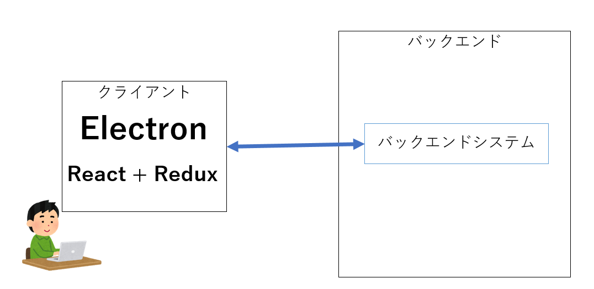
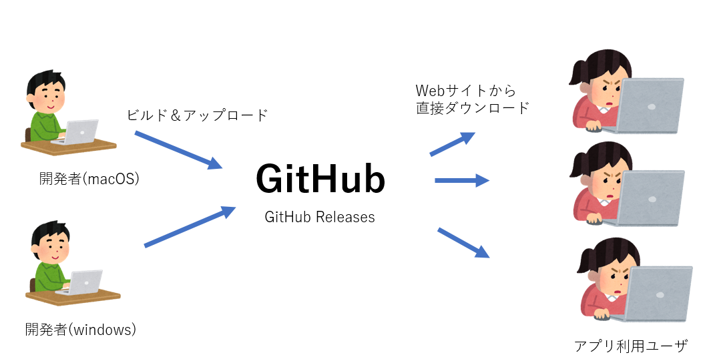
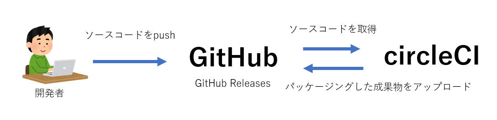
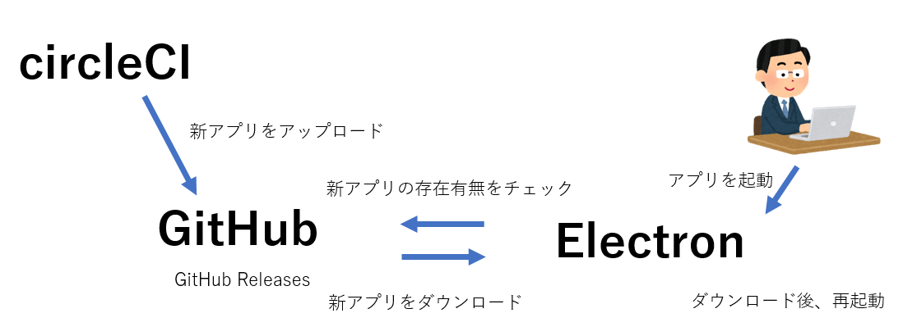

# 継続的に価値を届けるためのアプリケーションパッケージング・アップデート自動化事例

- [継続的に価値を届けるためのアプリケーションパッケージング・アップデート自動化事例](#継続的に価値を届けるためのアプリケーションパッケージングアップデート自動化事例)
  - [はじめに](#はじめに)
  - [TL;DR](#tldr)
  - [背景](#背景)
    - [システム概要](#システム概要)
  - [当初の課題](#当初の課題)
    - [開発者の負荷](#開発者の負荷)
    - [アプリ利用ユーザ・サービス運用者の負荷](#アプリ利用ユーザサービス運用者の負荷)
    - [採用技術について](#採用技術について)
      - [GitHub](#github)
      - [CircleCI](#circleci)
  - [自動パッケージング](#自動パッケージング)
    - [システム構成](#システム構成)
    - [サンプルコード](#サンプルコード)
      - [使用するimageの準備](#使用するimageの準備)
      - [job定義](#job定義)
        - [macOSの場合](#macosの場合)
        - [Windowsの場合](#windowsの場合)
      - [workflow定義](#workflow定義)
    - [課題がどう解消されたか](#課題がどう解消されたか)
  - [自動アップデート](#自動アップデート)
    - [システム構成](#システム構成-1)
    - [サンプルコード](#サンプルコード-1)
    - [課題がどう解消されたか](#課題がどう解消されたか-1)
  - [まとめ](#まとめ)

## はじめに

サービスを提供するにあたり、魅力的な機能・体験を継続的にユーザの元に届けることは非常に重要です。

ユーザから得たフィードバックをもとにアプリケーションを改善することで、日々生まれるユーザのニーズに応え続けることができます。逆に言えば、そのような進化をしないサービスからは、いつしかユーザは離れていきます。だからこそ、アプリケーションを改善し続け、それをユーザに届け続けなければなりません。

私達のプロジェクトでは、マルチプラットフォームに対応したデスクトップアプリケーションを通してユーザへサービスを提供しており、頻繁にバージョンアップを行っていました。しかし、新しい機能を提供する度にユーザ側・開発者側の双方で煩雑な作業が必要になっており、このことが継続的な価値提供を行う上での大きな障壁でした。

このドキュメントは、この課題を解決するために行ったアプリケーションのパッケージング・アップデートの自動化事例となります。
(なお、本事例で紹介させていただいた内容はまだ開発中のものですが、近い将来公開予定です)

## TL;DR

- CircleCIを用い、Electron製のデスクトップアプリケーションのパッケージングおよびGitHub Releasesへのアップロード作業を自動化した
- electron-builderのelectron-updaterを用い、アプリケーションのアップデートを自動化した
- アプリケーションのパッケージング、アップデートの自動化によって、以下の効果が得られた
  - アプリ利用ユーザがアプリケーションをバージョンアップさせる手間がなくなった
  - リリース担当者の複雑なリリース作業による負担が減り、属人化が排除された
  - 運用者がアプリ利用ユーザに対してアプリケーションのバージョンアップの報知をする必要がなくなった

## 背景
### システム概要

このドキュメントで対象となるシステム全体の構成イメージは以下になります。

ユーザにはデスクトップアプリケーションを配布する点が特徴的です。これは、ユーザのローカルPC側に極めて機密性の高いデータを保持し、かつ、それをバックエンドシステムに預けられないセキュリティ上の制約があるためです。



また、以下のような特徴もあります。

- Windows/macOS双方へデスクトップアプリケーションを提供する
  - クロスプラットフォームのデスクトップアプリケーションが開発できる [Electron](https://electronjs.org/) を採用
- ユーザーには常に新しいアプリケーションを利用してもらう必要がある

## 当初の課題

デスクトップアプリケーションの機能追加・修正を行った場合、利用ユーザーに新しいバージョンをダウンロード・インストールしてもらう必要があります。当初、アプリ利用ユーザーに対し新しいアプリケーションを届けるには、以下の流れになっていました。



1. 開発者(Windows、macOSで二名)がデスクトップアプリケーションをパッケージング
2. 開発者がパッケージングした成果物をGitHub Releasesへアップロード
3. アプリ利用者がGitHub Releasesのサイトへ直接アクセスし、パッケージングした成果物のダウンロード・インストールを行う

### 開発者の負荷

開発者がアプリケーションをパッケージングするには、普段開発を行っている端末で実施する必要があり、以下のような課題を抱えていました。

- パッケージング手順が複雑であり、属人化していた
- 開発を行うブランチとパッケージングを行うブランチを行き来する必要がある
- アプリケーションのパッケージングに時間がかかるため、その間作業者が本来担当していた開発タスクが止まってしまう
- 個々のサポートOSに対応したパッケージング用マシンを用意する必要がある
  - とくにWindowsについては、開発チーム内でWindows端末を所持している人数が少ないため、Windows端末を使用しているメンバーへ負荷が集中する

そして、実際に以下のような作業ミスも発生していました。

- 特定の手順を飛ばしてしまう
- 依存するライブラリのバージョンが古いままパッケージングしてしまう
- 開発用の設定(ホットリロード等)のままパッケージングしてしまう

### アプリ利用ユーザ・サービス運用者の負荷

また、アプリ利用ユーザーに向けてパッケージングした成果物をアップロードする際も、以下のような作業が発生していました。

- 運用者が逐一アプリ利用ユーザーに連絡(電話・メール)してダウンロード・インストール作業を促す
- アプリ利用ユーザーはアプリケーションのリリースのたびにGitHub Releasesのサイトにアクセスしてダウンロード・インストール作業を行う

以上のような課題が、継続的ユーザに価値提供を行ううえでの障壁となり、アプリケーションの価値を高める妨げになっていました。

### 採用技術について

これら課題の解決方法を説明する前提となるため、ここで簡単にプロジェクトで用いていた採用技術について触れておきます。

#### GitHub
ソースコード管理サービスとしてGitHubを採用しました。
GitHubの [Release機能](https://help.github.com/ja/github/administering-a-repository/creating-releases) を利用し、デスクトップアプリケーションを配置しています。

#### CircleCI
CI/CDツールとして、CircleCIを採用しました。
(CIツールとしての活用については本記事の趣旨から外れるため割愛します。)
本事例では、Electron製デスクトップアプリケーションのパッケージング、アップロードの自動化のために利用しています。

## 自動パッケージング
複雑なパッケージング手順によりアプリケーションのパッケージング作業が属人化するとともに、作業自体にもミスが頻出していた問題を解消するため、CircleCIでの自動パッケージングを行うことにしました。
CircleCIではDocker imageの指定によりmacOS用、Windows用のコンテナが使用できるため、個々のサポートOSに対応したパッケージング用マシンを用意する必要もなくなります。
また、誤ってリリースされてしまわないようにデプロイの前に承認操作を待つ設定にしました。

### システム構成


### サンプルコード
実際のCircleCIの設定ファイルを元に、アプリケーションのパッケージング、GitHub Releasesへのアップロードを行っている部分について説明します。

このサンプルコードでは、GitHub Releasesへのアップロードに[ghr](https://github.com/tcnksm/ghr)を使用しています。
GitHub ReleasesへアップロードするためにCircleCIの環境変数にGitHubのAPI Tokenを設定しています。

#### 使用するimageの準備
パッケージングで使用するコンテナのイメージを定義します。
普段の自動テストや静的コード解析の実行に使用するCircleCIのimageの他に、パッケージング用にmacOSとWindowsのimageを定義しています。

```yaml
executors:
  default:
    working_directory: ~/app
    docker:
      - image: circleci/node:12.4.0
  mac:
    working_directory: ~/app
    macos:
      xcode: "10.2.0"

orbs:
  win: circleci/windows@1.0.0
```

#### job定義
macOS、Windowsそれぞれでパッケージングとアップロードを行うjobを定義します。

##### macOSの場合
パッケージングを行うnpmスクリプトを実行すると、`dist/`ディレクトリ配下にdmg形式のインストーラが作成されます。
ghrを使用して、このインストーラをGitHub Releasesへアップロードしています。

```yaml
jobs:
# 中略
  packaging_on_mac:
    executor: mac # 実行イメージにmacOSを指定
    steps:
      # ソースコードの取得
      - checkout
      # GitHub Releasesへのアップロードに使用するツールの取得
      - run:
          name: "Install go tools"
          command: brew install ghr
      # node.jsのインストール
      - install_node_mac
      # yarn install を実行してnode_modulesのインストール
      - install_node_modules_mac
      # electronアプリケーションのパッケージング
      - run:
          name: build app
          # package.jsonに定義したelectronのアプリケーションをパッケージングするnpmスクリプトを実行する
          command: yarn electron_build
      # パッケージングした成果物をGitHub Releasesにアップロードする
      - run:
          name: "Publish Release on GitHub"
          command: |
            APP_VERSION=$(yarn --silent appVersion) # GitHubのtagとcommit hashを取得するnpmスクリプトの実行
            cd dist
            zip -9 ./Application-${APP_VERSION}.zip ./Application-${APP_VERSION}.dmg
            ghr -t ${GITHUB_TOKEN} -u ${CIRCLE_PROJECT_USERNAME} -r ${CIRCLE_PROJECT_REPONAME} -c ${CIRCLE_SHA1} -replace ${APP_VERSION} ./Application-${APP_VERSION}.zip
```

##### Windowsの場合
パッケージングを行うnpmスクリプトを実行すると、`dist/`ディレクトリ配下にexe形式のファイルが作成されます。
パッケージングした後は、macOSの時と同様にghrを使用してGitHub Releasesに成果物をアップロードしています。

```yaml
jobs:
# 中略
  packaging_on_win:
    executor:
      name: win/vs2019 # 実行イメージにwindowsを指定
      shell: bash.exe
    steps:
      # ソースコードの取得
      - checkout
      # GitHub Releasesへのアップロードに使用するツールの取得
      - run:
          name: "Install go tools"
          command: go get -u github.com/tcnksm/ghr
      # node.jsのインストール
      - install_node_win
      # yarn install を実行してnode_modulesのインストール
      - install_node_modules_win
      # electronアプリケーションのパッケージング
      - run:
          name: build app
          # package.jsonに定義したelectronのアプリケーションをパッケージングするnpmスクリプトを実行する
          command: yarn electron_build
      - run:
          name: "Publish Release on GitHub"
          command: |
            APP_VERSION=$(yarn --silent appVersion) # GitHubのtagとcommit hashを取得するscript
            cd dist
            zip -9 ./Application.Setup.${APP_VERSION}.zip ./Application*.exe
            ghr -t ${GITHUB_TOKEN} -u ${CIRCLE_PROJECT_USERNAME} -r ${CIRCLE_PROJECT_REPONAME} -c ${CIRCLE_SHA1} -replace ${APP_VERSION} ./Application.Setup.${APP_VERSION}.zip
```

#### workflow定義
最後にworkflowの定義です。パッケージングのジョブはリリース時にのみ動作させたいので、filtersに `master` ブランチを指定しています。
また、 手動での承認操作を必要とする `hold` ジョブを定義し、パッケージングするジョブを `hold` ジョブが終了してから実行するように設定しています。
これにより、 `master` ブランチへマージ後すぐに成果物がアップロードされることを防ぎ、任意のタイミングでアップロードできるようになります。

```yaml
workflows:
  version: 2
  build_and_test:
    jobs:
      # 中略
      - packaging_on_mac:
          requires:
            - hold # holdジョブが完了してから実行される
          filters:
            branches:
              only: master # masterブランチの時のみ実行される
      - packaging_on_win:
          requires:
            - hold # holdジョブが完了してから実行される
          filters:
            branches:
              only: master # masterブランチの時のみ実行される
      - hold:
          type: approval # 後続のジョブに進むために手動の承認操作が必要になる
          filters:
            branches:
              only: master
```

新しい機能がmasterブランチへマージされる毎にCircleCIのworkflowが実行されます。その後、パッケージングのジョブが実行される直前に、手動での承認が要求されます。CircleCIのコンソールでジョブの続行を承認することでパッケージングのジョブが実行され、GitHub Releasesに成果物がアップロードされます。

### 課題がどう解消されたか

ここまでで述べた自動パッケージングにより、課題であったパッケージング手順の煩雑さがコードとして表現されるようになり、それによって属人化していた問題も解消されました。
また、CircleCIのみで各OS用のアプリケーションパッケージングが完結するため、ビルド用のマシンを用意する必要がなくなりました。

これにより、開発者が潜在的に持っていた「パッケージング」に対する抵抗感がなくなり、新機能が入ったアプリケーションへのアップデート準備が継続的に行えるようになりました。


## 自動アップデート

新しいバージョンのアプリケーションをリリースする際、以下作業が発生しており、新しい機能を提供するための障壁となっていました。

1. 運用者はアプリ利用ユーザへ新しいリリースがあることを報知する
1. 連絡を受けたアプリ利用ユーザはアプリケーションをインターネットからダウンロード、インストールする

このような障壁をなくすため、私達のプロジェクトでは、アプリケーション起動時に以下の処理を挟むことにしました。

1. 新しいバージョンの有無チェック
1. 新しいバージョンがあるのであれば、当該バージョンのダウンロード・インストール

この機能の実現のために、[electron-builder](https://github.com/electron-userland/electron-builder)の[electron-updater](https://www.electron.build/auto-update)を利用しました。
electron-updaterは、バージョンチェックやダウンロード等の機能を提供しており、簡単に自動アップデート機能を実装できます。

ただし、以下に注意が必要です。  (以下仕様はelectron-builder v21.2.0のものになります。最新情報は公式ドキュメントを参照してください。)
- macOS用のアプリケーションの場合に署名を行う必要がある
- macOS:DMG、Windows: NSISのみをサポート

### システム構成


新しいアプリケーションをリリースし、アプリ利用ユーザーに利用していただく際の流れは以下の通りです。2～6までの間にユーザー側で実施する必要があるのは、ボタンをクリックすることのみです。

1. 管理者がGitHubへ新しいアプリケーションをリリース
2. アプリ利用ユーザーが旧アプリを起動
3. アプリケーションのバックグラウンドにてバージョンチェックを実施
4. 新しいバージョンのアプリケーションが存在する場合、ダウンロードを開始
5. ダウンロード完了後、アプリケーションを再起動
6. 新アプリの状態となる


### サンプルコード

以下は、すでにElectronのデスクトップアプリケーションが実装されていることを前提として、自動アップデートの機能を追加するために必要な修正の例です。

* Electronの依存ライブラリにelectron-updaterを追加

```bash
$ yarn add electron-updater
```

* package.jsonにGitHubのリポジトリ情報を追加

```json
"build": {
    "publish": [
      {
        "provider": "github",
        "owner": "owner name",
        "repo": "repository name"
      }
    ]
  },
```


* mainプロセスに以下のような実装を追加する

```javascript
autoUpdater.on('checking-for-update', () => {
    // 新しいバージョンのアプリケーションが存在していた場合、ここの処理が呼ばれる
    // 実装は必須ではなく、主にログ出力のために利用
})

app.on('ready', () => {
  autoUpdater.checkForUpdatesAndNotify(); // 更新があるかどうかをサーバに尋ね、ダウンロードし、更新が利用可能かどうかを通知する
  mainWindow = createMainWindow()
})
```

アプリ利用ユーザがアプリケーションを起動するだけで、[システム構成](#システム構成-1)に記載した動作となり、
煩雑なダウンロード・インストール操作をすることなく、ボタンを押すだけで新しい機能が利用できるようになりました。

### 課題がどう解消されたか

この自動アップデートの仕組みを整えることで、まず、運用者が新しいバージョンの存在をユーザに通知する必要がなくなりました。アプリ利用ユーザがアプリケーションを立ち上げてくれさえすれば、自動的に新しいバージョンの取得が行われます。
もともと、運用者はユーザそれぞれに対してメールで通知を行う必要があったため、これは大きな作業負荷に繋がります。

また、ユーザにとっては手動による新しいアプリケーションのダウンロード・インストール作業の手間がなくなり、UXが向上します。これにより、ユーザのバージョンアップに対する障壁を著しく下げることができ、サービス提供側としても新しい価値を届けられる可能性が格段にあがると考えています。

## まとめ

本コンテンツでは、デスクトップアプリケーションのパッケージング・アップデートの自動化の事例について説明しました。
今回説明したとおり、パッケージング、アップデートそれぞれの自動化をすることで以下のような効果が得られました。

* アプリ利用ユーザがアプリケーションをバージョンアップさせる手間がなくなり、UXが向上する
* パッケージングだけで1回あたり半日程度かかっていたリリース担当者の複雑なリリース作業による負担がほぼゼロになり、かつ、属人化が排除される
* バージョンアップ時に、運用者がアプリ利用ユーザに対して新バージョンを報知をする必要がなくなる

本事例で採用した自動パッケージング・自動アップデートの仕組みづくりには実質2週間もかかっておらず、そのコストは上記の効果によって容易にペイできるものでした。また、これにより新しい機能をユーザに届ける際の敷居が格段に下がり、新しい価値をよりユーザに届けやすくなったと感じています。

今回私達のプロジェクトで実施した具体的な取り組みは、パッケージング・アップデートの自動化でしたが、継続的に価値を提供するために必要なことはこれだけではありません。たとえば、以下のようなことが挙げられます。

* 細かなサイクルでリリースを回すために、十二分な自動テストで品質を担保するようにする
* 今後の改善につなげるためのユーザの利用状況、フィードバックを集める仕組みの構築

冒頭で述べたとおり、魅力的な機能・体験を継続的にユーザの元に届けることは非常に重要です。
今後もそのために必要な知識・技術を身につけ、実践することで、よりよいサービスをユーザに提供していきたいと考えています。
