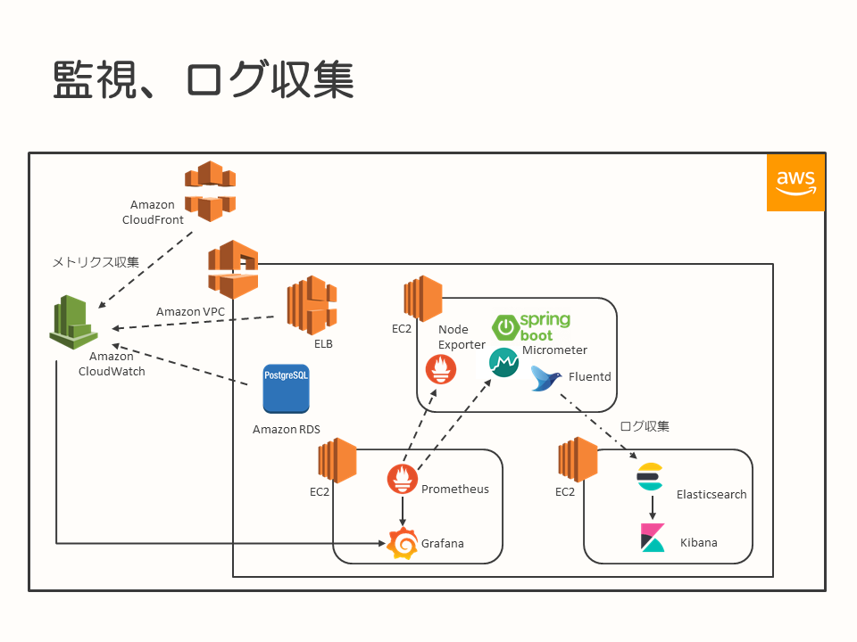

# フルスタックエンジニア育成に関する取り組み

* [はじめに](#introduction)
* [TL;DR](#tldr)
* [背景](#background)
* [フルスタックエンジニアと技術領域](#full-stack-engineer)
* [教育内容](#education-content)
  * [実装済みのアプリケーションをAWSにデプロイし、公開するまでの実践](#deploy)
  * [AWSの開発者用サービスを利用し、CI/CDの基礎を学習](#cicd)
  * [モニタリング、可視化などの実践](#monitoring)
* [まとめ](#summary)

## <a name="introduction">はじめに</a>

このドキュメントは、社内におけるフルスタックエンジニアを育成するための取り組み（施策）をまとめたものです。今後、エンジニアを育成する際の、参考情報となることを目的としています。

育成のターゲットとしているエンジニアとしては、業界に入って数年目程度で、これから基礎力を向上させていくような層を対象にしています。育成にあたっての環境は、Amazon Web Services（AWS）を利用しました。

なお、このドキュメントで記載している教育内容は、ドキュメント執筆時点でも日々ブラッシュアップ中であり、今後内容の見直し、変更は適宜発生していくことが考えられます。あくまで記載時点の取り組み内容ではありますので、その点に留意の上、参照いただければと思います。

## <a name="tldr">TL;DR</a>

このドキュメントでは、実践した以下の教育内容を記載しています。

- 実装済みのアプリケーションを、AWS環境上に展開
  * VPCを作成し、EC2のセットアップやネットワーク関連の設定を実施
  * AWS上で稼働させたアプリケーションを、インターネットを介して参照できるようになるまでを実践
* AWSの開発者用サービスを利用し、CI/CDの基礎を学習
* モニタリング、可視化などの実践
  * アプリケーションやAWSのサービスの各種メトリクスを収集し、モニタリング、可視化
  * ログ収集と可視化

## <a name="background">背景</a>

近年の開発では、開発のリードタイムを短縮し、改善の速度をあげていくことが求められるようになっています。開発自体も自社で行い、自分たちでサービスを立ち上げ、事業を創出していくことが行われるようになっています。

このような情勢の中で、変化の速い事業環境に対応し、サービス開発に求められるスキルを持った、エンジニアの育成が必要になってきました。

本ドキュメントで記載した施策では、このような状況に対応すべく、将来的なハイレベルなエンジニアを育成するためにエンジニアの育成に取り組むことを決めました。

## <a name="full-stack-engineer">フルスタックエンジニアと技術領域</a>

この施策では、フルスタックエンジニアがカバーする技術領域を以下のように定めました。

* サーバーアプリケーション
* Webフロントエンド
* モバイル
* 開発プロセス
  * 開発の進め方（スクラムなど）
  * 構成管理
  * デプロイ、テスト戦略
* DB
  * クラウド環境上のサービス利用前提
* インフラ
  * クラウド環境上のサービス利用前提

Webアプリケーションからモバイルアプリケーションの設計、実装ができることや、クラウド環境の利用ができることを前提に、適切なクラウドサービスを利用し、サービスを開発、リリースできるエンジニアをこの施策では「フルスタックエンジニア」と呼んでいます。

教育時には、これらの領域を伸ばしていくことを意識して、学習に取り組みます。

## <a name="education-content">教育内容</a>

教育内容の概要は、以下になります。

* 実装済みのアプリケーションをAWSにデプロイし、公開するまでの実践
* AWSの開発者用サービスを利用し、CI/CDの基礎を学習
* モニタリング、可視化などの実践

以降は、こちらの内容を順次掘り下げていきます。

なお、この育成施策の実施は、以下のメンバーで行いました。

* 育成対象者 … 3人
  * Aさん … Webアプリケーションの開発経験があり、構成管理なども行ってきているがインフラ的な経験はない
  * Bさん … Webアプリケーションの開発経験があり、構成管理なども行ってきているがインフラ的な経験はない
  * Cさん … 実際のプロジェクトでの開発経験はないが、インフラ面での知識、スキルに優れる
* チューター … 1名

育成対象者には、ある程度アプリケーション開発に関するスキルを保持しているメンバーが多く、またいずれのメンバーも実際に本番稼働しているシステムを運用したことがありません。このため、インフラ面や運用面での観点を教育の中心に置いています。

教育は、チューターによる説明などは育成対象者3名に対して行いますが、学習自体は育成対象者が各個人でそれぞれ実践します。

### <a name="deploy">実装済みのアプリケーションをAWSにデプロイし、公開するまでの実践</a>

この教育内容では、事前にSPA＋REST APIとして実装されたアプリケーションを、AWS上にデプロイし、教育を行っている社内からインターネット経由で参照できるようになるまでを実践します。

> 作成済みのアプリケーションとガイドについては、以下を使用しました。
> - [サンプルアプリケーション"kanade"](training-application/README.md)
> - [AWSでのアプリケーション・環境構築トライアル](training-application/training-text.md)

ここでは、主に以下の内容を、自分で環境を作りながら実践します。

* Amazon VPC内のネットワーク設定
  * ルーティング設定（VPC間、インターネットへのアウトバウンド）
  * 通信可能なプロトコルと方向を整理し、適切なネットワーク制限を課す
    * セキュリティグループ
    * ネットワークACL
* クラウドサービスの利用
  * Amazon EC2のインスタンス起動、OSのセットアップ
    * Linuxの基礎的なコマンドの学習、パッケージインストールなど
  * Amazon RDSを使ったデータベースサービスの利用
  * ELBによるロードバランサーの利用
  * Amazon S3を使ったストレージサービスの利用
  * Amazon CloudFrontによるCDNの利用
  * AWS WAFによるアクセス制御
  * Amazon Route 53を使ったDNS設定とサービス公開

> 補足：
> 
> 事前に構築されたアプリケーションは、SPAの部分はReact/Redux、REST APIの部分はSpring Bootを使用して構築されています

また、社内で育成を実施している関係上、育成対象者のPCからインターネットを介してアプリケーションサーバーにアクセスするためには、社内のプロキシサーバーを経由する必要があります。

社内の関係者外からのアクセスを避けるため、WAFを導入しアクセス制限を行っています。

この環境自体は、育成対象者各自で構築します。今回の育成では対象者が3人いますので、VPCを育成対象者毎にひとつずつ、計3つ作成しその中で環境構築の実施を行いました。

育成対象者が各自のVPCにアクセスするには、1度共通のVPCに構築したbastionを経由してアクセスする経路としています。

この施策の実施の際に、育成対象者となったメンバーはアプリケーションの設計、実装にスキルが強く寄っていました。

この育成内容では、VPC内の要素をひとつひとつ育成対象者自身の手で設定、実践しています。これにより、ルーティングや通信許可、DNSを使用してサービスを参照可能にするといった作業・設定を行うことで、これまであやふやだったネットワークに関する知識の整理や基本的なスキルの向上ができたことを、育成対象者の声としても得られています。

また、今回の内容ではELBの配下にはひとつのEC2インスタンスしか配置していないのですが、ロードバランサーを使用することにより構成に冗長性を持たせ、可用性の向上や負荷分散に利用できることなどをチューターより知識として伝えています。

### <a name="cicd">AWSの開発者用サービスを利用し、CI/CDの基礎を学習</a>

この教育内容では、事前にSPA＋REST APIとして実装され、AWS上にデプロイされたアプリケーションを、AWSのサービスを使用してビルドからデプロイまで自動化することを実践します。

ここでは、主に以下の内容を行います。

* 構成管理
  * AWS CodeCommitを使用したソースコード管理
* ビルド・デプロイ
  * AWS CodeCommitからソースコードを取得し、AWS CodeBuildを使ってのビルド
  * AWS CodeBuildを使用したビルド結果を、AWS CodeDeployを使用してEC2へ反映
    * フロントエンドについては、今回は簡易的にAWS CodeBuildがS3に配置した結果をそのまま利用
* ビルドからデプロイまでの一連の流れを、AWS CodePipelineを使用してパイプライン化

この前段のAWS上にアプリケーションをデプロイするというテーマでは、アプリケーションのビルドおよびデプロイは手動で行っていました。このテーマでは、リポジトリにコミットされたアプリケーションのソースコードをビルドし、デプロイするところまでを自動化します。

EC2上で動作しているアプリケーションのデプロイを自動化するにあたり、準備としてアプリケーションをLinuxの`systemd`によるサービス化を行い、起動停止を容易にするとともに、OSのサービスとして組み込むことでOSの起動時に自動起動できるといった利点を押さえてもらいました。

そのうえで、EC2へデプロイするジョブ設定を行い、最初は設定の手間はかかるものの、仕組みを構築できてしまえば以後はソースコードの変更からデプロイまでの手間が大きく軽減されることを体験してもらいました。

また、その他にチューターからは以下の内容を伝えました。

実際にサービスを開発し、運用していくことを想定すると、今後このような修正→テスト→デプロイという流れは継続的に発生する出来事になります。

最初に、CI/CDの仕組みとそのフローを作り上げる手間はかかるかもしれません。しかし、開発を続けていくとCI/CDの仕組みがあることにより、ビルドやデプロイの作業の手間を削減できる方がずっとメリットの方が大きくなり、本来注力したい開発に時間を使えるようになります。

自動化されているとはいえ、デプロイ時にサービスを稼働させているプロセスが全部ダウンしてしまっては障害となってしまうので、ロードバランサーの背後のサーバーを本来は複数配置し、切り替えながらデプロイしていく必要がある（もしくは注意する観点である）といった内容を育成対象者に話しています。

### <a name="monitoring">モニタリング、可視化などの実践</a>

この教育内容では、事前にSPA＋REST APIとして実装されAWS上にデプロイされたアプリケーションや、利用しているAWSのサービスからメトリクスを収集し、モニタリングや監視の実践を行います。また、アプリケーションが出力するログを収集することで、ログの可視化も実践します。

ここでは、主に以下の内容を行います。

* メトリクス収集
  * REST APIおよび、REST APIが動作するEC2のメトリクスの収集に、Prometheusを利用
  * REST API（Spring Bootを使用）に、Micrometerを組み込み、Prometheus向けにアプリケーションのメトリクスをエクスポートする
  * 同じく、REST APIが稼働しているEC2に、PrometheusのNode Exporterを導入し、OSのメトリクスをエクスポート
  * ELBやCloudFront等のAWSのサービスについては、Amazon CloudWatchで情報を収集
* メトリクスの可視化・モニタリング、監視
  * モニタリング対象のデータの収集箇所がPrometheusとAmazon CloudWatchの2つに分かれるが、Grafanaでこれらをデータソースにして参照
  * Grafana上でダッシュボードを作成し、収集したメトリクスを可視化
  * 閾値を設定し、設定を超えた場合はアラートを通知するようにGrafanaに設定
* ログ収集と可視化
  * REST APIが出力するログの対象に、アクセスログを追加
  * REST APIが出力するアクセスログを、Fluentdを使用して書き込まれたログを読み込み続け、読み込んだログをElasticsearchに送信
  * Elasticsearchに蓄積されたログデータを、Kibanaで表示

それぞれ、導入したツールやサービスを用いて、収集したメトリクスを可視化、監視する、ログを収集して可視化するところを各自で実践してもらいました。

育成対象者となったメンバーたちには、システムを本番環境で運用した経験がないため、なぜモニタリングや監視が必要なのか？ログの可視化、分析を行った方が良いのか？ということを伝える必要がありました。

開発したシステムやサービスは、リリースしたら完了ではなく、健全に稼働しているか、変化の兆候などはないかを確認し続ける必要があります。このため、サービスを構成するアプリケーションなどの情報（たとえばメモリ使用量、スレッド数、レスポンス時間など）を収集し、可視化することで変化に気づく、監視してアラートを通知することで変化や異常な事態に気づく契機を得ることができます。

また、サービスを運用していると、稼働しているサービスがどのような使われ方をしているか、改善などを行った場合に効果があったかどうかを計測して次の改善につなげていくための活動が必要となります。この一環として、ログ収集を行い、アプリケーションの利用状況を可視化するということを例として示しました。ログは、単に収集すればよいというだけではなく、分析を行うにあたって必要な情報が記録されていなければなりません。たとえば、アクセスされたURLやユーザーに関する情報、発生したイベントなど、分析に必要となる情報をあらかじめ設計し、記録していることも重要です。

## <a name="summary">まとめ</a>

今回の育成施策では、AWSのサービスを利用して環境を作成することでインフラ寄りの知識を高めることができ、CI/CDの仕組みやモニタリング、監視などの仕組みを構築することで継続的にサービスを開発、改善していくための知識を得たり、体験したりすることができました。

教育を行った結果として、もちろん自分たちの手で設定、構築などをした部分については直接の知識として得られたものが多数あり、基礎スキルの向上ができています。

その一方で育成対象者となったメンバーたちは、アプリケーションの設計・実装経験のみだったり、開発経験自体がなかったりという経歴の持ち主たちでした。このため、AWSのサービスを利用しているとはいえ初めて行うネットワークに関する設定で苦戦する、モニタリングや監視などで使うソフトウェアの特性、使い方などを把握するのに苦労している面も見られました。また、サービスを実際に開発してリリース、運用を行うことを考えると、この育成施策はアプリケーションの実装以外にも多くの分野で考慮しなくてはいけないこと、学ばなければならないことがあることを知るきっかけにもなりました。

実際、育成期間の終了時に対象のメンバーからヒアリングした結果としても、そのような声が得られています。

今後については、教育内容を見直しつつ質を高めていくことと、今回実施できなかったアプリケーション面（サーバーサイド、Webフロントエンド、モバイル）でのスキルアップに関する教育コンテンツを検討していく予定です。

フルスタックエンジニア、と呼ばれるような人材は、そうそういるものではありませんし、短期間で育成することができるようなものでもありません。また、本人にも継続して学習し続けられるような資質も求められます。

ですが、これから成長していくエンジニアたちに、まだ知らない学ぶべき分野がたくさんあることや、育成期間を設けてスキルアップを行い学ぶことの楽しさを実感してもらう。このような取り組みを行うことで、今後のエンジニアの裾野を広げられればよいと考えています。

このような取り組みを行おうとしている方々へ、本ドキュメントが参考となれば幸いです。
