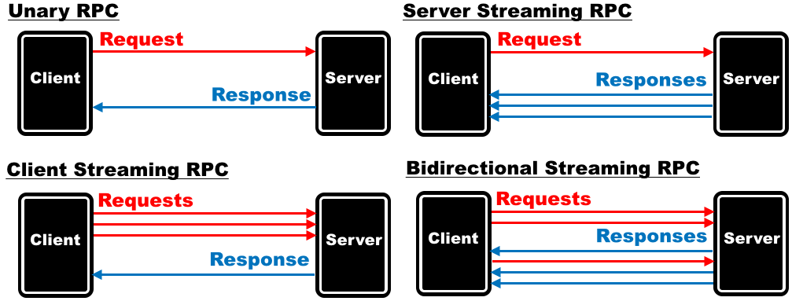
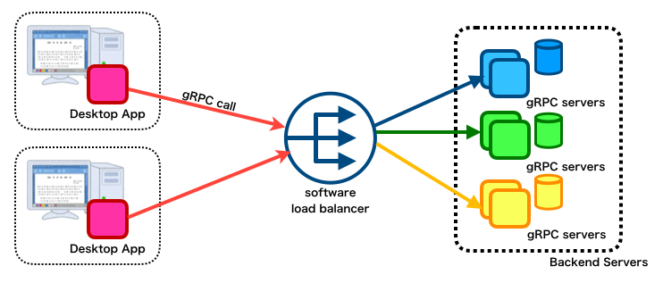
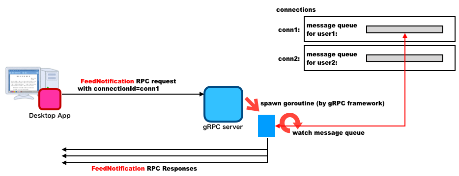

# gRPCのServer-Streaming RPCを用いたPUSH通知の実現事例

- [はじめに](#はじめに)
- [TL;DR](#tldr)
- [アプリケーションの特徴](#アプリケーションの特徴)
- [なぜ gRPC を選択したのか](#なぜ-grpc-を選択したのか)
    - [gRPC の概要](#grpc-の概要)
    - [RPC を選択した理由](#rpc-を選択した理由)
- [アーキテクチャ](#アーキテクチャ)
    - [PUSH 通知の仕組み](#push-通知の仕組み)
    - [Protocol Buffer 定義](#protocol-buffer-定義)
    - [バックエンドサーバの実装例](#バックエンドサーバの実装例)
    - [デスクトップアプリケーションの実装例](#デスクトップアプリケーションの実装例)
- [HTTP/2 コネクションの維持](#http2-コネクションの維持)
    - [クライアントサイドでの keepalive の有効化](#クライアントサイドでの-keepalive-の有効化)
    - [サーバサイドでの keepalive の有効化](#サーバサイドでの-keepalive-の有効化)
- [苦労した点](#苦労した点)
- [残課題と今後のポイント](#残課題と今後のポイント)
- [参考文献](#参考文献)

<!-- /TOC -->

# はじめに
このドキュメントは、gRPCを用いてサーバからクライアントへのPUSH通知を実現した事例をまとめたものです。

ここでいう PUSH 通知とは、通常のクライアントからサーバへのリクエストではなく、何かしらの契機によりサーバからクライアントへ送信される通知を指します。
例えばチャットツールでよくあるように、誰かのメッセージが入力されたらチャット参加者全員に通知されるというものです。

gRPCを利用してみた事例は現時点でも多く存在しますが、サーバ側からの通知の実現方法を述べた情報は調べた限りでは多くありませんでした。
本ドキュメントは、gRPC での PUSH 通知をどのように実装するのか？、そして、その時の課題にどのようなことがあるのか？という情報を提供することを目的としています。

# TL;DR

- サーバからの PUSH 通知を、gRPC の `Server Streaming RPC` という通信方法を用いて実現しました。
- サーバからの通知の待ち受けで TCP Connection の長時間の維持が必要となるため、gRPCの `client-side keepalive` 機能を使用しました

# アプリケーションの特徴

ターゲットとなるシステムは、Electron 上で動作するデスクトップアプリケーション(Node.js)と、バックエンドの RPC サーバ (golang)から構成されるトレーディングシステムです。このシステムには、以下のようないくつかの特徴がありました。

1. バックエンドの RPC サーバからデスクトップアプリケーションへの処理要求が存在する
   - 通常のサーバ・クライアント型アーキテクチャにおいては、クライアントはサーバへ処理を要求するのみで、サーバがクライアントに対して処理要求を行うことはありません。しかし、本システムにおいては、バックエンドの RPC サーバからデスクトップアプリケーションに対して処理要求を行う必要がありました。
2. リアルタイムに変化するトレード状況をすばやくユーザに通知する必要がある
    - デスクトップアプリケーション UI 上で表現されるのは、ユーザ自身による注文や成約といったアクティビティに留まりません。システムを利用する他ユーザのアクティビティや、注文の状態遷移等も UI 上で「リアルタイム」に表現される必要があります。
3. 多数・多量のデータがやり取りされる
    - デスクトップアプリケーション・RPC サーバ間でやり取りする通信回数もデータ量も多くなることは不可避でした。また、それらに対して型定義をしておきたいという希望もありました。

特に課題として考えられたのが、バックエンドサーバからデスクトップアプリケーションへ、通常のクライアント・サーバモデルとは逆方向の通信が必要なことでした。

# なぜ gRPC を選択したのか

上記の特徴を踏まえた選択肢としては、Polling や Comet (Long Polling)、WebSocket といった選択肢も存在しました。このため、gRPC での PUSH 通知の実現方法の前に、gRPC の概要、および、なぜ我々が gRPC を選択したのかを簡単にまとめておきます。

## gRPC の概要

gRPC は、HTTP/2 の上で動作する RPC フレームワークです。HTTP/2 の特徴である

1. バイナリフレームによる効率的で高速な通信
2. 1つの TCP コネクション上で通信を同時並列化可能

はそのままに、Protocol Buffers による言語非依存の IDL・スキーマ定義が可能です。

gRPC には以下の 4 つの通信方法があり、リクエスト・レスポンスが 1:1 になる通信だけでなく、Streaming 通信もサポートしています。   

1. Unary RPC
2. Server streaming RPC
3. Client Streaming RPC
4. Bidirectional Streaming RPC



Unary RPC は、1 リクエストに対して 1 レスポンスが返却されるというモデルで、HTTP/1.1 の上で作成される従来の API のほとんどはこちらに対応します。

Server Streaming RPC は、1 リクエストに対してレスポンスを複数返却できる (言い換えると、レスポンスの stream が返却される) というモデルです。これはサーバ側からの　PUSH 通知に利用できます。

Client Streaming RPC はその逆で、クライアントがリクエストを複数 (言い換えると、リクエストの stream を) 送信し、それに対してサーバがレスポンスを 1 つ返却するというモデルになります。大量のデータの分割アップロードなどに使用できます。

そして bidirectional streaming RPC は、クライアントもサーバも、リクエスト・レスポンスを任意の順序で送信し合えるというモデルになります。複数のリクエストと複数のレスポンスを独立して（サーバもクライアントも待つことなく）送受信できます。

## RPC を選択した理由

前節で述べたようなアプリケーションの特徴をより効率的に実現できると考えたのが gRPC でした。以下に、その判断に至ったいくつかの理由を記載します。

1. デスクトップアプリケーションからバックエンドへの処理要求には Unary RPC を、バックエンドからデスクトップアプリケーションへの通知(PUSH 通知)には Server Streaming RPCを使えば、双方を gRPC という Framework で賄うことが可能であり、システムとしてシンプルです。
2. Server Streaming RPC を使えば、バックエンドサーバ側で認識できたアクティビティを、PUSH 通知としてリアルタイムにデスクトップアプリケーションに届けることが可能です。
3. Protocol Buffer を用いて型定義が可能で、サーバ・クライアント間の通信を型安全にすることができます。
4. 何よりこちらが大きかったのですが、今回のシステムにおいては、デスクトップアプリケーションからの RPC 呼び出しが頻繁に発生し、また、そのリクエスト・レスポンスに含まれるデータも大きくなることが想定されていました。 gRPC であれば、HTTP/2 の特徴を活かし、効率的・高速な連携が可能です。

# アーキテクチャ

ここでは、PUSH 通知の実現に焦点を合わせ、システムアーキテクチャを記述します。

ユーザが使用するのはデスクトップアプリケーションです。このデスクトップアプリケーションは、gRPC に対応したソフトウェアロードバランサ経由で、バックエンドの gRPC サーバに対して各種の RPC を発行します。



## PUSH 通知の仕組み

クライアントでサーバからの PUSH 通知を受ける処理は、以下のような流れで実現しています。

1. ユーザがデスクトップアプリケーションを用いてログイン認証を行う (クライアント側)
2. サーバはセッションを識別する一意な ID (プロジェクトでは、`connectionID` と呼んでいます）を発行する (サーバ側)
3. デスクトップアプリケーションはログイン成功後、connectionID を引数に `feedNotification` RPCを呼び出す（クライアント側）
4. サーバは、connectionID で識別される "コネクション" オブジェクトを作成し、そのメッセージキューを監視する goroutine を起動する
5. ユーザが取引開始、注文、成約などの操作を行い、デスクトップアプリケーションが対応する RPC を呼び出す（クライアント側）
6. サーバは、取引開始、注文、成約などの RPC で、ビジネスロジックを処理した後、"コネクション" のメッセージキューにメッセージを Put する（サーバ側）
7. 4 で作られた goroutine が、6 で Put されたメッセージを取り出し、デスクトップアプリケーションに送信する（サーバ側）
8. デスクトップアプリケーションは、`feedNotification` のレスポンスとしてメッセージを受け取り、対応する画面更新やデータ取得などの新たなイベントを発火させる（クライアント側）

「コネクション」は、メッセージキューを持つことと、`feedNotification` では、そのメッセージキューを監視する goroutine を作成することがポイントです。
また、クライアントは、 `feedNotification` を 1 回だけ呼べば十分で、それ以降はサーバからの PUSH 通知のレスポンスに応答するだけになっています。



コネクションは以下のように MessageQueue を保持する struct として定義されています。
例えば、gRPC サーバが

- 他ユーザがログインした
- 他ユーザとの Trade が成立した

といったアクティビティを検知すると、通知が必要なユーザに紐づくコネクションの MessageQueue に PUSH 通知のメッセージを enqueue するようになっています。

```go
type Connection struct {
  User          user                       // コネクションに紐づくユーザ。
  MessageQueue  chan backendServer.Message // メッセージキュー。
  Disconnect    chan bool                  // 切断用のキュー。
  watched       bool                       // 監視中か否か。
  lock          *sync.Mutex
}
```

先の `FeedNotification` RPC で起動された goroutine は、MessageQueue に enqueue が行われると、それをレスポンスとしてデスクトップアプリに返却します。これにより、バックエンドサーバはユーザに対し、任意のタイミングで PUSH 通知 (レスポンス) を送ることができるようになります。

それでは、以下で具体的な実装を紹介します。

## Protocol Buffer 定義

PUSH 通知を受け取るための Server Streaming RPC である `FeedNotificationStreaming` RPC の Protocol Buffer 上の定義は以下のようになります。

レスポンス (PUSH 通知) にはそれぞれ種別の定義を設けており、通知を受け取ったデスクトップアプリケーション側で、種別に応じた処理が行えるようにしています。

```proto
service BackendService {
  // PUSH 通知用の Server Streaming RPC。レスポンスとして PUSH 通知を受け取る。
  rpc FeedNotification (FeedNotificationRequest) returns (stream FeedNotificationResponse);
}

// PUSH 通知用のコネクションを確立するためのリクエスト。
message FeedNotificationRequest {
  string connectionId = 1;
}

// PUSH 通知を示すレスポンス。
message FeedNotificationResponse {
  string connectionId = 1;
  // PUSH 通知のメッセージ本体。
  Message message = 2;
}

// PUSH 通知を示す message。
message Message {
  // PUSH 通知の種別。
  enum MessageType {
    // 他ユーザがログインしたことを示す通知。
    OTHER_USER_LOGIN = 0;
    // トレードが成立したことを示す通知。
    TRADE_SUCCEEDS = 1;
  }
  // メッセージ種別。
  MessageType type = 1;
  // 個々の通知に依存するパラメータ。
  repeated string params = 2;
}
```

## バックエンドサーバの実装例

バックエンドサーバでは、当該の `FeedNotification` RPC が呼び出されると、呼び出し元のデスクトップアプリケーションを識別するための「Connection」オブジェクトを取得します。Connection オブジェクトでは、大まかに言うと以下の 2 つを管理しています。

- ユーザとの紐付け (どのユーザがどの Connection と紐付いているのか)
- デスクトップアプリケーションへの PUSH 通知をバッファリングするメッセージキュー

当該 RPC では、メッセージキューへのメッセージの enqueue を [`select`](https://gobyexample.com/select) で監視しており、enqueue されたメッセージを PUSH 通知としてデスクトップアプリケーションに送ります。

簡単に、PUSH 通知の実装の抜粋を以下に示します(エラー処理等は適宜省略し、実装のコアな部分だけを示しています)。
実装には無限ループが存在しており、本 Server Streaming RPC が呼び出される都度 goroutine が蓄積していきスケールしないようにも思われますが、goroutine は非常に軽量であり、この実装でも大きな問題にはなっていません。

```go
// FeedNotification は、PUSH 通知を受信するための Server Streaming RPC。
func (s *BackendServer) FeedNotification(
    req *backendServer.FeedNotificationRequest,
    stream backendServer.backendServerService_FeedNotificationServer) (err error) {
    // ConnectionID に紐づく Push 通知用コネクションを取得。
    connection, _ := s.GetConnection(req.ConnectionId)
loop:
    for {
        select {
        // PUSH 通知用 Connection に紐づく MessageQueue (channel) にメッセージが届いていれば、
        // それをデスクトップアプリに返却する。
        case message := <-connection.MessageQueue:
            _ := stream.Send(&backendServer.FeedNotificationResponse{
                ConnectionId:  req.ConnectionId,
                Message: message,
            })
        // コネクションが切断されていたらループを抜ける。
        case <-connection.Disconnect:
            break loop
        }
    }
    return nil
}
```

## デスクトップアプリケーションの実装例

一方のデスクトップアプリケーションでは、アプリケーション上でのログイン完了イベントを[redux-saga](https://redux-saga.js.org/) の `take` で待ち受け、当該イベントが到着したら `FeedNotification` RPC を呼び出すようにしています。

当該 RPC を呼び出した後は、RPC レスポンス(PUSH 通知)を待ち受けます。PUSH 通知を受け取ると、その種別に応じて新たなイベントを発火させる実装になっています。

簡単に、本処理の実装を以下に示します。

```javascript
import { call, put, take, select } from "redux-saga/effects"
import { eventChannel } from "redux-saga"

function* watchUserLogin() {
  while (true) {
    // ユーザのログイン成功イベントを待ち受け。
    const action = yield take(USER_LOGIN_SUCCESS_EVENT)

    // PUSH 通知用の Server Streaming RPC を呼び出し。
    const prom = yield call(backendApi.connectFeedNotification, generateConnectionID())
    const state = yield select()
    try {
      // push 通知を受け取るための eventChannel を作成。
      const channel = yield call(createEventChannel, prom, connectionId, state)
      while (true) {
        // eventChannel に到達した PUSH 通知に応じ、適切なイベントを発火。
        const newAction = yield take(channel)
        yield put(newAction)
      }
    } finally {
      // channel 切断時の処理。
    }
  }
}

function createEventChannel(prom, connectionId, state) {
  return eventChannel((emitter) => {
    prom.on("data", function (msg) {
      const { message: { type, params } } = msg
      // PUSH 通知の種別に応じ、適切な channel にルーティングする。
      switch (type) {
        case MESSAGE_TYPE.OTHER_USER_LOGIN:
          const userId = params[0]
          emitter(otherUserLoginStartEvent(userId))
          break
        case MESSAGE_TYPE.TRADE_SUCCEEDS:
          emitter(tradeSucceedsStartEvent(state.tradeId))
          break
        // snip
        default:
          Logger.error("not supported message: " + type)
      }
    })
    prom.on("error", function (error) {
        // エラー処理。
    })
    // snip
    const unsubscribe = () => {
        // snip
    }
    return unsubscribe
  })
}
```

あとは、PUSH 通知によって発火するイベントに応じ、UI コンポーネントの描画やサーバへの新たなリクエスト送信等、必要な処理を行うようになっています。

# HTTP/2 コネクションの維持

Server Streaming RPC のような long-lived なコネクションに依拠する場合、コネクションが idle になる時間が長くなると、間のネットワーク機器の idle timeout によって HTTP/2 コネクションが意図せず切断されるケースがあります。PUSH 通知用のServer Streaming RPC は HTTP/2 コネクションが確立し続けていることを前提にしているため、本プロジェクトにおいても、如何にして HTTP/2 コネクションを確立し続けるかが課題でした。

本プロジェクトでは、この課題について、 client side keepalive という機能を使うことで解決に取り組みました。client side keepalvie は以下で仕様化されている機能です。

- [Client-side Keepalive](https://github.com/grpc/proposal/blob/master/A8-client-side-keepalive.md)

一言でいうと、HTTP/2 の [`PING`](https://httpwg.org/specs/rfc7540.html#PING) フレームを定期的にコネクション上に送出し、それに対してサーバが `ACK` を返却することで、コネクション上にトラフィックを流し続ける機能です。そういう意味では、TCP にある keepalive と同様のものになります。

gRPC における client side keepalive 実現するためには、PING を送信するデスクトップアプリケーション側はもちろん、ACK を返信するバックエンドサーバ側でも対応が必要になります。

## クライアントサイドでの keepalive の有効化

今回クライアントとなるデスクトップアプリケーションは node.js で開発を行っており、[grpc](https://github.com/grpc/grpc-node) や [@grpc/proto-loader](https://www.npmjs.com/package/@grpc/proto-loader)モジュールを使用しています。2019/07 現在は詳細にドキュメンテーションされていないのですが、`grpc` モジュールを使用して gRPC client を構築する際、第三引数に keepalive の設定を渡すことで、client side keepalive を有効化できます。

```javascript
    const packageDefinition = protoLoader.loadSync(PROTO_PATH, {
        keepCase: false,
        longs: String,
        enums: String,
        defaults: true,
        oneofs: true
    })
    const bs = grpc.loadPackageDefinition(packageDefinition).BackendService
    const client = new bs(
        endpoint,
        grpc.credentials.createSsl(),
        {
          "grpc.keepalive_time_ms": settings.keepalive.timeMs,
          "grpc.keepalive_timeout_ms": settings.keepalive.timeoutMs,
          "grpc.http2.min_time_between_pings_ms": settings.keepalive.minTimeBetweenPingsMs,
          "grpc.http2.max_pings_without_data": settings.keepalive.maxPingsWithoutData,
        }
    )
```

上記で設定した `options` の内容は以下の通りです。

| 設定キー                               | 設定内容                                                                                                                                             |
| -------------------------------------- | ---------------------------------------------------------------------------------------------------------------------------------------------------- |
| `grpc.keepalive_time_ms`               | PING frame の送出間隔(単位はミリ秒)。                                                                                                                |
| `grpc.keepalive_timeout_ms`            | PING を送信してからそれに対する応答 (ACK) が返却されるまでの待ち時間(ミリ秒)。この時間待っても ACK が返却されない場合、コネクションは close される。 |
| `grpc.http2.min_time_between_pings_ms` | `data` フレームを受信しないまま `PING` フレームを連続して送出できる最小間隔 (単位はミリ秒)。                                                         |
| `grpc.http2.max_pings_without_data`    | `data` フレームや `header` フレームを送出しないまま `PING` フレームをいくつ送出できるかの設定値。                                                    |

この後に [Wireshark](https://wireshark.org) でパケットキャプチャを行ったり、サーバサイドで環境変数 `GODEBUG=http2debug=2` を設定することで、`PING` フレームが送出されていることを確認できます。

```
2019/05/12 08:52:43 http2: Framer 0xc0001bc000: read PING len=8 ping="\x00\x00\x00\x00\x00\x00\x00\x01"
2019/05/12 08:52:43 http2: Framer 0xc0001bc000: wrote PING flags=ACK len=8 ping="\x00\x00\x00\x00\x00\x00\x00\x01"
2019/05/12 08:52:46 http2: Framer 0xc0001bc000: read PING len=8 ping="\x00\x00\x00\x00\x00\x00\x00\x02"
2019/05/12 08:52:46 http2: Framer 0xc0001bc000: wrote PING flags=ACK len=8 ping="\x00\x00\x00\x00\x00\x00\x00\x02"
2019/05/12 08:52:49 http2: Framer 0xc0001bc000: read PING len=8 ping="\x00\x00\x00\x00\x00\x00\x00\x03"
2019/05/12 08:52:49 http2: Framer 0xc0001bc000: wrote PING flags=ACK len=8 ping="\x00\x00\x00\x00\x00\x00\x00\x03"
2019/05/12 08:52:52 http2: Framer 0xc0001bc000: read PING len=8 ping="\x00\x00\x00\x00\x00\x00\x00\x04"
```

## サーバサイドでの keepalive の有効化

golang でサーバサイドでの keepalive の有効化を行うためには、 gRPC の [`keepalive`](https://godoc.org/google.golang.org/grpc/keepalive) package を利用する必要があります。こちらについてはドキュメントされているため、設定の内容については、[`keepalive` パッケージのドキュメント](https://godoc.org/google.golang.org/grpc/keepalive)を参照ください。

```go
  s := grpc.NewServer(
    keepalive.EnforcementPolicy{
      MinTime:             config.KeepaliveEnforcementPolicyMinTime(),
      PermitWithoutStream: config.KeepaliveEnforcementPolicyPermitWithoutStream(),
    },
    keepalive.ServerParameters{
      MaxConnectionIdle:     config.KeepaliveServerParametersMaxConnectionIdle(),
      MaxConnectionAge:      config.KeepaliveServerParametersMaxConnectionAge(),
      MaxConnectionAgeGrace: config.KeepaliveServerParametersMaxConnectionAgeGrace(),
      Time:                  config.KeepaliveServerParametersTime(),
      Timeout:               config.KeepaliveServerParametersTimeout(),
    })
```

# 苦労した点

gRPC は必ずしも枯れた技術ではなく、今まさに発展している技術です。このため、プロジェクト内はもちろんインターネット上にもなかなかナレッジが存在しておらず、トラブルシュートには苦労しました。

- gRPC は様々な言語で利用することができる一方、必ずしもその相互運用性は取れていない。
  - 言語間で可能な事柄には差異があるとともに、ドキュメントも追いついていないこともある。
- IaaS やミドルウェアにも、gRPC 対応がされているものは多くない。
  - 対応が謳われている場合であっても、動作しないこともある。

トラブルシュートにはアプリケーションレイヤ、gRPC の core 実装、ネットワークプロトコルレイヤの知識を動員する必要があり、開発チームの各技術スタックの総合力が問われるように思いました。ただ、この状況も gRPC そのものと、それを取り巻くエコシステムの発展、そしてナレッジの蓄積により解決していくものと考えます。
本ドキュメントも、その一助になれば幸いです。

# 残課題と今後のポイント

keepalive を実装したものの、未だ TCP コネクションが意図せず切断されているケースがあり、その原因についてはこれから突き止めていく必要があります。

また、それ以外にも取り組みたい課題が存在しています。
- Connection オブジェクトは gRPC サーバのメモリ上で管理しているが、Redis 等に外出ししなければサーバのスケールアウトができない。
- Server Streaming RPC と Unary RPC が混在する状況において、gRPC のタイムアウト設計のベストプラクティスが構築できていない。

これらに一つずつ取り組みつつ、そこで得られた新たなナレッジを事例として公開できればと考えています。

# 参考文献

- [Client-side Keepalive](https://github.com/grpc/proposal/blob/master/A8-client-side-keepalive.md)
- [Hypertext Transfer Protocol Version 2 (HTTP/2)](https://httpwg.org/specs/rfc7540.html)
