## ヘキサゴナルアーキテクチャ導入事例

* [はじめに](#はじめに)
* [サマリ](#サマリ)
* [この活動への取り組みについての情報](#この活動への取り組みについての情報)
* [プロジェクトのコンテキスト](#プロジェクトのコンテキスト)
* [ヘキサゴナルアーキテクチャ導入の動機](#ヘキサゴナルアーキテクチャ導入の動機)
* [導入にあたり検討したこと](#導入にあたり検討したこと)
* [導入後アーキテクチャ](#導入後アーキテクチャ)
* [セパレートインターフェース](#セパレートインターフェース)
* [依存性逆転の法則とレジストリ](#依存性逆転の法則とレジストリ)
* [レイヤー実装の注力順序と時期](#レイヤー実装の注力順序と時期)
* [導入結果](#導入結果)
* [懸念事項](#懸念事項)
* [効果が期待できるプロジェクト](#効果が期待できるプロジェクト)
* [おわりに](#おわりに)
* [サンプルコード](samplecode.md)

---

### はじめに

このドキュメントは、変更の要求が激しいソフトウェア開発プロジェクトにおいて、ソフトウェアアーキテクチャの1つであるヘキサゴナルアーキテクチャを導入した結果を事例としてまとめたものになります。ヘキサゴナルアーキテクチャを導入した結果、ソフトウェアを要求の変更に対して追従させやすくなりました。

本ドキュメントを通じて、以下の情報を知ることができます。

- ヘキサゴナルアーキテクチャの導入例
- ヘキサゴナルアーキテクチャの効果
    - 変更容易性の向上
    - 技術要素非依存性の向上

また、本ドキュメントではヘキサゴナルアーキテクチャ自体の説明はしません。ヘキサゴナルアーキテクチャについては以下のサイトを参照してください。

* [ヘキサゴナルアーキテクチャ(Hexagonal architecture翻訳)](https://blog.tai2.net/hexagonal_architexture.html)

### サマリ

ヘキサゴナルアーキテクチャを導入することで、ビジネスロジックを他の要素から独立して定義でき、ソフトウェアの変更容易性が向上しました。また、ビジネスロジックのデモを簡単に実行できるようになりました。

本プロジェクトにヘキサゴナルアーキテクチャを適用するために、セパレートインターフェースパターンと依存性逆転の法則、レジストリパターンを採用しました。

一方でヘキサゴナルアーキテクチャ導入するには、アダプターレイヤーのコードが複雑化しやすくなり、導入コストと学習コストがかかるため、プロジェクトの変更頻度などの背景の考慮が必要であるとわかりました。

### この活動への取り組みについての情報

本事例のプロジェクトについて説明します。

**プロジェクト内容**

- 社外常駐、準委任契約での開発
- 顧客社内システムのマイグレーション（一部機能の変更または追加有）

**開発プロセス**

- スクラム
- スプリント期間：1週間

**開発規模**

- 期間：2.5か月
- 人数：2～3人

**技術要素**

- 実装形態：Webアプリケーション
- 言語：Java 8
- フレームワーク：[Nablarch 5u9](https://nablarch.github.io/docs/5u9/doc/)

### プロジェクトのコンテキスト

プロジェクトを取り巻くコンテキストを説明します。

**要求の変更が激しい**

顧客からの要求が短い期間で頻繁に変更されることが予想されていました。顧客も我々開発者とともに、ソフトウェア開発を通じて業務を具体化していく状況であり、ソフトウェアは継続的かつ頻繁に変更される要求に追従していくことが求められていました。

**開発の初期段階から頻繁にデモを行う**

開発の初期段階から1週間ごとに動作するソフトウェアを顧客に提示する方針をとりました。動作するソフトウェアから多くのフィードバックを得ることが重要と判断したためです。そのため、ビジネスロジックの振る舞いについてはデータベースのセットアップやサーバー環境へのデプロイなしにデモを行うことができるような何らかの仕組みを導入する事にしました。

### ヘキサゴナルアーキテクチャ導入の動機

プロジェクトのコンテキストを考慮し、アーキテクチャを検討する際に以下の観点を重視しました。

- 変更容易性
    - ユーザーインターフェースやデータベースの変更がビジネスロジックに影響しづらいこと
    - ユーザーインターフェースやデータベースなしにビジネスロジックを独立してテスト可能であること
- 技術要素非依存性
    - ビジネスロジックを特定の技術要素の存在なしに実行できること

ビジネスロジックをほかの要素から独立して定義できれば上記の観点のソフトウェアの変更容易性とビジネスロジックの技術要素非依存性が向上すると考え、ヘキサゴナルアーキテクチャを採用しました。

ビジネスロジックの分離はほかのアーキテクチャでも実現可能ですが（たとえばクリーンアーキテクチャ）、ヘキサゴナルアーキテクチャはレイヤーが2つしか登場しないため構造がシンプルであり、開発期間やプロジェクトのコンテキストにおいて実装コストが適切であると考えました。加えて、本プロジェクトではヘキサゴナルアーキテクチャの導入と合わせてドメイン駆動設計も実践しており、ヘキサゴナルアーキテクチャとドメイン駆動設計の両方を同時に適用する手法の文献が豊富で、参考資料として利用できたことも理由の1つです。

**ビジネスロジックを独立して定義することによる変更容易性の向上**

ビジネスロジックを独立して定義できればユーザーインターフェースやデータベースの変更がビジネスロジックに影響せず、変更コストが下がることを期待できます。ソフトウェアの変更がしやすくなれば、顧客の要求の変化にも追従しやすくなると考えられます。たとえばユーザーインターフェースの項目や見た目、またデータベースのスキーマや製品を変更したとしてもビジネスロジックを変更する必要がなくなります。

また、ビジネスロジックを独立してテストできるようになればテストの作成・実行のコストを軽減できると考えました。ビジネスロジックがユーザーインターフェースやデータベースの存在なしにテストを実行できるようになると、環境のセットアップなくテストが実行できるようになります。

これらのことから、ビジネスロジックの独立性を高めることで、ソフトウェアの変更やテスト実施が容易になることが期待できます。

**ビジネスロジックを独立して定義することによる技術要素非依存性の向上**

ビジネスロジックが特定のフレームワークや特定のデータベース製品に依存しなくなることで、環境のセットアップなしにビジネスロジックの動作デモを行えるようになると考えました。デモを実施する時にはフレームワークが提供するHTTP通信の機能や、データベースの振る舞いをモックに切り替えることで環境のセットアップを省くことができるようになります。

### 導入にあたり検討したこと

**レイヤーの分割**

ヘキサゴナルアーキテクチャはビジネスロジックを含むアプリケーションレイヤーと、特定の技術要素を含むアダプターレイヤーで構成されますが、本プロジェクトではレイヤーを以下のように整理しました。

- アダプターレイヤー : 外部と内部のシステムとの内容を相互変換する役割
- アプリケーションレイヤー
  - アプリケーションサービスレイヤー : ビジネスロジックに対するAPIを定義し、ドメインレイヤーのタスクの調整をする役割
  - ドメインレイヤー : ビジネスロジックを含み、ビジネスの方針を表現する役割

図1　整理後のアーキテクチャ

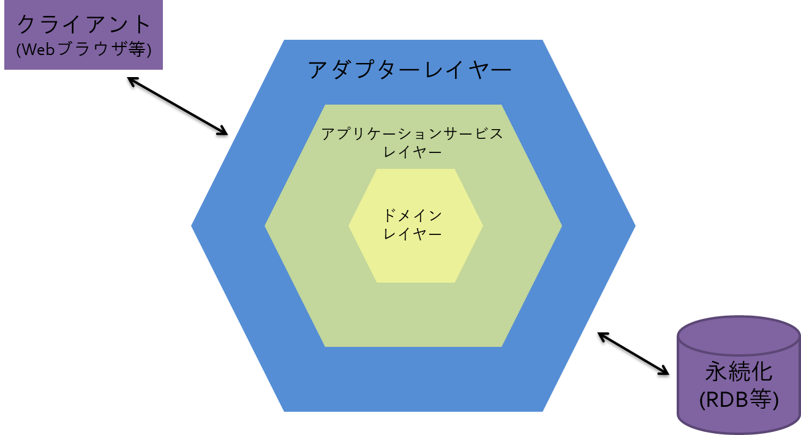

アプリケーションレイヤーをさらにサブレイヤーに分割しています。この構成にすることで、アダプターレイヤーとの接続点が明確になり、クラスの責務も整理しやすくなると考えたためです。また、ドメイン駆動設計という手法を合わせて実践しており、ビジネスロジックのタスクを調整するレイヤーを追加したほうがドメイン駆動設計に沿った設計ができると考えたことも理由の1つです。

**レイヤー間の依存方向の実現方法**

ヘキサゴナルアーキテクチャではビジネスロジックを特定の技術要素から独立して定義できるようにするため、ビジネスロジックを含むレイヤー(本プロジェクトではアプリケーションサービスレイヤーとドメインレイヤー)が、特定の技術要素の内容を含むアダプターレイヤーへ依存しないようにします。

図2　ヘキサゴナルアーキテクチャのレイヤー間の依存方向

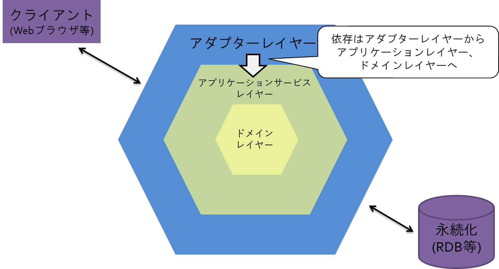

レイヤー間の依存方向は上記のように定められていますが、その一方でレイヤー間をどのようにつなぎ合わせるかは開発者が考え独自に実装しなければなりません。本プロジェクトでは下記の方法を用いてビジネスロジックを特定の技術要素から独立して定義できるようにし、レイヤー間をつなぎ合わせました。

- セパレートインターフェースパターン
    - ドメインレイヤーに永続化に関するインターフェースを定義する
- 依存性逆転の法則
    - ビジネスロジックがアダプターレイヤーのインスタンスを取得する際にDIコンテナから取得するようにする
- レジストリパターン
    - DIコンテナに関するコードを1つのクラスにまとめる

以降ではヘキサゴナルアーキテクチャ導入後のアーキテクチャの概要を示し、その後セパレートインターフェースパターンから順に、どのようにしてビジネスロジックを独立して定義したかを説明します。

### 導入後アーキテクチャ

ヘキサゴナルアーキテクチャを導入した結果のアーキテクチャを説明します。

以下に構築したシステムのアーキテクチャの概要図を示します。

図3　ヘキサゴナルアーキテクチャ導入後アーキテクチャ

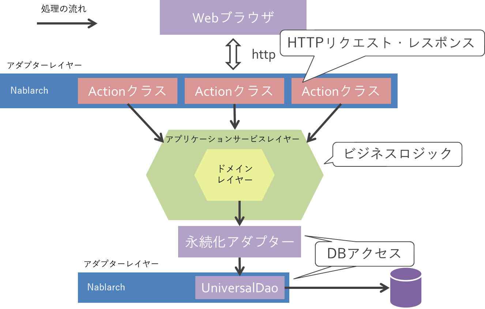

ヘキサゴナルアーキテクチャを導入した本プロジェクトではNablarchフレームワークにビジネスロジックが依存しなくなり、責務ごとにクラスを配置するレイヤーが分かれました。各Actionクラス（URLに対応する処理を記述するクラス）はAPIを通じて対応するビジネスロジックを呼び出すだけで良くなりました。また、ビジネスロジックとDBアクセスの責務がレイヤーによって分離され、各レイヤーの責務配置が明確になりました。

比較のために、参考情報として同顧客で以前に開発された別のソフトウェアのアーキテクチャ概要を示します。

図4　前プロジェクトアーキテクチャ

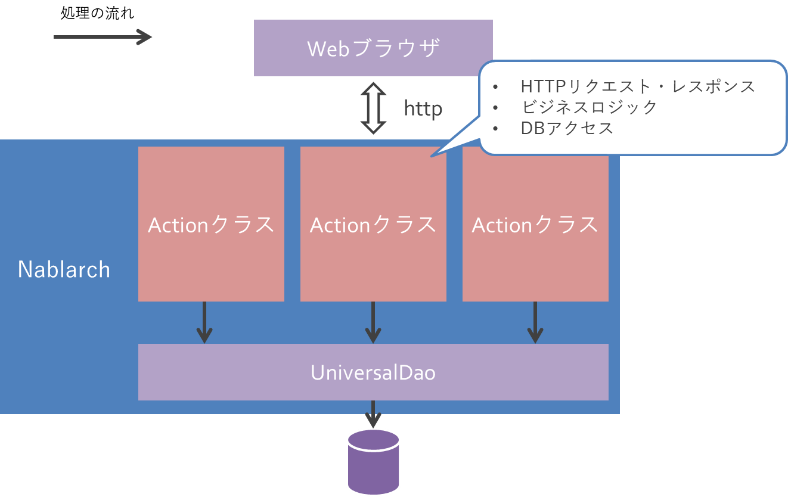

以前開発したソフトウェアではNablarchフレームワークにソフトウェア全体が依存した形で個々のActionクラスに複数の責務を配置していました。Actionクラス内には主にHTTPリクエスト・レスポンス、ビジネスロジック、DBアクセスに関する処理が記述されておりクラスの凝集度は低い状態でした。また、各クラス間でデータのわずかな違いから取り除くことができない重複も発生していました。

### セパレートインターフェース

**ドメインレイヤーに永続化に関するインターフェースを定義し、ビジネスロジックを永続化技術から独立させました。**

レイヤーは使用する側から使用される側に依存が発生します。そのため、ドメインレイヤーが永続化に関するアダプターレイヤーのクラスを使用する場合、ドメインレイヤーがアダプターレイヤーに依存することで、ビジネスロジックが特定の永続化技術に依存してしまい変更容易性や技術要素非依存性を満たすことができません。

図5　ビジネスロジックが特定の技術要素に依存

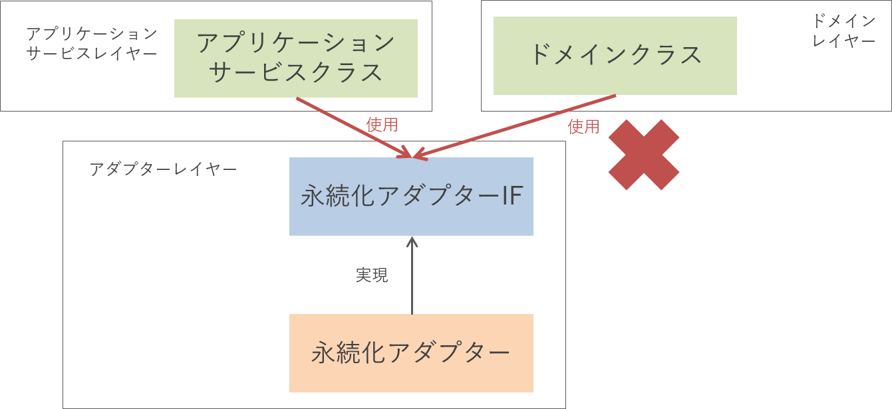

本プロジェクトでは [セパレートインターフェースパターン](https://www.martinfowler.com/eaaCatalog/separatedInterface.html) を使用することでアダプターレイヤーがドメインレイヤーに対して依存する様にし、ビジネスロジックが特定の技術要素へ依存しないようにしました。セパレートインターフェースパターンとは、インターフェースとそれを実現するクラスを別のパッケージに置くことでパッケージ間の依存方向を制御する設計パターンです。

図6　セパレートインターフェースパターン適用結果

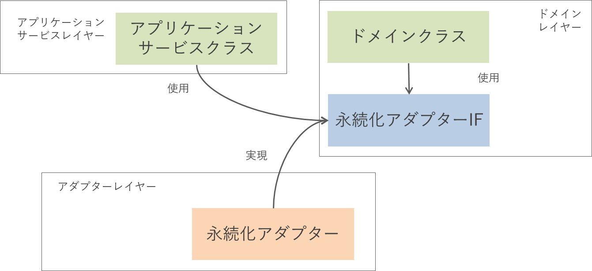

### 依存性逆転の法則とレジストリ

**DIコンテナから永続化に関するクラスのインスタンスを取得できるようにし、ビジネスロジックの独立性を向上させました。また、レジストリパターンを利用しDIコンテナに関するコードがビジネスロジックで分散しないようにしました。**

[セパレートインターフェースパターン](#セパレートインターフェースパターン) を適用したことによりビジネスロジックを独立して定義できるようにしましたが、実際にソフトウェアが動作するにはインターフェースに対応する具象クラスをインスタンス化する必要があります。しかし、直接クラスをインスタンス化するとビジネスロジックが特定の技術要素に依存してしまいます。

図7　具象クラスのインスタンス化による依存ルール違反

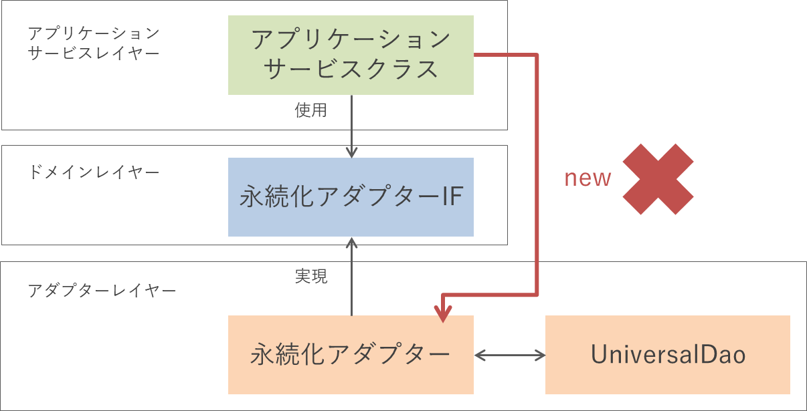

この課題に対し、NablarchのDIコンテナを利用する方法を取りました。DIコンテナを利用することでインターフェースの利用側はインターフェースの具象クラスを知る必要がなくなります。一方、ドメインレイヤーがDIコンテナを直接利用するとソフトウェアのフレームワーク依存性を高めることにつながるため、[レジストリパターン](https://martinfowler.com/eaaCatalog/registry.html)を利用しフレームワークに関係するコードをドメインレイヤーから分離させました。実装したレジストリクラスは、特定のインターフェースに対応する具象クラスを返すメソッドが実装されておりDIコンテナを利用しているかは利用側から隠蔽されています。

図8　依存性逆転の法則とレジストリを使用

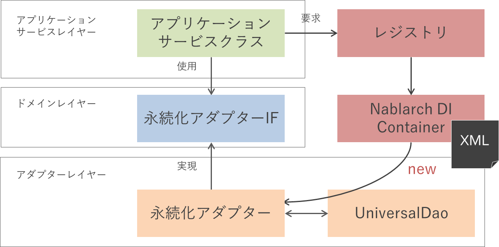

### レイヤー実装の注力順序と時期

**本プロジェクトで作成した3つのレイヤーを以下に示すように順に注力して作成することで、要求の変更に対する手戻りを軽減するようにしました。**

1. ドメインレイヤー
2. アプリケーションサービスレイヤー
3. アダプターレイヤー（クライアント）
4. アダプターレイヤー（データベース）

※「クライアント」とは、アプリケーションサービスレイヤーのメソッドを呼び出すクラスのことを指します。

大まかにどの時期に、どのレイヤーに注力していたかを以下の図に示します。図では濃い色の部分が注力していたことを表しており、薄い部分が注力していないことを表しています。

図9　レイヤー実装の注力順序と時期

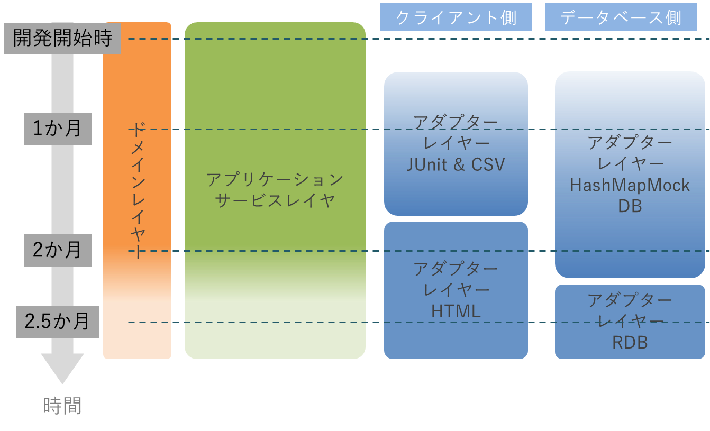

ユーザーインターフェースと永続化に関する決定はプロジェクトの初期段階では決定できなかったため、ビジネスロジックを顧客と詰め、完成度を高めていく方針にしたいと考えました。

レイヤーをこの作成順にすることで、ドメインレイヤーとアプリケーションサービスレイヤーは、開発開始時からリリースに至るまでの全開発期間で分析・設計・実装を行うことができ、顧客と都度実際に動作するビジネスロジックを使ってシステムが動作するイメージを合わせることができました。また、アダプターレイヤーはドメインレイヤーとアプリケーションサービスレイヤーの成長に合わせ、モックからリリース用へと順に作成し、顧客の要求がある程度固まってから本番用のアダプターの作成に取り掛かることができました。

・開発開始時

ドメインレイヤーとアプリケーションサービスレイヤーのみ開発を行いました。これらのレイヤーから開発を行うことで、顧客の要求を開発の早い段階で動くソフトウェアとして具体化し、顧客からのフィードバックを得られるようにしました。とくに本プロジェクトでは要求の変更が頻繁に発生する可能性があったので、これら2つのレイヤーを先に開発し開発開始直後からフィードバックを得ることは非常に重要でした。

一方で、ドメインレイヤーを頻繁に変更する可能性が高い開発初期でアダプターレイヤーを構築すると、変更に対し高いコストを払う恐れがあり、開発開始直後はアダプターレイヤーの作成は行いませんでした。

・1か月後

アダプターレイヤーのクライアント側、データベース側のモックを作成しました。この頃からアプリケーションに対するユースケースが具体化しつつあり、ユースケースに沿ったデモを顧客に提示する必要があったためです。作成したモックはCSVで入出力を行うクライアント側のアダプターと、HashMapを使用しデータベースのような振る舞いをするデータベース側のアダプターです。デモではCSVアダプターをJUnitから呼び出すことで実行できるようにし、入出力されるCSVを顧客に提示することでアプリケーションが扱っているデータと、計算が期待通りかを確認しました。

しかし、依然として要求の変更があったため、製品用のアダプターをこの段階では作成しませんでした。

・2か月後

HTMLで表示するクライアント側のアダプターを作成し、モックと切り替えました。この段階で表示するデータと、操作一覧がある程度固まってきたため、それらの内容を踏まえたデモを顧客に提示する必要があったためです。一方、永続化に関しては構造やデータの種類が明確になっていないためモックのままにしました。

・2.5か月後

データの永続化に関する構造や、データの種類が明確になったため、RDBアダプターを作成し本番環境のデータベースにデータを格納できるようにしました。

以上の1か月後～2.5か月後のアダプターレイヤーの変化を以下の図に示します。

図10　アダプターレイヤーの変化

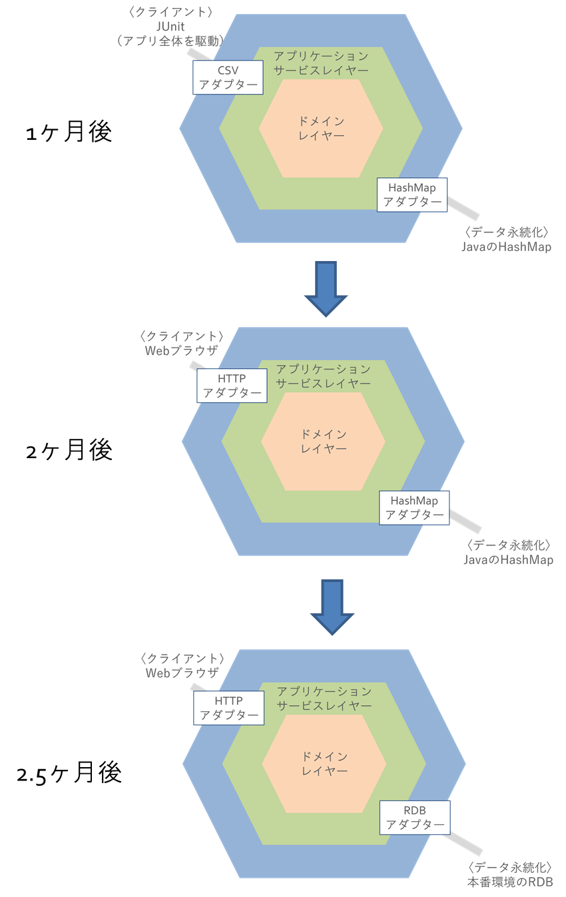

### 導入結果

**変更容易性の向上**

ユーザーインターフェースやデータベースの変更がビジネスロジックに影響しないようにでき、ソフトウェアが顧客の要求の変更に追従しやすくなりました。たとえば、ユーザーインターフェースの項目が増えた際、ビジネスロジックが影響を受けることはなく、アダプターレイヤーまたはアプリケーションサービスレイヤーが変更の影響を吸収しました。また、永続化したいデータの構造が変わった際にはアダプターレイヤーのみが影響を受けました。これらの仕組みにより、ユーザーインターフェースやデータベースの変更の影響がビジネスロジックに波及することがなく、変更が容易になりました。

また、ビジネスロジックを独立してテストできるようにでき、テストの作成・実行のコストを軽減することができました。ビジネスロジックはユーザーインターフェースやデータベースの存在なしにテストを実行できることでデータベース等の環境のセットアップが不要になりました。

一方で、ビジネスロジックを含んだ大きな要求の変更が発生した場合ではすべてのレイヤーが影響を受けました。とくに新たなビジネス上の概念の登場、計算ルールの大きな変更等でソフトウェア全体の修正が必要になりました。

**技術要素非依存性の向上**

ビジネスロジックが特定のフレームワークや特定のデータベース製品に依存しないようにでき、環境のセットアップなしにデモを行えました。ソフトウェアはモック用のアダプター(CSVアダプターやHashMapアダプター)と製品用アダプター(HTTPアダプターやRDBアダプター)とをDIコンテナを用いて簡単に切り替えることができ、モック用のアダプターを使用することでデモを行う際の環境のセットアップが不要になりました。また、一部を製品用アダプターに切り替えることでデモしたい内容以外の環境のセットアップを省くことが可能でした。たとえばHTTPアダプターとHashMapアダプターを利用すればデータベースのセットアップなしにブラウザを通したソフトウェアの動作をデモすることが可能です。

### 懸念事項

ヘキサゴナルアーキテクチャの導入にあたり、以下の懸念事項が考えられます。

**アダプターレイヤーのコードが複雑化しやすい**

アダプターレイヤーのコードがアプリケーションサービスレイヤーやドメインレイヤーに比べて複雑化しやすくなりました。とくにデータへのアクセスを行うHashMapアダプターやRDBアダプターはドメインレイヤーのインスタンスを永続化・復元する責任があり、他のレイヤーと比べ多くの処理が必要になります。そのため、単にアダプターレイヤーとして単一のパッケージにまとめるのではなくレイヤーを追加するなどし、責任を細分化することで多くの処理を単純な処理の集まりに分解するとよいのではないかと考えられます。

**導入コストがかかる**

レイヤー間のやり取りのための仕組みを実装する必要があるため、ヘキサゴナルアーキテクチャを導入していない前プロジェクト（図4を参照）と比べ、導入コストがかかります。本事例では依存性逆転の法則のためにDIの仕組みを導入したり、レイヤー間のやり取りを行うためのインターフェースを用意したりしました。

**学習コストがかかる**

開発者がヘキサゴナルアーキテクチャの動機や各レイヤーの役割・関係性を学習する必要があります。ヘキサゴナルアーキテクチャでは明確に各レイヤーの役割と依存方向を定義しており、この定義に反するコードが存在すればヘキサゴナルアーキテクチャを導入するメリットが失われます。そのため、開発者はどのレイヤーに、どのようなコードを書くべきなのかを理解する必要があります。

### 効果が期待できるプロジェクト

要求の変更が頻繁に発生するプロジェクトにおいて有用であると考えられます。本事例のプロジェクトでは、ヘキサゴナルアーキテクチャを導入したことで要求の変更にソフトウェアが追従しやすくなりました。これらの効果は、他の似たプロジェクトに適用したとしても、同等の効果を発揮できると考えられます。一方で、単純なCRUD操作や要求の変更がまったくないプロジェクトではヘキサゴナルアーキテクチャを導入するメリットはないと考えます。ソフトウェアに求められる機能が少なく、要求の変更が発生しないのであれば、変更が容易になっても得られるメリットが少なく、かえって導入コストの方が大きくなるからです。

**ヘキサゴナルアーキテクチャの導入におけるコスト**

ヘキサゴナルアーキテクチャを導入する場合一定のコストが発生します。これは学習コストや、ヘキサゴナルアーキテクチャを支えるための実装コストなどが含まれます。これらのコストは開発が進んで行くことで回収することが可能であると考えています。

要求の頻繁な変更が発生するプロジェクトにおいて、ヘキサゴナルアーキテクチャを導入して対策を行った場合と、何も対策を行わなかった場合のイメージ図を以下に示します。この図は「実現した顧客の要求」と「時間」の関係を表しています。オレンジ色の線がヘキサゴナルアーキテクチャを導入した場合を表しており、青色の線が何も対策をしなかった場合を表しています。何も対策を行わないでソフトウェアを開発した場合、最初は比較的短時間で顧客の要求を実現できますが、徐々に要求の実現にかかる時間が長くなっていくと考えられます。一方、ヘキサゴナルアーキテクチャを導入した場合では初期の導入コストによって最初は要求の実現に時間がかかりますが、少しずつかかる時間が短くなっていき、要求の大小によりますがある時点でほぼ一定のペースで実現できるようになると考えられます。これら2つの線が重なる位置にヘキサゴナルアーキテクチャ導入のコストの分岐点があります。ヘキサゴナルアーキテクチャを導入することで、開発期間中またはその後の保守の期間中に導入コストを上回るメリットを得られると考えています。

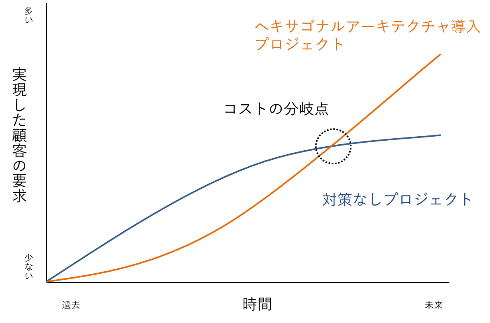

### おわりに

本ドキュメントでは、変更の要求が激しいソフトウェア開発プロジェクトにおいて、ソフトウェアアーキテクチャの1つであるヘキサゴナルアーキテクチャを導入した結果を事例として説明し、ソフトウェアが要求の変更に対して追従しやすくなった事を示しました。また、導入においてセパレートインターフェースパターンや依存性逆転の法則、レジストリパターンを利用したことを説明し、導入にあたっての懸念事項、効果が期待できるプロジェクトについて述べました。本事例の内容がアーキテクチャを検討する際や、ヘキサゴナルアーキテクチャを導入する際の参考になればと思います。
