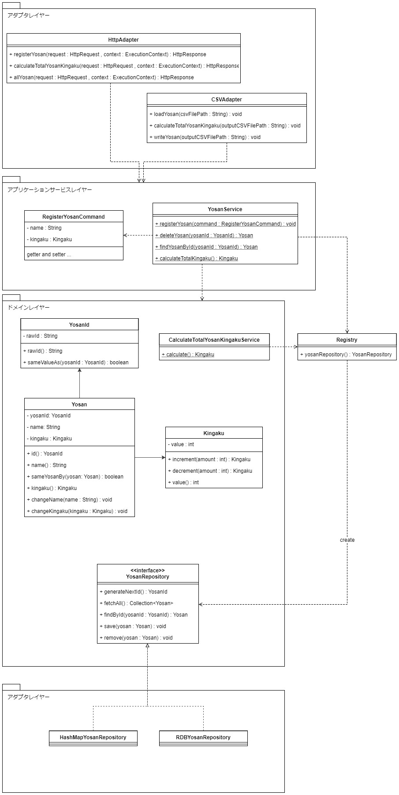

## サンプルコード

各レイヤーのサンプルコードを示します。ヘキサゴナルアーキテクチャの導入事例で説明した内容を補強する点で冗長であるコードやクラスは省略しています。また、コード量が過度に多くなることを避けるため、単純なビジネスロジックにしています。

* [ドメインレイヤー](#ドメインレイヤー)
* [アプリケーションサービスレイヤー](#アプリケーションサービスレイヤー)
* [アダプタレイヤー](#アダプタレイヤー)
* [その他](#その他)

---

### サンプルコードクラス図

サンプルコードの大まかな構成を以下のUMLクラス図に示します。




### ドメインレイヤー

ビジネスロジックを含み、ビジネスの方針を表現する役割を持ちます。

``` java
/**
 * 予算を表します。
 *
 * 予算は、ID、名前、金額を持ちます。
 */
public class Yosan {

    private final YosanId yosanId;

    private String name;

    private Kingaku kingaku;

    public Yosan(YosanId yosanId, String name, Kingaku kingaku) {
        this.yosanId = yosanId;
        this.name = name;
        this.kingaku = kingaku;
    }

    public YosanId id() {
        return yosanId;
    }

    public String name() {
        return name;
    }

    public Kingaku kingaku() {
        return kingaku;
    }

    /**
     * 同じ予算か比較します。
     *
     * @param yosan 比較対象予算
     * @return 同じ場合true,異なる場合false
     */
    public boolean sameYosanBy(Yosan yosan) {
        return this.yosanId.sameValueAs(yosan.yosanId);
    }

    /**
     * 予算名を変更します。
     *
     * @param name 新しい予算名
     */
    public void changeName(String name) {
        this.name = name;
    }

    /**
     * 金額を変更します。
     *
     * @param kingaku 新しい金額
     */
    public void changeKingaku(Kingaku kingaku) {
        this.kingaku = kingaku;
    }

}
```

``` java
/**
 * 予算のIDです。
 */
public class YosanId {

    private String rawId;

    public YosanId(String rawId) {
        this.rawId = rawId;
    }

    public String rawId() {
        return rawId;
    }

    public boolean sameValueAs(YosanId yosanId) {
        return this.rawId.equals(yosanId.rawId);
    }

}
```

``` java
/**
 * 金額を表します。
 */
public class Kingaku {

    private final int value;

    /**
     * 金額を指定された値で作成します。
     *
     * @param value 値
     * @throws IllegalArgumentException 値が０未満の場合
     */
    public Kingaku(int value) {
        if (!isGreaterThenZero(value)) throw new IllegalArgumentException("金額を０以下で作成できません");
        this.value = value;
    }

    /**
     * 指定された値で増やした金額を返します。
     *
     * @param amount 増やす金額
     * @return 金額
     */
    public Kingaku increment(Kingaku amount) {
        return new Kingaku(value + amount.value);
    }

    /**
     * 指定された値で減らした金額を返します。
     *
     * @param amount 減らす金額
     * @return 金額
     */
    public Kingaku decrement(Kingaku amount) {
        return new Kingaku(value - amount.value);
    }

    public int value() {
        return value;
    }

    /**
     * 値が０以上かを返します。
     *
     * @param value 確認する値
     * @return ０以上の場合true,０未満の場合false
     */
    private boolean isGreaterThenZero(int value) {
        return value >= 0;
    }

}
```

``` java
/**
 * 予算の合計金額を計算します。
 */
public class CalculateTotalYosanKingakuService {

    public static Kingaku calculate() {
        return new Registry().yosanRepository().fetchAll().stream()
                .map(Yosan::kingaku)
                .reduce(Kingaku::increment)
                .orElseGet(() -> new Kingaku(0));
    }

}
```

``` java
/**
 * 予算のリポジトリです。
 */
public interface YosanRepository {

    /**
     * 予算IDを新規採番します。
     *
     * @return 予算ID
     */
    YosanId generateNextId();

    /**
     * すべての予算を取得します。
     *
     * @return すべての予算
     */
    Collection<Yosan> fetchAll();

    /**
     * 予算IDを元に取得します。
     *
     * @param yosanId 検索に使用する予算ID
     * @return 予算
     */
    Yosan findById(YosanId yosanId);

    /**
     * 予算を保存します。
     *
     * @param yosan 保存する予算
     */
    void save(Yosan yosan);

    /**
     * 予算を削除します。
     *
     * @param yosan 削除する予算
     */
    void remove(Yosan yosan);

}
```

### アプリケーションサービスレイヤー

APIを定義し、ドメインレイヤーのタスクの調整をする役割を持ちます。

``` java
/**
 * 予算を登録するために必要な情報を表すクラスです。
 */
public class RegisterYosanCommand {

    private String name;

    private Kingaku kingaku;

    // Getter and Setter ...

}
```

``` java
/**
 * 予算のアプリケーションサービスです。
 */
public class YosanService {

    /**
     * 予算を登録します。
     */
    public static void registerYosan(RegisterYosanCommand command) {
        Yosan yosan = new Yosan(
                yosanRepository().generateNextId(),
                command.getName(),
                command.getKingaku()
        );

        yosanRepository().save(yosan);
    }

    /**
     * 予算IDを元に予算を取得します。
     *
     * @param yosanId 検索に使用する予算ID
     * @return 予算
     */
    public static Yosan findYosanById(YosanId yosanId) {
        return yosanRepository().findById(yosanId);
    }

    /**
     * 予算IDを元に予算を削除します。
     *
     * @param yosanId 検索に使用する予算ID
     */
    public static void deleteYosanById(YosanId yosanId) {
        Yosan yosan = yosanRepository().findById(yosanId);
        yosanRepository().remove(yosan);
    }

    /**
     * 全予算の合計金額を計算します。
     *
     * @return 合計金額
     */
    public static Kingaku calculateTotalYosanKingaku() {
        return CalculateTotalYosanKingakuService.calculate();
    }

    /**
     * すべての予算を取得します。
     *
     * @return すべての予算
     */
    public static Collection<Yosan> fetchAllYosan() {
        return yosanRepository().fetchAll();
    }

    /**
     * 予算リポジトリを取得するヘルパー関数です。
     *
     * @return 予算リポジトリ
     */
    private static YosanRepository yosanRepository() {
        return new Registry().yosanRepository();
    }

}
```

### アダプタレイヤー

外部と内部のシステムとの内容を相互変換する役割を持ちます。

``` java
/**
 * CSVで入出力を行うアダプタクラスです。
 */
public class CSVYosanAdapter {

    /**
     * 予算の登録を行います。
     *
     * @param csvFilePath 読み込み先CSVファイルのパス
     */
    public void loadYosan(String csvFilePath) {
        // CSVファイルの読み込み ...

        Collection<RegisterYosanCommand> commands = ...

        YosanService.registerYosan(commands);
    }

    /**
     * 予算の合計金額を計算します。
     *
     * @param outputCSVFilePath 計算結果を出力するCSVファイルパス。
     */
    public void calculateTotalYosanKingaku(String outputCSVFilePath) {
        Kingaku kingaku = YosanService.calculateTotalYosanKingaku();

        // CSVファイルへ書き込み ...
    }

    /**
     * 登録されている予算を出力します。
     *
     * @param outputCSVFilePath 出力先CSVファイルパス
     */
    public void writeYosan(String outputCSVFilePath) {
        Collection<Yosan> allYosan = YosanService.fetchAllYosan();

        // CSVファイルへ書き込み ...
    }

}
```

``` java
/**
 * HashMapを利用した予算のリポジトリです。
 */
public class HashMapYosanAdapter implements YosanRepository {

    private Map<YosanId, Yosan> repository = new HashMap<>();

    private int idCounter = 0;

    @Override
    public YosanId generateNextId() {
        idCounter++;
        return new YosanId(String.valueOf(idCounter));
    }

    @Override
    public Collection<Yosan> fetchAll() {
        return repository.values();
    }

    @Override
    public Yosan findById(YosanId yosanId) {
        Yosan yosan = repository.get(yosanId);

        if (yosan == null) {
            throw new NotFoundException();
        } else {
            return yosan;
        }
    }

    @Override
    public void save(Yosan yosan) {
        repository.put(yosan.id(), yosan);
    }

    @Override
    public void remove(Yosan yosan) {
        repository.remove(yosan.id());
    }
}
```

``` java
/**
 * Http通信を行うアダプタクラスです。
 *
 * Nablarchフレームワークを利用しています。
 */
public class HttpYosanAdapter {

    /**
     * 予算の登録を行います。
     */
    @InjectForm(form = RegisterYosanForm.class, prefix = "form")
    @OnError(type = ApplicationException.class, path = "forward://input")
    public HttpResponse registerYosan(HttpRequest request, ExecutionContext context) {
        // フォーム内容の読み込み ...

        Collection<RegisterYosanCommand> commands = ...

        YosanService.registerYosan(commands);

        return new HttpResponse("/WEB-INF/view/client/registerSuccess.jsp");
    }

    /**
     * 予算の合計金額を計算します。
     */
    public HttpResponse calculateTotalYosanKingaku(HttpRequest request, ExecutionContext context) {
        Kingaku kingaku = YosanService.calculateTotalYosanKingaku();

        // 出力情報をリクエストスコープにセット ...

        return new HttpResponse("/WEB-INF/view/client/totalYosanKingaku.jsp");
    }

    /**
     * 登録されている予算を表示します。
     */
    public HttpResponse allYosan(HttpRequest request, ExecutionContext context) {
        Collection<Yosan> allYosan = YosanService.fetchAllYosan();

        // 出力情報をリクエストスコープにセット ...

        return new HttpResponse("/WEB-INF/view/client/allYosan.jsp");
    }

}
```

``` java
/**
 * RDBを使用する予算リポジトリです。
 *
 * Nablarchフレームワークを利用しデータベースへアクセスしています。
 */
public class RDBYosanAdapter implements YosanRepository {

    @Override
    public YosanId generateNextId() {
        // RDBのシーケンス機能を元に値を採番 ...

        return new YosanId(String.valueOf(value));
    }

    @Override
    public Collection<Yosan> fetchAll() {
        // すべての予算を取得
        EntityList<YosanEntity> allYosanEntity = UniversalDao.findAll(YosanEntity.class);

        // ドメインレイヤーの予算クラスに変換
        Collection<Yosan> allYosan = ...

        return allYosan;
    }

    @Override
    public Yosan findById(YosanId yosanId) {
        YosanEntity yosanEntity = UniversalDao.findById(YosanEntity.class, yosanId.rawId());

        // ドメインレイヤーの予算クラスに変換
        Yosan yosan = ...

        return yosan;
    }

    @Override
    public void save(Yosan yosan) {
        // ドメインレイヤーの予算クラスをデータベース用の予算クラスに変換
        YosanEntity yosanEntity = ...

        UniversalDao.insert(yosanEntity);
    }

    @Override
    public void remove(Yosan yosan) {
        // ドメインレイヤーの予算クラスをデータベース用の予算クラスに変換
        YosanEntity yosanEntity = ...

        UniversalDao.delete(yosanEntity);
    }
}

```

### その他

``` java
/**
 * レジストリクラスです。
 *
 * Nablarchフレームワークを利用し、XMLファイルで記述されたクラス情報を読み込みインスタンス化します。
 */
public class Registry {

    /**
     * 予算リポジトリのインスタンスを返します。
     *
     * @return 予算リポジトリ
     */
    public YosanRepository yosanRepository() {
        return (YosanRepository) SystemRepository.getObject("YosanRepository");
    }

}
```