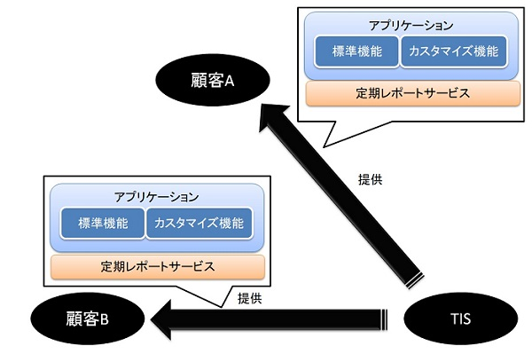
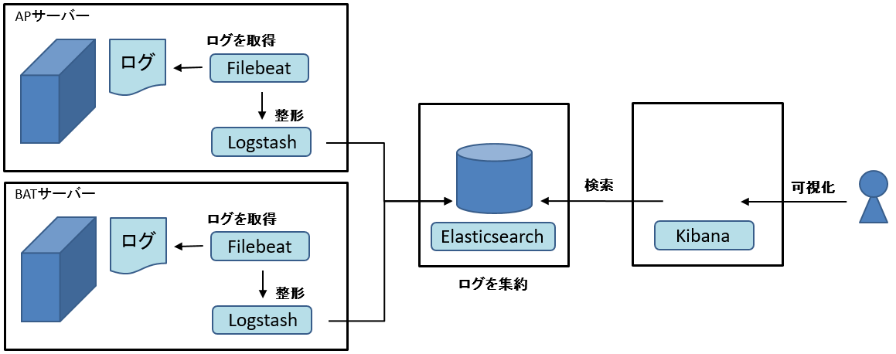
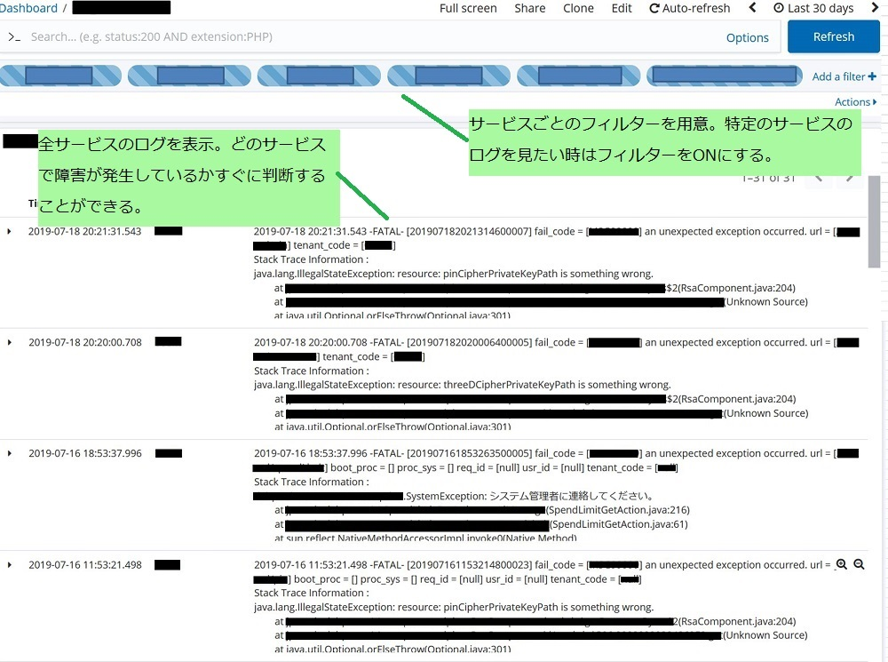
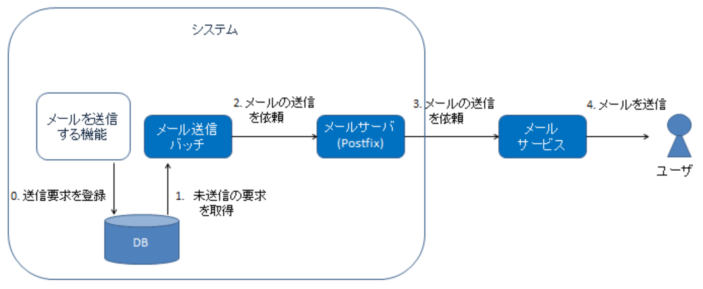
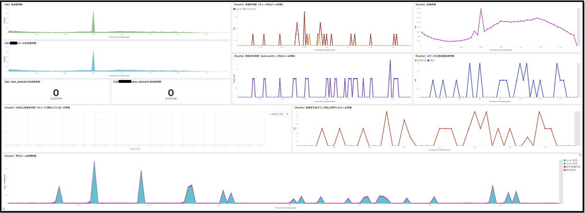
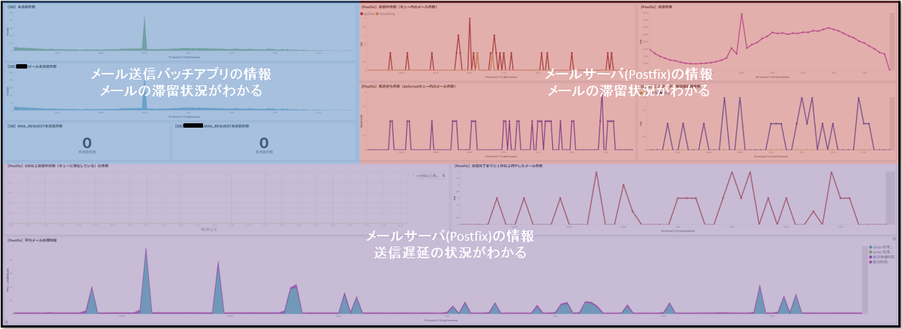

# サービス開発する人にまねしてほしい、ログの集約と活用事例

* [はじめに](#introduction)
* [本事例のサービスについて](#whatService)
* [なぜElastic Stackなのか](#whyElastic)
* [解決した課題](#background)
* [どのように解決したか](#cases)
* [今後の展望](#future)
* [まとめ](#summary)

## <a name="introduction">はじめに</a>

### 本ドキュメントの狙い

一般に、ITサービスが価値を持つのは、その開発中ではなく運用がはじまってからになります。結果として、運用を高品質かつ効率よく行うことができるかどうかが、サービスの成否に大きく影響します。

一方で、ITサービスの開発中は運用に目を向けられることが少なく、運用時にどのような問題が発生し得るのか、それらの問題に対してどのような手が打てるのかといったノウハウが共有される機会は限られがちでした。

本ドキュメントは、運用フェーズにあるシステムで発生していた「システム全体の状況把握」に関する具体的な課題、そしてそれらに対して実施した改善を事例として公開するものです。
この事例公開の狙いは以下の通りです。

- 運用に目を向け、「サービスイン後においても望ましいシステムであり続ける」ために何をすれば良いかを考えて頂けるようになること
- 運用フェーズにあるプロジェクトに対しては、具体的な改善活動を始めるきっかけにしていただくこと

もちろん、本事例の課題であった「システムの状況把握」と同じ課題を抱えるプロジェクトに対しては、ぜひその具体的な改善方法を参考にして頂きたいです。

### 本ドキュメントの対象

このドキュメントには、ログを活用して課題解決した事例を記載しています。

“ログ”という言葉は、アプリケーションがログファイルに出力する文字列を指していることもあります。
しかし、本記事ではログファイルに出力される文字列はもちろん、
システムメトリック、特定の時点のデータベース／キューの内容、アプリケーションの起動記録等、システムの状況を表すものはログであると考え、それらを集約・可視化する事例となります。

本事例ではElastic Stackを利用しています。
ただし、本ドキュメントはElastic Stackの導入や運用方法を記載したものではありません。  
Elastic Stackの導入や運用方法については別のコンテンツを作成予定ですので、そちらを参照してください。

## <a name="whatService">本事例のサービスについて</a>

ドキュメントの事例を理解しやすくするため、本事例のサービスについて説明します。  
本事例のサービスは、業務で必須な標準機能に加え、顧客ごとのカスタマイズ機能を提供しています。

また、本事例のサービスは自社サーバに構築されている、いわゆるオンプレミス型のシステムです。

## <a name="whyElastic">なぜElastic Stackなのか</a>

ログの集約には複数のソリューションが存在しますが、本事例で何故Elastic Stackを利用しているかを説明します。

本事例のシステムは、既に本番稼働しているため、それらの機能に可能な限り影響を与えないようにログ集約を実現する必要がありました。
具体的には以下の制約がありました。

* システムの構成は変更しない（環境をクラウドに変更しない。アプリケーションが動作するサーバを変更しない。）
* 稼働中のアプリケーションのソースコードを変更しない

Elastic Stackの特徴は、上記の制約をクリアすることができました。
加えて、以下のような魅力的な特徴があったためElastic Stackを選択しました。

* 多機能なプロダクト群が提供されている  
  ログ収集から、ログを可視化するためのWebアプリケーションなど、幅広いプロダクト群がサポートされています。ログの集約はファイル以外にも様々な媒体を対象としており、アプリケーションのソースコードや設定を変更することなくログを収集できます。
* 他社でログ収集に使用されている事例がある
* 取り込んだログで機械学習ができる  
  Elasticsearchは機械学習機能があり、機械学習による障害検知が可能です。
* 開発が盛んで、今後も有用な機能がリリースされる見込みがある

## <a name="background">解決した課題</a>

Elastic Stackを利用して解決した本事例の課題を説明します。

本事例のサービスでは、障害発生時に顧客への障害の状況報告が遅くなりサービスレベルが低下するという問題が発生していました。  
障害の状況報告が遅くなる理由は、原因調査に時間がかかってしまうためです。

運用担当者は障害発生から顧客への報告までに次のような作業を実施します。

* 障害発生の連絡を受電
* 障害箇所の特定
* 障害原因の特定
* 顧客へ障害の状況報告

特に時間がかかっている作業は障害原因の特定です。  
障害原因の特定には、必要なログの収集と収集した情報の統合を実施します。

これらに時間がかかっている理由は以下の３点が挙げられます。

1. ログファイルがたくさんあり、散在している  
  顧客の増加やサービスの拡大により、サーバ・基盤・ミドルウェア・アプリの数が増えたため、ログファイルの数も同時に増えました。そのため、障害原因の調査時に参照しなければならないログファイルが多くなり、対象のログファイルを収集する時間もかかります。これにより障害対応の一次切り分けのスピードが落ちていきます。
2. ログを参照できる場所が限定されている  
  ログを参照するためには、サーバにログインする必要があります。１台の場合はそれほど煩雑ではないかもしれませんが、複数台になると、それぞれ異なるユーザ/パスワードでログインする必要があるので手間です。
3. ログファイルやデータを確認する担当者がアプリやレイヤ毎に異なる  
  ログファイルはOS・ミドル・アプリなどレイヤ毎に状況確認する担当者が異なります。それだけでなく、対象のアプリによって担当者が異なるため、全体を俯瞰して状況を確認するにはそれらの情報を集約する必要があり時間がかかります。

## <a name="cases">どのように解決したか</a>

上記の課題の解決方法について説明します。

### ログの集約

多数のサーバに散在しているログは１箇所に集約することで、閲覧しやすくなりました。
閲覧しやすくしたことにより、散在しているログを参照する煩雑さがなくなり、障害解析のスピードが向上しました。

ログの集約にはElastic Stackのプロダクトを以下のような構成で使用しました。

* Filebeat...ログファイルを読み取り、Logstashに送る
* Logstash...Filebeatから受信したログを整形してElasticsearchに送る
* Elasticsearch...ログの情報を集約し、Kibanaからの検索に応じログ情報を返す
* Kibana...Elasticsearchからログの情報を取得し、可視化する

FilebeatとLogstashを使用することでアプリケーションやログの出力場所を変更することなくElasticsearchにログを集約することができるため、
現行システムの構成・ソースコードを変更しないという本事例の制約を満たすことができます。
Elasticsearchに溜めたログはKibanaで閲覧できるようにしました。

#### 課題に対して

ログを集約したことで、どのように課題が解決されているかを説明します。

ログを集約したことで、Kibanaにアクセスさえすればログを閲覧できるようになりました。  
今までのように、散在している多くのログファイルを収集する必要がなくなりました。また、参照すべきログが１箇所に集約されたことにより、複数のサーバへそれぞれログインする必要もなくなりました。

Kibanaにアクセスし、ログ閲覧用の画面を開くと下図のように表示されます。
様々なログが１画面に表示されていて、フィルターにより絞り込みもできます。  
  

また、ログをKibanaで閲覧できるようにしたことにより、以下の効果もありました。
* 異なるログを時系列順に並べて閲覧できる  
  今までは複数のログファイルに分かれていたため時系列に並べることが困難でした。現在は全てのログを時系列順に表示することができます。
  例えば、冗長構成のサーバに負荷分散されている状況で特定のユーザの操作履歴を見たい場合、それぞれのログファイルに対して、特定のユーザの操作を抽出した後、
  複数のログファイルを行き来しながら、時系列順にログを確認する必要があります。
  Kibanaで閲覧すれば、ログのイベントが時系列順に並んでいるため、特定のユーザの操作を抽出するだけで操作履歴を確認することができます。
* 異なるフォーマットのログファイルでも同じフォーマットで閲覧できる  
  異なるアプリケーションから出力されるログファイルだとフォーマットが異なるため、そのまま並べて閲覧すると見にくいですが、
  どのログファイルもKibanaを通して閲覧するため、同じフォーマットで閲覧することができ、見やすくなります。
* 検索/フィルターが容易にできる  
  今までは複数のログファイルに分かれていたために検索やフィルターを適用することが困難でした。
  また、異なるログ（ログファイルとDBのデータ等）に対しては共通のフィルターを適用することができませんでした。
  現在は全てのログから検索することやフィルターを適用することが容易にできます。

### 機能単位で状況を可視化

ここではメール送信機能を例にログの可視化事例を説明します。

メール送信機能では、状況の把握のために「アプリログ」、「メール送信キュー(postfix)の状況」、「メールプロバイダの稼働状況」を並べて確認する必要があります。
これらのログは情報を収集できる担当者が異なるため、状況の把握のために複数の人が必要となり、結果として状況の把握に時間がかかってしまうという問題がありました。
それらのログを集約し、１画面に可視化することで機能単位での状況を俯瞰的に参照できるようになりました。  
これにより、担当者の異なるログを一目で確認することができ、調査スピードが向上しました。

システムがメールを送るとき、ユーザに届けるまでに以下の３つのアプリケーションを利用しています。  

0. メール送信バッチアプリ
0. メールサーバ（Postfix)
0. 外部メールサービス

本事例のサービスではバッチアプリはアプリケーションチーム、Postfix・外部メールサービスはインフラチームが運用を担当しています。
そのため、「メールが送信できていない」という障害が発生したとき、状況を把握するためには両チームに問い合わせなければ全体的な状況がつかめませんでした。

この状況を解決するため、バッチアプリやPostfixのログを以下のダッシュボードで可視化しました。  
ダッシュボード上部では、メールが滞留してないか、送信状況がわかるような情報を表示しています。
ダッシュボード下部では、送信遅延が発生したときなど、何に時間がかかったのか、時間がかかったものは何件あるかなどの情報を表示しています。

これにより、ダッシュボードを見れば、アプリケーション/担当チームに関係なくメール送信に関する情報が一目でわかるようになり、障害調査のスピードが大きく向上しました。

## <a name="future">今後の展望</a>

今後は集約したログを他の課題解決やサービスレベルの向上に役立てていきます。

例えば、上記のダッシュボードでは、メールの送信状況がどうなっているのかを視覚的に知ることができます。
しかし、何か問題が発生したとしても、我々がそれを検知するためにはダッシュボードを確認しに行く必要があります。
それでは、問題が起きたときにすぐに対応することができません。

そこで、Elasticsearchの機能である「機械学習」と「アラート機能」を用いて、通常時と異なるおかしな挙動を検知し、
通知することで、問題の発生から対応までの時間を短縮しようと考えています。
これにより、さらなるサービスレベルの向上が見込めます。

## <a name="summary">まとめ</a>

本ドキュメントでは、サービスイン後に発生していた「システム全体の状況把握が難しい」という運用課題を、ログを集約・可視化することで改善した事例について説明しました。

運用時に発生する課題は、今回のような状況把握に関する課題はもちろん、障害検知、システムの安定運用、セキュリティ等、多岐に渡ります。そして、サービスを提供するということは、当事者としてこれらの課題を相手にすることを意味します。

本事例はあくまでそのうちの1つの課題を改善したに過ぎません。しかし、そういった1つの1つの対応、改善の積み重ねこそが、より良いサービスを提供し続けるために必要なことだと思っています。

本事例を通して、運用の大切さ、そして運用改善の大切さを考えるきっかけにして頂ければ幸いです。
