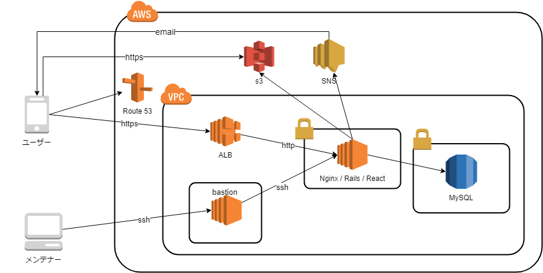

# 関西地区でのスタートアップとのサービス開発事例

 - [はじめに](#introduction)
 - [TL;DR](#tldr)
 - [背景](#background)
 - [開発](#development)
 - [おわりに](#conclusion)

## <a name="introduction">はじめに</a>

本ドキュメントは、スタートアップと半年間でPoCを実現するために実践した事例をまとめたものです。

本ドキュメントがサービス開発の事例として、サービス開発の経験が少ないメンバーでPoCを実施するための実用最小限のプロダクト(MVP)を実装するチームの参考情報になることを目的としています。

## <a name="tldr">TL;DR</a>

MVPを実装するにあたり、なるべく早く実装、リリースするために開発の進め方を工夫しました。

 - 技術選定はスタートアップの要求とチームのスキルをすり合わせて選択しました。
 - 機能の実装に集中できるように、ソースコードの管理が複雑にならないようにしました。
 - 回避したい問題には運用で回避できるかどうかを確認し、実装する範囲とアプリケーションでやらないことを合意しました。
 - 特に管理系の機能は実装コストを下げるため、優先度をコントロールできるように要求を細分化しました。

## <a name="background">背景</a>

スタートアップと協業して半年間でPoCを実施する計画で外国人向けのおつかいサービスを開発しました。

開発チームのメンバーは3名で、2名はシステム開発の経験はあったものの、サービス開発やスタートアップの経験がないメンバーです。
1名はReactやSpringの学習経験はありましたが、実務でアプリケーションを作成したことがないメンバーでした。

そのため機能の実装やシステム構成の検討に注力できるよう、ストーリーと優先度、進め方はスタートアップのCEOにプロダクトオーナー(以下PO)として判断してもらいました。

### <a name="service">サービスの特徴とPoCのスコープ</a>

今回の事例となるサービスは「2サイドプラットフォーム」という形式で、ユーザーには2つの役割（購入依頼する人(以下Shopper)、購入する人(以下Buyer)）があるサービスを考えています。

ただし、この形式は次のような状況になってしまいます。

 * Buyerがいないと依頼しづらい
 * Shopperがいないと依頼がないためBuyerは購入できない

次のような理由もあり、Buyer用の機能を劣後させ、
スタートアップのメンバーが管理アプリケーションを利用して代理で購入することでShopperとなるユーザーを集めるという方針で計画し、Buyer用の機能はPoCでは必須とはしませんでした。

 * BtoCよりCtoCのほうがお金のやり取りが複雑になる
 * CtoCの決済は法律の調査が必要になる
 * BtoCでスタートアップが解決したかった問題が解決できる可能性もある

法的な制約や実現性の難しさについては、私たち開発チームが参加する前にスタートアップが課題として検討、推進してくれていたため、CtoC（PoC以降）で支払方式は実装しなおすという合意はスムーズに進みました。

チーム全体で弱い（誰も対応に自信がない）ものがないか、見えるようにすることとMVPの中に入らないように検討することが重要でしょう。
支払に関しては、支払機能の開発着手直前まで調査してもらいましたが、現状問題がないことがわかっている方法で実装し、PoC後に実装し直すことにしました。

## <a name="development">開発</a>

PoCまでの開発を大きく時系列に分類すると下記のようになりました。

 1. 技術選択
 1. ユーザー登録機能（最初のフェーズ）
 1. 購入依頼機能（サービスの価値となる機能）
 1. 管理アプリケーション（PoC開始までに必要なアプリケーション）

それぞれでの判断やノウハウを以降に記載します。

### 技術選択

スタートアップからはPoCをする上で、下記のような要望、条件が提示されていました。

 1. できるだけ早く実装してほしい
 2. 技術者を確保しやすいためRailsを利用してほしい
 3. ネイティブアプリケーションではなくWebアプリケーションをPWAにしたい
 4. Facebookで集客しているため、Facebookユーザーを対象とする

できるだけ早く実装ができるように、開発開始前にそれぞれの条件を考慮して採用する技術をスタートアップと合意しました。

開発チームにはRailsの経験がありませんでしたが、
PoC後にも開発を継続する上で技術者の確保が難しくなることは開発チームとしても避けたかったため、Railsを利用することとしました。

ただし、すべてをRailsで実装するとなると初期学習コストの増加や、ベロシティーが低くなるリスクを感じていたこと、「3. PWAを利用したい」ということを踏まえて、
フロントエンドはReactを採用しRailsはAPIモードで作成することにしました。

また、インフラはスタートアップが別のサービスでAWSを利用しており、開発チームもAWSの利用経験があったため、AWSを選択しました。

「4.Facebookユーザーを対象にすること」としており、認証に必要なセンシティブな情報を極力持ちたくなかったこととユーザーの登録のフロー(※)を整理し、FacebookのOAuth 2.0でユーザー認証をすることにしました。

※FacebookにログインしているユーザーをFacebook広告からランディングページへと誘導して、そこからサービスにアクセスするように設計していました。

まとめると開発を始めるまでに決めていたことは下記になります。

 * SPA + APIの構成で作成
   * SPAはReact
   * APIはRails
 * AWS上に構築
 * 認証方式はFacebook OAuth 2.0認証

サービスの構成イメージは下記です。

### ユーザー登録機能

アプリを配置する環境は決まっていましたが、実際の本番環境や開発環境の整備、開発プロセスを整備しながら最初の機能を実装していきます。

開発メンバーの体制は次のような体制で開始しました。

 * 全体の方式設計および技術面のサポート＆POとの折衝をするリーダー
 * RailsでAPIを作成する開発メンバー
 * Reactでフロントエンドを作成する開発メンバー

ユーザー登録機能で実装したときの技術的なトピックは[Swaggerを利用したUI開発](https://fintan.jp/?p=3561)や[React+APIでのOAuth2.0認証](https://fintan.jp/?p=3648)があります。

このセクションでは「環境の整備」、「サービスの粒度の検討」、「キャンペーン」を紹介します。

#### 環境の整備

技術選択時には決めていなかった要素を決めていきました。
POからの要望があまり無い要素なので、開発チーム（とくに技術リーダー）が中心となって決定していきます。

AWSのサービスであるCodeCommit/CodeBuild/CodeDeployはサービス開発前に利用した経験から自分たちには合わないと判断し
ソースコード管理やCIにはGitLabを利用し、CDはCapistranoを採用することにしました。

役割としてフロントエンドの実装メンバーとバックエンドのAPI実装メンバーが別れていたため、SwaggerにてAPIの定義を作成してそれぞれが並走して実装することにしました。

 * APIの実装としてはフロントエンドが利用したときのイメージと乖離しないAPIを作成できているという自信が持てるため、迷いなく実装できた。
 * 迷う部分はAPI定義のときに相談できた。

また、社内ネットワークではFacebookやGoogleドキュメントにアクセスできないため、どうやって開発するかという課題がありました。

最終的には社内ネットワークから離れて開発できるように対応しましたが、
認証で利用したライブラリには（[OmniAuth](https://github.com/omniauth/omniauth)）に開発用の認可実装があったため、Facebookアカウントを作成しなくてもユーザーを作成できました。
複数のユーザーを利用してテストすることも可能になるため、これは非常に助かりました。

OAuthで認証する場合、アカウントが認可サーバに依存することを考えると、認証必須である機能のテストができない、またはソースコードを書き換えないとテストできないといった問題が起きてしまいます。
開発(テスト)用に代替手段があることを確認しておくと良いでしょう。

#### サービスの粒度の検討

ユーザー登録機能をリリース後に購入依頼機能を実装しましたが、ソースコードのリポジトリをユーザー登録機能と購入依頼機能で分割するかどうかを検討しました。

ユーザー登録機能は勢いで実装したという自覚もあり、以降に実装する購入依頼機能はユーザー登録機能より煩雑になると想定されたため、
新規にリポジトリを作成したほうが良いのではないか？という感覚がありました。  
これはまさに感覚でメリット、デメリットの整理もできていませんでした。

ユーザー登録のメイン機能は**FacebookのOAuth認証**、**ユーザー情報の初期設定(Facebookの名前やメールの利用)**、**ユーザー登録API**、**認証確認メール**で
購入依頼機能で利用するものは**FacebookのOAuth認証**だけです。

この時点では「一旦同じリポジトリで開発してみる」という判断をしました。  
利用技術にも慣れ、サービスの設計も共有できたことでチームでの開発のスピードが出てきたため、POにフィードバックしてもらうことを優先したからです。

リポジトリを別に作成するといっても、配置先やネットワークの構成、DBマイグレーションの管理方法、設定ファイルの管理などを検討する必要がありました。
そのため、実際の購入依頼機能をリリースする前に検討しなおすということにして実装を優先しました。

結果としてPoCまでにはリポジトリ（サービス）の分割はしませんでした。
リポジトリを分割して別のサービスにしたほうが良かったかどうかはわかりません。

分割しなかったデメリットとして、購入依頼機能の開発が並走したときにブランチ間の変更管理が煩雑になってしまいました。（これは[後述](#shopper)します。）
煩雑になってしまったことは対処できましたが、リポジトリを分割していれば困らなかったかもしれません。

ただし、分割した場合どのような問題が発生したのかがわからないこと、デメリットの影響はあったものの対処はできたため、どちらがよかったかは検討する必要があると思います。

#### キャンペーン

ユーザー登録機能をリリースした後、ユーザーの登録状況を確認すると広告コストに対して登録者数が低いことがわかりました。

初期のユーザー登録では電話番号を入力してもらい、その番号にSMSでコンビニで利用できるクーポンを送ることにしていました。
クーポンだけでは集客効果が低いのでは？という仮説のもと「紹介キャンペーン」を実施することにしました。

紹介キャンペーンでは登録時に紹介者コードを発行し、知り合いが登録時に紹介者コードを設定して登録するとそれぞれにクーポンを送ります。
紹介者になるとクーポンが貰えることから、この紹介キャンペーンでは複数アカウントを作成してキャンペーンに乗ろうとするユーザーがいる可能性があります。
こうした不要なクーポンの提供は、できれば抑制したいという要望がありました。

1人で複数アカウントを作成できないようにするため、認証確認をメールから（よりアカウントが作成しづらい電話番号を利用した）SMSに変更しました。

SMSはAWS SNSを利用しました。AWS SNSでは利用料金に上限が設けられています。ターゲットにしているユーザーはUSの電話番号ではないため、無料枠はありませんでした。

キャンペーン機能をリリースし、ユーザーに告知したところ、急激に登録者数が増加しました。そしてすぐに「確認のメール（SMS）が来ない」という問い合わせが来ました。
原因はSMSで送った文言が大きく1SMSで4通分の料金がかかっていたため、想定より早く利用料金の上限に達してしまいました。

AWS SNSの上限を上げる申請をしましたが、紹介者と紹介されたユーザーにクーポンを送るためのコスト(合わせて300円程度)がかかるため、キャンペーンの上限を設定する必要がありました。

キャンペーン全体の上限と紹介者あたりの上限を設定し、すでに登録されているデータの修正や仮登録(SMS認証ができていない)のユーザーデータの削除などが必要で、1週間程度サービスが停止しました。
サービスの停止中には、上限を設定する修正だけでなく、ユーザーへのメッセージを複数パターンに分けたり、サービス停止のアナウンスや再開の告知、問い合わせ対応のためにデータを確認するための機能を作成もあったため時間がかかりました。
その後サービスを再開しましたが、キャンペーンが上限に達し、キャンペーン自体が終了するとユーザー登録数は激減しました。

SMSの利用上限があったため、スタートアップの資金が枯渇してしまうことを避けられましたが、本来はサービス、キャンペーンにかけられるコストを確認しておくべきでした。

また、このキャンペーンで登録してくれたユーザーのうち何人が実際にサービスを使うのか？という疑問もありました。
スタートアップのメンバーの振り返りでは「初回の購入依頼は10%OFFにするなど、サービスの魅力をインセンティブにすべきだったかも」という声もありました。

### <a name="shopper">購入依頼機能</a>

ユーザー登録機能にて開発の基盤ができたことと、フレームワーク、ライブラリの利用方法への理解もできたため開発にスピードが出てきました。
MVP実装にあたり検討やスコープ、作り込みを確認しながら実装を進めました。

PoCで検証したいことの重要なポイントとして「どういう情報をどういう形式で提供をすればターゲットにしている海外の人に地方物産に興味を持ってもらい、購入してもらえるか」ということがありました。

そのため **ユーザー登録していない海外の人にも商品を見てもらう**、**CtoCでの決済はサポートせずにリリースする** という判断になりました。

#### 未認証時の制御

ここでログインを必須にしてしまうと、サービスに触れる前にユーザーが離れてしまうため、認証できていなくても商品や他の人が依頼している情報を参照できることが要求されます。

一方で購入依頼を出した人は特定できなければいけないため、購入依頼をしたり、コメントを残すためにはユーザー登録をして認証してもらう必要がありました。

認証必須な画面にアクセスした場合はFacebook認証してもらい、ユーザー登録状況を確認して、登録が完了していなければ登録してもらうというフローを設計しました。
そのため認証が必要な画面を洗い出し、Reactで認証が必要なページで共通で利用できるComponentを作成して対応しました。

詳しい内容に関しては[React+APIでのOAuth2.0認証](https://fintan.jp/?p=3648)を参照して下さい。

#### 購入依頼機能の開発との並走

開発時にはAWSのCodeCommit/Build/Deployではなく、GitLab(CI/CD含む)を利用していました。
GitLabの機能は使いやすく、コード管理やCI/CDで困ることはありませんでした。
ただし、単純なブランチでの運用をしていると開発チームが想定していなかった量の差分がブランチ間で発生してしまい、開発のスピードが落ちてしまうほどの影響がでてきました。

前述の通り、初回にリリースしたユーザー登録機能ですが、「紹介キャンペーン」を実施することになり、「紹介者にもクーポンを発行する」機能を作成することになりました。
通知の仕組みの変更やデータモデルの変更も発生していました。

ユーザー登録機能を実装した時点で`master`ブランチからリリースしており、開発チームは購入依頼機能（商品一覧、依頼作成、支払などの機能）を`develop`ブランチで開発していました。

この時点では商品の一覧のデモも確認してもらっていませんし、その時点の`develop`ブランチを`master`にマージすることはできませんでした。
紹介キャンペーン前はメール認証としていましたが、できるだけアカウントを作成しづらいSMS認証に切り替えたり、データモデルを変更する必要があり`develop`と`master`が大きく乖離してしまいました。

またユーザーへの通知やAWSを利用した機能のうち、`develop`では実装済みなのですが、`master`では実装していないものもあります。

特定のコミットを`develop`から`master`にマージして機能のリリースをしますが、`master`から`develop`へのマージでコンフリクトが発生してしまい、マージ作業に時間がかかるようになりました。

機能の開発にも慣れ、実装スピードが出てきていましたが、マージ作業に時間が取られることが増えてしまったためPOと相談してこの問題を解消する必要があると判断しました。
対応はマージ作業自体を極力少なくするために、`develop`先行する状態を維持しながら、ユーザーに見せたくない部分はアクセスできないようにルーティングの設定で隠すようにしました。

`master`に反映したい機能や修正でも`develop`で開発し、`master`にマージした後に不要なルーティングを閉じる運用にしました。
ルーティングの変更が必要だったのはReactの1ファイルとnginxの設定だけなので、マージ作業の煩雑さに比べると安心して対応できました。

#### 支払

背景の章に記載したように、PoC時点での支払機能はCtoCでは利用できないものだったため、支払機能はなるべく簡易に作成することにしました。

支払いはPayPalを利用しました。
Shopperは「支払画面」にて「発送先」を入力し、PayPalの画面で支払を承認します。
承認が完了すると支払完了となり、「アプリケーションのホーム画面」が表示されます。

リダイレクトを利用していることもあり、単一のトランザクションで完結できない制約があるため、上記では2点考慮しないといけない点が2つありました。
1つは「ニ重支払」、もう1つは「障害への対応」です。

##### ニ重支払

クライアントから二重でリクエストが送信された場合、ステータスの変更や重複したデータが無いことを参照しても二重処理を防止できないため、RDBMSのトランザクションと一意制約を利用しました。
支払処理では複数の依頼に対して支払が可能なため、支払と購入依頼の中間テーブルを作成し、支払に紐付けました。

この中間テーブルは支払IDと購入依頼IDを持っていますが、購入依頼IDのみの一意制約をつけています。

支払をキャンセルした場合、中間テーブルから紐づく購入依頼のIDを削除し、依頼を未支払いというステータスに戻します。

##### 障害への対応

支払のフローは下記のように3つのフェーズで処理します。

 1. アプリケーションとPayPalで支払を開始
 2. ユーザーとPayPalで支払の承認
 3. アプリケーションとPayPalで同期

アプリケーションとPayPal間で障害が発生した場合は、ユーザーに通知され、エラーによってトランザクションはロールバックするため、ユーザーに処理失敗を通知して再度対応してもらえば問題ありません。
1.のフェーズが完了した時点（リダイレクトレスポンスを返した時点）で「二重支払」を防止するためのデータが作成されています。

2.のフェーズはリダイレクトによって支払の承認をしてもらいます。
このときユーザーがPayPalにアクセスできないなどで、処理が中断してしまうケースが発生する可能性があります。

3.のフェーズでも承認した結果をPayPalと動機できないケースがあります。
この場合、支払は完了しているため購入依頼を受けた商品を実際に購入しないといけません。

こうした障害への対応をどこまですすめるか？ということを検討しました。
たとえば2.のフェーズから再開できるようにすることや、処理中になっている支払に関して非同期でPayPalのREST APIを呼び出し確認するということが想定されます。

今回の事例では1日以上処理中で止まっている支払を管理アプリケーション（[後述](#operation_app)します）でリカバリすることにしました。

#### バックログが不足

開発に関する課題は対応していったものの、スタートアップ側の作業が想定以上に多かったことと、地方自治体との協議やPOが兼務していたこともあり
プロダクトをデモで確認してもらいフィードバックをもらう量が開発チームのベロシティに対して小さくなっていました。

開発チームは自分たちが対応できない量のフィードバックが来ると思っていたため、バックログが不足してしまい優先度の低い作業をどうにか見つけて対応するか、
サービス開発とは別の作業をする必要がありました。

今回の体制では開発チームにはサービス開発以降に社内の業務実施が計画されていたため、別の作業を前倒して進めることで、サービス開発のコストを今後に利用することにしました。

POが多忙であることは認識できていたため、PoC開始前であってもリスクとして認識しておく必要がありました。

### <a name="operation_app">管理アプリケーション</a>

PoCではBuyer用の機能は作成せず、スタートアップが購入し商品を発送することにしていたため、
依頼を確認し、値段の交渉をして購入する機能が必要でした。

値段の交渉はアプリケーションが持っている機能でできるため、
最小で必要なものは
「購入依頼を受託したステータスに変更すること」、前述した「支払状況の整合性を取ること」、「クーポン発送のためにユーザーの電話番号の一覧を取得すること」だけでした。

商品情報の登録も必要でしたが、データを作成してもらって直接データベースに登録することも考えていました。

はじめは簡単な要望（たとえばデータベースから取得して一覧にするだけなど）だけでしたが、実際スタートアップのメンバーが利用する機能なので、フィードバックが多く、細かい要望が出てきやすいです。

今回の事例ではSPAにする必要もなかったため、管理アプリケーションはRailsだけで作成しました。

#### 購入依頼一覧

管理アプリケーションを開発したときには「情報を一覧化して何でもできる画面」を求められることが多くなります。
開発チームではなるべく実装コストがかからないように、デザインにこだわらないようにしました。

受託するために購入依頼された商品と金額を確認してステータスを変更したり、ユーザーからのコメントを確認するための一覧を作成しました。

一覧に出す条件などはなくて良い（どうやって絞りたいかみえていない）ということもあり、ページングをするように修正しました。
RailsのAPIオンリーで作成したときは異なり、Gemや実装方法など外部に多くの情報があったため簡単に対応できました。

スタートアップのメンバーに一覧機能のフィードバックをもらうと、購入依頼日でのソートや、ユーザー向けのアプリに遷移しなくてもコメントも表示してほしいという要望がでてきます。

フィードバックしてもらった要望をすべてそのまま受け入れて実装するには作業できる時間は限られていました。
要望が上がったときには、「なぜそれが必要なのか」、「どういう作業を実現したいのか」ということを会話してなるべく少ない労力で達成できる方法を取るようにしました。

#### 商品情報登録

購入依頼を出すための商品情報として商品名やカテゴリ、定価といったデータと商品画像のURLを登録する必要がありました。
サービスがCtoCになったときはShopperに商品情報を登録してもらう想定ですが、PoCではスタートアップのメンバーがラインナップを登録しておくことにしていました。

商品数を確認していなかったことと、一度登録してしまえば作業がないと思っていたため登録方法はデータベースにSQLやCSVで登録しようとしていました。

実際に商品登録をするタイミングになると何度も実行することや商品数が1000件以上あり、商品情報はCloudWorksなどアウトソーシングで行うということになりました。
スタートアップ側の負担が非常に大きかったこともあり、アウトソーシングした結果の取り込みをしないといけないため、認可制御も含めたリッチな機能が必要になるかと心配しました。

POがスタートアップの経験が多かったこともあり、Googleのスプレッドシートで一覧を作成して、画像はGoogleDriveの所定のディレクトリに格納するということになりました。

所定のディレクトリから一度に取得できるファイルIDのリストは上限があったため、全量が取り込まれないといったバグを埋め込んだりしながら実装しました。
実際に使って確認してもらうと「取り込まれた件数」や「エラーの内容を表示してほしい」という要望や
大量件数の場合タイムアウトしてしまうというバグもありました。
（特に画像の登録がGoogleDriveから取得したファイルをローカルにダウンロードしてS3にアップロードする箇所で時間がかかります）

ALBはアプリケーションと共通のためいたずらにタイムアウトが伸ばせないということもあり、nginxから管理アプリケーションまでのタイムアウトをのばして処理が継続されるように修正しました。
いままでのシステム開発では画面で入力の受付のみを行い、非同期のバッチやサービスに処理させるケースですが、非同期機能を作成する時間がなかったため暫定対応しました。

ALBからのタイムアウトで画面に結果を通知できないため、処理完了後にメールにて通知するように修正しました。

## <a name="conclusion">おわりに</a>

「半年間でPoCを実施するためにMVPを実装する」ということを目標に開発を進め、スタートアップと協業して半年後にPoCの開始ができました。

PoCのスコープに入らなかったアイデアもあったため
機能や非機能※（可用性や耐障害性）に関してはPoC以降も改善をしていくことになると思います。  
※実はEC2をAWSの大規模障害が発生したアベイラビリティゾーンに配置していたため、本番環境が停止してしまいました。  

開発するボリュームが増えてしまわないように意識したことで、スタートアップのメンバー（特にPO）といろいろな会話をして機能や課題も整理できました。  
優先度や機能を決めるときには「どの程度の時間がかかるのか」を伝え、PoC実施時に必要な機能を判断してもらいました。  

ビジネスやビジョンに詳しいスタートアップ側のメンバーは多忙な中でも、サービスや機能に関する会話の時間を設けてもらい不安なく機能の開発に取り組めましたし、  
キャンペーン中にサービスが停止したことも含め、失敗してしまったり検討が足りていなかったときにも「まずは前に進もう」と背中を押してもらえました。

開発チームには機能を実装する力はあったと思いますが、PoCを実施するためには上記のような協力がなければたどりつけませんでした。

問題があったときには前にすすめるようチームで柔軟に考えることを忘れず、開発していこうと思います。
