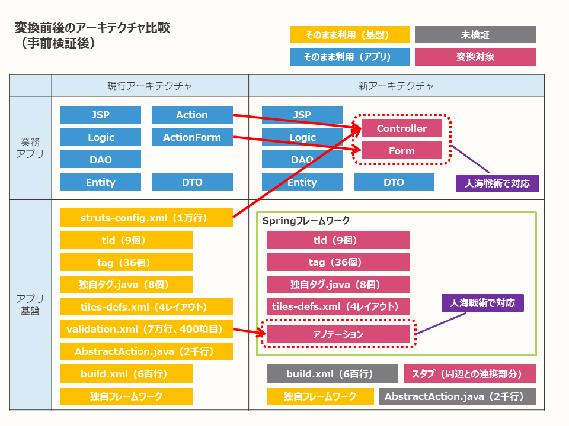
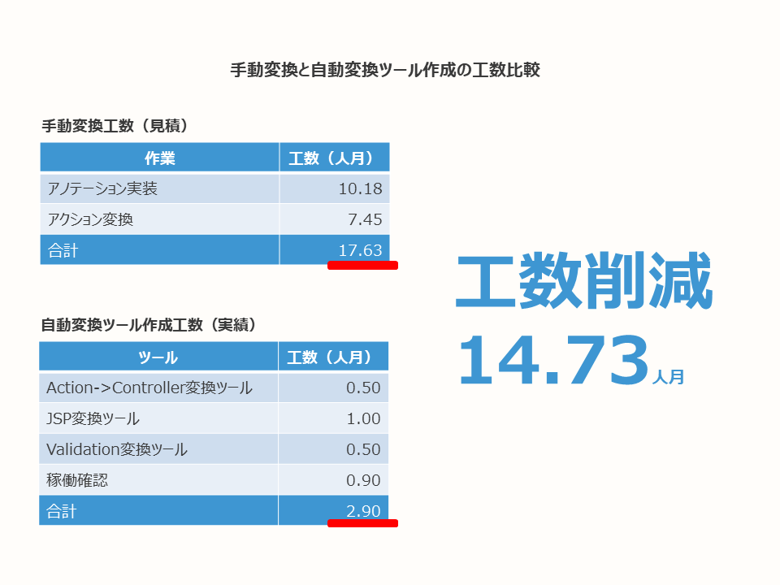

# StrutsからSpring MVCへのマイグレーション事例

- [はじめに](#introduction)
- [TL;DR](#tldr)
- [背景](#background)
- [全体の進め方](#overview)
- [提案](#proposal)
- [要件定義](#requirement-definition)
- [製造](#build)
- [結合テスト](#it)
- [結果](#result)

## <a name="introduction">はじめに</a>

このドキュメントは、あるプロジェクトにおけるフレームワークのマイグレーションを事例としてまとめたものになります。
このプロジェクトでは、StrutsからSpring MVCへの置き換えを行いました。

本ドキュメントがフレームワークのマイグレーションの例として、
今後開発を行うシステムやプロジェクトの参考情報となることを目的としています。

なお、このドキュメントに記載しているシステムは開発を終え本番移行中で、もう少しで実際に運用が始まります。
テスト等本番移行に必要な作業は全て完了していますが、実運用はこれからになります。
その点については、ご留意のうえ、事例としてドキュメントを参照いただければと思います。

## <a name="tldr">TL;DR</a>

- StrutsからSpring MVCへのマイグレーションプロジェクトを実施し、遅延することなく、計画通り開発を終えました。
  - システム要件（機能要件、セキュリティ要件、非機能要件など）は現行踏襲でした。
- フレームワークのマイグレーションのみ実施するため、変換方法とテスト方法の検討を重点的に実施するよう進めました。
- 提案、要件定義で事前検証や現行調査を行い、技術リスクを低減し、最終的に自動変換ツールを作成し工数削減しました。
- テストについては現行アプリと新アプリを比較する現新比較テストがメインなので、
  パイロット開発を行い現新比較テストの手順を事前に検証してから実施することで、
  単体テストと結合テストで品質を安定させることができました。

## <a name="background">背景</a>

この事例の対象となったシステムは、入会申込や会員向けサービスを提供するコンシューマー向けのシステムです。
公式のメンテナンスが終了しているStruts 1.1がこのシステムで使われており、
新たな脆弱性が見つかりセキュリティを脅かすリスクがあるため、
フレームワークのマイグレーションを行うプロジェクトが立ち上がりました。

Strutsからの乗り換え先となるフレームワークとしては、
公式のメンテナンスが活発で、現行のソースコードとの親和性が高い、Spring MVC（4.3.20.RELEASE）が採用されました。

このような背景から、プロジェクトは次の特徴があります。

- アプリケーションフレームワークのマイグレーションプロジェクト。
- システム要件（機能要件、セキュリティ要件、非機能要件など）は現行踏襲とする。
- 現行ソースコードのリファクタリングは原則実施しない。

対象システムのプロフィールと開発期間を示します。

- 対象システム
  - 入会申込や会員向けサービスを提供するコンシューマー向けシステム
- システム構成
  - OS：Red Hat Enterprise Linux 5.6
  - アプリケーションサーバー：WebSphere Application Server 7.0
  - JDK：JDK1.6.0 SR2 (IBM)
  - アプリケーションフレームワーク：Struts 1.1、独自フレームワーク（Web以外）
  - DB：Oracle 11.2.0.1
- システム規模
  - 画面数：約400画面
  - ソースコード行数
    - Java：145KSLOC
    - JSP：82KSLOC
    - XML：102KSLOC
- 開発期間
  - 提案：2ヶ月
  - 要件定義：3ヶ月
  - 製造：4ヶ月
  - 結合テスト：3ヶ月
  - システムテスト・本番移行：3ヶ月

画面数やソースコード行数に記載の通りの規模のため、フレームワークのマイグレーションだけであっても、
見積りや進め方を間違えると開発が大きく停滞する可能性があり、リスクが高いプロジェクトでした。

マイグレーション後のシステム構成は、Strutsを除き、現行と同じになります。
次期案件としてインフラ/ミドルウェア更改の案件が控えているため、今回は先行してStrutsのみ置き換えました。
マイグレーション後のシステム規模については、[結果](#result)の対応規模を参照ください。

## <a name="overview">全体の進め方</a>

今回のプロジェクトはフレームワークのマイグレーションとそれに伴うアプリケーション改修のみ実施し、
その他は現行踏襲になります。
そのため、開発作業の大半が変換作業とテストで占められるので、
プロジェクトは変換方法とテスト方法の検討を重点的に実施する方針で全体の進め方を決めました。

プロジェクトで実施した工程と作業を以下に示します。
システムテストはお客様が実施するため、以下に含まれていません。

- 提案
  - 事前検証
  - テスト方針の合意
- 要件定義
  - 現行調査
  - 動作確認
  - 基盤部品の作成
  - 変換ツールの作成
- 製造
  - 稼働確認
  - パイロット開発
  - 現新比較テスト（1リクエスト単位、画面遷移を網羅）
- 結合テスト
  - 現新比較テスト（機能単位、業務パターン/データパターンを網羅）

提案時点から事前検証を行い、技術リスクをつぶし込むような進め方を実施しました。
さらに、要件定義や製造に入ってからも、先行して技術リスクをつぶし込むように、
動作確認や稼働確認、パイロット開発を実施しました。
この結果、今回のプロジェクトは、遅延することなく、計画通り開発を終えることができました。

ここから、各工程の作業内容についてポイントを説明します。

## <a name="proposal">提案</a>

### <a name="proposal-study">事前検証</a>

はじめは、提案に向けて、机上検証のみで見積りを実施しようとしましたが、
実際に変換作業を実施する事前検証を行うことにしました。
これは、Spring MVCの場合、自由度が高いフレームワークのため変換方法にいくつかの選択肢があり、
この選択肢の評価をせずにどれかの方法を採用するのはリスクが高いと判断したためです。

#### 目的

- 見積の精度向上のために、実際に変換作業を実施して、
  リスクが高いポイントに関する変換方法や変換時の制約の洗い出しを行う。

#### 検証内容

- 変換方法は複数の選択肢を挙げて、検証対象とする方法を一旦選択する。（基本的に対応コストが小さいものを選択する）
- 選択した方法で実際にStruts→Spring MVC変換を実施してみる。
- 見積りに影響が大きいポイントを中心に検証し、選択した方法の制約を洗い出す。（カスタムタグ／バリデーション／DBアクセスなど）
- 変換作業と作成が必要となる基盤部品のボリュームを算出する。

#### 検証結果

- 画面遷移
  - StrutsのActionクラスからSpring MVCのControllerクラスに変換する。
  - struts-config.xmlに存在した遷移情報は各Controllerクラスに移行する。
- バリデーション
  - VlidatorPluginを使用して行っていたバリデーションはBeanValidationに置き換える。
  - validation.xmlの設定からBeanValidationに必要なアノテーションクラスを実装する。（validation.xmlからアノテーションへの変換）
  - ActionFormクラスはValidatorFormクラスの継承を削除しFormクラスに変換して、BeanValidation用のアノテーションを追加する。
- 画面（JSP）
  - 現行で使用されているStrutsのカスタムタグと同じ処理を行うJSPタグを新規作成することで、JSPを変換することなく移行する。

### <a name="proposal-test-policy">テスト方針の合意</a>

フレームワークのマイグレーションのみ実施する方針であるため、
プロジェクトの作業工数の大半が変換作業とテストで占められます。
見積もりに大きく影響するテストについても、提案で方針を決めることにしました。

なお、テスト方針の作成では、[テスト種別＆テスト観点カタログ](https://fintan.jp/?p=45)を使って全体の整理を行っています。

#### 目的

- 各工程のテストで実施する内容をPJ内で合意する。
- 各工程で実施するテスト内容を合意することで、見積もりが過少、もしくは過剰になることを防ぐ。

#### 作業内容

- ソースコード変換の方針から各工程のテストで実施すべきテスト観点をあげる。
- スケジュールなどを考慮して実施可否を判断する。

#### 作業結果

提案時点に合意したテスト方針は以下のとおりです。

ここで決めたテスト方針は全体テスト計画のベースとなります。

単項目バリデーション、画面の表示バリエーション（Logicタグなど）、JavaScriptは、結合テストで実施することにしました。
設計書がメンテナンスされておらず、業務の有識者でなければテストケースを作成できない状態でしたが、
そのテストケースの作成が製造工程に間に合わなかったためです。

## <a name="requirement-definition">要件定義</a>

### <a name="requirement-definition-study">現行調査</a>

提案時点で事前検証を行っていますが、ソースコード全量を確認したわけではありません。
そのため、想定外のパターンや移行方法が未検討のものが存在します。
これらに対処するため、現行調査ではソースコード全量に対して机上で調査・確認を行いました。

#### 目的

- 想定した変換方法で移行できるかを確認する。
- 想定した規模で開発できるかを確認する。
- ソースの変換ルールを策定する（自動化検討を含む）。

#### 作業内容

- 提案時点の構成で現行踏襲が可能かどうかを調査・確認する。
  - 例えば、BeanValidationを使用して単項目バリデーションを実施した場合に、
    現行仕様を踏襲できるのかを調査・確認する。
- 提案時点では未検証のものについて変換方法を確定させる。
  - 例えば、現行ではStrutsのTOKEN（二重サブミット防止）を使用しているが、
    Spring MVCに移行した場合にどうするのかを確定させる。
- ソースコードの変換ルールを策定し、自動変換できるかの検討も行う。

#### 作業結果

次の動作確認の対応結果と同じとなるため、省略します。

### <a name="requirement-definition-check">動作確認</a>

提案時点で行った事前検証での動作確認は非常に限定的なものです。
また、現行調査は机上調査であるため、実際にやってみないと分からないという思いがあり、調査結果に確信を持てません。
そのため、実際にSpring MVC構成で動作させて確認を行うことにしました。
全ての処理で確認は行えないため、代表的な処理パターンを抽出して確認を行うことにしました。

#### 目的

- 想定したSpring MVCの構成でシステムの代表的な処理パターンを疎通させる。
- 先行で検証することでリスクを低減する。
- 現行調査結果（変換方法）に問題がないかを判断する。

処理パターンは、システムのI/Oに着目して抽出しました。
以下は処理パターンの例です。

- 画面入力 + DB
- ファイルアップロード
- ファイルダウンロード
- 外部システム連携

#### 対応内容

- Spring MVCの構成で代表的な処理パターンの疎通確認を実施する。
- 疎通確認では必要な部品のみ準備して確認を行う。
- 現行調査で確定させた変換方法を試行して動作確認を実施する。

#### 対応結果

- 画面遷移
  - StrutsのActionクラスからSpringのControllerクラスへ変換する方針に変更はないが、
    現行調査により一括変換するツールを作成して対応できる見込みが立ったため、自動変換する方針に変更する。
    - Actionクラスにはほとんど業務ロジックが存在しないため、Actionクラス→Controllerクラスの変換が容易だった。
    - 業務ロジックはLogicクラスに存在し、ActionクラスではLogicクラスの呼び出しのみが存在していた。
- バリデーション
  - BeanValidationをやめて、SpringValidatorを使用する。
    - 現行では1つのActionFormクラスが複数の画面遷移で使用され、かつ遷移によってチェック内容が異なっていた。
    - このため、現行仕様を再現するには、バリデーション処理やエラーメッセージの順序制御ができないBeanValidationよりも
       SpringValidatorの方が適切であると判断した。
  - validation.xmlから一括変換するツールを作成して対応できる見込みが立ったため、自動変換する方針に変更する。
- 画面（JSP）
  - JSPタグを新規実装する方針から既存部品（JSTL、Springタグ）を流用する方針に変更する。
    - 動作確認において、Strutsタグの代替を既存部品（JSTL、Springタグ）と
      既存部品のカスタマイズで行えることが分かったため、方針を変更した。
    - JSPタグを新規作成するよりも、流用する方が低リスクだと判断した。
  - Strutsタグから代替するタグへの変換もツールを作成して対応できる見込みが立ったため、自動変換する方針に変更する。
- 未検証部品
  - 提案時点では、未検証だった部品の変換方針を確定した。
  - Antを使用したビルドはMavenに変更、AbstractActionにあった共通処理はSpringAOP、ViewResolverで実現する。

### <a name="requirement-definition-component">基盤部品の作成</a>

#### 対応内容

現行調査と動作確認の結果をもとに、個別に作成が必要な部品を作成しました。
JSPタグ、Strutsに依存していた部品が主な対象となります。
作成した部品は単体テスト（JUnit）を実施しました。

### <a name="requirement-definition-tool">変換ツールの作成</a>

#### 対応内容

現行調査と動作確認の結果をもとに、変換ツールを作成しました。

作成した変換ツールは以下となります。

- Action->Controller変換ツール
  - Actionクラス、struts-config.xmlをインプットに、ActionクラスをControllerクラスに変換する。
- JSP変換ツール
  - JSPで使用されているStrutsタグ、独自タグを変換する。
- Validation変換ツール
  - validation.xml、validation-rule.xmlをSpringValidator実装クラスに変換する。

変換内容のイメージを以下に示します。

ツールで出力されたJava、JSPのテストは次工程で実施します。
要件定義工程では、コンパイルチェック、机上チェック、および限定的な動作確認のみを実施しました。

## <a name="build">製造</a>

### <a name="build-check">稼働確認</a>

各ソースコードを結合した検証は、後続の現新比較テストで実施する予定ですが、
基本的な機能（ログイン、メニューなど）が動作しないとテストを円滑に進めることができません。
特に自動変換したソースコードの検証は、机上チェック、および限定的な動作確認しか行っていないため、
自動変換したソースコードの品質リスクは高いです。このため、リスク低減策として、稼働確認を実施しました。

#### 目的

- 個別に作成した部品（JSPタグ、共通クラスなど）、および自動変換したソースコードを結合して稼働確認を実施し、
  後続に控えている現新比較テストの実施が円滑に行える品質を担保する。

#### 対応内容

- 品質リスクが高い自動変換したソースコードの種類やパターンを網羅するように稼働確認を実施する。
- 不具合が検出された場合は、自動変換ツールを修正して対応する（自動変換したソースコード自体の修正は行わない）。

ソースコード毎の確認内容は以下になります。

- JSP
  - 使用されているタグ、およびタグの属性を網羅させる稼働確認を実施する。
- Controller
  - もともとのActionクラスの実装にパターンがあり、このパターンを網羅させる稼働確認を実施する。
- SpringValidator
  - 現行で使用されているValidationルールを網羅させる稼働確認を実施する。

### <a name="build-pilot">パイロット開発</a>

現新比較テストはすべてオフショアに委託する予定だったため、
現新比較テストの手順に問題がないかを事前に検証しました。

#### 目的

- 現新比較テストの手順確認、課題を洗い出す。
- 洗い出された課題へ対応する。
- パイロット開発の実施メンバーからのフィードバックを取り込む。
- オフショアメンバーを教育する。

#### 対応内容

- 実際に現新比較テストの実施フロー（テスト実施から受入検証まで）を複数回試行して、フィージビリティを確認する。
- テスト実施、レビューはオフショアメンバーが実施し、受入れはオンサイトメンバーが実施する。
- 実施中に検出された不具合（テスト実施ガイド不備、検証ツール不備など）は随時対応する。

### <a name="build-now-new-test">現新比較テスト</a>

現新比較テストでは、テスト方針に従いテストを実施し、現行アプリと新アプリで一致するかを確認します。
1リクエスト単位に現行システムと差異が発生しないことを確認します。

設計書がメンテナンスされていない可能性があったため、
実際に動作させた結果を比較することで現行踏襲できているかを確認することにしました。

#### 対応内容

- 開発者のローカル環境に現行アプリと新アプリを構築して、
  同じオペレーション（画面遷移）を行った場合の結果が一致することを確認する。
- 対象とする遷移は全画面遷移、リクエスト単位で以下の結果を現新比較する。
  - 現新での画面デザイン
    - 画面遷移前後の画面キャプチャを取得して、現新で一致することを確認する。
    - 画面キャプチャ（PNGファイル）の比較には、 WinMerge を使用する。
  - 現新での実行結果DB
    - 画面遷移前後のDBダンプを取得して、現新で一致することを確認する。
    - 取得したDBダンプの現新比較は、プロジェクトで作成したツールを使用して実施する。
  - 現新でのHTML
    - 画面遷移前後のHTMLを取得して、現新で一致することを確認する。
    - 取得したHTMLの現新比較は、プロジェクトで作成したツールを使用して実施する。

## <a name="it">結合テスト</a>

### <a name="it-now-new-test">現新比較テスト</a>

単体テストで1リクエスト単位の現新比較を行ったので、
結合テストでは機能単位（複数リクエストの結合）の現新比較を行いました。
また、単体テストで網羅できていない業務パターン、データパターンを網羅しました。

#### 目的

- テスト方針（テスト計画）に従いテストを実施し、現新で一致するかを確認する。
- 機能単位に現行システムと差異が発生しないことを確認する。
- 業務パターン、データパターンを網羅する。

#### 対応内容

- 結合テスト環境に現行アプリと新アプリを構築して、現新比較テストを実施する。
- 基本的に単体テストで実施した内容と同じ。ただし、確認の単位が複数リクエストになる。
- また、入力項目が多い入会系の機能は Selenide を使用してテストを自動化する（＊１）。
- 自動テストでは現新のアプリに同じオペレーションを実施した後に、画面キャプチャ、DB、HTMLの比較を行う。
- 自動テストではアサートは行わず、比較結果を担当者が目視で確認し、合否を確認する。

※１ 次期案件としてインフラ/ミドルウェア更改の案件が控えているので、その時に流用する目的もあり、Selenideを使用したテスト自動化を行いました。

## <a name="result">結果</a>

冒頭にも書きましたが、上記に記載した進め方で、計画通り開発を終えることができました。
特に、以下の点も開発の成功に寄与したと考えています。

- 提案や要件定義工程でStrutsやSpringに精通しているハイスキルなエンジニアをアサインできた。
  提案前の事前検証は3名であり、10人日で実施した。
- 提案時にテストの方針を合意しており、テスト全体計画の作成が円滑に進んだ。
- 要件定義工程でしっかりとした現行調査と動作確認で自動化の目途を立てることができた。
- 現新比較テストの手順を事前検証し、単体テストと結合テストで品質を安定させることができた。

最後に、対応規模と、手動変換と自動変換ツール作成の工数比較を示します。
これは、あくまで今回のプロジェクトによる実績値なので、他のプロジェクトに当てはまるものではありませんが、
今回の事例のイメージを掴んでもらうための参考情報として示しています。

※SLOCの集計は[かぞえチャオ！](http://ciao-ware.c.ooco.jp/ft_manu.html)を使用しています。

今回のように、古いフレームワークを使用しているために、マイグレーションが必要となるシステムは今後も発生します。
今後開発を行うシステム、プロジェクトに、本ドキュメントに記載したマイグレーションの進め方や作業内容の事例が参考になればと思います。
