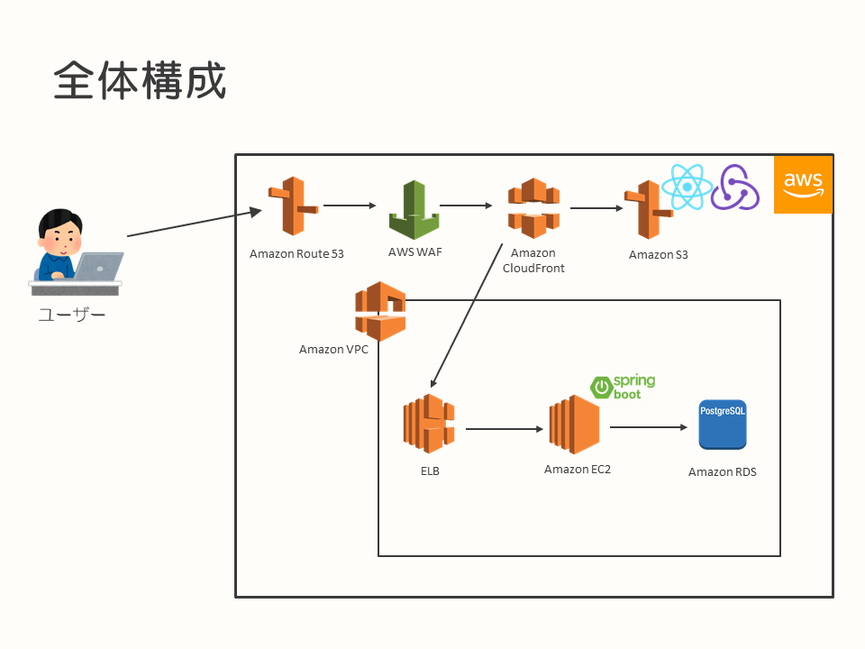
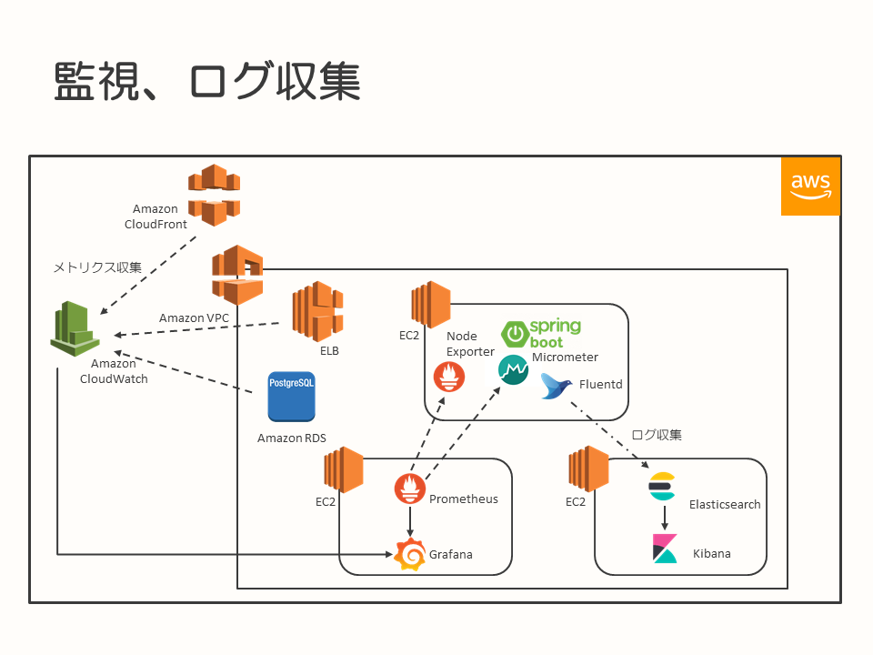
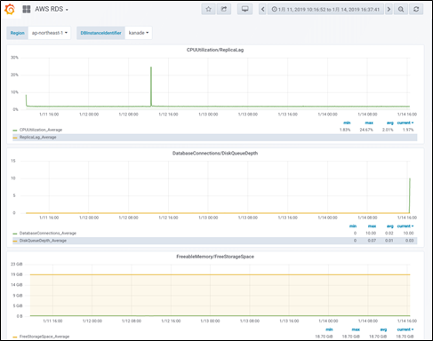
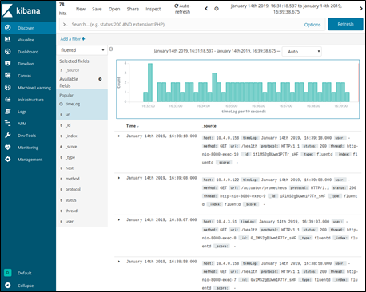

# モニタリング、監視、ログ収集の実践例（AWS）

* [はじめに](#introduction)
* [TL;DR](#tldr)
* [背景](#background)
  * [システムの稼働状況を確認する、とは](#system-status)
  * [アプリケーションの利用状況を確認する、とは](#application-status)
* [構成](#constitution)
  * [システム全体構成](#system-constitution)
  * [採用するミドルウェア、AWS上のサービスの検討](#using-middleware-and-service)
    * [メトリクス収集・可視化・監視](#monitoring)
    * [ログ収集・可視化](#log-collect)
* [まとめ](#summary)

## <a name="introduction">はじめに</a>

このドキュメントは、クラウド上に構築したシステムの、メトリクスの収集から監視、ログの収集の実践例をまとめたものになります。利用したクラウド環境は、Amazon Web Services（AWS）です。

本ドキュメントが、AWS上で開発するシステムのメトリクスやログの収集、監視を行う例として、今後開発を行うシステム、プロジェクトの参考情報となることを目的としています。

なお、このドキュメントに記載しているシステムは開発中のものであり、実際に運用されているシステムではありません。テストなどで品質を高めていく活動についても、これからになります。その点については、ご留意のうえ、構成例としてドキュメントを参照いただければと思います。

このドキュメントは、[SPA＋REST APIのシステム構成例（AWS）](../spa-rest-api-system-design-on-aws/README.md)のモニタリング、監視、ログ収集の部分にフォーカスして記載したものです。

## <a name="tldr">TL;DR</a>

このドキュメントに記載しているシステムにおける、モニタリング、監視、ログ収集については、以下の内容でAWS上に構築を行いました。

* シンプルなSPA＋REST APIで作成したシステムを、AWS上に構築・環境展開
  * フロントエンドはReact＋Redux、サーバーサイドはSpring Bootで実装
* サーバーサイド（REST API）は、EC2インスタンス上で実行
* フロントエンド（SPA）に関するコンテンツはAmazon S3上に置き、さらにAmazon CloudFrontを前段に配置
* メトリクスの収集と可視化、監視
  * EC2およびEC2上で動作しているアプリケーションのメトリクスは、Prometheusで収集
  * AWSのサービスのメトリクスは、CloudWatchで収集
  * PrometheusおよびCloudWatchにより収集したメトリクスを、Grafanaで可視化、アラート通知
* ログの収集と可視化
  * REST APIが出力するアクセスログを、Fluentdで読み込み、Elasticsearchへ送信
  * Elasticsearchに保存したログデータを、Kibanaで可視化

## <a name="background">背景</a>

このドキュメントの事例となったプロジェクトの背景は、[SPA＋REST APIのシステム構成例（AWS） - 背景](../spa-rest-api-system-design-on-aws/README.md#背景)に同じです。社内の開発案件における、プロジェクト内、チーム内の課題解決を行うためのシステム開発を行うことになりました。

今回のプロジェクトでは、開発を行う過程で技術的なチャレンジに取り組み、スキルアップを行うことも効果として睨んでいます。今回はSPA＋REST APIでアプリケーションを構築し、システムの稼働状況、アプリケーションの利用状況もモニタリング、監視できるような構成を、AWSのサービスや昨今のトレンドとなっているミドルウェアを利用して実現する方針としました。

また、実際にシステムを運用することを踏まえると、システムの状態を収集してモニタリング、異常が発生していないか監視を行う必要があります。また、システムがどのように利用されているかを把握するための情報を集め、改善のインプットとしてシステムをより良くしていくための活動も必要です。

これらの背景から、今回開発するシステムに導入する、メトリクスやログの収集、監視や可視化を行う仕組みの検討を行いました。

#### <a name="system-status">システムの稼働状況を確認する、とは</a>

システムを構成する要素、たとえばアプリケーションが稼働しているサーバーから、OSから見たCPU使用率・メモリ使用量・ディスク使用率といった情報、アプリケーションが使用しているメモリ使用量・スレッド数・レスポンスを返すまでにかかった時間といった情報を収集します。これらの値を確認することで、システムが正常に動作しているか、異常な兆候を示していないかを把握しておくことが必要です。

これらのシステムに関する情報をメトリクスと呼び、収集して可視化などを行い、システムの状態を確認します。

また、システムが異常な状態になってしまった時、もしくは異常な兆候を示した時にアラート通知し、正常な状態に復旧させる必要があります。こちらは、監視の仕組みを導入して実現します。

#### <a name="application-status">アプリケーションの利用状況を確認する、とは</a>

システムは開発してリリースして終わりではなく、リリース以後も継続して改善していくことになります。このため、システムがどのような使われ方をしているか、新機能をリリースしたら効果があったかといった情報を確認し、次の改善につなげていく活動が重要です。

この情報を得るために、アプリケーションなどから出力するログに記録された情報を収集、分析します。

ログには、分析に行うために必要な情報が記録されていなければなりません。たとえば、アクセスされたURLやユーザーに関する情報、イベント（商品を購入した）に関する情報などがあります。

これらの情報を収集し、可視化することで、システムがどのように利用されているかを分析することができ、次の改善を行うためのインプットとして活用できます。

## <a name="constitution">構成</a>

### <a name="system-constitution">システム全体構成</a>

アプリケーションを動作させるための、システム全体の主要な構成要素は、以下の通りです。

* シンプルなSPA＋REST APIで作成したシステムを、AWS上に構築・環境展開
* REST APIをAmazon EC2で動作させ、前段にELBを配置
* データベースはRDSを利用
* フロントエンドのコンテンツは、Amazon CloudFrontを経由してAmazon S3から取得
* システムへは、Amazon Route 53により付与した名前でアクセス

### <a name="using-middleware-and-service">採用するミドルウェア、AWS上のサービスの検討</a>

今回構築したアプリケーションに対して、アプリケーションに対して導入したメトリクスおよびログ収集、可視化、監視に関する構成にフォーカスした要素および図は、以下のようになります。

* メトリクス収集、可視化、監視
  * Prometheus
  * Amazon CloudWatch
  * Grafana
* ログ収集、可視化
  * Fluentd
  * Elasticsearch
  * Kibana

以降、各種要素について記載します。

#### <a name="monitoring">メトリクス収集・可視化・監視</a>

ここでは、システムのメトリクスを収集して、モニタリングをする仕組み、また監視の仕組みについて記載します。

昨今のトレンドと、技術習得の目的を鑑みて、今回のシステムでは動作するアプリケーションのメトリクス収集をPrometheus、収集したメトリクスの可視化およびアラート通知にはGrafanaを採用することにしました。

Prometheusによりメトリクスを収集する対象は、EC2上に構築されたREST APIとなります。アプリケーション自身および、アプリケーションが稼働しているEC2からの情報取得は、以下のように行いました。

* アプリケーションはSpring Bootを使用しており、Micrometerを使用してPrometheus向けにメトリクスをエクスポート
* OSから取得できる情報は、Node Exporterを使用してPrometheusにエクスポート

Prometheus自体は、アプリケーションとは別のEC2インスタンス上に構築しています。Prometheusのメトリクス収集の方向は、Prometheusからアプリケーション（Micrometer）やEC2（Node Exporter）といったメトリクス収集対象に対してアクセスしに行く向きとなります（Pull型）。Prometheusから各種リソースに対してアクセスを行い、メトリクスを収集します。収集対象のリソースは、Prometheusに対してメトリクスを提供するエンドポイントを公開します。

このため、Prometheusが稼働しているサーバーから、メトリクス収集対象のサーバーに対してアクセスできる必要があります。

また、今回のシステムではAWSのサービスを利用して構築しています。CloudFrontやELB、RDSなどといったサービスのメトリクスは、Prometheusでは収集できません。これらのサービスに対しては、CloudWatchによりメトリクス収集を行っています。

PrometheusおよびCloudWatchにより収集したメトリクスは、Grafanaにより可視化を行い、閾値を設定した上で必要に応じてアラート通知を行うように設定しました。

Grafanaは、複数のデータソースを元にしてデータを抽出し、可視化やアラート通知に利用できます。今回は、PrometheusおよびCloudWatchがデータソースとなっています。

#### <a name="log-collect">ログ収集・可視化</a>

ここでは、アプリケーション（REST API）が出力するログを収集し、データとして蓄積、可視化する仕組みについて記載します。

アプリケーションに対しては、アクセスログを出力するように設定を追加し、ログの収集自体はメジャーなログコレクターであるFluentdを採用しました。またFluentdが読み込んだログは検索機能に優れたElasticsearchへ保存、Kibanaを使用して可視化、ログ分析を行う構成としました。

Spring Bootアプリケーションにおける、アクセスログの出力するための設定は、[Fintan](https://fintan.jp/)にて公開されている、以下のドキュメントを参考にしてください。

[Springアプリ開発ノウハウ集 - 画面やAPIでTomcatのアクセスログを出力する](https://fintan-contents.github.io/spring-crib-notes/latest/html/common/log/web-access-log.html)

参考ドキュメントにも設定例として記載されていますが、今回はアクセスログをLTSV形式で出力し、FluentdではLTSVとして出力されたログをパース、Elasticsearchに送信するように設定しています。

今回は各構成要素に対する技術習得も兼ねたため、AWSのサービスを利用するのではなく各要素をEC2にインストールして構築しました。

## <a name="summary">まとめ</a>

今回の事例は、まだ本番稼働していないシステムであり、残念ながら実際にユーザーが利用し、運用までを実践した結果は含まれていません。

開発中における動作確認、テストにおいて、構築した各ソフトウェアを連動させ、メトリクスやログの収集、可視化、監視までが実現できることは確認できています。

今後、収集するメトリクスやログの内容の整理、分析などの整理を行い、精度を高めていく活動を実施していく予定です。

システムを運用するにあたり、メトリクスの収集や監視、アプリケーションの利用状況を測るために分析する仕組みは必要なものだと考えます。今後開発を行うシステム、プロジェクトに、本ドキュメントに記載した内容が事例として参考になればと思います。
