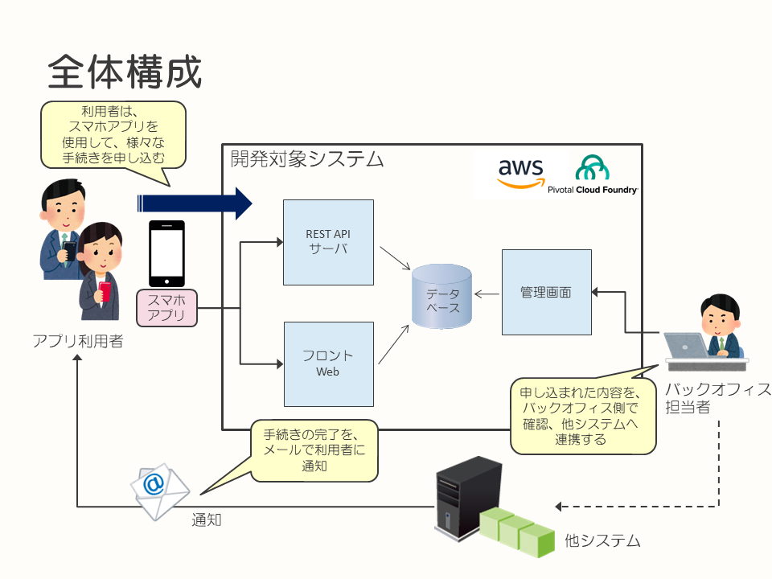
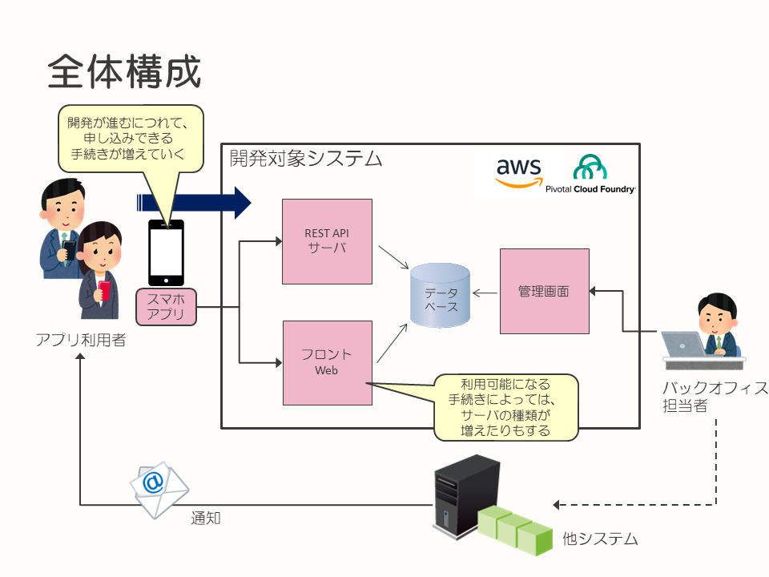
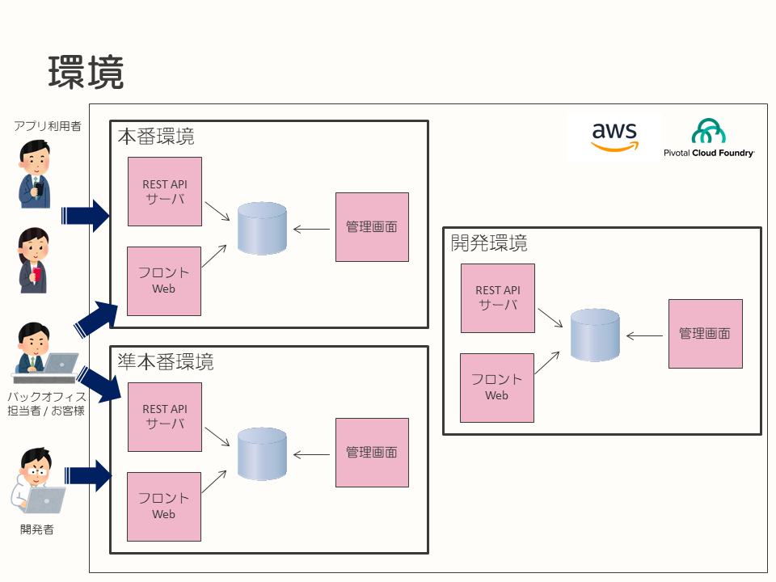
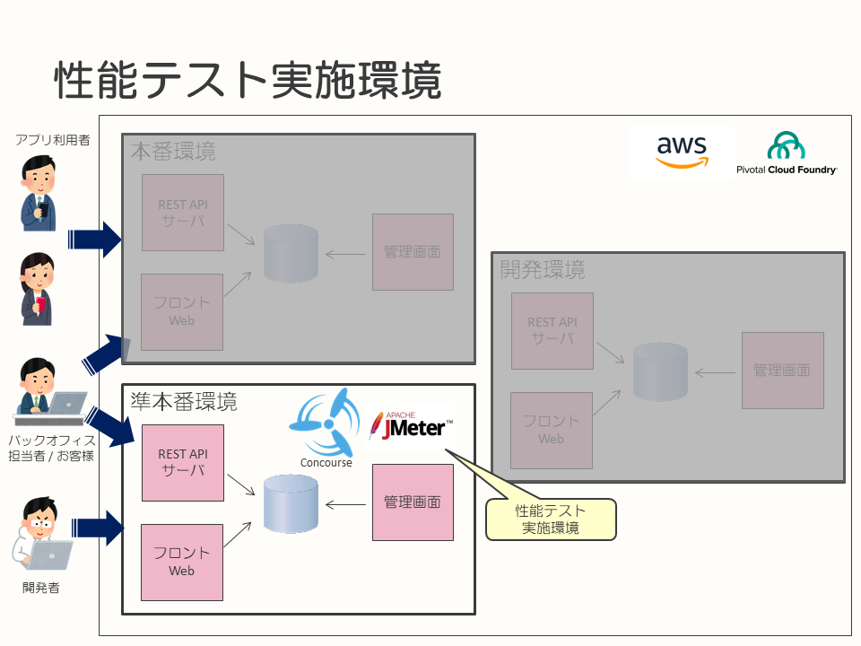
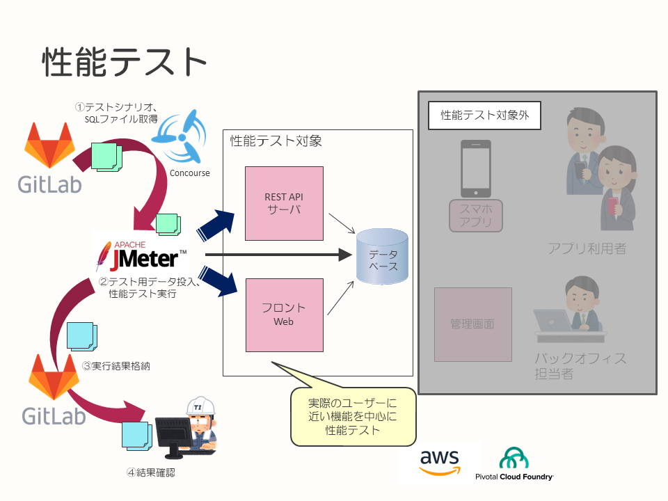
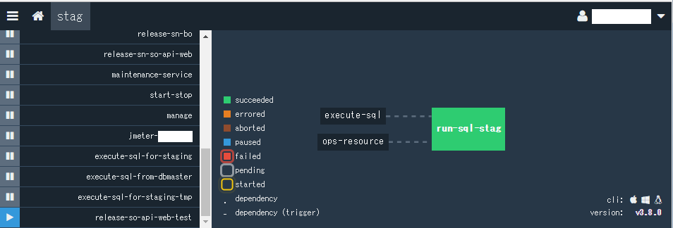
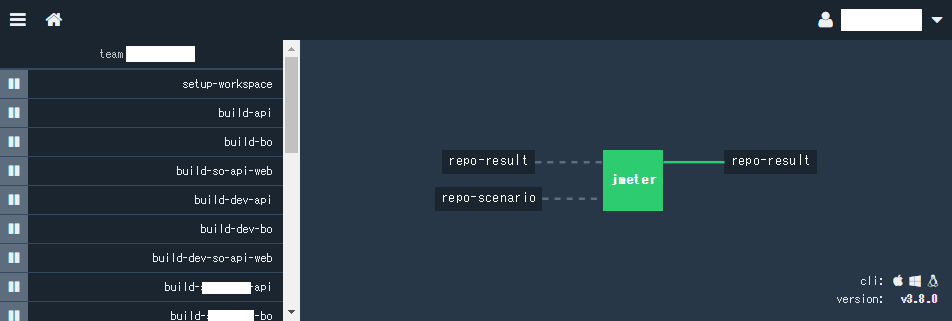

## 性能テスト自動化事例

* [はじめに](#はじめに)
* [プロジェクト概要／全体構成](#プロジェクト概要全体構成)
* [性能目標](#性能目標)
* [性能テスト自動化のねらい](#性能テスト自動化のねらい)
* [テスト実施環境](#テスト実施環境)
* [性能テストシナリオ](#性能テストシナリオ)
* [CI環境での自動実行／結果の確認](#CI環境での自動実行結果の確認)
* [まとめ](#まとめ)

---

### はじめに

このドキュメントは、あるプロジェクトにおける性能テストの自動化への取り組みを、事例としてまとめたものになります。

本ドキュメントが、性能テスト自動化に取り組む際のアプローチや採用技術についての参考情報となることを目的としています。

### サマリ

* 今後の機能追加を見越して繰り返し性能テストをできるようにした
* 性能テストにはJMeterを利用し、テストの起動はConcourse CIを利用した
  * ConcourseのUIから手動でジョブ起動
  * データのクリーニングと投入は性能テストの前処理として実行
* テスト結果のレポートはGitLabのリポジトリに格納
* テスト結果のレポートは目で確認する
  * 自動で検証するような仕組みは用意していない
    * プロジェクトAでは、これで必要十分と判断した

### プロジェクト概要／全体構成

このドキュメントで取り上げるプロジェクト（以降、プロジェクトAと記載）の概要を、記載します。

**プロジェクトAの概要**

プロジェクトAにおける、システム全体の構成イメージを、以下に記載します。



* 目的
  * もともとお客様（プロジェクトAのオーナー）とそのお客様（エンドユーザー）の間で、実店舗の窓口で紙などによって行われていた手続きをスマホアプリに置き換える
  * 手続きには、登録している利用者の住所変更などがある
  * スマホアプリとして提供することで、エンドユーザーにより気軽に手続きを行いやすい環境を提供する
* ユーザーから見たスマホアプリ
  * 店舗の窓口で実施していた手続きを、実店舗に行かず、スマホアプリで実施できる
  * 実店舗に行く必要はなくなるが、手続きに必要な情報を提供するため、手続きの種類によっては写真を撮影してアップロードを実施するものもある
  * 実施した手続きは、スマホアプリから履歴確認できる
  * アプリケーションのバージョンアップに伴い、次第にスマホアプリで実施可能な手続きが増えていく
* スマホアプリを介したバックオフィス側の業務
  * エンドユーザーがスマホアプリを使用して手続きを行うと、スマホアプリの連携先となるサーバー側のアプリケーションが受け付け、手続きで入力された内容を保存する
  * 保存された手続きのデータは、バックオフィス担当の方が管理画面により確認し、受け付け可能かを確認する
  * 問題のないデータについては、管理画面よりダウンロードを行い、データを別システムへ連携する
  * この後、別システムにより実際の手続きが進められ、完了するとエンドユーザーに通知され、結果を確認できる

**システムの構成要素**

プロジェクトAを構成する、システム的な要素を以下に記載します。

* スマホアプリはネイティブアプリケーションとして構築され、iPhoneおよびAndroid端末に提供されます
* サーバー側は、スマホアプリからWebViewで参照される画面を持つアプリケーションや、REST APIを提供するサーバーにより構成されています
* バックエンド側は管理画面が構築されており、スマホにより入力されたデータはデータベースを介して参照・更新を行います
* サーバー側およびバックエンド側の環境は、IaaSとしてAWS、PaaSとしてPivotal Cloud Foundry（PCF）を展開し、その上にサーバーアプリケーションが構築されています

**プロジェクトAの特徴**

このプロジェクトには、以下のような特徴があります。

* システム化したい手続きがいくつもある
  * 最初のリリース以降も継続して開発を行い、エンドユーザーが利用可能な手続きを追加していく
  * リリースサイクルは不定で、リリースしたい機能の塊が完成次第リリースしている
    * 現状、月1, 2回程度の頻度でリリース
    * リリース前に性能テスト実施が必要
* 手続きが追加されてもスマホアプリはひとつであり、スマホアプリのバージョンアップやサーバー側のアプリケーションでの機能追加により拡張していく



最初のリリースでプロジェクト完了ではなく、その後に利用できる手続きを増やしていく、継続的に開発が行われていくプロジェクトとなります。

本ドキュメントには、最初のリリースが終わり、2つ目の機能の開発の途中までに実施された取り組みを反映しています。

### 性能目標

元々が実店舗で行っていた手続きをスマホアプリ化したものなので、大量のアクセスが想定されるようなシステムではありません。

性能目標としては、以下を目標値としています。

* サーバー側のレスポンスが特定の重い処理を除いて1秒以内であること
* 1,000件/日のリクエストを捌けること
  * 高アクセスが想定されるシステムではないが余裕を見た数字で実施

### 性能テスト自動化のねらい

プロジェクトAでは、エンドユーザーに対して利用可能な手続きを順次増やしていきます。  
今後追加する手続きが、どのような実現・実装方式となるかは未定ですが、既存の手続きと同じ環境に追加されることは十分に想定されます。この時、既存の手続きにも性能に問題がない状態であることを都度確認する必要があります。 そして、その確認範囲には、過去にリリースした手続き分を含む可能性があります。

この繰り返しを効率よく実施するため、性能テストの自動化に取り組みました。

### テスト実施環境

プロジェクトAには、以下の3つの環境が存在します。

| 名称 | 用途 |
|:----|:-----|
| 本番環境 | 開発したシステムが本番稼働する環境 |
| 準本番環境 | 開発・保守用途の環境。冗長構成されていない点を除いて、本番環境と同等の構成 |
| 開発環境 | CI/CD、チケット管理、ソースコードリポジトリなどを含む、開発環境 |



性能テストは、これら3つの環境のうち、準本番環境を使用して実施します。
実施タイミングは、リリースの大体1週間前から開始するようにしています。

並走することは滅多にありませんが、性能テスト実施時は他のテストを実施できません。並走する可能性がある場合は、事前にスケジュールの調整を行います。



PaaSとしてPCFを採用しているので、同じくPivotal社が主に開発している[Concourse](https://concourse-ci.org/)というOSSのCI/CDツールを採用しています。相性の良さもありますが、ジョブやパイプラインなどをYAMLで記述するため、Gitで構成管理できます。

これにより、ジョブやパイプラインのレビューを開発フローに組み込める、属人化の防止、スケールのしやすさなどのメリットがあります。

Concourseはいずれの環境にも設置してあり、アプリケーションのビルド・テスト・デプロイを実行するためのパイプラインが設定してあります。パイプラインとはConcourse上で実行するジョブの定義と、ジョブの実行に必要な設定を定義したもので、設定ファイルとして作成します。

環境によってConcourseに設定してあるパイプラインの内容は異なります。

準本番環境のConcourseは、準本番環境へのデプロイと、Concourse上のジョブとして性能テストを実施するように構成しています。

### 性能テストシナリオ

このドキュメント執筆時には2つの手続きが対象となっているため、それぞれの手続きに対してテストシナリオを作成して、実行しています。

性能テストツールにはJMeterを採用しているので、JMeterのシナリオとして作成しています。JMeterは性能テスト用のシナリオが作成できること、過去のプロジェクトでの採用経験があることから採用しました。

テストシナリオには、端末（スマホ）にインストールしたアプリケーションから、サーバーに対する画面表示や画像送信などを行う操作を定義します。

この操作を、以下の条件で実行します。

| 秒間同時リクエスト数 | テスト実行時間 | テスト開始時点のデータ量 |
|:----------------:|:-----------:|:-------------------:|
|  2 req / sec     |    60時間    |     100,000件       |

長時間のテストとなっているのは、システムが大量のユーザーから頻繁にアクセスされるような性質でないことと（[性能目標](#性能目標)参照）、確認内容としてロングランテストの意味合いも兼ねることにしているためです。このため、テストの実行時間（60時間）が長いものになっています。

### CI環境での自動実行／結果の確認

性能テストシナリオを、極力人手を介さずに実行できるように構成します。

ソースコード等はGitLab（Git）を使用して管理しており、この中に以下を含むリポジトリを作成しています。

* 性能テストを実行するApache JMeterの実行環境
* [性能テストシナリオ](#性能テストシナリオ)での実行内容に対応する、Apache JMeterのテストシナリオ
* 性能テストを実施するためのデータのクリーンアップ、データ投入を実行するための、SQLファイルと実行スクリプト

性能テストでは、上述した通りConcourseを使用しています。
Concourseの性能テスト用のジョブは、以下の用に構成されています。

1. GitLabからApache JMeterおよびテストシナリオ、テストデータ投入スクリプトを取得
1. SQLを実行し、データのクリーニングとセットアップを実行する
1. Apache JMeterのテストシナリオを実行し、REST APIサーバーやフロントWebサーバーに対して負荷をかける
1. 性能テストの実行結果である、Apache JMeterのレポートは、GitLabのリポジトリにアップロードする

最後に、アップロードされた結果を、開発者が目視で確認、評価を実施します。

このフローを、以下に図示します。



また、Concourse上でのジョブを表示したものを、以下に記載します。

次は、データのクリーニングおよびセットアップを実施するための、SQLを実行するジョブの様子です。



次は、データセットアップ後に、Apache JMeterで性能テストを実行するジョブの様子です。



これらのジョブは、以下のようなYAMLファイルで作成されています。

execute-sql.yml（データのセットアップを行うConcourseのPipeline定義）  
※一部、内容を加工、削除しています  
※データベースの接続情報などは、`{{}}`でパラメーター化されていますが、これは外部の設定から取り込みます。

```yaml
groups:
- name: stag
  jobs:
  - run-sql-stag

params:
  dbInfoStag: &DB_INFO_STAG
    DB_USERNAME: app_stg_test
    DB_URL: {{availability-maintenance-datasource-url}}
    DB_PASSWORD: ((spring-datasource-password))
    DB_SCHEMA: {{db-schema-stag}}
    SQL_FILE_PATH: execute-sql/run.sql
    CA_CERT_PATH: ops-resource/concourse/sql/ca-bundle.pem
resources:
- name: ops-resource
  type: git
  source:
    uri: {{gitlab-uri-concourse}}
    branch: {{gitlab-branch-master}}
    private_key: ((gitlab-private_key.private_key))
    username: {{gitlab-username}}
    password: ((gitlab-password))
- name: execute-sql
  type: git
  source:
    uri: {{gitlab-uri-execute-sql-for-staging}}
    branch: {{gitlab-branch-master}}
    private_key: ((gitlab-private_key.private_key))
    username: {{gitlab-username}}
    password: ((gitlab-password))

jobs:
- name: run-sql-stag
  plan:
  - aggregate:
    - get: ops-resource
    - get: execute-sql
  - task: runsql
    config:
      platform: linux
      image_resource:
        type: docker-image
        source:
          repository: mysql
      inputs:
      - name: ops-resource
      - name: execute-sql
      run:
        path: ops-resource/concourse/script/run-sql.sh
      params:
        <<: *DB_INFO_STAG
```

実際にSQLを実行するスクリプトは、以下の部分です。このスクリプト中では複数のSQLファイルへの呼び出しが記載されており、データのクリーニング、セットアップが行われます。

```yaml
      run:
        path: ops-resource/concourse/script/run-sql.sh
```

jmeter-pipeline.yml（Apache JMeterのシナリオ実行を行うPipeline定義）  
※一部、内容を加工、削除しています  
※設定情報などは、`{{}}`でパラメーター化されていますが、これは外部の設定から取り込みます。

```yaml
resources:
- name: repo-scenario
  type: git
  source:
    uri: {{gitlab-uri-jmeter-scenario}}
    branch: {{gitlab-branch-master}}
    private_key: ((gitlab-private_key.private_key))
    username: {{gitlab-username}}
    password: ((gitlab-password))
- name: repo-result
  type: git
  source:
    uri: {{gitlab-uri-jmeter-result}}
    branch: {{gitlab-branch-master}}
    private_key: ((gitlab-private_key.private_key))
    username: {{gitlab-username}}
    password: ((gitlab-password))
jobs:
- name: jmeter
  plan:
  - get: repo
    resource: repo-scenario
  - get: result
    resource: repo-result
  - task: run-jmeter
    config:
      platform: linux
      image_resource:
        type: docker-image
        source:
          repository: justb4/jmeter
      inputs:
      -  name: repo
      outputs:
      - name: out
      run:
        path: bash
        args:
        - -c
        - |
          set -e
          cd repo
          echo "==== jmeter start ===="
          export EXPORT_DIR="../out"
          sh run.sh
          echo "==== jmeter end ===="
          cd ../out
          ls
  - task: git-push
    config:
      platform: linux
      image_resource:
        type: docker-image
        source:
          repository: getourneau/alpine-bash-git
      inputs:
      -  name: result #clone用のGit
      -  name: out #前タスクの出力を入力にする.
      outputs:
      -  name: updated-result
      run:
        path: bash
        args:
        - -c
        - |
          set -e
          git clone result updated-result
          cd updated-result
          export TZ=JST-9
          date_dir=`date +"%Y%m%d_%H%M%S"`

          mkdir report/$date_dir

          mv -f ../out/* ./report/$date_dir

          git config --global user.email "xxxxx@email.com"
          git config --global user.name "xxxxx"

          git add -A
          git commit -m "` date +"%Y/%m/%d %H:%M:%S"` Update result"
  - put: repo-result
    params:
      repository: updated-result
```

このYAMLファイルには2つのタスクが定義してあり、Apache JMeterを実行するタスクと

```yaml
  - task: run-jmeter
```

テスト結果をGitLabにアップロードするタスクがあります。

```yaml
  - task: git-push
```

実際の処理を行うスクリプトの呼び出しの部分を、抜粋して以下に記載します。

Apache JMeterを実行するスクリプトを呼び出す部分は、以下になります。

```yaml
      run:
        path: bash
        args:
        - -c
        - |
          set -e
          cd repo
          echo "==== jmeter start ===="
          export EXPORT_DIR="../out"
          sh run.sh
          echo "==== jmeter end ===="
          cd ../out
          ls
```

テスト結果をGitLabにアップロードする部分は、以下になります。

```yaml
      run:
        path: bash
        args:
        - -c
        - |
          set -e
          git clone result updated-result
          cd updated-result
          export TZ=JST-9
          date_dir=`date +"%Y%m%d_%H%M%S"`

          mkdir report/$date_dir

          mv -f ../out/* ./report/$date_dir

          git config --global user.email "xxxxx@email.com"
          git config --global user.name "xxxxx"

          git add -A
          git commit -m "` date +"%Y/%m/%d %H:%M:%S"` Update result"
```

ここで、性能テストの結果としてアップロードされるレポートには、HTMLとCSVの2種類のファイル形式があります。

このように、性能テストの実施と結果の格納までは自動化しており、結果の評価自体は目視で実施するという形にしています。

また、ここで収集される性能テストの結果にはインフラ面でのリソースの使用状況などは含まれていません。この点については、後に取得して、テスト結果と突き合わせて確認する必要があります。

インフラのリソースは、CPU使用率、メモリ使用率、ディスク容量などを確認しています。

性能テストは何度か実行することになりますが頻度は低く、実行結果の確認自体も負荷が低いため、費用対効果の観点から手動部分を残しています。

### まとめ

このドキュメントでは、プロジェクトAにおける性能テストの自動化の取り組みについて記載しました。

自動化の範囲は、以下の一連の流れを対象としたものです。

* テスト前のセットアップ
* Apache JMeterによるテストシナリオの実行
* テスト結果レポートのアップロード

範囲が限定的ではありますが、費用対効果が高い箇所については繰り返し実行できるように整備できました。

性能テストを実施する上でこのようなセットアップは多くの時間を要しますし、スキルも必要です。
性能テストの実施自体も手動では時間がかかりますし、ミスがつきものです。

自動化によって、準備や実施の時間を大幅に短縮し、誰でもミスなく実施できるようになっています。

今後は、プロジェクトの追加開発により必要な手続きが追加されるに伴い、性能テストのシナリオやデータのセットアップスクリプトを拡充していく方針です。

仕組みは今回整えたので、機能追加時には低コストで既存部分含めた性能テストを実施できるようになっています。

結果、より多くの時間を本質的なサービス改善や機能追加に使えるようになりました。
