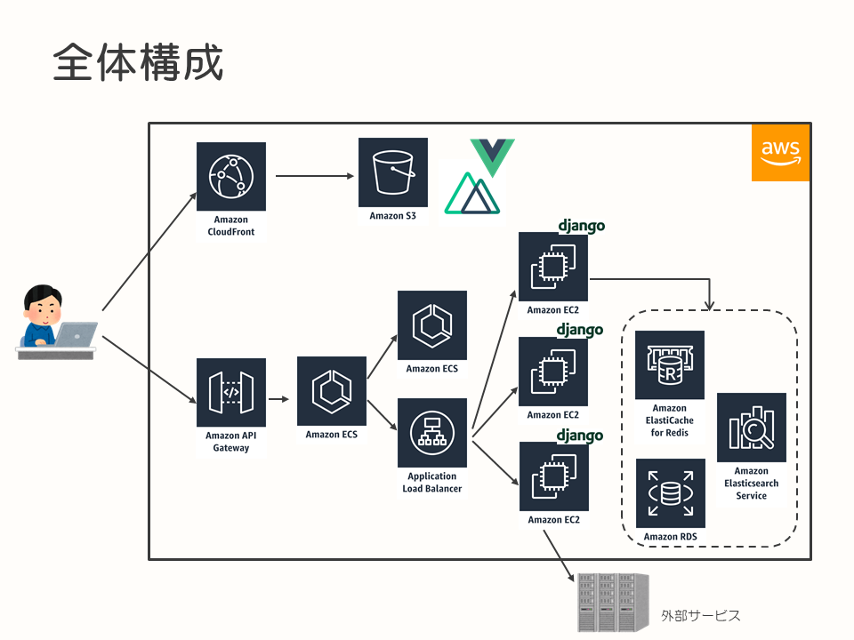
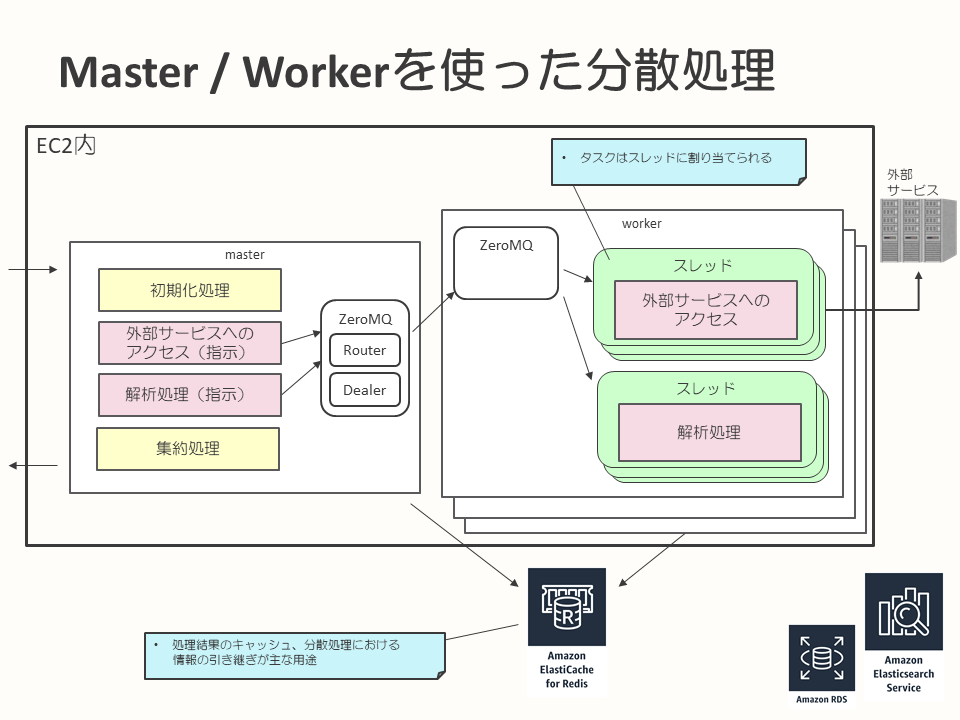
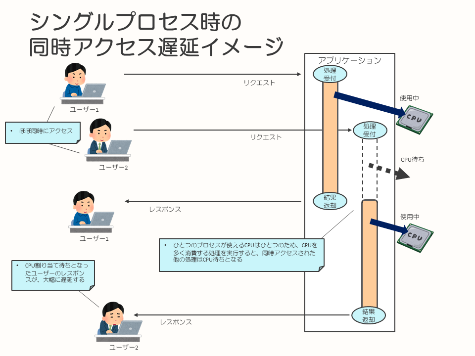

# Webアプリケーションのパフォーマンスチューニング事例（Python）

- [はじめに](#introduction)
- [TL;DR](#tldr)
- [背景](#background)
- [構成](#constitution)
- [非効率にキューを扱うワーカー](#wrong-queue)
- [複数のリクエストを同時に処理できないサーバー](#server-cannot-process-multiple-requests)
- [Redisでメモリを大量消費](#redis-consume-memory)
- [結果と今後](#result-future)


## <a name="introduction">はじめに</a>

このドキュメントは、自社サービスとして開発したシステムに対する、開発中におけるチューニング、設計の改善などを事例としてまとめたものになります。

本ドキュメントに記載している改善範囲は、Pythonで作られたWebアプリケーションが主体となります。このため、Pythonに特化した内容もありますが他のプログラミング言語を使った場合でも有効な観点はあると考えており、本ドキュメントに記載した事例が、今後の開発におけるパフォーマンストラブルや設計トラブルを回避するための参考情報となることを目的としています。

このドキュメントに記載しているシステムは、すでにリリースされ、実際に運用されているシステムとなっています。ですが、品質改善を行う余地はまだまだ残っており、今後も継続して改善を行っていく予定です。


## <a name="tldr">TL;DR</a>

このドキュメントに記載しているシステムおよび、検出した問題は以下のような内容でした。

- Webアプリケーション開発を行い、AWS上で展開
- テストを通して、パフォーマンスのトラブルに直面し、ひとつひとつ改善
  - キューの待ち中に不要なCPU消費が発生
  - 並列アクセス時に対応できない
  - Redisのデータ量の増大

以降では、簡単なシステム構成の紹介と、検出した問題とその対応について記載します。

## <a name="background">背景</a>

このプロジェクトでは、社外のユーザーをターゲットにした自社サービス開発を行っています。

サービスの特性として、様々な外部サービスから情報を収集し、付加価値をつけてユーザーへ表示するものになります。1回のリクエストで、以下のような処理を行います。

* 複数の外部サービスからの情報取得、クローリング
* 収集したデータに対して言語解析処理、データ変換
* 解析結果に基づき、データを再構築し、かつデータのバリエーションを増幅

このような特性上、1回のリクエストにかかる時間が10秒程度と通常のWebサイトに比べると重く、速度面での対策を行う必要がありました。


## <a name="constitution">構成</a>

このプロジェクトにおけるシステム構成の概要は、以下のようになっています。



また、このサービスはAWS上に構築されており、採用している主要な技術要素としては、以下のようになっています。

- サーバーサイド
  - Python
  - Django
  - ZeroMQ
- データストア
  - Amazon RDS（PostgreSQL）
  - ElastiCache（Redis）
  - Amazon Elasticsearch Service（Elasticsearch）
- Webフロントエンド
  - Vue.js
  - Nuxt.js

なお、このドキュメントで扱う範囲は、サーバーサイド（図中のEC2）のアプリケーションを対象にしています。

使用しているデータストアは、AWSのマネージドサービスを使用していますが、以降ではサービス名（ElastiCacheなど）ではなく、単純に「Redis」のように表記します。


## <a name="wrong-queue">非効率にキューを扱うワーカー</a>

このプロジェクトでは、処理をタスクに分割して並列実行するために、キューを使用したマスター・ワーカーパターンを採用しています。



キューにはZeroMQを使用しており、DEALER、ROUTERソケットと呼ばれるものを利用して、このパターンを実現しています。

[Shared Queue (DEALER and ROUTER sockets)](http://zguide.zeromq.org/page:all#Shared-Queue-DEALER-and-ROUTER-sockets)

タスクのマスターもワーカーも、EC2内のプロセスとして動作しており、マスタープロセスひとつに対してワーカープロセスが複数あり、全体として協調動作する形態となっています。

このEC2が複数台構成となっており、クライアントからのリクエストを前段のALBで振り分けます。

EC2内では、タスクのマスター側がキューにタスクを分割して投入し、複数のワーカープロセスがタスクを処理していく形態となっています。また、ワーカープロセス内ではマルチスレッドを使用し、各タスクはスレッドに割り当てられ処理される形態となっています。

ZeroMQのDEALER、ROUTERソケットを使用すると、マスター側から見て以下のような処理をRPCのように実現できます。

1. マスター側が、キューにタスク（データ）を登録
1. ワーカー側が、キューからデータを取得し、なんらかの処理をする
1. ワーカー側が、キューに処理結果のデータを登録
1. マスター側が、ワーカーの登録したデータを取得する

マスター側から、適度な単位にタスクを分割してキューに登録することで、分割数に合わせてワーカーを使用しての分散・並列処理が可能となります。

この仕組みを活用し、外部サービスへのアクセスや、その解析処理など時間がかかる処理をワーカー側で並列に処理し、レスポンスに要する時間の短縮を見込みました。

しかし、この設計方針に対して、適切な実装ができておらず不要なCPUリソースを大量に消費してしまう問題が、テスト中に発覚しました。

ワーカーからマスターへ処理結果を送り返すため、キューへデータを投入する部分で、以下のように内部的なリスト（キューに相当するもの）を管理し、その中にデータがあれば送信し、なければずっと無限ループするようになっていました。

```python
        # 送信データ群
        self.send_data_list = []

        ...

        while True:
            try:
                if len(self.send_data_list) > 0:
                    send_bytes = self.send_data_list.pop(0)
                    self.router_socket.send_multipart(send_bytes)
             except Exception as e:
                ...
```

スリープなどの処理も、入っていません。

このため、1回でもワーカーを使った処理を実行してしまうと、ひとつのCPUコアをムダに使い尽くしてしまいます。ワーカー側で、処理すべきタスクがなくなっても、です。

このサービスの特性として、どうしても処理に時間がかかってしまうため、それでもより早く処理できないかという性能改善を行う時に、不審にCPUリソースを消費していたため最初に発覚した問題です。

対応としては、この部分に関して、適度にスリープを入れることで不要なリソース消費を抑えるようにしています。

今回は通常のWebアプリケーションとは異なり、1回のリクエストに対する処理が重く、その対応策としてキューを使用しての分散並列処理を採用しましたが、開発メンバーとのスキルのアンマッチと確認不足の結果、発生した問題でした。

教訓として、アーキテクチャー上でもポイントとなる箇所は、基本的なことではありますが、設計と設計に対して適切な実装になっているかの確認が重要だということをあらためて確認した形になります。


### CPUプロファイルと処理時間の計測

この他にもCPUを多く消費している箇所の探索、特定は、Python組み込みのプロファイラーを使用して分析しています。

* [Python プロファイラ](https://docs.python.org/ja/3.5/library/profile.html)

ドキュメントにはprofileとcProfileが記載されていますが、まずは分析を優先したので、C言語で実装されオーバーヘッドの少ないcProfileを使用しました。

また、プロファイラーによる計測も単発のリクエストを詳細を把握するためには重要ですが、ポイントなる処理に処理時間を計測・記録し、テストなどで様々なリクエストを処理した後に、ログを検索・集計して傾向を掴み、改善していくという活動も行っています。

```python
        # 処理時間計測
        start_time = time.time()

        ### 計測対象の処理
        ### ...

        # 処理時間計測
        elapsed_time = time.time() - start_time

        ### 計測結果をログ出力
        ### ...
```

このような、計測に基づいての分析、改善はどの言語であっても変わらず適用できる方法だと考えています。


## <a name="server-cannot-process-multiple-requests">複数のリクエストを同時に処理できないサーバー</a>

このプロジェクトで性能確認をしていた時に発覚した問題として、「単体のサーバーで複数のリクエストを同時にさばくことができない」という事象が検出されました。

主な原因は、以下のものです。

* マスター・ワーカーを使用した分散処理を使用しているとはいえ、最後のマスターでの集約処理で大きくCPUパワーを必要とする処理があること
  * 集約処理が数秒ほど必要とするため、その時間はCPUコアひとつを使い切ってしまう
* 言語がPythonであり、サーバーにDjangoの[開発サーバー](https://docs.python.org/ja/3/glossary.html#term-global-interpreter-lock)を使用していたこと
  * Pythonには[GIL](https://docs.python.org/ja/3/glossary.html#term-global-interpreter-lock)があるため、ひとつのプロセスで同時に動かせるスレッドはひとつだけという制限がある
  * Djangoの開発サーバーでアプリケーションを動作させていたため、マルチプロセスで動作させることができない

このため、多くのCPUパワーを使用する処理があるという特性に対して、ひとつのプロセスが利用できるCPUはひとつに限られることから、複数のリクエストを受け付けた時に性能が線形的に劣化するという問題が発生しました。

例えば、2人が同時にアクセスすると、最初に受け付けたリクエストの処理が終わらないと2つ目のリクエストが処理できない状態になります。処理時間としては、2つ目のレスポンスを返すまでの時間に、本来の処理時間に加えてひとつ目のリクエストの処理時間が足され、結果として2倍ほどの時間がかかってしまうイメージです。

やや極端ですが、以下にそのイメージを記載します。



サービスの特性上、1回のリクエストに対する処理時間がかかってしまうことは仕方ないのですが、少なくともEC2上で利用可能なCPU数分はスケールして処理を捌ける必要があります。

Djangoの開発サーバーはこのようなニーズには対応しておらず、そもそも本番環境での利用は推奨されていないため、アプリケーションを動作させるサーバーを変更することにしました。

DjangoはWSGIサーバー上で動かすことができるため、WSGI仕様を実装しており、かつ複数のプロセスでアプリケーションを動作させることができるサーバーを選定しました。

候補としては、以下の2つが挙がりました。

* [uWSGI](https://uwsgi-docs.readthedocs.io/en/latest/)
* [Gunicorn](https://gunicorn.org/)

複数のプロセスを使用することができる、という観点では両者に差がなく、設定などはGunicornの方が設定などもシンプルに見えたため、Gunicornの採用を当初は考えました。ですが、起動時の初期化処理がGunicornでは複数回起動してしまうという事象があり、今回のアプリケーションの構成でこの点を避けることは難しかったため、uWSGIを採用することにしました。

アプリケーションをuWSGI上で動作できるように少し変更を加え、アプリケーションが稼働するEC2の持つCPUリソースをフルに活用し、CPU数分は並列にリクエストを捌けるように改善することができました。

教訓として、サービスの特性と選択した言語などの相性を考慮した設計にしておくこと、サービスを稼働させるためのミドルウェアの選定をきちんと行うこと、プロダクション環境で利用することに耐えうるものかどうか確認しておくこと、ということを確認した形になります。


## <a name="redis-consume-memory">Redisでメモリを大量消費</a>

テスト工程でアプリケーションを動作させている際に、プロジェクト内で使用しているRedisのメモリ使用量が増大し、利用しているユーザーが少ないにも関わらず大量のメモリを消費している事象が検出されました。

テスト時の利用ユーザー数に対して、Redisの利用量が見合わない状態になってしまっていたのです。

このを問題を検出し、アプリケーション内でのRedisの利用方法を調査した結果、以下のことがわかりました。

* Redisに格納する、データの有効期限の設定がされていない
* Redisに格納するデータの用途が曖昧
  * 以下のような用途で、機能の開発者が思い思いに利用
    * 処理結果（レスポンス）のキャッシュ
    * 起動時の設定のキャッシュ
    * 分散処理中などでの一時データ置き場

特に、レスポンスのキャッシュや中間データの保持にしているのに有効期限を設定していなかったため、1回のリクエストで使用するRedisのメモリが数百MB程度になってしまっていました。また、そのネットワーク転送量も膨大になります。

この課題に対して、以下のように改善、見直しを行いました。

* データ保存時に、有効期限を設定する
* 各機能でのRedisの利用用途を確し、再整理
  * キャッシュとして利用している場合は、キャッシュ切れの場合も考慮するように改善
* そもそも、Redisに保存する必要のあるデータなのかを見直し、削減

結果、Redisのメモリの使用量も利用ユーザーに合った値となり、大きくデータ量を削減することができました。

RedisのようなKVSはキャッシュ用途などでとても便利なのですが、その反面、利用する際の設計方針を適切に定めていないと、アプリケーション内でどのように使われているかわからなくなり、コントロールできない状態となってしまいます。

こうなってしまうと、Redisに保持しているデータ量が多いという課題が検出されても、それが現在の設計上適切かどうかすら判断できなくなってしまいます。今回、この点について見直しを行い、適正な形に修正しました。

便利だといって無秩序に使うのではなく、利用する方針を決めて、それを遵守していくことが大事だという教訓となりました。


## <a name="result-future">結果と今後</a>

今回検出された問題、課題は、Pythonに寄った事情のものであったり、Redisのようなデータストアの利用方針に関するものが大半でしたが、その多くは適切に設計、レビューなどを実施していれば回避できた問題が多かったのも事実だと考えています。

今回のプロジェクトでは、機能開発に傾倒しすぎたため、このあたりの確認がおろそかになってしまい、性能やデータ量に関する課題をプロジェクトの後半で検出することとなりました。その結果、構成や設計を見直すことになってしまいました。

とはいえ、課題として検出して改善することで、これらの課題に対して未対応のまま本番運用環境で問題が顕在化するという事態は避けることができました。

今後、このサービス自身の品質改善を継続して行っていくのはもちろんですが、機能を開発することに着目するのだけではなく、問題を抱えた設計になっていないかといった視点でレビュー、確認をする時間、機会を確保することがおろそかにならないように注意して開発していくことが必要だとあらためて確認させられる事例となりました。

これらの教訓が、他のプロジェクトでのトラブルを回避するための参考情報となれば幸いです。
