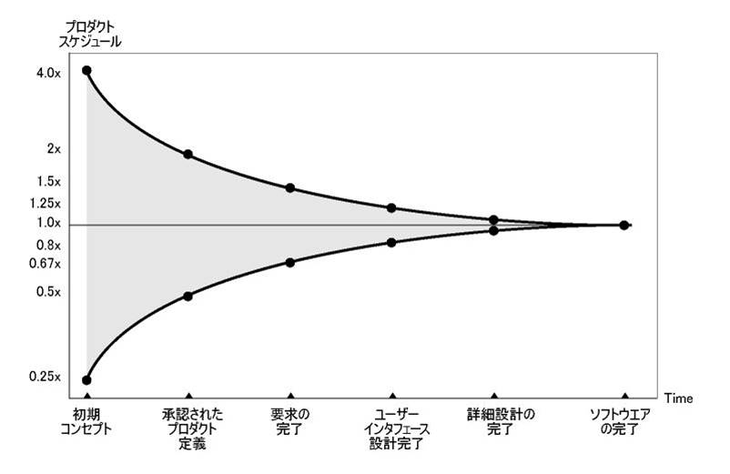
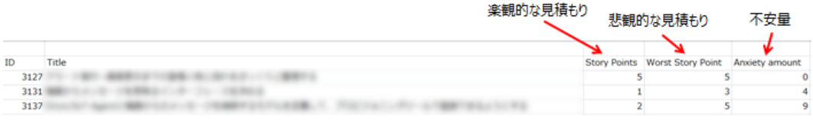
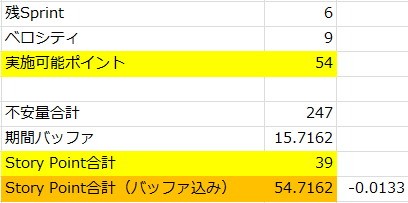
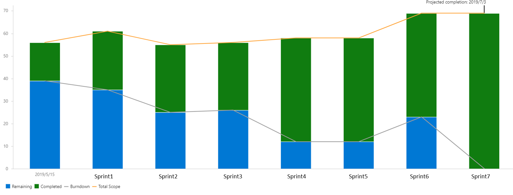

## 多点見積りとスケジューリングの実践

* はじめに
* 実施背景
* 実施内容
* 実施結果
* 振り返り
* まとめ
* 出典

##  はじめに
本ドキュメントは、あるスクラム開発プロジェクトにおいて多点見積もりを実施し、スケジューリングを行った事例としてまとめたものになります。  

本ドキュメントが、不確実性が高い中、早い段階で精度の高い見積もりを算出するスケジューリング方法およびスケジューリングのマネジメント方法についての参考情報となることを目的にしています。

## 実施背景
前提として本事例で取り上げているプロジェクトはスクラムで開発を実施しています。  
また本事例で扱っているプロジェクトは期日駆動（MM/dd に xx 機能（できているところまで）をリリースする）で行われており、提示された機能数に対してどのくらいの期日を要するかのスケジュール感について開発チームは計画時点で確実に達成できるマイルストーン（=高い精度の見積もり結果）を提示する必要がありました。  

しかし、不確実性コーンなどでも表されているように、複雑性の高いソフトウェア開発において見積もり時期が早いほど見積もり結果の振れ幅は大きくなってしまい精度の高い見積もり結果を提示するのは困難になります。
  
※1より抜粋

そのため多点見積もりのやり方を活かし算出したスケジュールバッファをマイルストーンに組み込むことで、  
「早いタイミングで精度の高いスケジューリングが求められる」という状況に適応できないかと考え実践してみました。

## 実施内容
大きく以下2点を実施しました。  
①多点見積もりの実施  
②スケジュールバッファの算出

#### ①多点見積もりの実施
多点見積もりとは複数の視点で見積もりを実施することを指します。  
具体的にはプロダクトバックログアイテム（以下PBI）に対して50％の確率で終わると予想した楽観的な見積もり(Story Points)と  
90％の確率で終わると予想した悲観的な見積もり(Worst Story Point)によるストーリーポイントを出しました。  

結果は以下の通りです。
  
なお不安量とは不確実性の量を定量化したものです。不安量の算出方法は広木大地さんの[Qiita記事](https://qiita.com/hirokidaichi/items/5a204a57a200569f755d "Qita記事")を参考にしました。  
  
※2より抜粋  

これだけでは複数のスケジュールプランを作成できるだけですが、下記記載の「②スケジュールバッファの算出」を実施することでスケジュールバッファを定量化することができます。

#### ②スケジュールバッファの算出
①多点見積もりの実施で算出した不安量(Anxiety amount)を基にスケジュールバッファを算出します。  
[Qiita記事](https://qiita.com/hirokidaichi/items/5a204a57a200569f755d "Qita記事")にスケジュールバッファ算出の手順は記載されていますが、2乗和平方根法（SRSS法:Square Root Sum of Squares）という手法を利用しました。  
本PJにおいて算出された不安量およびスケジュールバッファ（図では期間バッファと表現されています）のポイント、スケジュールバッファを加えた最終的なStory Pointは下記画像の通りです。  

スケジュールバッファ込みのストーリーポイントが54.7、実施可能ポイントは54であることから、計画時点で実施可能ポイントを上回っている状況でした。  

しかし、楽観的見積もりの結果（=一般的に採用されるストーリーポイント）は39ポイントであったこと、算出したスケジュールバッファの信憑性も当時チーム内では高くなくあくまで実験的位置づけだったということも相まって、バッファがマイナスあっても終わると考え当初計画のまま実施することにしました。

## 実施結果
※以下実施結果図内のSprint番号は仮の番号を振っています

上記図は完了ポイント（緑）と残りポイント（青）を表したグラフです。Sprint1でスコープが増えるという事態になり、遅延の見込みが強くなったためSprint2で範囲を減らしトータルスコープを調整しました。
しかし、Sprint6で再度増加したことで遅延が濃厚になり当初6Sprintsで完了する見込みでしたが、実際は完了に７Sprintsかかる結果となりました。

具体的な数値結果は以下の通りです。
* 実施ストーリー数：7Sprints
* 見積時点でのストーリーポイント合計値: 39pt
* バッファ込みのストーリーポイント合計値: 54.7pt
* 当初予定実績ポイント： 54pt
* 想定ベロシティ：９pt
* 実績ベロシティ：7.5pt

## 振り返り
振り返りでは以下3点の観点が挙がりました。

①今回の結果を振り返って反省点  
②スケジュールバッファを加えた見積もり精度について  
③その他のスケジューリング方法について  

#### ①今回の結果を振り返って反省点

まずスケジューリングの仕方についてですが、見積もり時点で期間内に終わらないリスクがあったにも関わらず結果としてスコープ調整が不十分なまま臨んでしまったことが挙がりました。先述したように初めての試みということもあり、スケジュールバッファ込みの見積もり結果がどの程度重要か考慮できていなかったことが今回の結果に大きく影響したと考えています。

また、スケジューリング後のマネジメント方法ではPBIの扱い方に関して不安量が大きいPBIを優先的に取り組むべきだったという反省点も挙がりました。[Qiita記事](https://qiita.com/hirokidaichi/items/5a204a57a200569f755d "Qita記事")にも記載がありますが、不安量が高いPBIを先に完了させるほど、後半は不確実性の低いPBIを取り組む割合が増え、スケジュールバッファを下げることができるというメリットがあります。  
このことについて十分に理解できていなかったため、不安量が大きいPBIを後半に回してしまい、それがSprint6でスコープが増大することにつながったと考えています。不確実性を下げるアプローチは開発手法に限らず、必要なアプローチと考えており、改めて実施しないことによるデメリットを実感しました。

#### ②スケジュールバッファを加えた見積もり精度について

先述したように見積もり当初は精度がどこまで高いか分からず、あくまでスケジュールバッファ抜きの見積もり結果を元に進めていました。  
しかし、見積もり予想のインプットとなるベロシティはあくまでこれまでの結果から算出された平均値であり、未来のベロシティを保証するものではありません。実際、今回は実績ベロシティは想定以下でした。そのためベロシティの差異を吸収する意味でスケジュールバッファ込みで計画を立てることは有効なアプローチと感じました。  
また当初のスケジュールバッファ込みの見積もり結果を活かすことで高い精度で実施期間を予想できることが判明し、今後も利用していきたいという結論になりました。

#### ③その他のスケジューリング方法について

今回実施した多点見積もり以外のスケジューリング方法として一定期間中（例えば直近5Sprint）の最低ベロシティを用いてスケジューリングをするのはどうかという意見も挙がりました。  
一見不確実性が高い状況下では有効なリスクヘッジにも見えますが、パーキンソンの法則でも言われているように人は完成のために与えられた時間を全て使ってしまうまで時間は膨れ上がり、最終的に完了しないと考えています。  
また確実に完了できそうな作業計画は人の達成モチベーションを下げ、結果として生産性を下げてしまうのではというリスクもあります。そもそも計画通り終わらないという潜在リスクが存在してる以上、私たちは「作業計画通りには終わらない」という前提でスケジューリングとマネジメントを行っていく方針になりました。

## まとめ
当初スケジュールバッファの数値に懐疑的だったものの、実際に結果を目の当たりにし、スケジュールバッファを取り込むことで計画時点で精度の高いスケジューリングを行えることが分かりました。  
スケジュールバッファをどの程度持たせるかなど考えるべきことはあるものの、今後も多点見積もりによるスケジューリングを活用し、プロジェクトを円滑に推進していければと考えています。

##  出典
※1 日経XTech プロジェクトマネジャーのための「プロセス設計術」 プロジェクトの本質とはなにか（https://tech.nikkeibp.co.jp/it/article/COLUMN/20131001/508039/ ）

※2 不安とストレスから解放される見積りとスケジュール方法(https://qiita.com/hirokidaichi/items/5a204a57a200569f755d )
