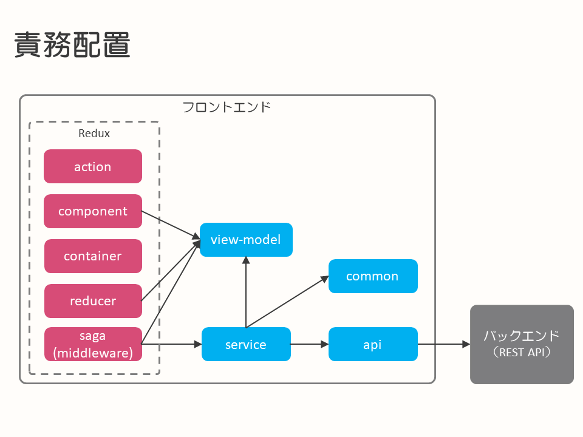

# Reactを使ったフロントエンドのアーキテクチャ事例

- [はじめに](#introduction)
- [TL;DR](#tldr)
- [背景](#background)
- [フロントエンドのアーキテクチャ](#frontend-architecture)
  - [フレームワーク](#frontend-architecture-framework)
  - [アーキテクチャ](#frontend-architecture-architecture)
  - [コンポーネント設計](#frontend-architecture-component-design)
  - [コンポーネントライブラリ](#frontend-architecture-ui-component-library)
  - [コンポーネントのスタイル](#frontend-architecture-component-style)
  - [コンポーネントのカタログ](#frontend-architecture-component-catalog)
  - [デザインガイド](#frontend-architecture-design-guide)
  - [ルーティング](#frontend-architecture-routing)
  - [APIの非同期呼び出し](#frontend-architecture-async-api-call)
  - [型チェック](#frontend-architecture-type-check)
  - [静的チェック](#frontend-architecture-static-check)
  - [テスト](#frontend-architecture-test)
- [結果と今後](#result-future)


## <a name="introduction">はじめに</a>

このドキュメントは、Reactを使ったフロントエンドのアーキテクチャを事例としてまとめたものになります。

本ドキュメントが今後開発を行うシステム、プロジェクトの参考情報となることを目的としています。

なお、このドキュメントに記載しているシステムは開発中のものであり、実際に運用されているシステムではありません。テストなどで品質を高めていく活動についても、これからになります。その点については、ご留意のうえ、ドキュメントを参照ください。

## <a name="tldr">TL;DR</a>

- [Slack](https://slack.com/intl/ja-jp/)のようなチャットツールをSPA（シングルページアプリケーション）で開発するため、フロントエンドのアーキテクチャを検討した
- フレームワーク・ライブラリ・ツールは以下を採用した
  - React、Redux、Element UI、Ant Design、redux-saga、React Router、ESLint
- コンポーネント設計はAtomic Designを参考にして４分類にした
- ディレクトリ構成と命名ルールにより、多人数での開発をやり易くした

## <a name="background">背景</a>

このドキュメントの事例となったプロジェクトでは、SlackのようなチャットツールをSPAで開発を行うことになりました。このドキュメントを作成している時点では、チャットアプリケーションに必要な最低限の機能のみ実装しています。

このシステムを開発するチームでは、採用する技術要素については前提や制限がないため、一からアーキテクチャを検討することになりました。開発体制としては、フロントエンドが１～２名、バックエンドも１～２名と少人数です。

これらを前提として、フロントエンドのアーキテクチャを検討することになりました。

## <a name="frontend-architecture">フロントエンドのアーキテクチャ</a>

フロントエンドの開発では、ReactやVueといったフレームワークを活用した開発が一般的です。しかし、これらのフレームワークはSPAのビュー部分しかカバーしていないため、これらのフレームワークがカバーしていない箇所の設計が必要になります。以下に示すように、フレームワークがカバーしていない箇所はたくさんあります。

- ビューで扱うモデルやビジネスロジックを実装するクラスなどの責務配置
- リッチなUIを実現するためのUIコンポーネントの活用
- ルーティングの実現方法

ここからは、そうしたフレームワークがカバーしていない箇所を含めて、フロントエンドのアーキテクチャの検討項目ごとに説明していきます。

ここで取り上げる検討項目は、Reactを使ったフロントエンドの開発でよく取り上げられているものを参考に、PJで検討した項目になります。

### <a name="frontend-architecture-framework">フレームワーク</a>

開発を開始した2018年時点では、[React](https://reactjs.org)と[Vue](https://jp.vuejs.org)がSPAの開発でよく利用されていました。開発メンバの１名がReactとVueでの開発経験があるため、どちらのフレームワークでもスムーズに開発を開始できる状態でした。また、ReactとVueのライセンスはともに[MIT](https://opensource.org/licenses/MIT)なので問題なく使用できます。

このプロジェクトではチャットアプリケーションでリアルタイムにメッセージをやりとりするため、双方向通信を実現する必要がありました。情報収集するとVueよりもReactの方が双方向通信を行う周辺ライブラリが充実していると感じ、Reactを採用しました。

なお、双方向通信以外の周辺ライブラリ（コンポーネントライブラリやコンポーネントのスタイル定義など）については選定に時間を割かずに、人気があるものや定番のものを実際に試してみて大きな問題が無ければそのまま進めることにしました。

### <a name="frontend-architecture-architecture">アーキテクチャ</a>

Reactはビュー部分の機能しか提供していないので、処理フローの制御や状態管理は、別途考える必要があります。開発対象のチャットアプリケーションは画面が７個必要で、さらに今後追加が見込まれており、管理する状態数が多いという特長があります。状態数が多いフロントエンドの処理フローの制御や状態管理を自分達で実装するのは、開発とメンテナンスコストが高くなると考えました。そのため、Reactを使ったフロントエンドの処理フローの制御や状態管理を行うライブラリとして、よく使用されている[Redux](https://redux.js.org)を採用しました。開発メンバの１名がReduxを使った開発経験があったことも採用理由の１つです。

ただし、Reduxはビューの状態までしか管理しません。非同期でのバックエンドのAPI呼び出しやバックエンドのAPIが扱うリクエスト・レスポンスとビューで扱うモデルとの変換は、自分達で設計する必要があります。

このプロジェクトでは、以下の責務配置にしました。



Reduxの標準的な構成（action、reducerなど）に以下を追加しています。

- view-model
  - ビューに必要な情報を保持する
- service
  - apiを使用してバックエンドが提供するビジネスロジックを呼び出す
  - ビューモデルとリクエスト/レスポンスの変換を行う
- api
  - バックエンドのAPIを呼び出す
- common
  - 共通ライブラリ（ID生成や暗号化処理など）

バックエンドのAPIの変更が直接ビュー側（Reduxの構成要素）に影響しないように、serviceとview-modelを設けています。さらに、バックエンドのAPI呼び出しをapiに集約することで、serviceで似たようなバックエンドのAPI呼び出し処理が発生しないようにしています。

責務配置にあるsagaは、[APIの非同期呼び出し](#frontend-architecture-async-api-call)を行うライブラリです。バックエンドのAPIを呼び出す画面イベントの場合は、saga->service経由でバックエンドのAPIを呼び出した後、reducerで処理します。バックエンドのAPIを呼び出さなくてもよい画面イベント（クライアントサイドのデータのみで処理できるもの）の場合は、reducerのみで処理します。

saga->service部分のソースコード例を示します。

```
import { call, put, takeEvery, takeLatest } from 'redux-saga/effects'
import ChatRoomService from '...'
import { createChatRoomSuccess, createChatRoomFailure } from '...'

function* handleCreateChatRoom() {
  whie(true) {
    // takeでアクションの待ち受け
    const action = yield take(CREATE_CHAT_ROOM_START_EVENT)
    // serviceの非同期呼び出し
    const {chatRoom, error} = yield call(ChatRoomService.createChatRoomAsync,
                                         action.payload.userId)
    if (!error) {
      yield put(createChatRoomSuccess(chatRoom))
    } else {
      yield put(createChatRoomFailure(error))
    }
  }
}
```

#### ディレクトリ構成

このプロジェクトでは、責務配置に合わせて、以下のディレクトリ構成で開発しています。
component配下の分類については、[コンポーネント設計](#frontend-architecture-component-design)で後ほど説明します。

- action/
- component/
  - basic/ ... ボタンなど基本部品
  - part/ ... 画面パーツ
  - template/ ... テンプレート
  - page/ ... ページ
- container/
- reducer/
- saga/
- view-model/
- service/
  - converter/ ... ビューモデルとリクエスト・レスポンスの変換
- api/
- common/

#### 命名ルール

このプロジェクトでは、以下のような命名ルールを設け、複数人で開発してもメンテナンスしやすい状態にしています。

- クラス、関数、定数
  - action
    - XXX_START_EVENT, XXX_SUCCESS_EVENT, XXX_FAILURE_EVENT
    - xxxStartEvent(), xxxSuccessEvent(), xxxFailureEvent()
  - part
    - XxxForm, XxxView, XxxPanel, XxxMenuBar
  - template
    - XxxPageTemplate
  - page
    - XxxPage
  - api
    - e.g.) receiveMessageAsync(), sendMessageAsync()
  - saga
    - handleXxxStart(), handleXxxSuccess(), watchXxxChannel()
- ファイル
  - action
    - xxxAction.js
  - store
    - xxxState.js, yyyState.js
  - container
    - xxxContainer.js
  - saga
    - xxxSaga.js, yyySaga.js

#### 実装のポイント

- reducer
  - 状態更新のみに専念する
- saga
  - serviceを呼ぶだけにする
- component
  - pageからだけ状態を渡すようにし、他のコンポーネントに依存させない
  - ボタンのクリックなどのコールバック関数は、containerに定義しpage経由で渡す
    - 具体的には、以下のように書く
        ```  
        <UserManagePage {...this.props}>
        ↓
        <UserManagePageTemplate {...this.props}>
        ↓
        <UserTable {...this.props}> (this.propsにはonEditButtonClickなどが入っている)
        ↓
        <MyButton onClick={this.props.onEditButtonClick}>
        ```
    - containerから末端のbasicに向かってpropsをバケツリレーしているのは、partとbasicを再利用できるようにするため
      - pageとtemplateは再利用しないのでそこからpropsを渡すが、part/basicは再利用したいので「親から」渡されたpropsのみを使う
  - コンポーネントに独自の属性state（チェックボックスの入力状態など）を持たせる場合は最小限となるようにする
- store
  - 複数画面で扱われるようなデータモデルを別々に管理しないようにする
    - 例えば、一覧画面と詳細画面で別々にデータモデルを管理してしまうと整合性が取れなくなる

### <a name="frontend-architecture-component-design">コンポーネント設計</a>

コンポーネント設計は、コンポーネントの作成単位を決めることでコンポーネントの再利用性を高め、メンテナンス性を高めるために行います。[アーキテクチャ](#frontend-architecture-architecture)の責務配置で示したcomponentがここでのコンポーネントに該当します。

コンポーネント設計の方法としては、[Atomic Design](http://atomicdesign.bradfrost.com)が有名です。Atomic Designとは、コンポーネントを化学に例えて、以下の５階層に分類して実装するやり方です。

- atoms
  - 原子＝それ以上分割できない、単一のコンポーネント
- molecules
  - 分子＝原子の組み合わせで表現されるコンポーネント
- organisms
  - 組織＝画面に表示する部品単位のコンポーネント
- templates
  - ページのワイヤーフレームとなるテンプレート
- pages
  - 実際の表示する単位となるページ

コンポーネントが多い場合は、何らかの方法で整理する必要が出てくるので、Atomic Designの適用を検討した方が良いでしょう。Atomic Designの基準に沿って分類でき、開発者同士の会話がしやすくなります。

このプロジェクトでは、Atomic Designを参考に、以下の分類にしました。moleculesとorganismsの分類が曖昧になりがちなことから、以下の４分類にしています。半年ほど開発していますが、特に迷うことなく、basic(=atoms+molecules)とpart(=organisms)という分類を利用できています。

- basic
  - コンポーネントライブラリをラップしたものや再利用可能な単位で構成
- part
  - basicの組み合わせ。特定の画面で使う部品。複数の入力部品を持つフォームなど
- template
  - Atomic Designのtemplatesと同じ
- page
  - Atomic Designのpagesと同じ

### <a name="frontend-architecture-component-library">コンポーネントライブラリ</a>

Reactを使う場合、コンポーネントライブラリの選択肢はたくさんあり、開発対象のアプリケーションの要件に応じて、選択していくことになります。コンポーネントライブラリの選択肢については、以下が参考になります。

[Best React Component Libraries/Frameworks for 2018](https://medium.com/@nishitvmaheta/best-react-component-libraries-frameworks-for-2018-bb84d1061f61)

このプロジェクトでは、ツリーや選択リストがある[Element UI](https://github.com/elemefe/element-react)と[Ant Design](https://ant.design/)を使用しています。
  
よく使われている[Material-UI](https://material-ui.com/)は、基本的なコンポーネントのみしか提供していないので、プロジェクトの要件を満たすにはコンポーネントの開発量が増えるため、採用しませんでした。

なお、テーブルを表示できる[React Data Grid](https://adazzle.github.io/react-data-grid/)など、単体のコンポーネントライブラリも汎用性が高く便利なので開発時は検討した方が良いでしょう。React Data Gridは以下から様々な例を見ることができます。

[Example - React Data Grid](https://adazzle.github.io/react-data-grid/docs/examples/simple-grid)

他にもReactを使う場合、「react <コンポーネントの特徴>」で検索すると色々なコンポーネントが見つかりますので、要件に近いものを探して使用すると良いでしょう。

### <a name="frontend-architecture-component-style">コンポーネントのスタイル</a>

Reactを使うことで、HTMLとJavaScriptがコンポーネント化されますが、CSSはアプリケーション全体に対して影響（つまりグローバルスコープ）します。CSSについてもHTMLやJavaScriptと同じように、CSSの影響範囲をコンポーネントに閉じるアプローチがあります。Reactを使った場合は
[CSS Modules](https://github.com/css-modules/css-modules)や[styled-components](https://www.styled-components.com)を使うことで実現できます。

現在このプロジェクトでは開発メンバが使い慣れているCSS Modulesを使用しています。しかし今後はstyled-componentsの使用を検討しようと考えています。styled-componentsを使うと、CSSの定義をReactのコンポーネントと同じファイル内に記載できます。外部のcssファイルに記載が必要なCSS Modulesに比べ、コンポーネントが扱いやすくなるためです。

### <a name="frontend-architecture-component-catalog">コンポーネントのカタログ</a>

コンポーネントのカタログは、APIリファレンスのようなもので、開発者がコンポーネントの表示例や使用方法、具体的なソースを参照するために使用します。

コンポーネントのカタログを作成するツールとしては、[Storybook](https://storybook.js.org)が有名です。

開発メンバが多く、コンポーネント数も多い場合はStorybookを導入した方が良いでしょう。導入準備とメンテナンスのコストと、利用場面のバランスを考慮して、導入の判断を行います。

このプロジェクトではStorybookを導入していません。開発メンバが少ないこと、Atomic Designのatomsにあたるような部品は採用したUIコンポーネントのライブラリを使用しており、使用方法等はライブラリのドキュメントで確認できるためです。

### <a name="frontend-architecture-desig-guide">デザインガイド</a>

デザイナーはUI/UXの設計に長けていますが、必ずしも実装に長けているわけではありません。UI/UXの設計と実装には乖離があり、実装困難なケースが出てくる可能性があります。この乖離を少なくするため、このプロジェクトではデザインガイドを作成してデザイナーと開発者の間で方針を共有しました。

実際のデザインガイドでは、以下のようなことを定義しました。

- マウスで操作しやすい場所や視線・操作の流れ（左上から右下）
- コンポーネントの配置場所の定義（表示領域をメニューバー、サイドメニュー、ヘッダー、フッター、コンテンツの５つに分割）
- 操作可能なボタンやアイコンのベースカラー
- 各コンポーネントの状態（選択中、マウスホバー時、非選択中、グレーアウト中など）のデザイン
- ツールチップの表示ルール（ディレイを何ミリ秒にするか、表示場所はどうするかなど）

### <a name="frontend-architecture-routing">ルーティング</a>

SPAでは、クライアントサイドに状態を持ち、画面切り替えを行い、ユーザーに機能を提供します。そのため、クライアントサイドでURLに応じた画面切り替えを行う仕組みが必要になります。この仕組みをルーティングと呼びます。

このプロジェクトでは、Reactでルーティングをする場合によく利用されている[React Router](https://reacttraining.com/react-router/)を使用しています。

### <a name="frontend-architecture-async-api-call">APIの非同期呼び出し</a>

React/Reduxを使った場合、APIの非同期呼び出しとしては、２つのライブラリが有名です。

- [redux-thunk](https://github.com/reduxjs/redux-thunk)
- [redux-saga](https://redux-saga.js.org/)

このプロジェクトでは、書きやすさや機能の充実さなどの理由からredux-sagaを採用しました。

基本的なAPIの非同期呼び出しであれば、take(イベントの待ち受け) -> call(非同期処理の呼び出し) -> put(次のイベントの発火)という流れで処理を記述できます。

WebSocketを使った双方向通信は少し難易度が高くなりますが、以下の公式ページを参考にすれば実装できます。今回のプロジェクトでも実際に実装を行い使用しています。

[Using Channels - redux-saga](https://redux-saga.js.org/docs/advanced/Channels.html)

### <a name="frontend-architecture-type-check">型チェック</a>

型チェックは学習コストもありますが、開発メンバ数が多い場合は導入する価値があると考えています。このプロジェクトでは、開発メンバが１～２名だったので、型チェックを導入していません。

今回は導入していないので良し悪しを言及できませんが、型チェックとしてはよく使用されている[TypeScript](https://www.typescriptlang.org/)、[flow](https://flow.org)の他に、以下に記載があるようにVS Codeの型判定を使用する方法もあります。そういったツールの機能を使用するのも選択肢になると考えています。

[VS CodeでJavascriptの型判定を行う](https://qiita.com/dbgso/items/137237a0d14503bc3daa)

### <a name="frontend-architecture-static-check">静的チェック</a>

静的チェックは、定番の[ESLint](https://eslint.org)を使っています。

開発開始からチェックして、エラーが出た場合に設定を見直し、開発チームで認識を合わせながら進めるのが良いでしょう。

### <a name="frontend-architecture-test">テスト</a>

このプロジェクトでは、自動テストを実施しておらず、手動でテストしています。

今後、Reactで使用が推奨されている[Enzyme](https://airbnb.io/enzyme)、モック化やアサーションなど、一通りの機能が揃っている[Jest](https://jestjs.io/)を使用予定です。

自動テストについては、ロジックが記載されるサービス層、Reducerから作成する予定です。

## <a name="result-future">結果と今後</a>

実際に上記のアーキテクチャで開発をしてみて感じたことは以下になります。

- ディレクトリ構成や命名ルールの徹底は、成果物が統一され検索しやすくなり、メンテナンス性が高くなる
- serviceとview-modelの導入により、バックエンドのAPI変更に対して、強く安定したビューを実現できた
- Atomic Designを参考にコンポーネントの分類を導入するとファイル数は増える傾向にあるが、コンポーネントの再利用が進み、粒度が揃うことで見通しがよくなる

今後の改善としてはテストの自動化があります。このプロジェクトでは、UIデザインの変更が頻発したため、手動によるUIテストのコストがかかっています。テストの自動化をどこまでやるかを決めて対応する必要があると考えています。

このアーキテクチャ事例が今後SPAの開発を行うシステム、プロジェクトにとって、少しでも参考になればと思います。
