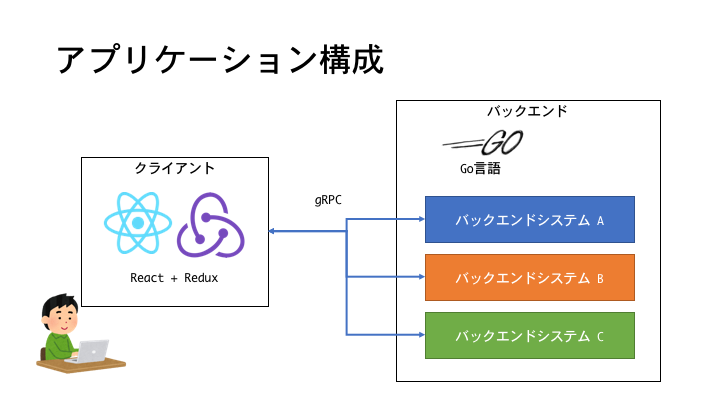
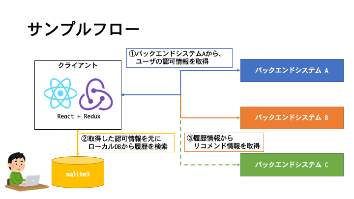

# redux-sagaを用いたReact/Reduxアプリケーションにおけるデータ通信の実現事例

* [はじめに](#はじめに)
* [TL;DR](#tldr)
* [背景](#背景)
  * [システム構成](#システム構成)
  * [JavaScriptにおける非同期処理の概要](#JavaScriptにおける非同期処理の概要)
  * [複雑な非同期処理を記述する上での問題](#複雑な非同期処理を記述する上での問題)
* [redux-sagaについて](#redux-sagaについて)
* [サンプルコード](#サンプルコード)
  * [シンプルな非同期アクセスに対するサンプルコード](#シンプルな非同期アクセスに対するサンプルコード)
  * [非同期処理の並列呼び出しのサンプルコード](#非同期処理の並列呼び出しのサンプルコード)
  * [PUSH通知のサンプルコード](#PUSH通知のサンプルコード)
* [まとめ](#まとめ)
* [license](#license)

## はじめに

本ドキュメントは、React+Reduxを利用した開発においてReduxのMiddlewareである `redux-saga`を用いて非同期処理を制御する事例をまとめた資料となります。  
本ドキュメントの目的は、React+Reduxを利用したアプリケーション開発において、非同期処理の制御に `redux-saga`を採用した際の参考情報となることです。

対象とする読者としては、以下を想定しております。
- JavaScriptを利用する開発者
  - ECMAScript 2015以降を知っていることが望ましい
  - 非同期処理について知っていることが望ましい
- ReactとReduxを利用したことがある開発者

なお、本ドキュメントに記載するシステムは開発中のものを改変したものであり、実際に運用されているものではありません。
また、 `redux-saga`を含めたテストなどで品質を高めていく活動についても、今後実施していく予定です。  
あらかじめ、上記の点にご留意の上参照ください。

## TL;DR

- Reduxのミドルウェアである `redux-saga`を導入することによって、非同期関数の制御が容易になった。
- `redux-saga`を導入することによって、複雑なAction/Store/Reduxの関係性を `redux-saga`で管理できるようになった。
- 複数回の非同期関数の呼び出しを、コールバック関数を使うことなく実施できるようになった。

## 背景

本ドキュメントの事例となったプロジェクトのシステム構成や前提知識について記述します。

### システム構成
  - 簡易なシステムの構成図と技術要素は以下のようになっております。  
  （インフラなどの基盤構成や詳細については省略しております。）



||利用ライブラリ|
|:---|:---|
|フロントエンド|言語： JavaScript(ECMAScript 2015以降)<br/>主要ライブラリ： React(16.5.ⅹ),Redux(4.0.x)<br/>DB： sqlite3(4.0.x)<br/>|
|バックエンド|言語： Go言語|

本システムの特徴は、バックエンドシステムが各業務ドメイン毎に分かれており、ユーザの操作に応じてフロントエンドシステムがそれぞれのバックエンドシステムにリクエストを投げる必要があることです。
通常、複数のバックエンドシステムに対してAPI毎に、呼び出すサーバが異なる場合、GatewayパターンやBFFを採用する場合が多いと思います。しかし、開発初期段階であり各APIの規模やデータフローが明確ではなかったため、現段階での採用は見送りました。

また、通信プロトコルにはGoogleが開発したgRPCを採用し、フロントエンドシステムとバックエンドシステム間でserver streaming RPC通信を利用したPUSH通知も実施しています。  

### JavaScriptにおける非同期処理の概要

JavaScriptはシングルスレッドで動作するプログラミング言語であり、Cのpthreadのような並列処理やGo言語のgoroutineにあるようなLWP(軽量スレッド)のようなユーザスレッドを基本的にはサポートしていません。  
そのため、JavaScriptでファイルI/Oや画像の描画/変換処理といった比較的時間がかかる処理を同期的に実行した場合、時間がかかる処理がメインスレッドを占有してしまうため、本来行いたかったメインスレッドの処理などを妨げてしまうことになります。特にクライアントとしてJavaScriptを利用する場合において、時間がかかる処理中はボタンや画面遷移などの操作ができなくなるなど、利用者のUI/UXを損なう可能性が高いです。  
（厳密にはJavaScriptでも、Web Workerを利用したAPIは並列処理を実行することは可能です。）
  
上記の問題を軽減するために、JavaScriptには"非同期処理"という並行処理をサポートする仕組みがあります。  
JavaScriptにおける非同期処理は、マルチスレッドのように処理単位でリソースを割り当てることで複数の処理を同時に並列実行するのではなく、非同期処理が呼び出されたら（即座に処理を開始せずに）タスクをキューイングします。つまり、メインとなる処理が終了してから非同期処理を実施するようなメインスレッドのアイドルタイムを利用した仕組みとなっています。

JavaScriptにおける非同期処理関数の代表例に `setTimeout(callback[, delay])`があります。  
このsetTimeout関数は `delay`(ミリ秒)で設定された時間経過後 `callback`関数を実行するというものですが、上記の非同期処理の考え方に照らし合わせると `delay`ミリ秒経過した後の最初のメインスレッドのアイドルタイムに `callback`で指定された関数が実行されます。

以下は、setTimeoutを利用して500ミリ秒後にコンソールに "Hello, World!"という文字列を出力するサンプルコードになります。非同期の関数内で行う処理がシンプルである場合はコードもシンプルになります。

```javascript
  setTimeout(() => {
    console.log("Hello, World!")
  }, 500)
```

### 複雑な非同期処理を記述する上での問題

しかし、クライアントアプリケーションがいつもシンプルになるとは限らず、複雑なAPIコールを実施する場合があります。  
以下の図は本事例とは異なるサンプルフローですが、図のように複数のサーバーへgRPCによる通信を行いながらDBの更新を"同期的"に行う必要がある場合は、非同期処理の呼び出しも複雑になってしまいます。
複雑な処理を同期的に行う場合、 `callback`のネストは必然的に深くなりコードの可読性が低くなる傾向にあります。



以下に `callback`を利用して、上記のフローを実現する際の簡素なサンプルコードを記載します。gRPCのprotoの呼び出しや各種clientの設定は事前に行なっているものとして省略していますが、必然的にcallback関数のネストが深くなり各変数のスコープについても非常にわかりにくくなってしまいます。  
こういった煩雑なコードは、業務フローの見直しやAction/ActionCreaterを細かく分割ことによって解消することもありますが、処理のフローを追いにくくなるなどメンテナンス性を下げてしまう恐れもあります。

  ```javascript
  // ユーザーIDが0001の人の認可情報をauthサーバーへ
  const userId = '0001';
  authClient.getAuth({'id': userId}, (authErr, authResponse) => {
    if(authErr) {
      throw new Error("認可エラー")
    }
    const {userId, userName, userRoll} = authResponse
    // DBから検索履歴を取得
    dbClient.getSearchHistory({'id': userId, 'roll': userRoll}, (dbErr, dbResult) => {
      if(dbErr) {
        throw new Error("DBエラー")
      }
      const { histories } = dbResult
      // 情報をReducerに渡す場合は、ここでActionをdispatch
      // 検索結果一覧からリコメンド対象を計算
      recommendClient.getRecommend({histories}, (recErr, recResult) => {
        ...
      }) 
    })
  })
  ```

  上記のような問題を解消する方法の一つとして、ECMAScript 2015で標準化された `Promise`と`then`や`catch`のメソッドチェインを使う方法や、`async/await`を利用する方法があります。
  以下に上記と同じ処理をメソッドチェインで置き換えた場合と、async/awaitで置き換えた場合のサンプルコードを記載します。  
  
  ```javascript
  const getAuthAsync =　(client, reqest) => {
    const { userId } = request
    return new Promise((resolve, reject) => {
      client.getAuth({'id': userId}, (err, res) => {
        if(err) {
          reject(err)
          return
        }
        resolve(res)
      }))
    }
  }

  const getSearchHistoryAsync = (client, condition) => {
    return new Promise((resolve, reject) => {
      client.getSearchHistory(condition, function(err, result) {
        if(err) {
          return reject(err)
        }
        resolve(result)
      })
    })
  }

  const getRecommendAsync(client, request) => {
    return new Promise((resolve, reject) => {
      ...
    })
  }
  ```

  メソッドチェインで記述した場合、処理は追いやすくなりますがネストの問題は解消されません。また、catchを記述し忘れるとエラーが失われるなどの危険性もあります。  

  ```javascript
  // 一連の処理をメソッドチェインで記述した場合
  const result = getAuthAsync(authClient, {'userId': '0001'})
    .then((authResult) => {
      getSearchHistoryAsync(dbClient, {'userId': authResult.id, 'roll': authResult.userRoll})
        .then((dbResult) => {
          getRecommendAsync(recClient, {'histories': dbResult})
            .then((result) => {
              ...
            })
            .catch((err) => { ... })
        })
        .catch((err) => { ... })
    })
    .catch((err) => {
      throw new Error(err)
    })
  ```

  一方、async/awaitで記述した場合上記の問題は解決されますが、ReduxではActionが複雑になったりMiddlewareを自分で記述するなどの対策が必要になります。

  ```javascript
  // 一連の処理をasync/awaitで記述した場合
  try {
    const authResult = await getAuthAsync(authClient, {'userId': '0001'})
    const dbResult = await getSearchHistoryAsync(dbClient, {'userId': authResult.id, 'roll': authResult.userRoll})
    const recResult = await getRecommendAsync(recClient, {'histories': dbResult})
    ...
  } catch (err) {
    throw new Error(err)
  }
  ```

  上記の問題を、ReduxのMiddlewareとしてシンプルに解決するライブラリが `redux-saga`です。

## redux-sagaについて
`redux-saga` は `redux-middleware` を利用したライブラリの1種であり、非同期処理を簡単に扱うことを目的としたものです。 `redux-middleware` は、 `redux` が提供している機能の一つで、 Action がdispatchされてからReducerの処理が実行されるまでの間に、ロジックを挿入できる機能です。  
  - 参考: [redux-middleware](https://redux.js.org/advanced/middleware)

`redux-saga` は、 `redux` の処理の流れに沿って動作します。`redux` の処理の流れを簡単に表すと以下のような流れになっています。

1. ユーザー操作等で発生したイベントを契機に、Actionをdispatchする
2. dispatchされたActionをReducerで受け取って、新しいStateを作成する
3. 作成された新しいStateを元に、画面を再描画する

今回の事例では、以下のルールにしたがって、Actionを定義しました。
  - XxxStartEvent(例: getAuthStartEvent): 非同期処理呼び出しの契機となるAction
  - XxxSuccessEvent(例: getAuthSuccessEvent): 非同期処理が成功した時にdispatchするAction
  - XxxFailureEvent(例: getAuthFailureEvent): 非同期処理がエラーになった時にdispatchするAction

基本的な流れとしては、XxxStartEventをdispatchして非同期処理の呼び出しを開始します。非同期処理が終了したら、成功した場合はXxxSuccessEventを、失敗した場合はXxxFailureEventをdispatchして、後続の処理に入ります。

## サンプルコード
実際に、 `redux-saga` を用いた非同期処理のサンプルコードを記載します。今回のサンプルでは、すでに該当のActionは作成済みの前提としています。

### シンプルな非同期アクセスに対するサンプルコード
前段で紹介したコールバックを用いて実装したサンプルコードを、 `redux-saga` を利用した形に修正したコードを紹介します。非同期処理を呼び出し、その処理結果を用いて次の非同期処理を呼び出す流れがシンプルに記述できます。

```javascript
function* handleGetAuthStart() {
  while (true) {
    // take で Action の待ち受け
    // GET_AUTH_START_EVENT がdispatchされると処理が進む
    const action = yield take(GET_AUTH_START_EVENT)
    const { userId } = action.payload
    // call で非同期処理を呼び出し、終了まで待つ
    const { userName, userRoll, error } = yield call(
      getAuthAsync,
      authClient,
      {
        userId
      }
    )

    // put で次の Action をdispatchする
    if (error) {
      // 非同期処理失敗時のActionをdispatch
      yield put(getAuthFailureEvent(error))
    } else {
      // 非同期処理成功時のActionをdispatch
      yield put(getAuthSuccessEvent(userId, userName, userRoll))
      // 次の非同期処理呼び出しのActionをdispatch
      yield put(getSearchHistoryStartEvent(userId, userName, userRoll))
    }
  }
}

function* handleGetSearchHistoryStart() {
   while (true) {
    // take で Action の待ち受け
    // GET_SEARCH_HISTORY_START_EVENT がdispatchされると処理が進む
    const action = yield take(GET_SEARCH_HISTORY_START_EVENT)
    const { userId, userRoll } = action.payload
    // call で非同期処理を呼び出し、終了まで待つ
    const { histories, error } = yield call(
      getSearchHistoryAsync,
      dbClient,
      {
        userId,
        userRoll
      }
    )

    // put で次の Action をdispatchする
    if (error) {
      // 非同期処理失敗時のActionをdispatch
      yield put(getSearchHistoryFailureEvent(error))
    } else {
      // 非同期処理成功時のActionをdispatch
      yield put(getSearchHistorySuccessEvent(userId, userName, userRoll))
      // 次の非同期処理呼び出しのActionをdispatch
      yield put(getRecommendStartEvent(userId, userName, userRoll))
    }
  }
}
```

サンプルコードを理解する上で、重要なポイントは以下になります。
- take作用でActionがdispatchされるのを待つ
- call作用で非同期処理を呼び出し、終了を待つ
- 非同期処理の結果に応じて、put作用で次のActionをdispatchする

注目する点は、take → call → put の一連の流れをwhileを使用して無限ループにしている点です。無限ループにすることで、put作用でActionをdispatchした後に再びtake作用でActionのdispatchを待ち受ける状態になります。これにより、同じActionが何度dispatchされても待ち受けることができる状態になります。

### 非同期処理の並列呼び出しのサンプルコード
all作用を利用することで、複数の非同期処理呼び出しを並列に実行することがでます。

```javascript
function* handleLoginDone() {
  while (true) {
    const action = yield take(LOGIN_DONE_EVENT)
    const { userId } = action.payload
    yield all([
      call(handleBackend1Connect, connectionId),
      call(handleBackend2Connect, connectionId),
      call(handleBackend3Connect, connectionId)
    ])
  }
}
```

all作用を利用する場合の重要なポイントは以下になります。
- all作用では引数のすべての非同期処理呼び出しが終了するのを待つ
- どれか一つでも異常終了した場合はその時点で次に進む

`redux-saga` には、他にも多様なAPIが用意されています。詳しくは、公式の [API Reference](https://redux-saga.js.org/docs/api/) を参照ください。

### PUSH通知のサンプルコード
gRPCのserver streaming通信を利用したPUSH通知も、 `redux-saga` を利用できます。
ここでは、サーバからのメッセージをクライアントで受け取る事例を紹介します。

```javascript
function createEventChannel(prom, connectionId, state) {
  return eventChannel(emit => {
    prom.on("data", function(msg) {
      // 受信したイベントに応じた Action を emit する
      switch (msg.message.type) {
        case BackendMessage.TYPE_UPDATE_USER_LIST:
          emit(getUserListStartEvent(state.accountState.loginUser.userId))
          break
        case BackendMessage.TYPE_FORCE_LOGOUT:
          emit(forceLogoutStartEvent(state.accountState.loginUser))
          break
        default:
          Logger.info("not supported message: " + msg.message.type)
      }
    })

    prom.on("error", function(error) {
      emit(connectFailureEvent(error))
    })

    const unsubscribe = () => {
      prom.on("end", function() {
        Logger.info("disconnected.")
      })
    }
    return unsubscribe
  })
}

function* watchBackendConnectSuccess() {
  while (true) {
    // take作用でBACKEND_CONNECT_SUCCESS_EVENTを待ち受けます
    // BACKEND_CONNECT_SUCCESS_EVENTはバックエンドサーバとのgRPCのコネクションが
    // 確立されたときにdispatchされるActionです
    const action = yield take(BACKEND_CONNECT_SUCCESS_EVENT)
    const connectionId = action.payload.connectionId
    // gRPC のサーバstreaming オブジェクトを取得
    const prom = yield call(BackendApi.receiveMessage, connectionId)
    const state = yield select()
    try {
      // PUSH通知を受け取るための eventChannel を作成
      const channel = yield call(createEventChannel, prom, connectionId, state)
      while (true) {
        // channelでイベント受信時に emit した Action を受け取る
        // BACKEND_DISCONNECT_SUCCESS_EVENT がdispatchされた場合は disconnectSuccessAction を受け取る
        const { disconnectSuccessAction, newAction } = yield race({
          disconnectSuccessAction: take(BACKEND_DISCONNECT_SUCCESS_EVENT),
          newAction: take(channel)
        })

        // Disconnect が成功した場合は channel を close して、loop を離脱
        if (disconnectSuccessAction) {
          channel.close()
          break
        } else {
          yield put(newAction)
        }
      }
    } finally {
      // コネクション切断時、ここに到達する。
      Logger.info(
        "escaped from while loop: createBackendEventChannel in watchBackendConnectSuccess"
      )
    }
  }
}
```

まずはcreateEventChannelについて説明します。createEventChannelでは、外部のイベントソース(今回の事例ではgRPCのサーバストリーミング)からのイベントを受信する役割を持つオブジェクトを作成します。gRPCサーバからのメッセージには、メッセージの種類を表すTYPE属性を持たせているので、メッセージのTYPEとreduxのActionを1対1に対応させ、受信したメッセージに応じたActionをdispatchするeventChannelを作成しています。

続いて、watchBackendConnectSuccessについてです。whileループが二重になっており、まず外側のループでは、take作用でBACKEND_CONNECT_SUCCESS_EVENTを待ち受けています。BACKEND_CONNECT_SUCCESS_EVENTはバックエンドサーバとのgRPCのコネクションが確立されたときにdispatchされるActionで、このActionを受けて、PUSH通知の受信に使用するeventChannelを作成します。
内側のループで、eventChannelを通してバックエンドサーバから送信されてくるPUSH通知のメッセージをtake作用で待ち受けて、メッセージに応じたActionをdispatchしています。

## まとめ
実際に redux-saga を使用して感じたことは以下になります。
- `redux-saga`を導入することによって、複雑なAction/Store/Reduxの関係性を `redux-saga`で管理できるようになった。
- 複数回の非同期関数の呼び出しを、コールバック関数を使うことなく実施できるようになった。

この事例が、今後 `redux-saga` を用いて開発を行うプロジェクトにとって少しでも参考になればと思います。 


## license

本ドキュメントに含まれる画像は以下の著作物を利用しています。

<!--
  reactjs-logo
  @see: https://github.com/facebook/react/issues/12570
-->
- [“logo.svg”](https://github.com/reactjs/reactjs.org/blob/623523131e11a9c08ce01130e612f366d58b5ea1/src/icons/logo.svg) by [reactjs.org](https://github.com/reactjs/reactjs.org) is licensed under [CC BY 4.0](https://github.com/reactjs/reactjs.org/blob/master/LICENSE-DOCS.md)

<!--
  redux-logo
  @see: https://github.com/reduxjs/redux/blob/master/LICENSE-logo.md
-->
- [“logo.png”](https://github.com/reduxjs/redux/blob/master/logo/logo.png) by [reduxjs/redux](https://github.com/reduxjs/redux) is licensed under [CC BY 4.0](https://github.com/reduxjs/redux/blob/master/LICENSE-logo.md)

<!--
  golang-logo
  @see: https://github.com/mholt/golang-graphics
-->
- [“go-logo-black.png”](https://github.com/mholt/golang-graphics/blob/master/official/go-logo-black.png) by [Renee French](http://reneefrench.blogspot.com/) is licensed under [CC BY 4.0](https://github.com/mholt/golang-graphics/blob/master/LICENSE)
