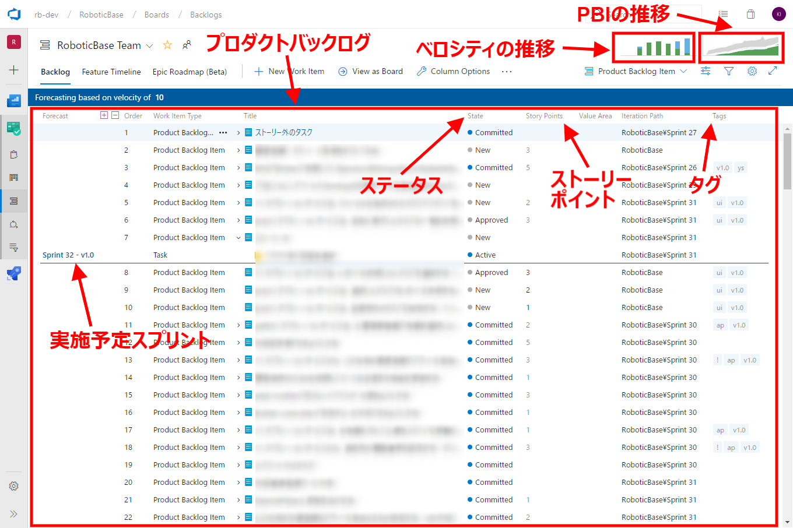
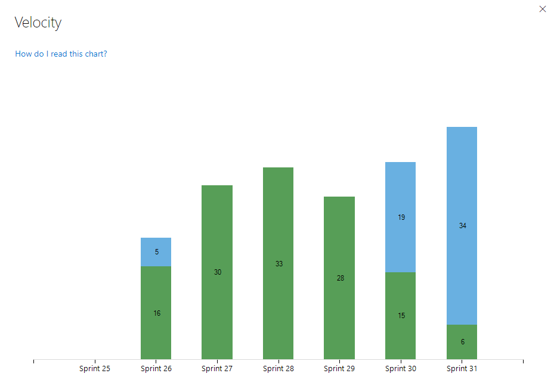
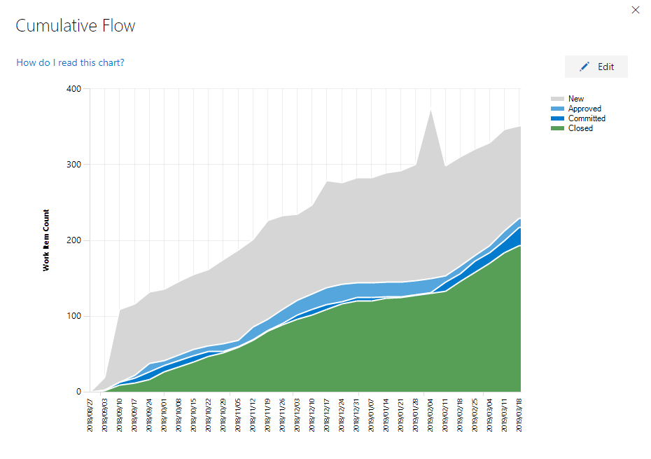
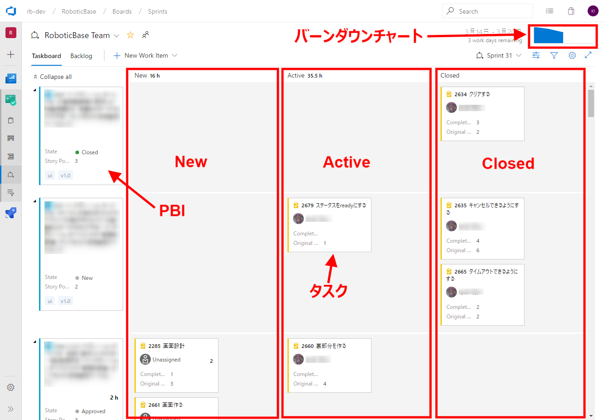
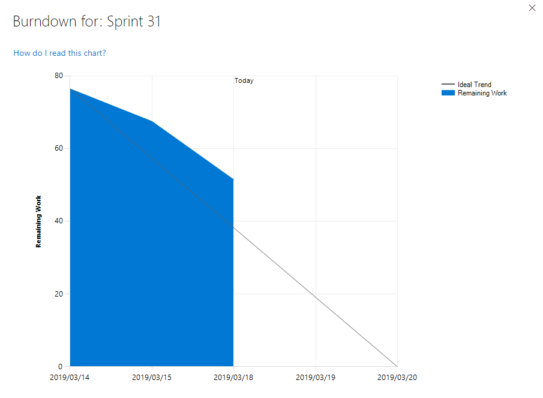
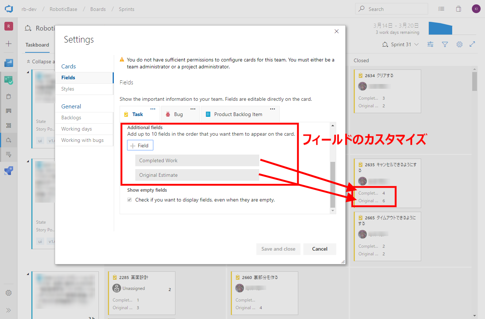
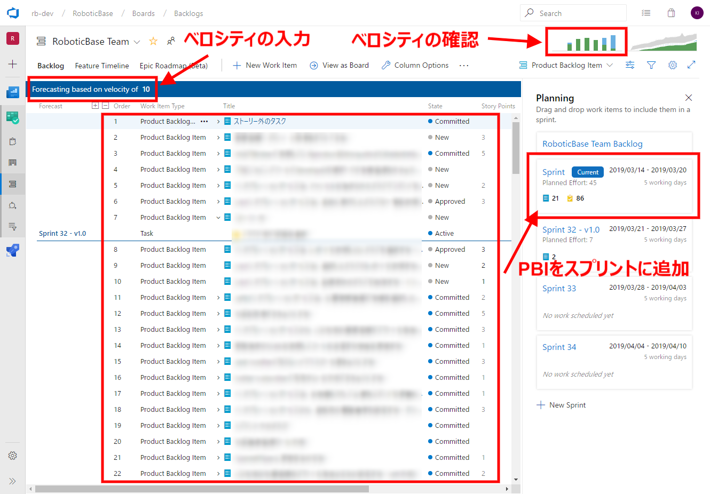

# Azure Boardsを使用したスクラム実践例

* [はじめに](#introduction)
* [TL;DR](#tldr)
* [背景](#background)
* [Azure Boards](#azure-boards)
  * [プロダクトバックログ](#azure-boards-product-backlog)
  * [スプリントバックログ](#azure-boards-sprint-backlog)
* [スクラムイベントにおけるAzure Boardsの使用方法](#azure-boards-on-scrum-event)
  * [スクラム](#azure-boards-on-scrum-event-scrum)
  * [スプリントプランニング](#azure-boards-on-scrum-event-sprint-planning)
  * [デイリースクラム](#azure-boards-on-scrum-event-daily-scrum)
  * [スプリントレビュー](#azure-boards-on-scrum-event-sprint-review)
  * [スプリントレトロスペクティブ](#azure-boards-on-scrum-event-sprint-retrospective)
* [結果と今後](#result-future)

## <a name="introduction">はじめに</a>

このドキュメントは、「[RoboticBase](https://www.tis.co.jp/news/2018/tis_news/20181016_1.html)」の開発において、Azure Boardsを使用してスクラム開発を実践した事例をまとめたものになります。

本ドキュメントが、Microsoft Azure上でAzure Boardsを使用してスクラム開発に取り組む実践例として、今後開発を行うシステム、プロジェクトの参考情報となることを目的としています。

なお、このドキュメントに記載しているシステムは開発中のものであり、実際に運用されているシステムではありません。テストなどで品質を高めていく活動についても、これからになります。その点については、ご留意のうえ、ドキュメントを参照いただければと思います。

## <a name="tldr">TL;DR</a>

- 今回のプロジェクトにおけるAzure Boardsの利用機能の紹介
- 実際のスクラム開発でのAzure Boardsの使用例

## <a name="background">背景</a>

このドキュメントの事例となったプロジェクトの背景は、[Azure DevOpsを活用したCI（ビルドパイプライン）の構築例 - 背景](../ci-on-azure/README.md#背景)に同じです。
人手不足の解消と業務生産性の向上などの社会課題の解決を目指し、複数のロボットを統合管理するプラットフォーム「[RoboticBase](https://www.tis.co.jp/news/2018/tis_news/20181016_1.html)」を開発しています。

開発当初は、ビジョンと利用イメージを伝えるための画面モックアップ（HTML）がありましたが、プラットフォームのシステム構成や提供機能は決まっていませんでした。このプロジェクトでは、仮説検証を繰り返し、フィードバックを獲得しながら開発を進めたかったので、スクラムを採用しました。

## <a name="azure-boards">Azure Boards</a>

[Azure DevOps](https://azure.microsoft.com/ja-jp/services/devops/)では、
名前が示す通り、DevOpsに必要な開発ツール一式をSaaSとして提供しています。
このプロジェクトではAzure DevOpsの提供機能のうち、
[Azure Boards](https://azure.microsoft.com/ja-jp/services/devops/boards/)
を使用してスクラム開発を行っています。

[Azure Boards](https://azure.microsoft.com/ja-jp/services/devops/boards/)は以下の機能を提供しています。

* かんばんボード
* ダッシュボード
* プロダクトバックログ
* スプリントバックログ

ここで、かんばんボードとスプリントバックログについて、補足しておきます。Azure Boardsでは、かんばん形式のビューとして、かんばんボードとスプリントバックログの２種類が存在します。以下に示すように、かんばんで扱う対象が異なります。

- かんばんボード
  - プロダクトバックログのPBI単位でかんばんに表示する
- スプリントバックログ
  - PBIを消化するためのタスク単位でかんばんに表示する

このプロジェクトでは、かんばんボード、ダッシュボードは現時点では使用していないため、プロダクトバックログとスプリントバックログについて簡単に紹介します。

### <a name="azure-boards-product-backlog">プロダクトバックログ</a>

プロダクトバックログでは、プロダクトバックログアイテム（以下PBI）に関するステータス、ストーリーポイント、実施予定スプリントを把握できます。実施予定スプリントは、設定された開発チームのベロシティから自動で算出され、プロダクトバックログに青い線で表現されます。PBIにタグを付けておくことで、各PBIの分類も可能です。

「ベロシティの推移」により、各スプリントの合計ベロシティが自動的に集計されます。完了したポイントは緑色、完了していないポイントは水色で表現されます。

「PBIの推移」により、ステータス（New、Committed、Closed等）毎のPBI数の推移を把握することもできます。

プロダクトバックログでは、実施予定スプリントの時期やベロシティ/PBIの推移で、自動で算出された結果を確認することができ、状況把握や計画を立てやすい機能が提供されています。

### <a name="azure-boards-sprint-backlog">スプリントバックログ</a>

スプリントバックログでは、PBI毎にタスクの状況を確認できます。このプロジェクトでは、New、Active、Closedの3種類のステータスを用意しており、どのタスクがどのステータスに存在するかで、PBIの進捗状況を把握することができます。

また、スプリントバックログではタスク毎の見積時間、残作業時間、実績時間を入力し、管理することが可能です。

「バーンダウンチャート」により、スプリントの期間に対するタスクの残量を確認することができます。

また、タスクの表示フィールドは独自にカスタマイズすることができます。
このプロジェクトでは、作業が終わった分の時間と見積時間を表示するようにしています。

## <a name="azure-boards-on-scrum-event">スクラムイベントにおけるAzure Boardsの使用方法</a>

ここからは、今回のプロジェクトで、[Azure Boards](https://azure.microsoft.com/ja-jp/services/devops/boards/)を使い、スクラムをどのように進めているのかについて説明します。

### <a name="azure-boards-on-scrum-event-scrum">スクラム</a>

このプロジェクトでは、[背景](#背景)に記載した通り、スクラムを採用しました。
体制は、プロダクトオーナーとスクラムマスター、開発チームが７～８名になります。

以下のスクラムイベントを実施しています。各スクラムイベントの詳細については、[スクラムガイド](https://www.scrumguides.org/docs/scrumguide/v2017/2017-Scrum-Guide-Japanese.pdf)を参照ください。

- スプリントプランニング
- デイリースクラム
- スプリントレビュー
- スプリントレトロスペクティブ

なお、スクラムの開始準備や開発において、[Fintan](https://fintan.jp)で公開されている以下のコンテンツを参考にしています。

- [スプリント開始条件チェックリスト](https://fintan.jp/?p=687)
- [スクラム概論](https://fintan.jp/?p=949)
- [プロダクトオーナーの役割](https://fintan.jp/?p=1244)
- [Doneの定義](https://fintan.jp/?p=239)
- [ワーキングアグリーメント](https://fintan.jp/?p=280)
- [スクラム開発プラクティス集](https://fintan.jp/?p=230)
- [スプリント運営ガイド](https://fintan.jp/?p=948)
- [アジャイルアセスメントシート](https://fintan.jp/?p=282)

### <a name="azure-boards-on-scrum-event-sprint-planning">スプリントプランニング</a>

プランニングの第１部では、プロダクトバックログを使い、今回のスプリントで実施するPBIを決定します。
第２部では、スプリントバックログを使い、各PBIのタスクの詳細化を行います。

#### プロダクトバックログ

1. 「ベロシティの推移」により、前回までのベロシティを確認し、平均ベロシティを算出します。
1. 平均ベロシティを入力します。
  - 今回のスプリントの実施予定スプリント（水色の完了予測ライン）が自動で表示されます。
  - プロダクトバックログを下に辿ることで、どのスプリントでPBIが完了するのか見通しを確認できます。
1. 今回のスプリントで実施予定のPBIをスプリントバックログに反映させます。
  - プロダクトバックログの横にPlanningを表示すると、スプリントが並びます。スプリントに対してドラッグ＆ドロップでPBIを追加できます。

#### スプリントバックログ

1. PBIごとにタスクと見積時間を入力します。
1. Work detailsで作業負荷が高いメンバーがいないか、予定していたタスクは終了しそうかを確認します。

### <a name="azure-boards-on-scrum-event-daily-scrum">デイリースクラム</a>

1. スプリントバックログを使い、各PBIの昨日やったこと、今日やること、困ったことがないかを開発チームで確認し合います。
1. Work detailsで作業負荷が高いメンバーがいないか、予定していたタスクは終了しそうかを確認します。

### <a name="azure-boards-on-scrum-event-sprint-review">スプリントレビュー</a>

スプリントレビューを実施し、Azure DevOpsが機能提供するWikiに議事録をまとめています。

インクリメントを検査した後、必要に応じてプロダクトバックログを修正します。例えば、リリースプランに影響が出そうなら、リリースまでの戦略を立て、最新の結果をプロダクトバックログに反映します。

この場合も、指定されたベロシティに応じて、実施予定スプリント（水色の完了予測ライン）が分かるので、PBIが完了する見通しを確認することができます。つまり、POがリリースプランを考える際のインプットとして使用できます。

### <a name="azure-boards-on-scrum-event-sprint-retrospective">スプリントレトロスペクティブ</a>

KPT等を実施し、話し合ったことをWikiにまとめます。必要に応じてプロダクトバックログやスプリントバックログを確認することもありますが、スプリントレトロスペクティブではAzure Boardsの機能は今のところあまり活用できていません。

## <a name="result-future">結果と今後</a>

今回のプロジェクトでは、Azure Boardsを使用し、スクラム開発を実施しています。実際に使用してみて、以下のように感じました。

* スクラム開発に必要な機能（プロダクトバックログ、スプリントバックログ、バーンダウンチャートなど）は一通り備わっており、スクラムイベントをすぐに開始できる。
* 柔軟性も高く、チーム状況に合わせてカスタマイズできる点も良かった。
* 使い方に関するドキュメントが少なく、手探りの状態で徐々に使い方を学習していったので、一定の学習コストがかかった。

今後はダッシュボードなども運用に組み込み、チームのパフォーマンス分析なども行っていきたいと考えています。Azure Boardsの利用方法に関するガイドが少なく手探りになりがちなので、このドキュメントがAzure Boardsを使用したスクラム開発に関する参考になればと思います。

