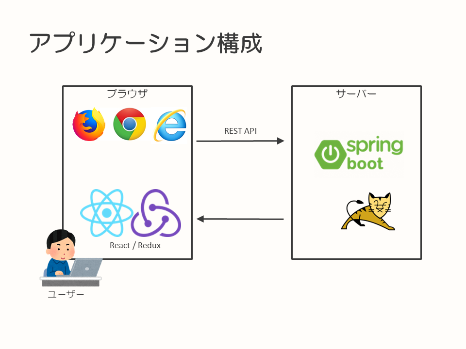
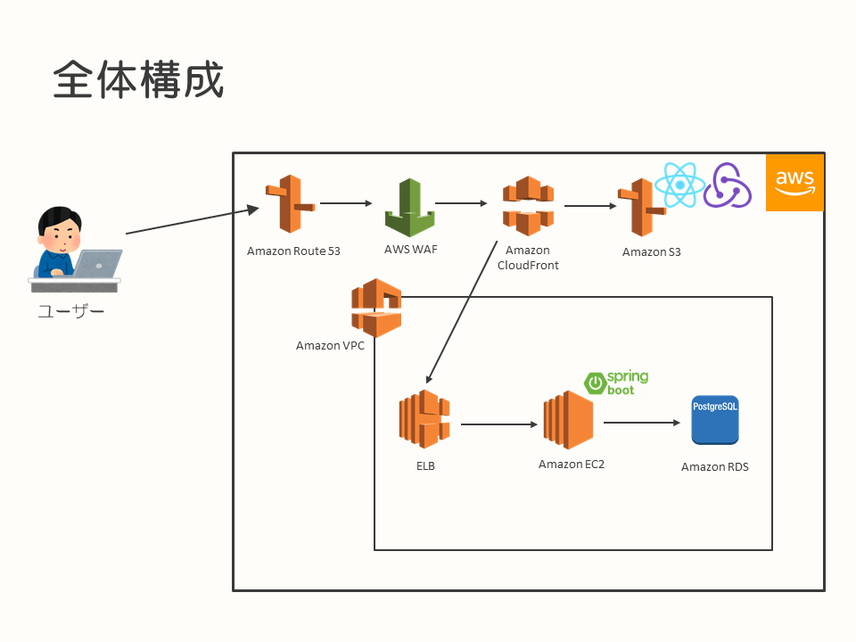
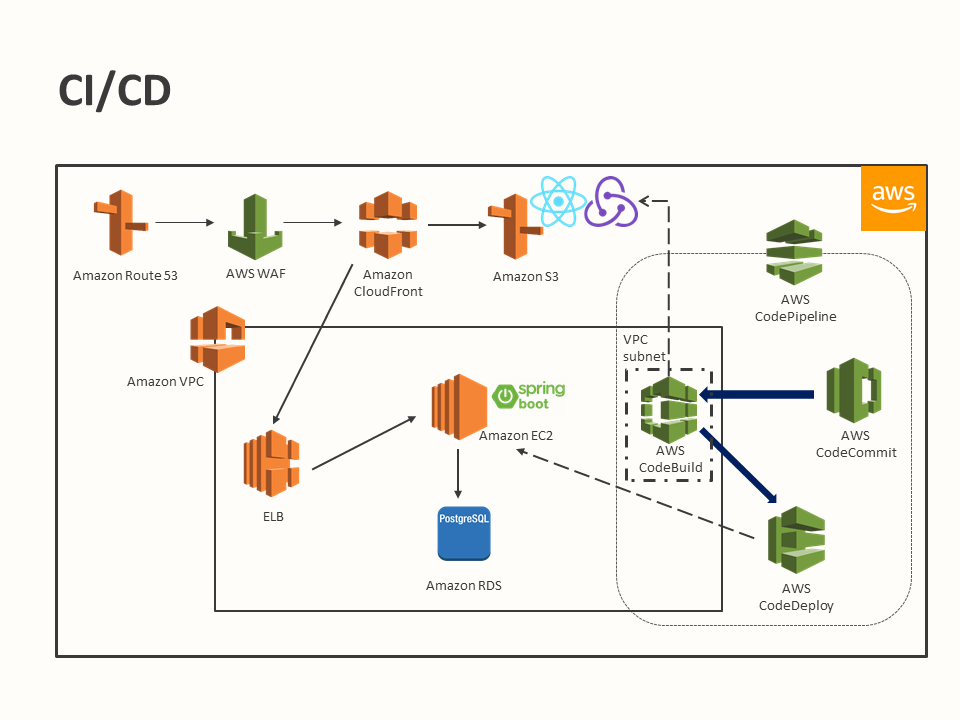
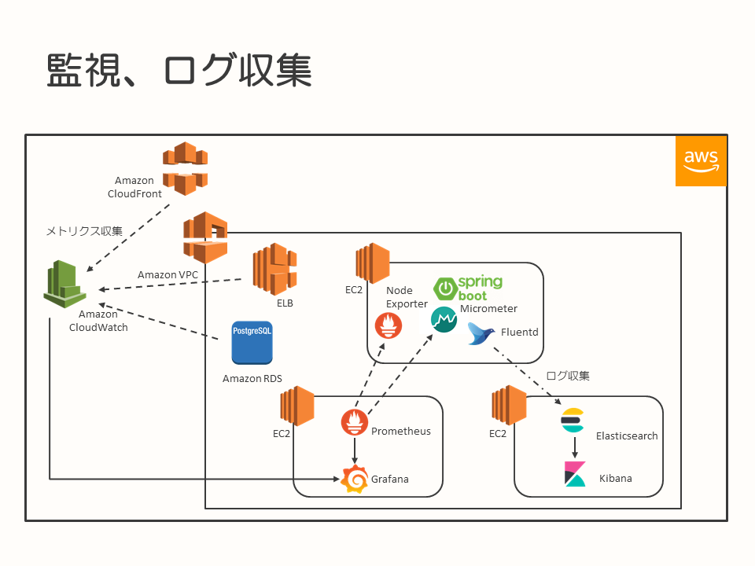

# SPA＋REST APIのシステム構成例（AWS）

* [はじめに](#introduction)
* [TL;DR](#tldr)
* [背景](#background)
* [採用したシステム構成](#system-constitution)
  * [アプリケーション構成](#application-constitution)
  * [全体構成](#constitution)
  * [CICD、モニタリング、監視、ログ収集](#cicd-monitoring)
* [まとめ](#summary)

## <a name="introduction">はじめに</a>

このドキュメントは、クラウド上に構築したSPA＋REST APIのシステム構成を事例としてまとめたものになります。利用したクラウド環境は、Amazon Web Services（AWS）です。

本ドキュメントが、SPAとREST APIを使用してAWS上で開発するシステムの構成例として、今後開発を行うシステム、プロジェクトの参考情報となることを目的としています。

なお、このドキュメントに記載しているシステムは開発中のものであり、実際に運用されているシステムではありません。テストなどで品質を高めていく活動についても、これからになります。その点については、ご留意のうえ、構成例としてドキュメントを参照いただければと思います。

## <a name="tldr">TL;DR</a>

このドキュメントに記載しているシステムでは、以下のような構成でAWS上に構築を行いました。

* シンプルなSPA＋REST APIで作成したシステムを、AWS上に構築・環境展開
  * フロントエンドはReact＋Redux、サーバーサイドはSpring Bootで実装
* サーバーサイド（REST API）は、EC2インスタンス上で実行
* フロントエンド（SPA）に関するコンテンツはAmazon S3上に置き、さらにAmazon CloudFrontを前段に配置
  * アクセス元を絞る必要があり（[背景](#背景)参照）、セキュリティグループによるインバウンドのトラフィックの制限の他、AWS WAFも合わせて利用

## <a name="background">背景</a>

このドキュメントの事例となったプロジェクトでは、社内の開発案件におけるプロジェクト内、チーム内の課題解決を行うためのシステム開発を行うことになりました。利用するユーザーは社内からの利用を前提とし、外部からのアクセスは許可しない方針です。

このシステムを開発するチームでは、採用する技術要素については前提や制限はないため、チームの技術的なチャレンジ、習得も鑑みてSPA＋REST APIで構築し、環境はAWSを利用することとしました。

これらを前提として、AWS上にどのような構成でシステムを開発し、展開するのかを検討することになりました。

## <a name="system-constitution">採用したシステム構成</a>

### <a name="application-constitution">アプリケーション構成</a>

アプリケーションの構成は、[背景](#背景)の通り、技術習得が目的のひとつとなっていることもあり、昨今のトレンドを鑑みて、以下の構成としました。

* REST API … Java / Spring Boot
* フロントエンド … React＋Redux

また、まずは小さく作ってリリースし、今後改善を続けていく方針としたため、最小限の機能実装を行うようにしています。

認証については、今回は自アプリケーション内で簡易に実装する方針とし、バックエンドはREST APIですが認証状態はセッションで管理するようにしています。

### <a name="constitution">全体構成</a>

前述の[アプリケーション構成](#アプリケーション構成)を踏まえて検討した結果、システム構成は以下のようになりました。

今回構築するシステムは、環境を含めて新規に作成するため、VPCから新規に作成しています。

VPC内には、構成要素として以下のものを配置しました。

* Amazon EC2 … REST APIがデプロイされ、動作するサーバー。OSは、Amazon Linux
* Amazon RDS … REST APIが使用する、データを管理する。サービスとしては、Amazon RDS for PostgreSQLを採用（コストの関係で、今回はAuroraではなくRDSを採用）
* Elastic Load Balancing（ELB） … ロードバランサー。Application Load Balancer（ALB）を利用

サーバーアプリケーションをEC2上にデプロイし、RDSにデータを格納する、シンプルな構成です。実際のユーザー利用を踏まえ、今後の可用性の担保をポイントにELBをEC2の前段に配置しています。ただし、このドキュメントの執筆時点では、EC2上に稼働しているアプリケーションは、冗長構成となっていません（EC2が1台で動作しています）。可用性を踏まえた構成への変更は、今後実施していく予定です。

VPC外には、以下の構成要素を採用しました。

* Amazon S3 … オブジェクトストレージサービス。アプリケーションのフロントエンドのコンテンツ配置に利用
* Amazon CloudFront … CDN。Amazon S3に配置した、コンテンツの取得高速化のために利用
* AWS WAF … Webアプリケーションファイアーウォール
* Amazon Route 53 … DNSサービス

フロントエンドのコンテンツは、サーバーやミドルウェアを構築して配置するのではなく、S3に配置することで単純にコンテンツ参照させる方針としました。ただし、SPAとして構成しているので、特定のページのURLパスを直接指定してアクセスした場合を考慮し、リクエストで指定されたパスがCloudFront上に存在しなかった場合はSPAの基点となるHTMLページをレスポンスするように設定しています（※注1）。

また、コンテンツを高速に返却するためCloudFrontを採用していますが、単純にCloudFrontを使用したコンテンツ公開を行うと、CloudFrontの性質上アクセス元が絞れなくなってしまいます。これでは、システムの要件である「利用するユーザーは社内からの利用を前提とし、外部からのアクセスは許可させない」という方針に違反してしまいます。

アクセス制限に関する要件を維持するために、CloudFrontの前段にWAFを配置しました。WAFに対して社内からのアクセスのみを許可するセキュリティグループを適用することで、アクセス要件を守るようにしています。

CloudFront経由で取得するフロントのコンテンツと、ELB経由でのアクセスとなるREST APIの振り分けについては、それぞれ別のドメイン名でアクセスすることで実現しています。

> ※注1） SPAで構築されたアプリケーションに対する、特定のURLパスへの直接アクセスについて
>
> SPAは、エントリーとなるHTMLページからJavaScriptを読み込み、ページの遷移などをスクリプトによりページ全体を書き換えることなく実現していきます。この時、実装方法によってはブラウザ上のURL遷移も行っているように見せることができますが、実際にそのURLにHTMLページが存在するわけではありません。
> 
> なにもケアを行わない場合にトップページからのアクセスではなく、特定のページのURLパスに直接アクセスした場合、HTMLがないためページ未存在となってしまいます。この事象を回避するため、アクセスされたURLパスにコンテンツが配置されていない場合は、エントリーとなるHTMLを返すことでページの描画を行えるようにしています。
>
> ブラウザ上では、アクセスされたパスに応じたコンテンツの描画がスクリプトにより実行されます。

### <a name="cicd-monitoring">CICD、モニタリング、監視、ログ収集</a>

このシステムにおける、CI/CD、モニタリング、監視、ログ収集には、以下のサービス、ソフトウェアを利用して構成しています。

* ソースコード管理 … AWS CodeCommit
* ビルド・デプロイ … AWS CodeBuild、AWS CodeDeploy、AWS CodePipeline
* モニタリング、監視 … Prometheus、Grafana、Amazon CloudWatch
* ログ収集・可視化 … Fluentd、Elasticsearch、Kibana

これらの事例については、今後記載する別ドキュメントで記載いたします。各ドキュメントが作成された後に、参照いただければと思います。

現時点で記載している別テーマ分のドキュメントは、以下になります。

* [モニタリング、監視、ログ収集の実践例（AWS）](../monitoring-on-aws/README.md)

## <a name="summary">まとめ</a>

今回の事例は、まだ本番稼働していないシステムであり、残念ながら実際にユーザーが利用し、運用までを実践した結果は含まれていません。

開発中における動作確認、テストにおいては、開発、構築、採用した各ソフトウェア、サービスを連動できており、社内のみからアクセス可能なシステムとして動作させることができています。

今後、本番リリースや実運用に向けて、可用性の向上や性能テストなどを実施して、品質を高めていく予定です。

CDNは利用したいけれども、アクセス範囲に制限を設けて公開したいといった要件や、SPA＋REST APIでのアプリケーション開発は今後増えていく事例かと思います。そのようなシステム、プロジェクトに、本ドキュメントに記載した事例が参考になればと思います。
